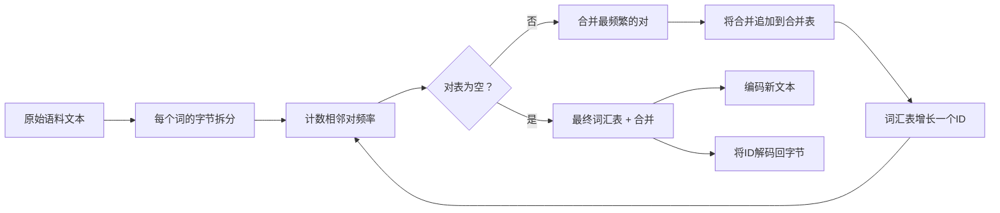
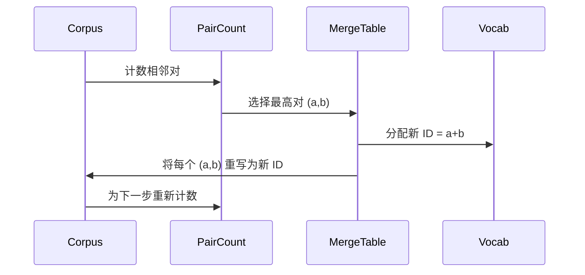

# 从零开始构建BPE分词器

> 字节进，ID出，ID回到相同的字节。构建每个现代文本模型仍然从其出发的分词器。

**类型:** 构建
**语言:** Python
**前置知识:** 阶段04课程，阶段07 Transformer课程
**时长:** ~90分钟

## 学习目标
- 通过重复合并最频繁的相邻符号对，从原始文本语料库训练字节对编码词汇表。
- 实现确定性的合并表，并将其应用于新文本以产生子词ID流。
- 将任意UTF-8输入往返为ID并返回而不丢失信息。
- 保留和保护特殊token（`<|endoftext|>`、`<|pad|>`），使它们在训练和解码中存活。
- 理解为什么字节级字母表是通用分词器的正确基础。

## 框架

语言模型从不看文本。它看整数。从字符串到整数列表的映射及返回就是分词器。这个层搞错了，训练运行中的每条损失曲线衡量的都是错误的东西。

通用文本模型的主要子词分词器家族是字节对编码。想法很小。从已知字母表开始。找到在训练语料中出现最频繁的相邻符号对。将其合并为新符号。重复直到词汇表达到目标大小。编码新文本以相同顺序重用相同的合并列表。

我们将构建字节级变体。字母表是256个原始字节，而非Unicode码点。这个选择使得分词器能够处理任何UTF-8输入而无需回退到未知token。

## 流水线

训练侧和推理侧共享合并表。这种共享就是契约。如果在推理时改变合并顺序，你解码的是不同的ID流。

## 字节字母表

前256个ID保留给原始字节0x00到0xFF。这保证任何输入字符串在任何合并发生之前都可以用词汇表表示。在字节块之后，我们为特殊token保留一个小范围。训练循环永远不会提议这些ID作为合并目标，因为我们将其完全排除在预分词流之外。

预分词器在训练看到之前将语料按空白和标点边界拆分。没有这个拆分，BPE合并步骤会愉快地学习跨词边界合并，词汇表会被整个常见短语填满。有了拆分，合并保持在词内部，结果具有泛化性。

## 训练循环

对于每个训练步骤，循环做三件事。它遍历语料中的每个词，计算每个当前符号相邻对出现的频率（按词本身的频率加权）。它选择计数最高的对。它将每处出现的该对重写为单个新符号，其ID是词汇表中的下一个空闲槽位。然后它记录这次合并。

每一步的成本与表示为符号序列列表的语料大小成线性关系。对于一百万个词和一万个ID的目标词汇表，循环在几秒内完成，因为随着合并发生，符号序列会缩小。

## 编码新文本

推理不调用合并计数器。它以学习时的相同顺序应用合并表。对于一个新词，编码器从字节拆分开始。它扫描当前序列寻找排名最低的合并（最早适用的那个）。它执行该合并。它再次扫描。当表中没有合并适用于当前序列时，循环结束。

按排名排序的属性使得编码具有确定性，并在相同输入上与训练行为匹配。首先学习的合并位于表的顶部，并首先应用。如果两个合并可能应用于相同位置，排名较低的获胜。

## 特殊token

特殊token是字节流永远无法产生的ID。我们手动保留它们。本课有两个就够了。

- `<|endoftext|>` 在预训练期间分隔文档。它告诉模型"新文档从这里开始，不要让前一个文档的上下文渗入。"
- `<|pad|>` 填充短序列，使批处理可以是矩形张量。损失掩码在训练期间隐藏它。

编码器接受一个标志，允许在输入中使用特殊token。标志关闭时，字符串 `<|endoftext|>` 和 `<|pad|>` 被分词为拼写它们的字节。标志打开时，字面字符串被映射到它们保留的ID，不受任何合并影响。

## 往返保证

编码然后解码必须精确返回输入字节。解码器按顺序连接每个ID的字节展开。由于每个ID要么是原始字节，要么是两个先前已知ID的连接，递归展开总是终止于原始字节。解码然后返回这些字节拼写的UTF-8字符串。

本课的测试套件在一个未见过的句子、一个包含Unicode表情符号的句子以及一个包含字面 `<|endoftext|>` token的句子上检查这个属性。

## 本课不做什么

它不构建最大生产分词器风格的正则表达式驱动的预分词器。这里的预分词器是一个小的空白和标点拆分。它足以在小型训练语料上产生合理的合并，并且与课程链其余部分的契约保持不变。下一课将分词器视为黑箱，在其上构建滑动窗口数据集。

它不并行化对计数器。在Python中对几千词的语料进行循环在远低于一秒内完成。对于更大的语料，明显的做法是并行计数每个词的对然后归约。

## 如何阅读代码

`main.py` 定义了四个对象。`BPETokenizer` 持有词汇表、合并表和特殊token表。`train` 是训练循环。`encode` 是推理路径。`decode` 是字节连接。底部的演示在内置语料上训练一个小型分词器，编码一个保留的句子，将ID解码回来，并打印两者。`code/tests/test_bpe.py` 中的测试确定了往返属性、特殊token保留和合并排序。

运行演示。然后将演示中的目标词汇表大小从300改为600，观察保留句子的编码长度下降。那条曲线就是BPE压缩曲线。
