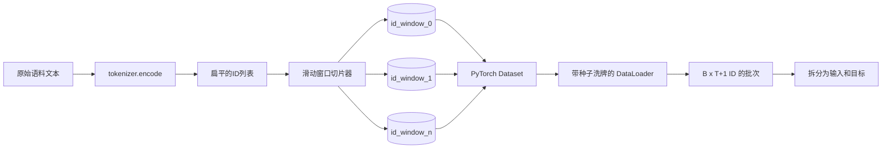
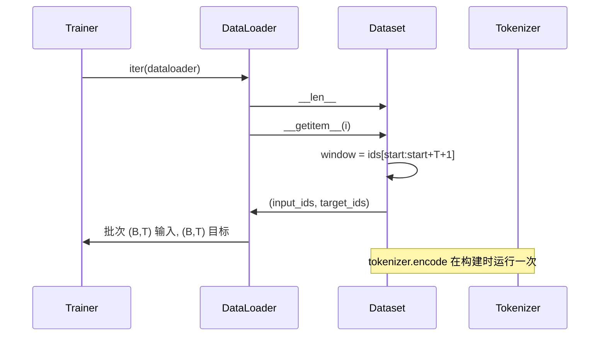

# 带滑动窗口的分词数据集

> 预训练运行是从token ID到梯度的函数。本课构建将ID送入的传送带。

**类型:** 构建
**语言:** Python
**前置知识:** 阶段04课程，阶段07 Transformer课程，本阶段第30课
**时长:** ~90分钟

## 学习目标
- 通过一次调用分词器将原始语料转换为token ID流。
- 将ID流切片为具有可配置重叠步长的固定长度窗口。
- 构建返回下一token预测的输入和目标张量的PyTorch Dataset。
- 将数据集包装在具有每epoch确定性洗牌的DataLoader中。
- 理解步长、冗余和有效数据集大小之间的权衡。

## 框架

预训练运行一次读取一批token ID并更新模型。每批的形状由训练契约固定。对于因果语言模型，批次包含 `(B, T)` 输入ID和 `(B, T)` 目标ID，其中目标是将输入左移一位。数据流水线的工作是按需、以确定性和可重现的方式，从可能数GB原始文本的语料中产生该契约。

本课构建该流水线。前一课的分词器将文本转换为长的扁平ID列表。滑动窗口将该列表切片为训练样本。自定义Dataset将样本暴露为张量。DataLoader对它们进行批处理和已知种子的洗牌。

## 形状契约

因果LM消费形状为 `(B, T)` 的ID，其中 `B` 是批大小，`T` 是上下文长度。位置 `t` 的目标是位置 `t+1` 的输入。这意味着每个训练样本覆盖 `T+1` 个原始ID。窗口步长控制连续样本之间存在多少重叠。

切片器永远不会与语料的边界重叠。如果最后一个窗口没有足够的ID填充 `T+1` 个位置，切片器丢弃它。用 `<|pad|>` 填充尾部也是一个有效的选择，但它会使损失掩码复杂化。本课中我们选择丢弃。

## 为什么用滑动窗口

预训练语料是一个长的ID流。如果模型只看到不重叠的窗口，每个训练样本会教它相同的 `T` 边界。调整步长移动这些边界，使模型看到更多样化的预测下一token任务。

步长为 `T` 时产生不重叠的窗口。步长为 `T // 2` 时产生50%的重叠，有效数据集大小翻倍。步长为 `1` 时产生最大的重叠，数据集增加 `T` 倍。代价是每个epoch更多的计算。好处是更多的边界多样性。大多数预训练运行使用等于上下文长度的步长，因为语料已经比模型在一个epoch内能完成的要大得多，所以边界多样性的论点较弱。

## Dataset 类

PyTorch Dataset有两个必需的方法。`__len__` 返回样本数。`__getitem__` 返回一个样本作为张量对。我们的Dataset存储编码后的ID流和步长。索引进入它动态计算窗口的起始位置，因此无论步长产生多少样本，内存成本都只是一份ID流。

移位操作在 `__getitem__` 内部发生。Dataset 返回 `(input, target)`，其中 `input = window[:-1]`，`target = window[1:]`。两者都是 PyTorch 长张量。训练循环将它们视为真实值。

## 确定性洗牌

带有 `shuffle=True` 的 DataLoader 从 PyTorch 随机生成器读取。通过传递每 epoch 播种的显式 `torch.Generator`，我们在每次重新启动运行时获得相同的洗牌顺序。当你想比较仅在单个超参数上不同的两次运行时，这个属性很重要。没有种子，两次运行以不同顺序看到数据，损失曲线因与变更无关的原因而发散。

本课的种子契约很简单。`epoch_seed = base_seed + epoch_index`。基础种子在构造时传入。epoch 索引由训练器在每个 epoch 开始时递增。具有相同基础种子的重新运行总是在每个 epoch 中看到相同的顺序。

## 批次采样器

PyTorch 中的默认采样器无放回地均匀随机选择索引。这正是预训练所需要的。对于小数据集的微调，契约相同。DataLoader 通过调用 `__getitem__` B 次并堆叠结果来组装批次。由于每个样本通过构造具有相同长度，不需要填充逻辑。

本课为了简单起见保持 `num_workers=0`。在生产运行中，工作进程并行化 `__getitem__` 调用。使用我们的流水线，这主要是一个空操作，因为工作只是对内存中张量的切片，但相同的 Dataset API 干净地支持工作进程。

## 计算样本数

对于长度为 `N` 的 ID 流、上下文长度 `T` 和步长 `S`，样本数为 `max(0, 1 + (N - (T + 1)) // S)`。本课在 Dataset 上将该计算暴露为静态方法，以便训练器无需迭代即可计算每 epoch 的总步数。

## 本课不做什么

它不从磁盘流式读取。语料完全编码在内存中，作为单个张量保存。对于几百万 ID 的语料，这远低于一百兆字节，是本课的正确形状。磁盘流式是一个单独的关注点，通过替换存储但保持 Dataset 契约来接入。

它不处理多个文档。语料被视为一个连续的 ID 流。当下一个文档边界通过在从多个文档构建语料时插入 `<|endoftext|>` ID 来编码。模型学习在边界周围进行预测。

## 如何阅读代码

`main.py` 定义了两个类和一个辅助函数。`SlidingWindowDataset` 是 PyTorch Dataset。`make_dataloader` 返回配置好的带种子生成器的 DataLoader。`_encode_corpus_to_ids` 是一次性的分词器调用。底部的演示在进程中构建一个小型分词器，编码内置语料，构造数据集和 data loader，打印一个批次，并断言形状契约。`code/tests/test_dataset.py` 中的测试确定了窗口计数公式、移位属性、确定性洗牌和步长权衡。

运行演示。然后将上下文长度从16改为32，观察每 epoch 的样本数下降。那个数字就是你的每 epoch 步数预算。
