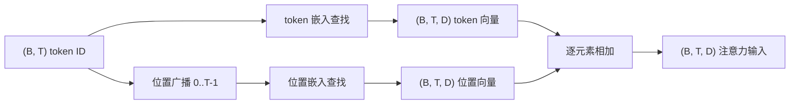
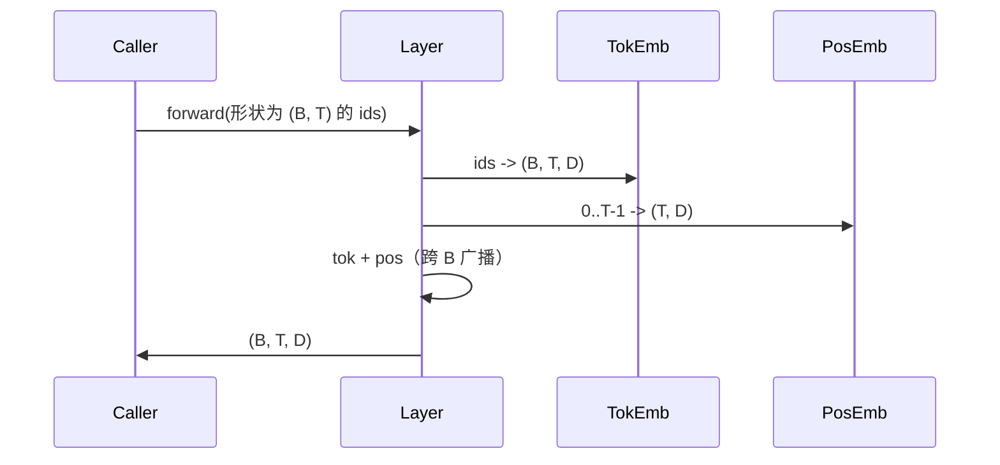

# Token与位置嵌入

> ID是整数。模型想要向量。两个查找表位于它们之间，位置表的选择决定了模型能学到什么。

**类型:** 构建
**语言:** Python
**前置知识:** 阶段04课程，阶段07 Transformer课程，本阶段第30和31课
**时长:** ~90分钟

## 学习目标
- 构建将词汇表ID映射到稠密向量的token嵌入查找表。
- 构建按位置索引的学习位置嵌入查找表。
- 构建按位置索引的固定正弦位置嵌入，无参数。
- 将token和位置嵌入组合为Transformer块的单一输入。
- 对比学习嵌入和正弦嵌入在长度泛化和参数数量上的差异。

## 框架

模型与token ID的第一次接触是在token嵌入矩阵中的行查找。矩阵每词汇表ID一行，每模型维度一列。查找返回一个向量，模型的其余部分将其视为该ID的含义。反向传播更新在前向传播中使用过的行。经过训练，这些行的几何结构学会在方向上编码相似性。

仅有token ID缺乏顺序。模型需要第二个信号告诉它位置一不同于位置十七。该信号的两个主导选择是学习的位置嵌入（第二个查找表，每位置一行）和固定的正弦位置嵌入（无参数的数学公式）。选择有后果。学习表是一个参数，受限于模型训练的最大上下文长度。正弦表在理论上无参数，公式扩展到任何位置，但本课的 `SinusoidalPositionalEmbedding` 在 `max_context_length` 处预计算一个固定表，其 `forward` 在超过该界限时抛出；因此两个模块在此都强制最大上下文长度。即使表格足够大以索引，模型在超过其训练长度时仍可能挣扎。

本课构建两者，并将其与token嵌入组合为下一课注意力块的单一输入。

## 形状契约

嵌入阶段的输入是形状为 `(B, T)` 的token ID批次。输出是形状为 `(B, T, D)` 的张量，其中 `D` 是模型维度。每个批次元素具有相同的上下文长度 `T`。每个位置具有相同的向量维度 `D`。



组合是相加而非拼接。相加保持 `D` 在整个网络中恒定，让模型在每个层按特征决定token含义和位置哪个占主导。

## Token嵌入矩阵

Token嵌入是形状为 `(V, D)` 的参数张量，其中 `V` 是词汇表大小。PyTorch 将其暴露为 `nn.Embedding(V, D)`。初始化时，条目从一个小高斯分布中抽取，对于Transformer规模的模型，传统上均值为零，标准差约为 `0.02`。确切的初始化不如在运行间保持一致重要。

前向传播是单一的索引操作。PyTorch 通过收集行将 `(B, T)` int64 ID 映射到 `(B, T, D)` 浮点数。反向传播仅累积梯度到在前向传播中触及的行。批次中从未出现的两行在该步接收零梯度。

一个微妙的细节。Token嵌入和模型末尾的输出投影经常共享权重（权重绑定）。当这种情况发生时，每个反向传播通过输出侧触及嵌入的每一行。本课将两者暴露为独立模块，但相同的矩阵可以在完整模型中扮演两个角色。

## 学习位置嵌入

学习位置嵌入是形状为 `(max_context_length, D)` 的第二个 `nn.Embedding`。查找由位置ID `0, 1, 2, ..., T-1` 作为键。前向传播将该位置向量广播到批次维度。

学习表的下限是，如果模型只训练到位置 `T-1`，则无法查询位置 `T` 处的行。该行不存在。使用此方案的生产解码器专用模型将最大上下文长度烘焙到架构中，并拒绝处理更长的输入。

## 正弦位置嵌入

正弦位置嵌入是从位置到向量的函数。位置 `p` 和特征 `i` 产生

```python
angle = p / (10000 ** (2 * (i // 2) / D))
emb[p, 2k]     = sin(angle)
emb[p, 2k + 1] = cos(angle)
```

该函数没有参数。每个位置有唯一的向量。波长在各特征维度上几何变化，因此低维度编码粗略位置，高维度编码精细位置。

同时选择 `sin` 和 `cos` 产生的性质是，位置 `p + k` 处的向量是位置 `p` 处向量的线性函数。这为注意力层学习相对位置偏移提供了便捷路径。模型不需要单独的参数来表达"往回看五个token"。

本课在构建时计算完整的正弦表一次，并在前向时索引到其中。

## 组合

输入流水线按顺序做三件事。读取token ID。查找token向量。添加位置向量。返回和。



求和步骤中的广播沿批次维度复制 `(T, D)` 位置张量。PyTorch 自动处理此操作，因为位置张量在 unsqueeze 后形状为 `(1, T, D)`。

## 对比分析

本课在相同输入上运行两个变体并打印两个诊断指标。

第一个是参数数量。学习变体在 token 嵌入之上增加 `max_context_length * D` 个参数。正弦变体增加零个。

第二个是相邻位置嵌入之间的余弦相似度。正弦变体具有平滑可预测的衰减，因为函数是连续的。学习变体在初始化时具有接近随机的相似度，因为行是独立抽取的。经过训练后，学习变体通常发展出类似的平滑结构，但它必须从数据中发现该结构。

## 本课不做什么

它不构建旋转位置编码（RoPE）或AliBi。这些是现代生产Transformer中的选择。它们都遵循与此处嵌入相同的形状契约（对形状为 `(B, T, D)` 的向量应用位置相关的变换），但它们在注意力投影步骤而非输入处应用。下一课构建注意力块，可选的扩展之一是在那里的查询-键投影中融入旋转编码。

它不训练嵌入。训练需要损失，损失需要模型输出，模型输出需要注意力和LM头。那是下一课和再下一课的内容。

## 如何阅读代码

`main.py` 定义了三个模块。`TokenEmbedding` 包装 `nn.Embedding(V, D)`。`LearnedPositionalEmbedding` 包装 `nn.Embedding(L, D)`。`SinusoidalPositionalEmbedding` 预计算表并将其暴露为缓冲区。`EmbeddingComposer` 将token嵌入和位置嵌入绑定在一起。底部的演示打印形状、参数数量和相邻位置相似度诊断。`code/tests/test_embeddings.py` 中的测试确定了形状、广播行为、参数数量和正弦公式。

运行演示。然后将模型维度 `D` 从64改为32，观察正弦波长带如何变化。
