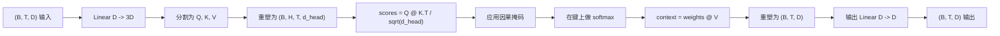
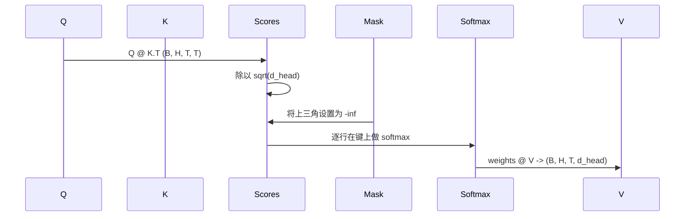

# 多头自注意力

> 一个线性投影，三个视图，H个并行头，一个掩码。模型实际使用的注意力块。

**类型:** 构建
**语言:** Python
**前置知识:** 阶段04课程，阶段07 Transformer课程，本阶段第30至32课
**时长:** ~90分钟

## 学习目标
- 实现批量查询/键/值投影作为单个线性层，分割为H个头。
- 使用正确的归一化和数据类型处理计算缩放点积注意力。
- 应用因果掩码，防止位置关注未来位置。
- 检查固定输入下每个头的注意力权重，并理解每个头关注什么。
- 在玩具任务上训练一个小型注意力块，观察损失在头特化时下降。

## 框架

注意力是让一个token的表示从同一序列中的其他token获取信息的函数。自注意力意味着查询、键和值都来自相同的输入。多头意味着投影被分割为H个并行的注意力问题，其输出被拼接并投影回来。

高效的实现模式是一个线性层，从 `D` 投影到 `3 * D` 并切片为三个视图，然后重塑为每个大小为 `D // H` 的H个头。矩阵乘法、softmax和加权求和作为批量张量操作进行，因此头在加速器上并行运行。

本课构建该块。它还添加因果掩码，使相同的代码可以作为解码器专用语言模型中的注意力层工作。下一课将该块堆叠为完整的Transformer，再下一课训练它。

## 形状契约

输入是 `(B, T, D)`。输出是 `(B, T, D)`。掩码是 `(T, T)` 或可广播到该形状。在块内部，中间张量的形状为 `(B, H, T, d_head)`，其中 `d_head = D // H`。约束是 `D % H == 0`。

块中仅有的两个参数是两个线性层（QKV投影和输出投影）。掩码、softmax、矩阵乘法和重塑都是无参数的。

## QKV分割

朴素实现有三个独立的线性层，分别用于Q、K和V。高效的实现有一个输出 `3 * D` 个特征并分割结果的单一层。两者在数学上等价，因为三次与 `(D, D)` 权重的独立矩阵乘法恰好等于一次与从它们堆叠的 `(3D, D)` 权重的矩阵乘法。

高效版本更快，因为加速器启动一次矩阵乘法而不是三次。它也更易于初始化，因为三个子矩阵位于相同的参数张量中，可以一起初始化。

## 头重塑

分割后，Q、K、V各自为 `(B, T, D)`。为了将其转换为H个并行的注意力问题，我们重塑为 `(B, T, H, d_head)` 并转置为 `(B, H, T, d_head)`。头维度现在位于批次维度旁边，因此PyTorch将每头注意力视为跨 `B * H` 个独立实例的批量操作。

d_head 维度保持在最后，以便分数矩阵乘法 `Q @ K.transpose(-2, -1)` 收缩它。结果是 `(B, H, T, T)` 每头注意力分数。

## 缩放

在softmax之前，分数要除以 `sqrt(d_head)`。没有这个缩放，点积随着 `d_head` 增长而增长，将softmax推入一个条目拥有几乎所有质量而其他条目变得极小的区域。该区域中的梯度很小，学习停滞。除以 `sqrt(d_head)` 使分数的方差在各头大小上大致保持恒定。

## 因果掩码

解码器专用语言模型在预测下一个token时只能依赖过去。掩码强制执行这一点。具体来说，在softmax之前，`(T, T)` 分数矩阵中对角线上方的每个条目被替换为负无穷。softmax后，这些位置的权重变为零。

我们在构造时将掩码注册为缓冲区，使其与模型位于相同设备上，并且不成为梯度图的一部分。掩码覆盖块将要看到的最大上下文长度。在前向时，我们切取左上角的 `(T, T)` 部分。

## 输出投影

在每头上下文向量 `(B, H, T, d_head)` 之后，我们转置回 `(B, T, H, d_head)`，重塑为 `(B, T, D)`，并应用最终的 `(D, D)` 线性投影。输出投影让模型混合各头。没有它，H个头只能通过后续层重新组合，块将被人为约束。

## 注意力权重检查

本课在前向传递上暴露了 `return_weights=True` 标志。设置后，块返回形状为 `(B, H, T, T)` 的每头注意力权重以及输出。演示打印一个头在短输入上的权重热力图，让你看到因果三角结构和每位置的关注焦点。

在训练好的模型中，不同的头学习不同的模式。有些头关注紧邻的前一个token。有些头关注序列的开头。有些头几乎均匀分布注意力。检查钩子是该可解释性工作的入口点。

## 训练演示

`main.py` 底部的演示将注意力块连接到微小的LM头，并在重复任务上训练整个东西。输入的每一行是单个随机ID，跨上下文复制。目标是输入移位一位，因此模型必须学习下一个token与前一个token相同。损失是交叉熵。使用 H=4、D=32、T=12 和 64 的词汇表，损失从随机水平（大约 `log(64) ~ 4.16`）下降到远低于 `1.0`，在CPU上经过三个epoch。

演示的目的不是训练一个有用的模型。目的是确认梯度穿过块的每一部分流动，并且头在答案明显的问题上学到了一些东西。

## 本课不做什么

它不添加前馈块。真实模型中的Transformer层是注意力后接两层MLP，带有残差连接和层归一化。下一课添加这些。

它不实现旋转或AliBi位置编码。两者都在同一块中的QKV投影步骤应用，但它们是独立的教学单元。这里构建的块通过在矩阵乘法前转换Q和K与两者兼容。

它不实现推理的KV缓存。在前向传递间缓存键和值是使自回归解码快速的优化。它改变了K和V张量上的形状契约，但Q不变。它属于推理课程。

## 如何阅读代码

`main.py` 定义了 `MultiHeadSelfAttention`。该类持有两个线性层和一个注册的掩码缓冲区。前向传播进行投影、重塑、评分、掩码、softmax、加权、重塑和再次投影。底部的演示构建了一个小型模型，将注意力与token和位置嵌入以及LM头包装在一起，在复制任务上训练三个epoch，并打印损失曲线和每头注意力热力图。`code/tests/test_attention.py` 中的测试确定了形状契约、因果性属性、softmax属性、头分割属性和梯度流动。

运行演示。然后将 `n_heads` 从4增加到8（保持 `d_model=32`，因此 `d_head=4`），观察热力图如何变化。
