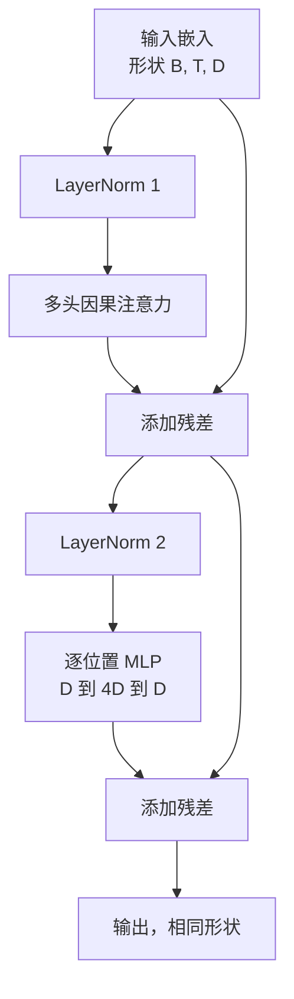
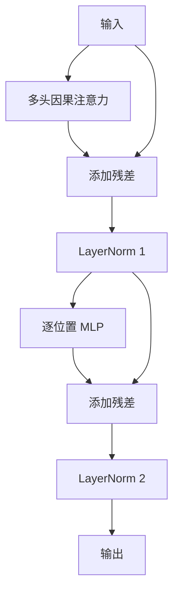

# 从头构建 Transformer 模块

> 一个模块是每个现代解码器 LLM 的基本单元。层归一化、多头注意力、残差连接、MLP、残差连接。Pre-LN 变体无需预热即可稳定训练。Post-LN 变体是原始论文使用的版本。本课并行构建这两种变体，并展示在常见学习率下，哪一种能在 12 层堆叠中存活下来。

**类型：** 构建
**语言：** Python
**前置要求：** 阶段 19 课程 30 到 33（分词器、嵌入、注意力运算、批量数据加载器）
**时间：** ~90 分钟

## 学习目标

- 用 PyTorch 从四个组件构建 Transformer 模块：LayerNorm、多头因果注意力、残差连接、逐位置 MLP。
- 以两种配置（pre-LN 和 post-LN）放置 LayerNorm，并解释为什么其中一种无需预热即可稳定训练。
- 在多头发注意力中实现因果掩码，使 token `i` 无法看到 token `j > i`。
- 追踪两种变体在 12 层堆叠上的梯度流，并无需空口证明就能读取结果。
- 当下节课组装 1.24 亿参数 GPT 时，将该模块作为即插即用的单元复用。

## 问题

Transformer 是一个重复的模块。模块写错一次，重复十二次，你交付的模型要么在第一个 epoch 就发散，要么需要预热 hack 来撑过剩下的路程。本课中你会看到的两种失败模式并不罕见。它们是学习者天真地堆叠模块时第一次就会遇到的问题。一个是注意力层关注到未来。另一个是 LayerNorm 被放在无法在深度下控制残差信号的位置。

一旦你看到了，修复方法就是机械式的。该模块恰好有两条残差路径和两个归一化位置。正确选择位置后，堆叠的其余部分就只是簿记工作了。

## 概念

每个仅解码器的 Transformer 模块都是一个函数，接收形状为 `(batch, sequence, embedding)` 的张量，并返回相同形状的张量。内部有两个子层完成工作。



这是 pre-LN 变体。LayerNorm 位于残差分支内部，在子层之前。残差连接将未归一化的信号向前传递。

Post-LN 变体将 LayerNorm 移到残差相加之后。



形状完全相同。训练行为则不同。使用 post-LN，通过残差路径反向传播的梯度必须经过 LayerNorm。在深度为 12、学习率为 `3e-4` 的情况下，梯度收缩得足够快，需要预热调度。Pre-LN 让残差路径保持未归一化状态，因此梯度可以干净地传播到嵌入层。正因如此，Pre-LN 是 GPT-2 及以后版本使用的配置。

### 多头因果注意力

注意力子层将输入投影为三种张量：查询、键、值。每个张量从 `(B, T, D)` 重塑为 `(B, H, T, D/H)`，其中 `H` 是头数。缩放点积注意力计算每个头的 `softmax(Q K^T / sqrt(d_k))`，将上三角掩码设为负无穷，通过 softmax 应用掩码，然后乘以 `V`。所有头拼接回一个 `(B, T, D)` 张量并再次投影。掩码是使模型具有因果性的唯一关键。忘了掩码，你训练的就是一个会作弊的模型。

### MLP

逐位置 MLP 对每个 token 独立应用相同的两层网络。隐藏宽度是嵌入宽度的四倍，激活函数是 GELU，dropout 跟在第二个线性层之后。MLP 内部没有 token 之间相互通信。所有 token 混合都在注意力中进行。

### 残差连接的两个作用

它们使梯度路径在深度上保持加性，从而使梯度范数在十二层中保持规模。它们还让每个模块学会对运行中的表示进行加性更新，而不是完全替换。这两种效应就是模块可以扩展的原因。

## 构建

`code/main.py` 实现了：

- `class LayerNorm`，包含可学习的缩放和偏移、有偏的 eps，应用于每个 token 向量。
- `class MultiHeadAttention`，包含 `num_heads`、`head_dim = d_model // num_heads`、融合 QKV 投影、注册的因果掩码、注意力和残差 dropout。
- `class FeedForward`，包含两个线性层、GELU 激活函数、dropout。
- `class TransformerBlock`，包含一个 `pre_ln` 标志，用于在两种变体之间切换。
- 一个演示程序，使用相同输入构建 6 层 pre-LN 堆叠和 6 层 post-LN 堆叠，并打印 (a) 输出形状，(b) 一次反向传播后嵌入层的梯度范数。

运行：

```bash
python3 code/main.py
```

输出：两个堆叠的形状检查，梯度范数并排显示。在相同学习率下，pre-LN 堆叠的嵌入梯度比 post-LN 堆叠大一个数量级，这是 pre-LN 无需预热就能训练的经验信号。

## 技术栈

- `torch` 用于张量运算、自动求导和 `nn.Module` 基础设施。
- 不使用 `transformers`，不使用预训练权重。该模块从基本运算实现。

## 生产模式

有三种模式可以将教科书上的模块变成可交付使用的产品。

**融合 QKV 投影。** 三个独立的线性层对应三次内核启动和三次矩阵乘法。一个宽度为 `3 * d_model` 的线性层在一次启动中完成相同的工作，然后沿最后一个轴分割输出。融合路径在所有加速器上都更快，与 GPT-2、LLaMA 和 Mistral 的参考实现相匹配。

**注册的因果掩码缓冲区。** 掩码仅取决于最大上下文长度。在构造时用 `register_buffer` 分配一次，每次前向时切片活动窗口，避免每次调用都分配。忘记这一点会导致掩码在长上下文时成为分配器的热点。

**在两个位置而不是三个位置使用 Dropout。** Dropout 应该放在注意力 softmax 之后（注意力 dropout）和 MLP 的第二个线性层之后（残差 dropout）。在残差本身上做 dropout 会破坏允许梯度在深度上流动的加性恒等关系。一些早期实现在这方面出了问题，并付出了训练脆弱的代价。

## 使用

- 本课的模块可以直接插入课程 35 的 GPT 组装中，无需修改。
- Pre-LN 变体是每个现代开源权重 LLM 使用的版本。Post-LN 变体是 2017 年原始注意力论文使用的版本。了解两者就足以读懂你将遇到的任何解码器架构。
- 将 GELU 换成 SiLU 就得到了 LLaMA 家族的激活函数。将 LayerNorm 换成 RMSNorm 就得到了 LLaMA 家族的归一化。骨架相同。

## 练习

1. 为模块中的每个线性层添加 `bias=False` 标志。现代开源权重 LLM 的线性层没有偏置。测量在一个 12 层 768 维的模型中能节省多少参数。
2. 用手工实现的 RMSNorm 替换 `nn.LayerNorm`，并验证输出形状不变。
3. 添加一个标志，将第一个头的注意力权重作为 `(B, T, T)` 张量返回。绘制上三角图，确认 softmax 后为零。
4. 构建一个健全性检查，将 `(2, 16, 384)` 张量（`H=6`）输入两种变体，并断言在权重初始化相同且 dropout 设为零的情况下，前向输出不同（例如 `not torch.allclose`）。

## 关键术语

| 术语 | 人们说的 | 实际含义 |
|------|---------|---------|
| Pre-LN | "前置归一化" | LayerNorm 在残差分支内部，每个子层之前；残差携带未归一化的信号 |
| Post-LN | "后置归一化" | LayerNorm 在残差相加之后；这是 2017 年论文使用的版本，需要预热 |
| 因果掩码 | "三角掩码" | 注意力 logits 的上三角设为负无穷，使 token i 在 j 大于 i 时无法读取 token j |
| 融合 QKV | "组合投影" | 一个宽度为 3D 的线性层替代三个宽度为 D 的线性层；一次内核启动，一次矩阵乘法 |
| 残差流 | "跳跃连接" | 从顶部到底部流经每个模块的未归一化张量；每个模块都向其中添加内容 |

## 延伸阅读

- 阶段 7 课程 02（从头构建自注意力）了解本模块底层的注意力运算。
- 阶段 7 课程 05（完整 Transformer）了解同一骨架的编码器-解码器版本。
- 阶段 10 课程 04（预训练 mini GPT）了解本模块所插入的训练过程。
- 阶段 19 课程 35（本轨道）将十二个此类模块堆叠成 GPT 模型。
