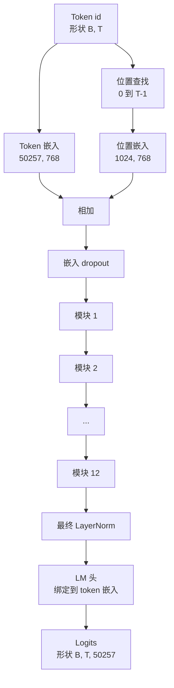
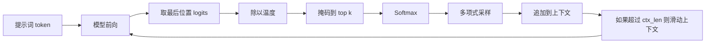

# GPT 模型组装

> 十二个模块堆叠、一个 token 嵌入、一个学习得到的位置嵌入、一个最终 LayerNorm 和一个绑定的语言模型头。这就是完整的 1.24 亿参数 GPT 模型。本课将这些部分组装成一个可运行的类，统计参数以确认模型匹配参考的 124M 形状，并使用多项式采样、温度和 top-k 生成文本。

**类型：** 构建
**语言：** Python
**前置要求：** 阶段 19 课程 30 到 34
**时间：** ~90 分钟

## 学习目标

- 将课程 34 的 Transformer 模块组装成完整的 GPT 模型：token 嵌入、位置嵌入、N 个模块、最终 LayerNorm、语言模型头。
- 复现 1.24 亿参数配置：词汇表 50257、上下文 1024、嵌入 768、十二个头、十二层。
- 将语言模型头的权重与 token 嵌入绑定，并解释为什么在这种规模下可以节省约 3800 万参数。
- 从提示词开始，使用多项式采样、温度缩放和 top-k 截断生成文本，用滑动窗口保持上下文长度。
- 测量参数数量和前向传播成本，与 124M 目标进行比较。

## 问题

Transformer 模块本身什么也做不了。你需要将 token id 转换为向量，混入位置信息，将它们通过堆叠运行，然后投影回词汇表 logits。忘记这四个步骤中的任何一个，模型要么无法前向传播，要么在位置信息上漂移，要么无法说话。

模型的形状也很重要。参考的 GPT-2 small 正好是上述配置的 1.24 亿参数。这些数字不是随机的。词汇表 50257 乘以嵌入 768 是 token 表。位置 1024 乘以 768 是位置表。十二个模块，每个大约 700 万参数，共 8400 万。最终头通过权重绑定重用 token 表。将这些部分相加，你就得到了 1.24 亿。构建一个参数数量与参考不匹配的模型，说明你把某些地方接错了。

## 概念



Token id 变成 token 向量。位置 id 变成位置向量。两者相加后送入堆叠。最终 LayerNorm 是模块外部在所有现代变体中仍然保留的唯一部分。LM 头重用 token 嵌入矩阵，这就是权重绑定的含义。

### 权重绑定

Token 嵌入的形状为 `(vocab, d_model)`。语言模型头需要从 `d_model` 投影回 `vocab`。它们是彼此的转置。将两者绑定意味着字面上使用相同的参数张量两次。在词汇表 50257 和 d_model 768 的情况下，矩阵大小为 3800 万参数。如果不绑定，你需要付出双倍代价。绑定后，你只需付出一次代价，同时因为嵌入和头一起更新，梯度信号也会稍微更清晰。

### 位置嵌入是学习的，不是正弦的

GPT-2 使用学习得到的位置嵌入。位置表是一个形状为 `(1024, 768)` 的参数张量。模型在每次前向时查找位置 0 到 T-1，并将查找结果加到 token 嵌入上。这是所有位置方案中最简单的（RoPE、ALiBi、T5 相对偏置是替代方案），也是 124M 参考使用的方案。

### 生成：温度、top-k、多项式

生成是自回归的。每一步，模型返回每个位置上整个词汇表的 logits。你只取最后一个位置，除以温度，可以选择将所有除了前 k 个以外的 logits 掩码为负无穷，softmax 得到概率，然后从结果分布中采样一个 token。



三个旋钮，三种不同的行为。温度接近零时退化为贪心。温度为一匹配模型的自然分布。Top-k 为 1 是贪心。Top-k 为 40 过滤掉长尾。这些组合很重要；下一课关于训练的内容将生成作为定性评估信号使用。

## 构建

`code/main.py` 实现了：

- `class GPTConfig` 数据类，包含 124M 默认值：`vocab_size=50257`、`context_length=1024`、`d_model=768`、`num_heads=12`、`num_layers=12`、`mlp_expansion=4`、`dropout=0.1`、`use_bias=True`、`weight_tying=True`。
- `class GPTModel`，包含 token 嵌入、位置嵌入、嵌入 dropout、十二个 `TransformerBlock`、最终 LayerNorm 和一个在标志设置时绑定到 token 嵌入的 `lm_head`。
- 一个 `count_parameters` 辅助函数，返回唯一的参数数量（因此权重绑定在计数中得到尊重）。
- 一个 `generate` 函数，执行温度、top-k、多项式和滑动窗口上下文。
- 一个演示程序，构建模型，打印参数数量并与参考 124M 对比，并从固定提示词生成短序列，展示端到端流程。

运行：

```bash
python3 code/main.py
```

输出：参数数量与 124M 参考并列显示，从随机提示词生成的 token id，以及 LM 头和 token 嵌入在绑定开启时共享存储的确认。

为了让演示保持快速，该脚本还端到端运行一个小型配置（`d_model=64`、`num_layers=2`）并内联打印生成的 token 序列。124M 配置被构建，但只运行其参数计数和一次前向传播。

## 技术栈

- `torch` 用于张量运算、自动求导和模块基础设施。
- `code/main.py` 在本地重新实现了课程 34 的相同模块模式。

## 生产模式

三种模式区分了能运行的模型和能交付的模型。

**将残差投影初始化得较小。** 注意力的输出投影和 MLP 的第二个线性层都直接馈入残差相加。如果使用与其他线性层相同的标准差初始化这些层，残差流会随深度增长，并将最终 LayerNorm 推入激烈状态。对这两个投影，将标准差缩放为 `1 / sqrt(2 * num_layers)`；残差流在十二层中保持在合理范围内。

**缓存位置 id 张量，不要重新计算。** `torch.arange(T)` 每次前向都会分配新内存。在 `__init__` 中为最大上下文分配一次，每次调用时切片前 T 个条目，跳过分配器往返。

**在参数级别绑定权重，而不仅仅是复制。** 设置 `lm_head.weight = token_embedding.weight` 共享张量；复制则不会。优化器需要更新一个参数，自动求导图需要一次累积。如果复制，头会偏离嵌入，权重绑定就毫无意义。

## 使用

- 本课的模型类与下一课训练的模型形状相同。
- 用 RoPE 替换学习的位置嵌入，无需触及模块或头即可得到 LLaMA 家族。
- 将 GELU 换成 SiLU，将 LayerNorm 换成 RMSNorm，即可获得 LLaMA 家族的其余变化。
- 生成函数适用于任何 logits 源，不仅限于此模型。你可以在课程 37 中从预训练的 GPT-2 文件中提取 logits，并重用相同的生成循环。

## 练习

1. 将 LM 头与 token 嵌入解绑并重新计数参数。验证差值为 50257 乘 768 = 3800 万。
2. 用构建时计算的正弦表替换学习的位置嵌入。确认模型仍能前向传播，参数数量减少 786,432。
3. 在生成中添加一个 `greedy=True` 标志，跳过采样并选择 argmax。确认序列在多次运行中是确定性的。
4. 添加一个 `repetition_penalty` 旋钮，在 softmax 之前将提示词或生成历史中任何 token 的 logit 除以一个常数。在固定提示词上展示大于 1 的值会减少输出中的重复次数。
5. 在 `top_k` 旁边添加 `top_p`（核）采样。两行代码检查保留 token 的概率和是否超过 `top_p`。

## 关键术语

| 术语 | 人们说的 | 实际含义 |
|------|---------|---------|
| 权重绑定 | "绑定嵌入" | LM 头和 token 嵌入共享相同的参数张量；节省词汇表乘以 d_model 个参数，与 GPT-2 参考一致 |
| 位置嵌入 | "学习的位置" | 一个形状为（上下文长度，d_model）的单独表，加到 token 向量上；端到端学习 |
| 滑动窗口上下文 | "上下文上限" | 当提示词加上生成的 token 超过上下文长度时，丢弃最老的 token，使活动窗口适合 |
| Top-k 采样 | "K 截断" | 保留值最高的 K 个 logits，将其余掩码为负无穷，对剩余部分做 softmax |
| 温度 | "采样温度" | 在 softmax 之前将 logits 除以 T；T 小于 1 使分布变尖锐，T 等于 1 保持自然分布，T 大于 1 使分布变平坦 |

## 延伸阅读

- 阶段 19 课程 34 了解本模型堆叠的模块。
- 阶段 19 课程 36 了解驱动本模型的训练循环（使用交叉熵损失）。
- 阶段 19 课程 37 了解将预训练的 GPT-2 权重加载到本架构中。
- 阶段 7 课程 07（GPT 因果语言建模）了解下一个 token 预测的数学原理。
- 阶段 10 课程 04（预训练 mini GPT）了解在相同架构上的原始训练过程。
