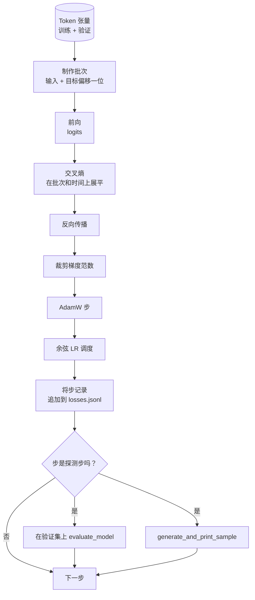

# 训练循环与评估

> 不进行衡量的循环就是在撒谎的循环。本课构建驱动 GPT 模型的训练循环：带有权重衰减分组的 AdamW、预热加余弦学习率调度、`calc_loss_batch` 辅助函数、在保留数据上的 `evaluate_model` 评估、每 K 步的 `generate_and_print_sample` 定性探测，以及一个你可以之后绘制的 JSONL 损失日志。相同的骨架将训练你将要构建的每一个解码器 LLM。

**类型：** 构建
**语言：** Python
**前置要求：** 阶段 19 课程 30 到 35
**时间：** ~90 分钟

## 学习目标

- 构建一个训练循环，使用正确的输入和目标对齐计算下一个 token 预测的交叉熵损失。
- 配置 AdamW，将权重衰减应用于权重张量，而不应用于 LayerNorm 或偏置张量。
- 实现带有线性预热和余弦衰减的学习率调度，并读取随时间的 LR 曲线。
- 使用 `evaluate_model` 在保留分片上进行评估，使评估损失在多次运行之间可比。
- 每 K 步使用 `generate_and_print_sample` 生成定性样本，以在损失曲线之前发现发散。
- 将每步损失持久化到 JSONL，以便你可以重新加载、绘图并将训练日志作为可交付物发布。

## 问题

一个只打印损失但不做其他事情的训练脚本会在三个方面失败。它无法告诉你损失是否因为正确的原因在下降（模型可能过拟合训练集而从未学习）。它无法告诉你发散是否正在开始（损失可能一步飙升然后恢复，或者一步飙升然后崩溃）。它无法告诉你模型学到了什么（损失是一个标量；生成的样本是一段文字）。除非循环进行衡量，否则所有三个失败都会隐藏。

本课中的循环以三种方式进行衡量。每步的训练批次损失。每 K 步的保留批次损失。每 K 步从固定提示词生成的延续文本。训练日志写入 JSONL，因此这个产物就是循环的证词。

## 概念



两个不太明显的部分是损失对齐和 AdamW 衰减分组。

### 损失对齐

模型在每个位置预测下一个 token。如果输入批次是 token `[t0, t1, t2, t3]`，目标批次必须是 `[t1, t2, t3, t4]`。交叉熵在展平的 `(batch * seq, vocab)` 形状上对展平的 `(batch * seq,)` 目标进行计算。忘记偏移，你就在训练模型预测自身，这会在学习任何有用东西的同时收敛到零损失。

### AdamW 衰减分组

权重衰减正则化权重张量，但不会正则化归一化尺度或偏置。将衰减放在 LayerNorm 尺度上会慢慢将尺度推向零并破坏归一化。将衰减放在偏置上在数学上是无害的，但浪费计算周期。标准的分组是：矩阵形状的张量（线性权重、嵌入表）获得衰减，任何看起来像尺度或偏移的张量则不获得衰减。

### 预热加余弦调度

预热在最初的几百步中将学习率从零线性提升到目标值，以便优化器状态有时间填充。余弦衰减在剩余步数中将学习率降回零附近，以便最终阶段以小步长微调权重。这种组合是开源权重 LLM 训练中最常见的调度，因为它消除了前一千步和最后一千步中的大多数脆弱时刻。

### 保留评估

`evaluate_model` 从验证分片运行固定数量的批次，累积损失，除以批次数，然后返回。没有梯度。没有 dropout。在给定相同种子和相同分片的情况下，该数字在多次运行之间是可复现的。将保留损失与训练损失并排报告，是你发现过拟合的方法。

### 定性采样作为早期信号

一个训练损失下降得很好但生成样本都是同一个 token 的模型是有问题的。一个损失曲线看起来平坦但生成样本逐渐变得连贯的模型正在学习。定性探测跑得比读取完整曲线更快，并能捕捉标量无法发现的模式。

## 构建

`code/main.py` 实现了：

- `make_batches(token_ids, batch_size, context_length)`，将长 token 张量切片成输入-目标对。
- `calc_loss_batch(model, inputs, targets)`，前向传播、展平、返回标量交叉熵。
- `evaluate_model(model, val_loader, max_batches)`，在无梯度模式下迭代固定数量的验证批次并返回平均损失。
- `generate_and_print_sample(model, prompt, max_new_tokens)`，在固定提示词上运行课程 35 的生成函数并打印结果。
- `build_param_groups(model, weight_decay)`，生成两组的 AdamW 参数列表。
- `cosine_with_warmup(step, warmup_steps, total_steps, max_lr, min_lr)`，返回给定步数的 LR。
- `train(...)`，运行循环，将 `outputs/losses.jsonl` 持久化，并在每个 `eval_every` 步打印评估损失和样本。
- 一个演示程序，在合成数据上训练小型模型少量步数，写入 JSONL 日志，并在探测点打印评估损失和样本。演示在 CPU 上远低于一分钟即可运行完毕。

运行：

```bash
python3 code/main.py
```

输出：每步损失行，每个探测步的评估损失，每个探测步的生成样本，以及一个最终的 `outputs/losses.jsonl`，你可以使用每行 `json.loads` 加载。

## 技术栈

- `torch` 用于自动求导、优化器和模块。
- `main.py` 在本地重新实现了课程 35 的 `GPTModel` 和支持模块。

## 生产模式

三种模式将教科书上的循环变成可以整夜运行的东西。

**梯度范数裁剪是不可协商的。** 一个坏批次（异常数据、LR 尖峰、数值边缘情况）会产生巨大的梯度，抹掉数小时的训练。在 `backward` 之后、`step` 之前调用 `torch.nn.utils.clip_grad_norm_(params, max_norm=1.0)` 使优化器保持在安全范围内。裁剪值是一个自由参数；1.0 是能适应大多数设置的默认值。

**可恢复的 JSONL 日志，而不是 pickled 状态。** 每步损失记录作为 `{"step": int, "train_loss": float, "lr": float}` 行的 JSONL 是持久的：任何崩溃都会留下可读的产物，你可以 grep，可以用三十行 Python 绘图，并且可以通过读取最后一步来恢复训练。Pickled 状态使你绑定到产生该文件的确切模块布局，这在重构时是脆弱的。

**评估批次来自固定切片。** 验证 token 在脚本启动时被切片成批次，而不是动态进行。可复现性取决于评估批次在每次运行时是否相同；否则，比较两次运行的评估损失不仅衡量模型，也衡量批次打乱的影响。

## 使用

- 本课的循环与在真实数据上训练 124M 模型使用相同的骨架。将合成的 token 张量换成 `datasets` 风格的加载器，循环即可不变地运行。
- JSONL 日志是将训练运行转化为证据的产物。下一课使用它来比较新训练的检查点与预训练的检查点。
- 定性样本探测是标量损失无法替代的全面检查。

## 练习

1. 添加 `weight_decay_groups()` 单元测试，确认尺度参数和偏置参数落在无衰减组中，线性权重和嵌入权重落在衰减组中。
2. 将合成随机 token 替换为来自小型文本文件的字节，使演示在可读的内容上训练。验证生成的样本使用文件中存在的字符。
3. 在余弦调度中添加一个 `min_lr` 下限（`max_lr` 的 10%），并重新绘图。
4. 除了 JSONL 日志外，每 `eval_every` 步保存一个检查点。添加一个 `resume_from` 标志，重新加载模型状态和优化器状态。
5. 在损失旁边记录每步吞吐量（每秒 token 数），并确认它保持在稳定的范围内。

## 关键术语

| 术语 | 人们说的 | 实际含义 |
|------|---------|---------|
| 损失对齐 | "偏移一位" | 输入 token 在位置 0..T-1，目标 token 在位置 1..T；交叉熵在展平形状上计算 |
| 衰减分组 | "两组" | AdamW 接收矩阵形状张量带权重衰减，尺度或偏置张量不带衰减 |
| 预热 | "上升" | 学习率在固定步数内从零上升到目标值，使优化器状态能够填充 |
| 评估批次 | "保留批次" | 验证 token 张量的一个固定切片，在脚本启动时切片一次，每次探测时相同使用 |
| 定性探测 | "样本打印" | 每 K 步从固定提示词进行短生成，以捕捉单独损失无法显示的失败模式 |

## 延伸阅读

- 阶段 19 课程 35 了解循环驱动的模型。
- 阶段 19 课程 37 了解将预训练权重加载到同一模型。
- 阶段 10 课程 04（预训练 mini GPT）了解在真实数据上的过程。
- 阶段 10 课程 10（评估）了解超越交叉熵损失的更广泛评估面。
