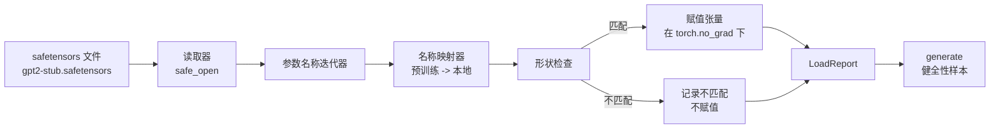

# 加载预训练权重

> 从头训练一个 1.24 亿参数的模型是一个预算决策；加载已发布的检查点就是一个星期二的任务。本课将预训练的 GPT-2 风格权重从 safetensors 文件加载到课程 35 的精确架构中，逐块走完参数名称映射，并通过生成延续文本来证明加载成功。没有网络请求，没有第三方加载器，没有不透明的魔法。

**类型：** 构建
**语言：** Python
**前置要求：** 阶段 19 课程 30 到 36
**时间：** ~90 分钟

## 学习目标

- 使用 `safetensors` Python 库读取 safetensors 文件，并检查张量名称和形状。
- 将每个预训练参数名称映射到课程 35 GPT 模型内的一个参数。
- 处理已发布 GPT-2 权重与本轨道模型之间不同的两种命名约定：`wte/wpe/h.N.attn.c_attn/c_proj` 和 `mlp.c_fc/c_proj` 对比本地的 `tok_embed/pos_embed/blocks.N.attn.qkv/out_proj` 和 `mlp.fc1/fc2`。
- 在任何权重赋值发生之前检测并拒绝形状不匹配，并给出清晰的错误信息。
- 使用加载的权重生成短文本，并确认 token 来自加载的分布，而非随机初始化的分布。

## 问题

已发布的权重并非为你的架构打包的。它们带有原始实现使用的名称。预训练文件有 `transformer.h.0.attn.c_attn.weight`，形状为 `(2304, 768)`；你的模型期望 `blocks.0.attn.qkv.weight`，形状为 `(2304, 768)`（这是相同矩阵的不同布局约定），或者你的模型使用 `nn.Linear`，它以转置形式存储矩阵。同一个参数以三种微妙不同的身份出现（名称、形状、字节布局），加载器必须协调三者。

一个盲目复制的加载器会把正确的张量放在错误的位置，导致模型生成无意义的内容。一个在形状不同时拒绝复制但什么都不记录的加载器会让你猜测哪个张量未能正确加载。本课中的加载器是显式的：每个赋值都被记录，每个形状都被检查，一个 `LoadReport` 汇总命中、未命中和形状不匹配的情况，以便你能读取发生了什么。

## 概念



名称映射器只是一个字符串到字符串的函数。形状检查是一个 if 语句。赋值在 `torch.no_grad()` 内部进行，使自动求导不跟踪加载。报告保存每个名称的结果。

### GPT-2 命名约定

已发布的 GPT-2 权重使用如下名称：

| 预训练名称 | 形状 | 含义 |
|-----------|------|------|
| `wte.weight` | (50257, 768) | Token 嵌入 |
| `wpe.weight` | (1024, 768) | 位置嵌入 |
| `h.N.ln_1.weight` | (768,) | 模块 N 的 LayerNorm 1 尺度 |
| `h.N.ln_1.bias` | (768,) | 模块 N 的 LayerNorm 1 偏移 |
| `h.N.attn.c_attn.weight` | (768, 2304) | 融合 QKV 线性权重 |
| `h.N.attn.c_attn.bias` | (2304,) | 融合 QKV 线性偏置 |
| `h.N.attn.c_proj.weight` | (768, 768) | 注意力输出投影 |
| `h.N.attn.c_proj.bias` | (768,) | 注意力输出投影偏置 |
| `h.N.ln_2.weight` | (768,) | LayerNorm 2 尺度 |
| `h.N.ln_2.bias` | (768,) | LayerNorm 2 偏移 |
| `h.N.mlp.c_fc.weight` | (768, 3072) | MLP fc1 权重 |
| `h.N.mlp.c_fc.bias` | (3072,) | MLP fc1 偏置 |
| `h.N.mlp.c_proj.weight` | (3072, 768) | MLP fc2 权重 |
| `h.N.mlp.c_proj.bias` | (768,) | MLP fc2 偏置 |
| `ln_f.weight` | (768,) | 最终 LayerNorm 尺度 |
| `ln_f.bias` | (768,) | 最终 LayerNorm 偏移 |

有两个需要计划的意外。`c_attn`、`c_proj`、`c_fc` 线性层的存储矩阵相对于 `nn.Linear.weight` 期望的是转置的。加载器在赋值时进行转置。LM 头完全不在文件中；模型依赖与 `wte` 的权重绑定，因此在 `wte` 加载后通过别名设置头。

### 本地命名约定

本轨道中的模型使用描述性名称：

| 本地名称 | 含义 |
|---------|------|
| `tok_embed.weight` | Token 嵌入 |
| `pos_embed.weight` | 位置嵌入 |
| `blocks.N.ln1.scale` | 模块 N 的 LayerNorm 1 尺度 |
| `blocks.N.ln1.shift` | 模块 N 的 LayerNorm 1 偏移 |
| `blocks.N.attn.qkv.weight` | 融合 QKV |
| `blocks.N.attn.qkv.bias` | 融合 QKV 偏置 |
| `blocks.N.attn.out_proj.weight` | 注意力输出投影 |
| `blocks.N.attn.out_proj.bias` | 输出投影偏置 |
| `blocks.N.ln2.scale` | LayerNorm 2 尺度 |
| `blocks.N.ln2.shift` | LayerNorm 2 偏移 |
| `blocks.N.mlp.fc1.weight` | MLP fc1 |
| `blocks.N.mlp.fc1.bias` | MLP fc1 偏置 |
| `blocks.N.mlp.fc2.weight` | MLP fc2 |
| `blocks.N.mlp.fc2.bias` | MLP fc2 偏置 |
| `final_ln.scale` | 最终 LayerNorm 尺度 |
| `final_ln.shift` | 最终 LayerNorm 偏移 |

映射是一个固定函数。本课将其作为一个字典提供，加载器对其进行迭代。

### Stub 测试夹具

真实的 GPT-2 权重为 0.5 GB。演示不会下载它们；它在首次运行时生成一个小的 safetensors 测试夹具，使用精确的 GPT-2 命名约定和适用于 12 模块模型（d_model 192 而不是 768）的形状。这个夹具具有正确的结构，可以执行加载器中的每个代码路径。将夹具替换为真实文件，加载器无需修改即可工作。

## 构建

`code/main.py` 实现了：

- 课程 35 `GPTModel` 的一个小型副本，使本课自包含。
- `make_pretrained_to_local(num_layers)`，展开每层条目。
- `load_safetensors(model, path)`，迭代名称、映射、检查形状、转置 conv1d 风格的权重，并在 `torch.no_grad()` 下赋值。返回一个 `LoadReport`。
- `make_stub_safetensors(path, cfg)`，生成一个具有精确预训练命名约定的夹具文件。
- 一个演示程序，在首次运行时创建 `outputs/gpt2-stub.safetensors`，构建一个新模型，捕获从随机初始化生成的一个延续文本，加载测试夹具，捕获另一个延续文本，打印两者，并验证两者不同（加载确实改变了模型）。

运行：

```bash
python3 code/main.py
```

输出：夹具路径、按名称的加载日志、`LoadReport` 摘要、加载前的延续文本、加载后的延续文本，以及一个故意注入到夹具中的形状不匹配张量（以便执行失败路径）。

## 技术栈

- `safetensors` 用于磁盘格式和流式读取器。
- `torch` 用于模型和赋值运算。
- 不使用 `transformers`、`huggingface_hub` 和网络调用。

## 生产模式

三种模式使加载器能够在你未创建的权重面前存活。

**始终在赋值前验证文件。** 打开文件，列出每个张量名称及其 dtype 和形状，运行完整的形状检查映射，只有在成功时才开始赋值。半加载的模型是静默失败的机器。

**记录每个赋值的源名称和目标名称。** 当出现问题时，日志告诉你哪个张量去了哪里；替代方案是读取十六进制转储。本课中的 `LoadReport` 数据类跟踪 `loaded`、`missing`、`unexpected` 和 `shape_mismatch` 列表，并在最后打印摘要。

**LM 头是一个权重绑定别名，而不是一个单独的副本。** 在加载 `tok_embed` 后设置 `model.lm_head.weight = model.tok_embed.weight` 是规范的模式。将嵌入矩阵复制到新的 `lm_head.weight` 参数中会破坏绑定，并悄悄地使参数数量加倍。

## 使用

- 加载器适用于任何使用预训练命名约定的 safetensors 文件。真实的 GPT-2 文件（small / medium / large / xl）无需代码更改即可工作；只有模型配置不同。
- 相同的模式在更新名称映射后扩展到 LLaMA、Mistral、Qwen 权重。形状检查和报告保持不变。
- 加载后的健全性生成是一个快速的门控：如果加载后的样本看起来与加载前的样本相同，说明加载没有改变模型，意味着映射静默地错过了每个张量。

## 练习

1. 为加载器添加一个 `dtype` 参数，在赋值时将每个张量转换为目标 dtype（`bfloat16`、`float16`、`float32`）。确认 `float32` 模型可以降级为 `bfloat16` 并仍然生成。
2. 添加一个 `expected_layers` 参数，拒绝加载其 `h.N` 索引与模型的 `num_layers` 不匹配的检查点。
3. 将加载器插入课程 35 的生成函数，并生成两个并排的样本：一个来自随机初始化，一个来自加载的夹具。
4. 添加一个导出路径：将当前模型状态写入一个新的 safetensors 文件，使用预训练命名约定。往返测试加载器，并确认报告中有零个形状不匹配。
5. 扩展 `NAME_MAP` 以处理 LLaMA 命名约定（无偏置、RMSNorm、融合 qkv 布局），并在你生成的 LLaMA 测试夹具上重新运行加载器。

## 关键术语

| 术语 | 人们说的 | 实际含义 |
|------|---------|---------|
| 名称映射 | "键重映射" | 从预训练张量名称到本地参数名称的函数；通常是一个按层索引展开的文字字典 |
| 形状不匹配 | "错误形状" | 预训练张量在映射名称下存在，但其维度与本地参数不一致；加载器拒绝赋值并记录该对 |
| 加载时转置 | "Conv1d 布局" | 已发布的 GPT-2 以 nn.Linear 期望的转置形式存储注意力和 MLP 投影；加载器在赋值时进行转置 |
| 权重绑定别名 | "共享 LM 头" | 设置 model.lm_head.weight = model.tok_embed.weight，使头和嵌入共享存储；头不在文件中正是因为这个原因 |
| 加载报告 | "覆盖摘要" | 一个小型数据类，跟踪 loaded、missing、unexpected 和 shape_mismatch 列表；打印它是你判断加载是否成功的方法 |

## 延伸阅读

- 阶段 19 课程 35 了解接收权重的架构。
- 阶段 19 课程 36 了解生成相同形状检查点的训练循环。
- 阶段 10 课程 11（量化）了解内存紧张时如何处理加载的权重。
- 阶段 10 课程 13（构建完整 LLM 管道）了解围绕加载和推理的完整生命周期。
