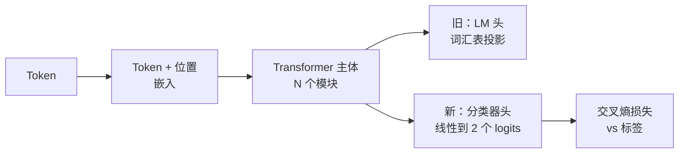
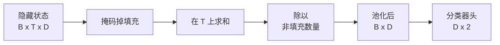
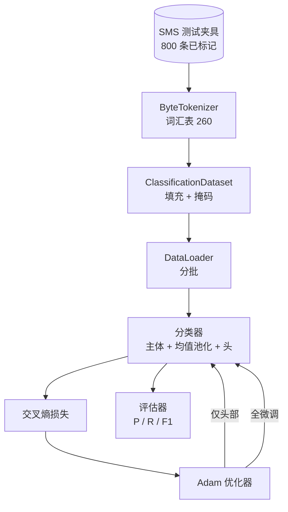

# 里程碑课程 38：通过头交换进行分类器微调

> 轨道 B 的第一个里程碑项目。一个预训练的语言模型是一个以 token 预测头结尾的自注意力模块堆叠。当你想要区分垃圾邮件和正常邮件时，头是错的但主体基本是对的。本课把头拆掉，将二类线性层粘在池化表示上，并以两种不同方式训练分类器：仅最终层和全微调。评估指标是精确率、召回率和 F1 分数。你将了解每种策略带来什么以及付出什么代价。

**类型：** 构建
**语言：** Python（torch、numpy）
**前置要求：** 阶段 19 课程 30-37（NLP LLM 轨道：分词器、嵌入表、注意力模块、transformer 主体、预训练循环、检查点、生成、困惑度）
**时间：** ~90 分钟

## 学习目标

- 在不重新初始化主体的情况下，用分类头替换语言模型头。
- 实现两种训练模式：冻结主体（仅头部）和全微调，共享一个训练循环。
- 构建一个识别分词器的数据管道，进行填充、掩码填充和池化注意力输出。
- 从原始 logits 计算精确率、召回率、F1 和混淆矩阵。
- 推理参数数量、训练时间和提升空间之间的权衡。

## 问题

你已经在通用语料上预训练了一个小型 transformer。输出头将最后一个隐藏状态投影到 1000 个 token 的词汇表。你现在有 800 条标记为垃圾或正常的短信，想要一个二分类器。存在三种选择。

错误的选择是在 800 个样本上从头训练一个新的分类器。预训练模型的主体已经编码了有用的结构：词身份、位置、简单的共现。丢弃它就浪费了构建它的算力。

两个正确的选择是：冻结主体的头交换，以及可训练主体的头交换。仅头部训练速度快、内存几乎免费，并且在这点数据上很少过拟合。全微调更慢，可能在少量数据上过拟合，但当下游领域偏离预训练语料时能达到更高的准确率。

本课构建了两种方法，以便你可以在同一个测试夹具上进行比较。

## 概念

模型是一个函数 `f_theta(tokens) -> hidden_states`。头是一个函数 `g_phi(hidden) -> logits`。交换头意味着保留 `theta` 并替换 `g_phi`。主体的参数是昂贵的部分。头只是一个线性层。

两个可训练参数集很重要：

- `theta`（主体）：每个注意力模块数万个权重。
- `phi`（头）：`hidden_dim * num_classes` 个权重加一个偏置。

在仅头部训练中，你计算针对 `phi` 的梯度，并将针对 `theta` 的梯度设为零。PyTorch 允许你通过在主体参数上设置 `requires_grad=False` 来实现。这样优化器只看到头，主体保持冻结。

在全微调中，你让梯度的反向传播经过整个堆叠。主体的权重漂移以适应分类目标。风险是在小数据上的灾难性遗忘：主体预训练被过拟合噪声冲走。

## 池化问题

分类器每个序列需要一个向量，而不是每个 token 一个。三种常见选择：

- **均值池化**：对序列上的隐藏状态求平均，按注意力掩码加权。
- **CLS 池化**：前置一个特殊 token 并只使用其输出。这就是 BERT 做的。
- **最后 token 池化**：使用最后一个非填充 token。这就是 GPT 分类器做的。

本课使用显式注意力掩码加权的均值池化。它最简单，在不同序列长度上给出稳定信号，并且不需要预训练 CLS token。

## 数据

八百条短信，400 条垃圾和 400 条正常平衡分布，在 `code/main.py` 中确定性地生成。生成器使用固定种子，选择模板并替换槽位填充词，发出长度在 5 到 25 个 token 之间的消息。真实数据集有这个测试夹具没有的噪声。测试夹具的意义在于可复现性。

数据按 80/20 分割：640 训练，160 测试。分割是分层的，使测试集保持 50/50 的平衡。具有已知平衡的保留集使精确率和召回率能够被读作诚实的数字。

## 指标

以类别 1 为正类（垃圾邮件）的二分类。计数如下：

- `TP`：预测为垃圾，实际是垃圾。
- `FP`：预测为垃圾，实际是正常。
- `FN`：预测为正常，实际是垃圾。
- `TN`：预测为正常，实际是正常。

三个关键指标：

- `精确率 = TP / (TP + FP)`。被标记为垃圾的消息中，实际有多大比例是垃圾？
- `召回率 = TP / (TP + FN)`。实际垃圾中，模型标记了多大比例？
- `F1 = 2 * P * R / (P + R)`。两者的调和平均数。

混淆矩阵将四个计数打印为 2x2 网格。演示将两种训练模式的混淆矩阵写入标准输出。

## 架构

主体是一个故意很小的 transformer：词汇表 260，隐藏 64，4 个头，2 个模块，最大序列长度 32。它足够小，可以在 CPU 上九十秒内将两种模式训练到收敛。本课中并未预训练主体；相反，`pretrain_quick` 辅助函数在相同的测试夹具文本上进行五个 epoch 的 LM 训练，为主体提供一个非平凡的起点。这使本课保持自包含。

## 你将构建什么

实现是一个 `main.py` 加一个测试模块（`code/tests/test_main.py`）。

1. `ByteTokenizer`：将字节映射为 id，保留一个填充 id。
2. `Block`：一个带有多头注意力和前馈层的 transformer 模块。先归一化。
3. `LMBody`：token + 位置嵌入加模块堆叠。返回隐藏状态。
4. `MeanPool`：在序列轴上按掩码加权平均。
5. `Classifier`：主体、池化、线性头。主体在两种模式下是相同的实例。
6. `freeze_body` 和 `unfreeze_body`：切换主体参数的 `requires_grad`。
7. `train_classifier`：一个共享循环。接收模型和根据哪个参数组可训练而配置的优化器。
8. `evaluate`：运行测试集并返回 `Metrics(precision, recall, f1, confusion)`。
9. `run_demo`：短暂预训练主体，然后训练和评估仅头部模式，然后全微调，打印两份报告，以零退出。

## 为什么比较很重要

仅头部模式通常训练更快，且过拟合更优雅。在这个测试夹具上，二十个 epoch 的仅头部训练后，你通常看到精确率接近 0.9，召回率接近 0.85。全微调大约需要三倍时间，根据随机种子，结果在几个百分点之内。

本课并不挑选胜者。它教会你读取数字和成本。在 800 个样本和小型主体上，仅头部是正确的选择。在 80,000 个样本和更大的主体上，全微调开始显现效果。你从本课获得的关键契约是 API：相同的 `train_classifier` 函数处理两者，切换是一个函数调用。

## 扩展目标

- 添加仅解冻最后一个模块的第三种模式。这有时称为部分微调。它比全微调成本更低，比仅头部学习更多。
- 添加学习率调度器。头上的余弦调度加上主体上的较小常数速率是常见的生产设置。
- 用学习的注意力池化替换均值池化：一个带有一个学习查询的小型注意力层。这在较长序列上通常优于均值池化。

实现为你提供了钩子。测试固定了契约。数字由你来推动。
