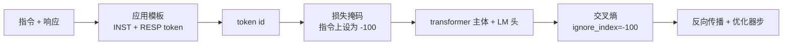
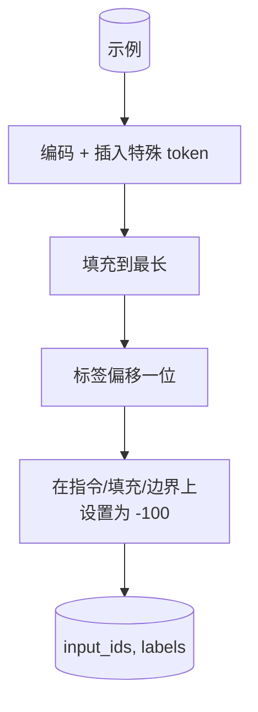
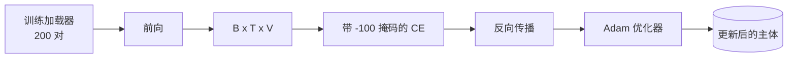

# 里程碑课程 39：通过监督微调进行指令微调

> 一个预训练的基础模型可以延续一个序列，但无法遵循指令。监督微调是解决这个问题的最小改动：将配对的指令和期望响应的示例喂给模型，训练主体预测响应 token。诀窍在于你只希望损失计算响应部分，而不是指令部分。本课构建一个 Alpaca 风格的 SFT 循环，带有一个自定义的 collate 函数，使用 `ignore_index=-100` 掩码指令 token，在 200 个指令-响应对上训练，并在保留分片上进行评估（使用精确匹配）。

**类型：** 构建
**语言：** Python（torch、numpy）
**前置要求：** 阶段 19 课程 30-37（NLP LLM 轨道：分词器、嵌入表、注意力模块、transformer 主体、预训练循环、检查点、生成、困惑度）
**时间：** ~90 分钟

## 学习目标

- 将配对的指令-响应数据格式化为带有显式边界 token 的单一因果序列。
- 构建一个 collate 函数，掩码指令 token，使交叉熵只计算响应 token。
- 在 SFT 目标下训练一个小型 transformer 主体，观察评估指标的变化。
- 实现尊重响应开始边界的贪心和温度采样生成。
- 在生成的补全上计算保留集的精确匹配。

## 问题

一个在下一个 token 预测上训练的基础模型不知道指令是什么。给它字符串 `"What is the capital of France?"`，它将继续提问或发明一个新句子。模型有语言能力，但没有格式契约。

SFT 契约是一个字符串模板。每个训练示例成为一个具有三个区域的单一序列：

```text
<INST> What is the capital of France? <RESP> The capital of France is Paris.
```

边界 token 是在训练时保留的特殊 token。模型学会 `<RESP>` 之后的所有内容都是响应，而响应是被评分的部分。基础模型的下一个 token 目标仍然适用；只是它在一个每个示例都具有此形状的语料上进行训练。

但有一个陷阱。如果你将整个序列送入 vanilla 交叉熵损失，你也在训练模型预测指令 token。指令是给定的。你希望这些位置上的梯度为零。解决方案就是掩码。

## 概念



`ignore_index` 是 `torch.nn.functional.cross_entropy` 的一个特性。任何等于 `ignore_index` 的目标位置贡献零损失和零梯度。PyTorch 中的约定是 `-100`。Collate 函数为每个示例构建两个张量：`input_ids`（完整序列）和 `labels`（`input_ids` 的副本，其中指令位置被 `-100` 覆盖）。

模型在前向传播期间看到整个序列；注意力可以关注到指令。损失只计算响应 token。这正是你想要的：以指令为条件，预测响应。

## 数据

两百个指令-响应对在 `main.py` 中确定性地生成。它们涵盖六种任务类型：

- 事实性单次问答（X 的首都）
- 算术
- 列表提取
- 一句话摘要
- 代码（print、sort）
- 定义

每个任务有一个模板化的指令和一个确定性的响应。这故意设计得简单。精确匹配是脆弱的，本课使用的测试夹具中正确答案是一个特定的字符串。真实的 SFT 数据集需要模糊指标；原理是相同的。

分割为 160 训练，40 测试。测试集涵盖所有六种任务类型，以便可以报告按类别的精确匹配。

## 分词和填充

分词器是字节级的，有三个保留的特殊 token：

- `INST_ID = 256`：标记指令区域的开始。
- `RESP_ID = 257`：标记指令和响应之间的边界。
- `PAD_ID = 258`：变长批次的填充。

序列是 `[INST] inst_bytes [RESP] resp_bytes [PAD]*`。Collate 函数：

1. 对每个示例进行分词。
2. 将批次中的每个示例填充到批次中最长序列。
3. 构建 `labels` = `input_ids` 偏移一位（因果 LM 目标），其中：
   - 指令区域被替换为 `-100`。
   - 填充区域被替换为 `-100`。
   - `RESP_ID` 边界位置本身被替换为 `-100`（你不训练模型预测边界 token；它预测后面是什么）。



偏移是标准的因果技巧：`input_ids` 的位置 `i` 预测位置 `i+1`，因此 `labels[i] = input_ids[i+1]`（输入中丢弃最后一个位置，目标中丢弃第一个位置）。掩码在偏移之后应用，以落在正确的位置上。

## 训练



循环是标准的 PyTorch SFT 循环。Adam，学习率约 3e-4 到 1e-3，在这个测试夹具上 10 到 20 个 epoch，没有调度器。模型足够小（隐藏 96，2 个模块，最大长度 64），可以在 CPU 上两分钟内训练到收敛。

每五个 epoch，循环在保留集上运行一次小型评估并打印精确匹配。观察精确匹配从第 1 个 epoch 的 0.0 到第 15 个 epoch 的约 0.85 是本课的回报：你可以看到模型同时学习格式和答案。

## 生成

在评估时，模型获得指令前缀 `[INST] inst_bytes [RESP]` 并生成 token，直到以下条件之一满足：

- 序列达到 `max_len`，或
- 模型发出一个特殊的停止启发式：两个连续的句子结束字节（`.`、`!`、`?`）。

本课提供贪心解码和一个可选的温度采样器。精确匹配使用贪心，因为温度会使指标具有随机性。真实系统通常先采样，然后模糊判断；那个管道是课程 41 的内容。

## 精确匹配评估

精确匹配是最严格的文本指标。预测的响应字符串被归一化（小写、去除空白、合并双空格）并与参考响应以相同方式归一化后进行比较。每个示例的指标是 1 或 0。聚合值是平均值。

真实的 SFT 管道用 token 级 F1（课程 41）和评判模型补充精确匹配。精确匹配仍然有用，因为它明确无歧义；如果它说是 0.7，那么正好 70% 的测试指令逐字符产生了金标准响应。

## 你将构建什么

实现是一个 `main.py` 加测试。

1. `InstructionTokenizer`：带保留特殊 token 的字节级编码器。编码指令前缀或完整配对。
2. `make_dataset`：用固定种子生成 200 个涵盖六种任务类型的配对。
3. `SFTDataset`：每个示例返回 `(input_ids, labels)`，已准备好掩码。
4. `sft_collate`：动态填充，构建批次张量，在指令和填充位置上设置 `-100`。
5. `TinyGPT`：transformer 主体加绑定或未绑定的 LM 头。
6. `train_sft`：SFT 循环，带每个 epoch 的评估钩子。
7. `generate`：从前缀开始的因果解码，贪心或采样，带停止启发式。
8. `exact_match`：归一化字符串比较，返回 `[0, 1]` 范围内的浮点数。
9. `run_demo`：构建数据，训练 20 个 epoch，评估，打印按类别细分，成功时以零退出。

## 为什么掩码很重要

没有掩码，损失将指令 token 视为目标。模型学会预测指令。这是一个不同的目标，会在两个方面产生更差的模型。首先，模型容量被浪费在重建用户总是提供的输入上。其次，响应损失在梯度总和中的占比更小，因为大多数批次中指令 token 数量多于响应 token；优化器在你关注的部位上的有效学习率低于你的预期。掩码不是锦上添花；它就是目标。

## 扩展目标

- 添加学习率预热后接余弦衰减。SFT 对 LR 比预训练更敏感。
- 添加每个 token 的损失日志，并在训练过程中绘制损失曲线。注意早期 epoch 被模板 token（`<RESP>`、常见前缀）主导，后期 epoch 被实际答案 token 主导。
- 将评估扩展到 BLEU-1 或 chrF。精确匹配低估了产生含有相同答案的释义的模型。
- 添加一个带多轮格式的聊天模板，并在包含后续问题的测试夹具上训练。

实现为你提供了格式契约、掩码和循环。从基础模型到指令跟随者的目标变化就是一个 collate 函数。
