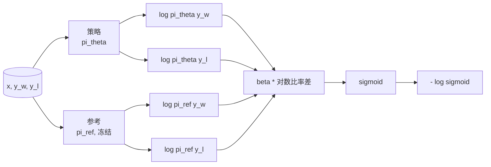
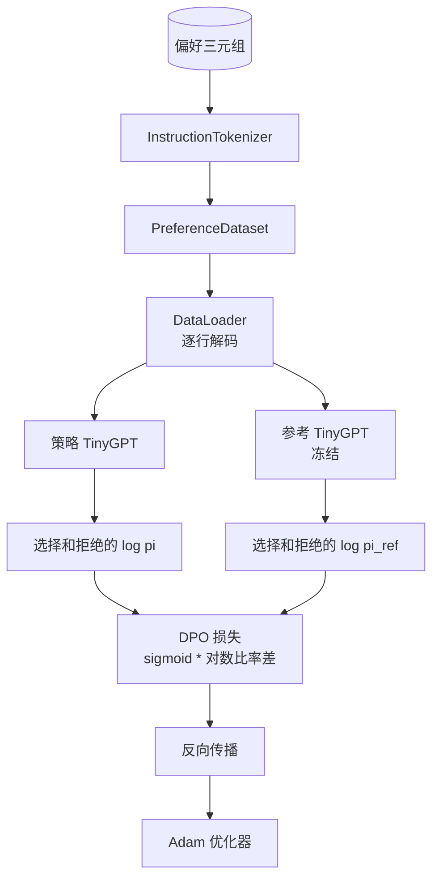

# 里程碑课程 40：从头构建直接偏好优化

> 奖励模型和 PPO 是经典的 RLHF 堆栈。DPO 将该堆栈压缩为一个监督损失，直接针对偏好对拟合策略。本课从奖励差恒等推导 DPO 损失，提供一个可工作的参考模型加策略模型，计算每个 token 的对数概率，并在一个包含选择和拒绝补全的偏好测试夹具上训练一个小型 transformer。测试固定了损失运算和梯度方向，让你知道实现与论文相匹配。

**类型：** 构建
**语言：** Python（torch、numpy）
**前置要求：** 阶段 19 课程 30-37（NLP LLM 轨道：分词器、嵌入表、注意力模块、transformer 主体、预训练循环、检查点、生成、困惑度）
**时间：** ~90 分钟

## 学习目标

- 将 DPO 损失推导为缩放对数比率差上的 sigmoid，并将其与隐式奖励连接起来。
- 构建一个参考模型加策略模型对，其中参考模型冻结，策略模型可训练。
- 计算两个模型下的序列级对数概率，掩码掉提示词 token。
- 在 `(prompt, chosen, rejected)` 三元组上训练策略，观察 chosen 对数概率相对于 rejected 上升。
- 通过关于损失运算、梯度符号和参考不变性的测试来固定行为。

## 问题

你有一个 SFT 模型。它遵循指令，但输出不一致；有些补全清晰，有些冗长或错误。你还有一个小数据集包含偏好对：对于相同的提示词，一个人标记了一个补全为选择、另一个为拒绝。

经典的 RLHF 答案是两阶段管道。在偏好上训练一个奖励模型。用 PPO 针对奖励优化策略。这有效但代价高昂：PPO 期间两个模型在内存中，KL 控制使策略接近参考，当奖励模型脆弱时奖励攻击（reward hacking）会出现。

DPO 用一个监督损失替换了两个阶段。奖励模型从未显式存在。策略直接在偏好对上训练，带有对 SFT 参考的显式 KL 惩罚。在 Bradley-Terry 偏好模型下得到相同的最优解，代码量大大减少。

## 概念

从 Bradley-Terry 模型开始。给定提示词 `x` 和两个补全 `y_w`（选择）和 `y_l`（拒绝），人类偏好 `y_w` 的概率为：

```text
P(y_w > y_l | x) = sigmoid( r(x, y_w) - r(x, y_l) )
```

其中 `r` 是某种潜在奖励函数。RLHF 首先从偏好拟合 `r`，然后训练一个策略 `pi` 以最大化带有 KL 锚点的 `r`：

```text
max_pi   E_{x, y~pi} [ r(x, y) ] - beta * KL(pi || pi_ref)
```

DPO 推导观察到，此目标下的最优策略 `pi*` 可以用 `r` 的闭式表示：

```text
pi*(y | x) = (1/Z(x)) * pi_ref(y | x) * exp( r(x, y) / beta )
```

对 `r` 重新排列：

```text
r(x, y) = beta * ( log pi*(y | x) - log pi_ref(y | x) ) + beta * log Z(x)
```

`log Z(x)` 项对 `y_w` 和 `y_l` 相同（它依赖于 `x`，而不依赖于 `y`），因此在计算偏好差异时相互抵消：

```text
r(x, y_w) - r(x, y_l) = beta * ( log pi_theta(y_w|x) - log pi_ref(y_w|x)
                                - log pi_theta(y_l|x) + log pi_ref(y_l|x) )
```

代入 Bradley-Terry sigmoid 并在偏好对上取负对数似然：

```text
L_DPO(theta) = - E_{(x, y_w, y_l)} [
  log sigmoid( beta * ( log pi_theta(y_w|x) - log pi_ref(y_w|x)
                       - log pi_theta(y_l|x) + log pi_ref(y_l|x) ) )
]
```

这就是损失函数。它是在每个示例一个标量上的 sigmoid，从四个对数概率计算而来。没有单独的奖励模型。没有 PPO。损失中没有 KL 项；KL 约束被内嵌在闭式推导中。



## 梯度的符号

在任何训练运行之前一个有用的健全性检查。对 `log pi_theta(y_w | x)` 取梯度：

```text
d L_DPO / d log pi_theta(y_w | x) = - beta * (1 - sigmoid(z))
```

其中 `z` 是 sigmoid 的参数。这对所有 `z` 都是负的，意味着：增加策略对选择补全的对数概率会减小损失。对称地，对 `log pi_theta(y_l | x)` 的梯度是正的：增加拒绝的对数概率会增加损失。训练推动选择上升、拒绝下降。参考被冻结；它不动。

## 数据

本课提供了十二个偏好三元组。每个是 `(prompt, chosen, rejected)`。选择的补全简短而精确。拒绝的则冗长、离题或错误。这些对涵盖了与课程 39 相同的任务族（首都、算术、列表），因此从 SFT 基础开始的策略有一个合理的起点。

这个数据集故意很小。DPO 在生产中工作在数万个对之上；这里，重点是损失运算和循环能在小数据集上端到端运行，并且选择与拒绝的对数概率差距明显增长。

## 参考不变性

DPO 实现必须谨慎处理参考模型。参考是在原位置冻结的 SFT 模型。需要保持三个属性：

- 参考参数从不接收梯度。
- 参考对数概率在 epoch 之间从不改变。
- 策略从与参考相同的权重开始。（最优 `theta` 是参考加上一个学习到的更新；将策略初始化为参考的副本是明确定义的起点。）

实现通过以下方式强制这些属性：

- 在前向传播期间将参考包裹在 `torch.no_grad()` 中。
- 在每个参考参数上设置 `requires_grad=False`。
- 在参考构建后通过 `policy.load_state_dict(reference.state_dict())` 构造策略。

## 架构



模型是与课程 39 相同的 TinyGPT（仅解码器、因果、字节分词器）。参考和策略共享架构；训练过程中策略的权重偏离参考，而参考保持不变。

## 你将构建什么

实现是一个 `main.py` 加测试。

1. `InstructionTokenizer`：带 `INST` 和 `RESP` 特殊 token 的字节分词器。与课程 39 相同的形状。
2. `TinyGPT`：仅解码器 transformer。与课程 39 相同的形状，使本课即使跳过了 39 也能自包含。
3. `make_preferences`：返回十二个 `(prompt, chosen, rejected)` 三元组。
4. `sequence_log_prob`：给定模型、提示词前缀和一个补全，返回补全上的下一个 token 对数概率之和（不含提示词位置的贡献）。
5. `dpo_loss`：接收四个对数概率和 `beta`，返回每个示例的损失张量和用于日志记录的隐式奖励差。
6. `train_dpo`：每 epoch 循环，计算策略和参考下的选择与拒绝对数概率，应用损失，并执行 Adam 步。
7. `evaluate_margins`：返回在任意时间点策略下的平均选择-拒绝对数概率差距。
8. `run_demo`：从一个小型预热预训练构建参考和策略，复制权重，训练三十步，打印每步损失和差距，成功时以零退出。

## DPO 为什么有效

DPO 在数学上等价于 Bradley-Terry 偏好模型下的 RLHF，直到奖励的参数化。隐式奖励 `r(x, y) = beta * (log pi(y|x) - log pi_ref(y|x))` 可以从偏好中识别，除了一个依赖于 `x` 的函数，该函数在差异中抵消。闭式策略让你跳过显式的奖励模型。KL 约束被结构性执行：`pi` 对 `pi_ref` 的任何偏离都会使对数比率变大，并且 sigmoid 饱和，当策略偏离太远时会削弱梯度。参考是你的安全网。

## 扩展目标

- 向对数概率和添加长度归一化：除以补全长度。长度偏差是一个已知的 DPO 失败模式，其中模型优先选择较短的补全，因为它们的对数概率绝对值更大。
- 添加损失的 IPO 变体：用 `(z - 1)^2` 替换 sigmoid + log。比较在测试夹具上的收敛性。
- 添加标签平滑参数，在硬的选择-拒绝标签和均匀 0.5 之间插值。
- 用更小更便宜的模型替换参考（知识蒸馏风格）。

实现为你提供了损失、参考不变性和训练循环。数学是本课的核心。代码使数学具体化。
