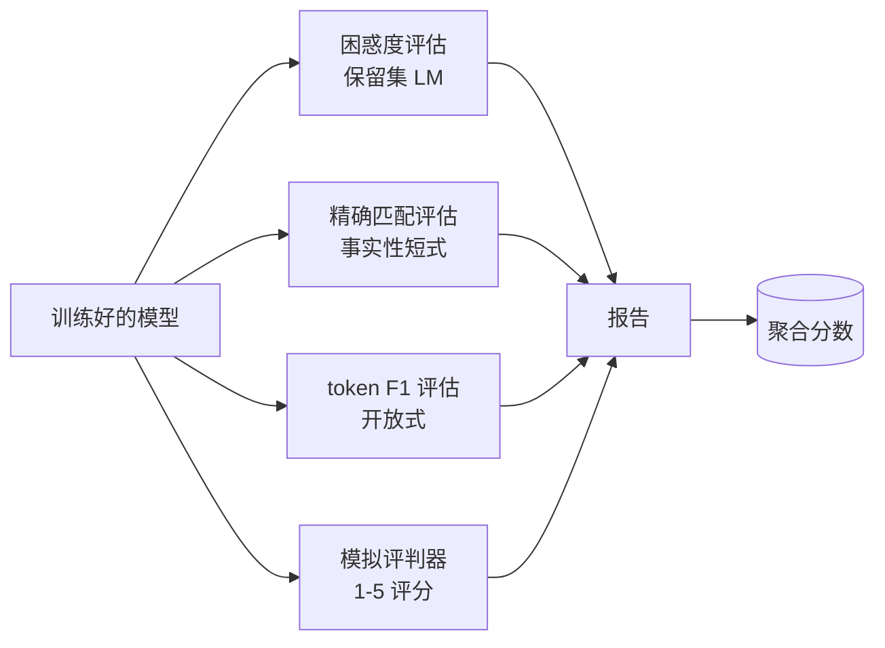
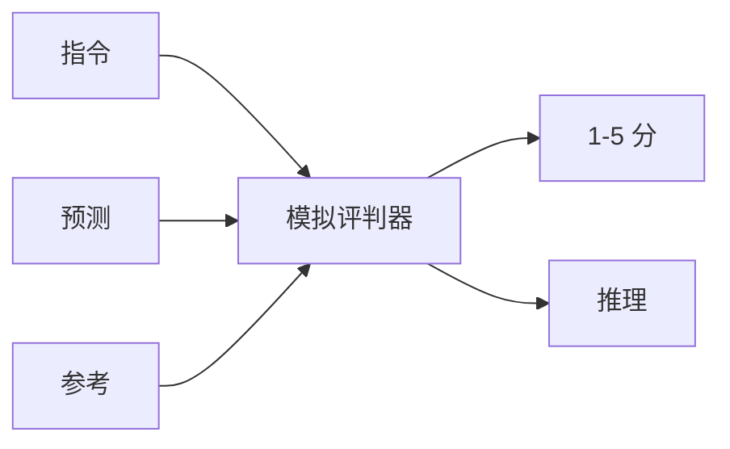
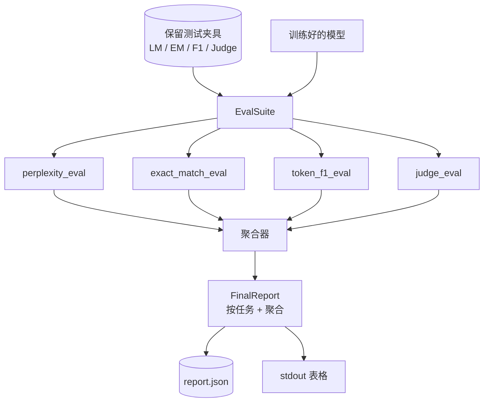

# 里程碑课程 41：完整评估管道

> 训练是你可以用损失曲线监控的部分。评估是你必须设计的部分。本课构建一个统一的评估管道，接收任何训练过的语言模型，运行四种异构评估，将结果聚合为按任务报告，并提供一个本地模拟的 LLM 评判器，使循环无需网络即可运行。四种评估涵盖了每个交付模型所需的维度：语言建模（困惑度）、短式正确性（精确匹配）、开放式相似度（token F1）和定性评分（评判器）。

**类型：** 构建
**语言：** Python（torch、numpy）
**前置要求：** 阶段 19 课程 30-37（NLP LLM 轨道：分词器、嵌入表、注意力模块、transformer 主体、预训练循环、检查点、生成、困惑度）
**时间：** ~90 分钟

## 学习目标

- 在小 transformer 上使用掩码 token 会计计算保留集困惑度。
- 在短式事实性提示词上运行精确匹配评估。
- 计算预测和参考字符串之间的 token 级 F1，带归一化。
- 构建一个本地模拟的 LLM 评判器，以 1-5 分制对模型输出评分。
- 将四种评估聚合为带按任务细分的单一加权报告。

## 问题

单一的指标永远无法描述一个语言模型。困惑度说明模型拟合语言分布的程度，但不说它是否回答问题。精确匹配说明模型是否生成金标准字符串，但惩罚正确释义。Token F1 原谅释义，但会被错误内容的词汇重叠欺骗。LLM 评判器捕捉定性维度，但昂贵且随机。

你真正需要的管道有全部四个指标。每个评估覆盖了其他评估遗漏的维度。每个在针对该指标定形的不同保留数据子集上运行。最终报告并排显示每个任务的数字和一个聚合分数，使评审者能一眼看出模型正在做的权衡。

本课在一个文件中端到端地构建该管道。

## 概念

每个评估是一个从 `(model, dataset) -> EvalResult` 的函数。结果携带指标值、供检查的每个示例详情，以及用于聚合的名称。管道用一个配置将它们组合起来，该配置说明运行哪些评估以及如何加权。

## 困惑度，正确计数

困惑度是 `exp(每个 token 的平均负对数似然)`。实现有两个陷阱：

- 均值必须基于实际的 token 位置，而不是基于 batch * sequence。填充 token 必须从分母中排除，否则困惑度看起来会比实际情况好。
- 模型预测下一个 token，因此位置 `i` 的 logits 预测位置 `i+1` 的 token。这里的差一错误是静默的：损失仍然训练，但指标变得无意义。

评估计算非填充位置上的每批次 `-log p(token)` 和以及每批次 token 计数，然后在最后相除。这在数值上比平均每批次困惑度（会低估短序列）更安全，并且与教科书定义匹配。

## 精确匹配，带归一化

评估框架在比较前对预测和参考进行归一化：

- 小写。
- 去除前后空白。
- 将内部空白合并为单一空格。
- 如果两边只差标点，则去掉结尾句末标点（`.`、`!`、`?`）。

归一化使精确匹配在实践中更有用。说 `"Paris"` 的模型是正确的；说 `"Paris."` 的也是正确的；说 `"  paris  "` 的也是正确的。指标仍然要求归一化后答案是相同的字符串。

## Token F1，正确的方式

Token F1 是在词袋上计算的精确率和召回率的调和平均数。步骤：

1. 归一化预测和参考（与精确匹配相同的规则）。
2. 将每个拆分为 token 列表（按空白分词）。
3. 计算多重集交集。
4. 精确率 = `intersection_count / len(pred_tokens)`。召回率 = `intersection_count / len(ref_tokens)`。F1 = 调和平均数。

如果预测和参考都为空，F1 为 1（空洞匹配）。如果只有一个为空，F1 为 0。这种模式与 SQuAD 评估参考匹配，并在释义上产生稳定的数字。

## 本地模拟 LLM 评判器

真实的评判器是一个在 API 后面的前沿模型。在本课中，评判器必须离线运行。模拟评判器是一个确定性评分器，接收指令、模型的预测和参考，并返回 `{1, 2, 3, 4, 5}` 的分数加一行推理。评分规则是明确的：

- 5 如果归一化预测等于归一化参考。
- 4 如果预测和参考之间的 token F1 至少为 0.8。
- 3 如果 token F1 在 `[0.5, 0.8)` 范围内。
- 2 如果 token F1 在 `[0.2, 0.5)` 范围内。
- 1 否则。

这不是一个真正的评判器，但它有正确的接口。稍后通过更改一个函数换成真正的模型。管道不关心。

## 聚合

聚合是归一化评估分数的加权平均值。每个评估报告自己的 `[0, 1]` 数字：

- 困惑度：归一化为 `1 / (1 + log(perplexity))`。困惑度 1 映射为 1，无穷大映射为 0。
- 精确匹配：已经在 `[0, 1]` 范围内。
- Token F1：已经在 `[0, 1]` 范围内。
- 评判器：除以 5。

权重可配置。默认混合是 0.2 困惑度、0.3 精确匹配、0.3 token F1、0.2 评判器。权重的选择是一个产品决策；本课暴露了旋钮，以便你可以实验。

## 架构

`EvalSuite` 是一个薄协调器。每个单独的评估是一个自由函数，接收 `(model, tokenizer, dataset, config)` 并返回 `EvalResult`。`Aggregator` 收集结果并生成最终报告。演示打印表格并写入下游 CI 可以读取的 JSON 副本。

## 你将构建什么

实现是一个 `main.py` 加测试。

1. `TinyGPT`：与课程 38-40 相同的仅解码器架构，包含进来使本课独立。
2. `InstructionTokenizer`：带 INST / RESP / PAD 特殊 token 的字节分词器。
3. 四个测试夹具：LM 语料、EM 集、F1 集和 Judge 集。每个 20 个示例，确定性的。
4. `perplexity_eval`：返回带有困惑度值和每个 token 损失直方图的 `EvalResult`。
5. `exact_match_eval`：返回平均 EM 和每个示例记录。
6. `token_f1_eval`：返回平均 token F1 和每个示例记录。
7. `mock_judge` 和 `judge_eval`：每个示例的分数和推理，整个集合的平均分。
8. `Aggregator.normalise`：每个评估的归一化规则。
9. `Aggregator.aggregate`：加权平均值和组装的报告。
10. `run_demo`：短暂训练一个小型模型，运行全部四个评估，打印报告表并写入 JSON，成功时以零退出。

## 阅读报告

报告有三层。顶部是聚合分数。下面是四个每个评估的数字。再下面是供诊断用的每个示例细分。一个失败的 CI 运行通常想要聚合分数，但追踪回归的评审者想要每个示例细分，以查看模型在哪些输入上出错了。

JSON 转储使用稳定的键，以便 CI 仪表板可以跨版本绘制趋势线。漂亮打印的表格供训练后在终端前盯着看的人类使用。

## 扩展目标

- 添加校准评估：模型的 softmax 概率是否匹配其准确率？按置信度分桶预测，并报告每桶的经验准确率。
- 添加鲁棒性评估：为每个示例标注一个扰动（拼写错误、释义、干扰项），并报告每个扰动的指标下降。
- 用 HTTP 调用后面的真实模型替换模拟评判器。函数签名不变。
- 添加按任务权重学习：不用固定权重，将权重拟合到模型上的目标偏好顺序。

实现为你提供了四种评估、聚合器和报告。真实的评估管道在上面叠加了许多更多的维度；模式保持不变：每个评估一个函数，一个聚合器，一个报告。
