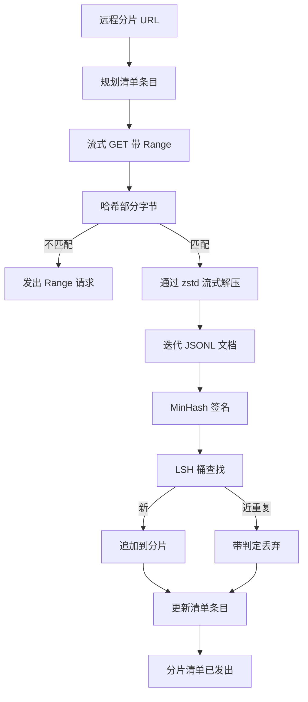

# 大规模语料下载器

> 训练语言模型在第一次前向传播之前很久就开始了。语料必须落地到磁盘、解压、去重和可寻址，在网络在 4% 处断开之前就要设计好恢复方案。本课构建一个流式下载器，拉取压缩分片，使用 Zstandard 实时解压，通过 MinHash 加局部敏感哈希对近重复文档进行指纹识别，并写入管道其余部分可以信任的分片清单。

**类型：** 构建
**语言：** Python
**前置要求：** 阶段 19 课程 30 到 37
**时间：** ~90 分钟

## 学习目标

- 使用 `urllib` 流式拉取远程分片，使用 `zstandard` 解压，而不将整个文件缓冲到内存中。
- 通过针对已验证的字节偏移发出 HTTP `Range` 请求来恢复部分下载。
- 为每个文档构建 MinHash 签名，并使用 LSH 分桶，使近重复文档发生碰撞。
- 输出一个分片清单，包含内容哈希、字节大小、文档数和去重判定。

## 问题

你第一次在 200 GB 语料上训练时，网络在 41% 处断开，脚本以 `urllib` 异常退出。第二次它在 78% 处断开。到了 99% 时你已经重写了三次循环。从第一分钟就需要设计的两个失败点是部分下载恢复和重复文档移除。两者都有成熟的解决方案；两者都经常被跳过，因为管道开始时只是一行 `requests.get` 调用，然后失控。

恢复是一个 HTTP 问题。服务器必须支持 `Range`，客户端必须跟踪针对磁盘上记录的已验证偏移，而验证偏移必须在进程死亡后存活。如果偏移和文件相差哪怕一个字节，恢复的下载就会写入垃圾数据，语料就会以一种只有在分词时才会显现的方式被破坏。

去重是一个签名问题。精确哈希去重会错过近重复：同一个 Wikipedia 文章以三种不同的样板页脚出现，同一个代码文件以不同的许可证头部出现，同一个博客文章在每个链接上带有追踪参数。MinHash 加 LSH 以次线性成本捕获这些情况。成本是每个文档一个签名和每个签名一次桶查找。

## 概念



### 使用 `urllib` 流式传输

标准库的 `urllib.request.urlopen` 返回一个类文件对象。将它包裹在 `zstandard.ZstdDecompressor().stream_reader` 中，字节从网络流过解压器进入文档迭代器，而无需在内存中物化压缩或解压后的分片。唯一的内存成本是行缓冲区、当前文档的 MinHash 签名和 LSH 索引。

### 使用 `Range` 恢复

下载器为每个分片写入两个文件：分片本身和一个 `.partial.json` 检查点。检查点记录 `verified_bytes`、`expected_size`、`sha256_prefix`（在前 `verified_bytes` 字节上计算）和源 URL。启动时下载器读取检查点，在磁盘字节上重新计算 `sha256_prefix`，只有在重新计算的哈希匹配时才恢复。如果哈希错误，部分文件被丢弃，下载从字节零重新开始。静默损坏是不可能的，因为已验证字节被检查而不是被假定。

### MinHash 加 LSH

MinHash 在固定空间中估计两个集合的 Jaccard 相似度。对于文档，集合是其文本的 shingle（重叠 n-gram）。签名是 `k` 个最小哈希值，每个来自一个独立的哈希函数。Jaccard 相似度为 `s` 的两个文档在签名的任何单个分量上同意的概率为 `s`。

LSH 然后将 `k` 个分量分组为 `b` 个 band，每个 band 有 `r` 行，其中 `k = b * r`。两个文档在至少一个 band 中碰撞的概率为 `1 - (1 - s^r)^b`，这是一个围绕你通过调整 `(b, r)` 来调节的 `s` 值的尖锐阈值。典型语料去重的阈值是 `s = 0.8`，LSH 研究文献通过 `k = 128`、`b = 32`、`r = 4` 达到此阈值。

### 分片清单作为契约

下载器唯一的持久输出是清单。清单为每个分片保存 URL、解压后的字节数、文档数、去重后的唯一文档数和最终分片文件的 sha256。下游分词读取清单而不是目录列表。如果一个分片缺失或其 sha256 错误，清单告诉下一阶段拒绝启动。清单是"数据已下载"和"数据已下载并可验证"之间的决定性边界。

## 构建

`code/main.py` 实现了：

- `ShardPlanner` - 读取分片 URL 列表并产生计划的清单条目。
- `StreamingDownloader` - 打开可选的 `Range` 的 `urllib` 流，写入临时文件，在每个块上更新 `.partial.json` 检查点，并在恢复时验证 sha256 前缀。
- `ZstdDocIterator` - 将类文件流包裹在 `zstandard.ZstdDecompressor` 中，每行产生一个文档。
- `MinHasher` - 使用固定哈希种子族为字符串产生 `k` 分量签名。
- `LSHIndex` - 按 band 对签名进行分桶并报告碰撞。
- `Dedup` - 组合哈希器和索引，将每个文档标记为 `keep` 或 `near_duplicate`，带上匹配的分片 id。
- `ManifestWriter` - 收集每个分片的统计信息并写入 `manifest.json`。

文件底部的演示程序在磁盘上构建一个小型合成语料，用 `zstandard` 压缩，通过 `file://` URL 下载，去重，并打印清单。

运行：

```bash
python3 code/main.py
```

脚本以零退出并打印清单摘要。

## 生产模式

四种模式将此课扩展到真实语料。

**写入前先检查点。** `.partial.json` 必须在字节追加到分片之前被 `fsync`。否则，电源故障会颠倒顺序：分片字节在磁盘上，但检查点没有它们，下一次恢复认为它拥有的已验证字节比实际少，重复的后缀字节损坏文件。先检查点，再写入。这与预写日志是相同的纪律。

**分片 LSH 索引。** 一个覆盖整个语料的单次 LSH 索引在 200 GB 规模下放不进 RAM。按第一个 band 哈希对 LSH 索引分区，将分区存储在磁盘上，只查阅新签名会落入的分区。代价是每个文档多一次磁盘读取；好处是 LSH 索引不再是硬性的内存天花板。

**墓碑记录，而非删除。** 被丢弃的重复项在清单中记录为 verdict `near_duplicate` 以及与其碰撞的文档的分片 id。删除它们会丢失重复项与其保留者之间的链接。墓碑记录保留了审计线索，并让下游处理能够改变关于阈值的决定。

**清单中的每分片 sha256，加清单 sha256。** 清单本身获得一个内容哈希。下游阶段在信任每个分片条目之前验证清单哈希。没有这个，清单就是静默攻击面：能够编辑单个文件的攻击者可以破坏整个管道。

## 使用

生产模式：

- **每次 CI 运行时恢复。** CI 运行器是临时的。下载器必须假设每次运行从头开始磁盘，并从缓存或远程恢复。`--cache-dir` 是一等标志。
- **在分词前先去重。** 分词是昂贵的。在同一个文档上运行两次是双倍的成本换取相同的损失曲线。去重在分词上游，而不是下游。
- **清单作为合并门控。** 训练运行从固定提交读取清单 sha256。新的数据集版本需要新的清单提交。代码和数据之间的链接是 git，而不是口口相传。

## 发布

在真实项目中，`outputs/skill-corpus-downloader.md` 会描述哪些 URL 供给下载器，检查点目录如何布局，去重使用什么 shingle 宽度和 `(k, b, r)` 三元组，以及清单在版本控制中的位置。本课发布引擎。

## 练习

1. 添加 `--shingle-width` 标志，测量去重判定在宽度 3、5、9 时的变化。论证所选默认值。
2. 通过嗅探魔数在 zstd 旁边添加 gzip 支持。下载器不应要求调用者指定编解码器。
3. 添加一个 `--resume-only` 模式，如果没有找到检查点，拒绝启动新下载。在 CI 中有用，防止一次运行意外地重新拉取 200 GB。
4. 将 LSH 索引移到 shelf 或 sqlite 文件，并与内存变体比较吞吐量。
5. 添加启动时清单 sha256 检查。如果磁盘上的清单与 `manifest.lock` 中的清单哈希不一致，下载器应失败关闭。

## 关键术语

| 术语 | 人们说的 | 实际含义 |
|------|---------|---------|
| 分片 | "一个文件" | 语料的一个自包含片段，带有自己的 sha256，用作恢复和去重的单元 |
| MinHash 签名 | "指纹" | 一个集合的 `k` 分量草图，其中每个分量是该集合上独立哈希的最小值 |
| LSH band | "桶" | 一组 `r` 个签名分量，用作单个桶键进行碰撞检测 |
| 已验证字节 | "恢复偏移" | 其 sha256 前缀与检查点匹配的磁盘字节；唯一安全的恢复偏移 |
| 清单 | "索引" | 下载器产生的唯一持久记录，包括内容哈希 |

## 延伸阅读

- [RFC 7233](https://datatracker.ietf.org/doc/html/rfc7233) - HTTP Range 请求，恢复协议
- [Zstandard 格式规范](https://datatracker.ietf.org/doc/html/rfc8478) - 使流式解压安全的帧格式
- [MinHash](https://en.wikipedia.org/wiki/MinHash) - 本课使用的签名族
- [局部敏感哈希](https://en.wikipedia.org/wiki/Locality-sensitive_hashing) - 去重阈值背后的分带方案
- 阶段 19 · 43 - 下载器供给的 HDF5 分词语料
- 阶段 19 · 44 - 在语料上训练的余弦调度
- 阶段 19 · 45 - 消费该调度的 AMP 循环
