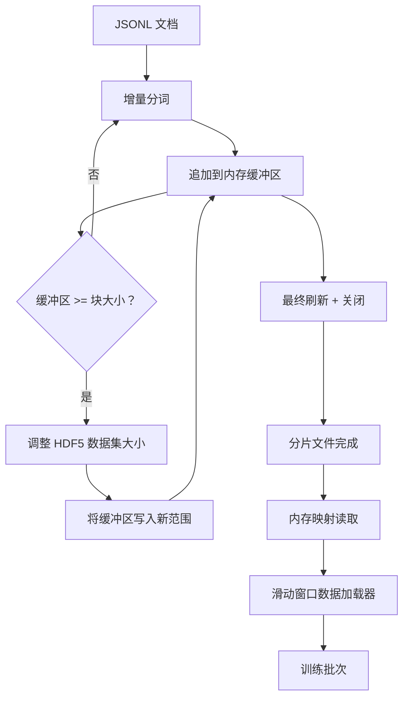

# HDF5 分词语料

> 下载的语料必须以训练器能够以线速流式读取的布局落地到磁盘上。磁盘上的 JSONL 无法承受 16 个数据加载器工作进程。带有可调整大小、分块整数数据集的 HDF5 可以。本课构建流式分词到可调整大小的 HDF5 数据集、跨多个文件的写入分片、训练时的内存映射读取，以及一个产生带有正确打包的定长序列的滑动窗口数据加载器。

**类型：** 构建
**语言：** Python
**前置要求：** 阶段 19 课程 30 到 37
**时间：** ~90 分钟

## 学习目标

- 以确定性的分块将文档流式写入可调整大小的 HDF5 整数数据集。
- 将写入分片到多个 HDF5 文件，使失败被限定范围并支持并行。
- 通过 HDF5 的页面缓存支持的分块布局读回 token，使数据加载器只在批次时复制到批次缓冲区。
- 实现一个滑动窗口数据加载器，发出带有显式打包规则的定长训练序列。

## 问题

现代语言模型训练运行以每秒数十万个样本的速率跨数十个工作进程读取 token。磁盘上的 JSONL 在第一次冷缓存缺页时就死了：JSON 解析器慢，文档边界不可寻址，寻找"样本 4,217,884"需要扫描文件。即使是压缩良好的 Parquet 也是一个糟糕的选择，因为训练器不需要列；它想要一个扁平的 token 流，具有 O(1) 随机访问。

HDF5 适合，因为它提供了一个分块、可调整大小、仅整数的数据集，其块在读取时对页面缓存友好。训练器请求一个 `tokens[3,200,000 : 3,200,8192]` 的切片，HDF5 将请求的超切片从页面缓存复制到新分配的 NumPy 数组中。代价是每个工作进程一个打开的文件句柄和一个块大小的页面缓存占用，与解码 JSONL 的成本相比微不足道。

构建问题在于让写入端诚实。可调整大小的数据集很容易被误用：一次写一个文档，HDF5 文件就会被碎片化到不可用的程度。在一次调整大小中写入所有文档，进程死亡就会丢失整个分片。正确的纪律是先缓冲再扩展，缓冲区大小匹配块大小，并使用分片写入将工作负载分散到多个文件上，使崩溃最多丢失一个分片。

## 概念



### 正确使用可调整大小的 HDF5

Token 数据集以 `maxshape=(None,)` 和固定 `chunks=(chunk_size,)` 创建。写入过程将 token 缓冲到长度为 `chunk_size` 的 NumPy 数组中。当缓冲区满时，数据集精确地按 `chunk_size` 调整大小，并将缓冲区写入新范围。在分片结束时，剩余缓冲区被写入最终的局部范围。每次写入都是连续的且块对齐的，除了最后一次，读取器被告知在记录的 `token_count`（在分片的 HDF5 属性中）处截断。

### 分片写入

单个 HDF5 文件是一个单点故障。管道并行写入分片：来自阶段 19 课程 42 的每个输入分片产生一个 HDF5 输出分片。一个 `shards.json` 索引按分片记录文件路径、token 数、文档数和 token 上的 sha256。训练器读取 `shards.json` 以计算全局偏移并验证语料。

### 内存映射读取

在训练时，每个工作进程以 `swmr=True` 模式打开其份额的 HDF5 文件，并请求 `tokens[start:stop]`。HDF5 的块布局使这在块变热后成为页面缓存支持的读取。工作进程从未物化整个文件：切片被复制到数据加载器的批次缓冲区，然后数据加载器在批次时将其复制到固定内存的训练张量中。热路径每次块过渡有一次系统调用；其他一切都是 RAM 访问。

### 滑动窗口数据加载器

数据加载器是唯一知道训练序列长度的阶段。它在全局 token 流中选择一个随机起始索引，读取 `window_size + 1` 个 token，并返回 `(input, target) = (tokens[:-1], tokens[1:])`。文档边界不被强制执行：一个窗口可能跨越两个文档，它们之间有一个显式的 `boundary_token_id`，使模型学会使用分隔符。这是标准的打包规则；这也是一个初学者会忘记的规则，最终导致语料中有 8% 是训练边界 token，92% 是自然文本。

## 构建

`code/main.py` 实现了：

- `Tokenizer` - 一个字节级的确定性分词器，足以用于演示。接口是 `encode(text) -> list[int]` 和 `vocab_size`。
- `HDF5ShardWriter` - 打开一个可调整大小的整数数据集，将 token 缓冲到块大小，以固定大小的步幅调整大小并写入，在关闭时记录 `token_count` 和 `sha256` 作为 HDF5 属性。
- `ShardedTokenizationPipeline` - 迭代输入文档，路由到写入器，并输出 `shards.json` 索引。
- `MmapTokenStore` - 打开分片文件进行内存映射读取，计算全局偏移，暴露单个 `get_slice(start, stop)` API。
- `SlidingWindowDataloader` - 从全局流中选取随机窗口，并产生 `(input_ids, target_ids)` NumPy 数组。

文件底部的演示程序构建一个小的内存语料，分词到两个分片，通过内存映射打开，运行数据加载器 10 个批次，并打印每批次形状和校验和。

运行：

```bash
python3 code/main.py
```

脚本以零退出并打印批次校验和。

## 生产模式

四种模式将此课扩展到真实训练运行。

**块大小等于典型读取。** 训练器每个样本读取 `window_size + 1` 个 token。将 HDF5 块设置为 `window_size` 的倍数，读取就会与页面缓存对齐。不匹配的块会使吞吐量减半，因为每个样本触及两个块。

**属性中的 token 计数，不在数据集中。** 数据集的尾随切片可能部分满，因为块大小不能整除文档边界。将真实的 `token_count` 作为 HDF5 属性存储在数据集上，并让读取器在该值处截断。没有这个，读取器会走出末尾进入零填充的 token，模型会学习预测零。

**分片 sha256 带并行验证。** 每个分片在 token 字节上有自己的 sha256。训练器可以在训练开始前并行验证所有分片。错误的 sha256 会提前失败运行，而不是在 16 小时后的第三个 epoch。

**双方使用 `swmr=True`，写入端使用 `libver="latest"`。** 单写入者多读取者模式要求写入端以 `libver="latest"` 打开，预先创建每个数据集，然后设置 `file.swmr_mode = True`。之后，写入端必须在每次调整大小后调用 `dataset.flush()`，以便读取工作进程（以 `swmr=True` 打开）看到一致的数据。跳过 `libver="latest"` 或在结构更改后启用 SWMR 是"文件被锁定"失败的常见来源。

## 使用

生产模式：

- **每个源分片一个 HDF5。** 下载器（课程 42）每个 URL 产生一个分片；分词（本课）每个源分片产生一个 HDF5。1:1 映射使恢复和部分失败恢复变得微不足道。
- **边界 token id。** 边界 token 是分词器词汇表的一部分，是数据加载器注入的唯一 token。如果模型应该忽略边界 token，训练损失掩码它；否则它学会将其用作序列分隔符。
- **`shards.json` 作为真实来源。** 添加新分片意味着写入 HDF5，计算其 sha256，并追加一个条目。训练器在启动时读取该文件一次，从不触及目录列表。

## 发布

在真实项目中，`outputs/skill-hdf5-tokenized-corpus.md` 会描述哪个分词器供给管道、什么块大小匹配训练器的窗口、`shards.json` 在版本控制中的位置，以及数据加载器工作进程如何跨文件分片。本课发布引擎。

## 练习

1. 为 HDF5 写入器添加 `--compression gzip` 标志，并衡量演示语料上的吞吐量成本。论证所选默认值。
2. 为滑动窗口数据加载器添加确定性种子，并验证两个具有相同种子的运行产生相同批次。
3. 添加 `--validate` 模式，读取每个分片，在其 token 上重新计算 sha256，并与 `shards.json` 比较。CI 应在训练开始前运行此项。
4. 比较块大小等于、一半和两倍窗口大小的数据加载器吞吐量。报告页面缓存效应。
5. 添加 `--max-document-tokens` 标志，在写入时截断非常长的文档。与在读取时做决定相比，论证这种权衡。

## 关键术语

| 术语 | 人们说的 | 实际含义 |
|------|---------|---------|
| 可调整大小数据集 | "仅追加" | 一个以 `maxshape=(None,)` 创建的 HDF5 数据集，通过以块大小步幅的 `resize` 调用增长 |
| 分块布局 | "HDF5 如何存储" | 内核可以内存映射、数据加载器可以连续读取的固定大小磁盘页面 |
| `swmr` 模式 | "边写边读" | 单写入者多读取者模式，让数据加载器工作进程安全地共享文件 |
| 分片索引 | "shards.json" | 所有 token 分片的持久索引，包含偏移和内容哈希 |
| 滑动窗口 | "训练样本" | 全局 token 流的一个定长切片，训练器将其与偏移一位的目标配对 |

## 延伸阅读

- [HDF5 分块文档](https://docs.hdfgroup.org/hdf5/v1_14/) - 本课使用的分块、可调整大小数据集布局
- [h5py 用户指南](https://docs.h5py.org/en/stable/) - HDF5 的 Python 绑定
- [NumPy 内存映射](https://numpy.org/doc/stable/reference/generated/numpy.memmap.html) - HDF5 通过 h5py 暴露的读取端原语
- 阶段 19 · 42 - 本课对其输出进行分词的下载器
- 阶段 19 · 44 - 消费此数据加载器的余弦调度
- 阶段 19 · 45 - 包裹训练步骤的 AMP 循环
