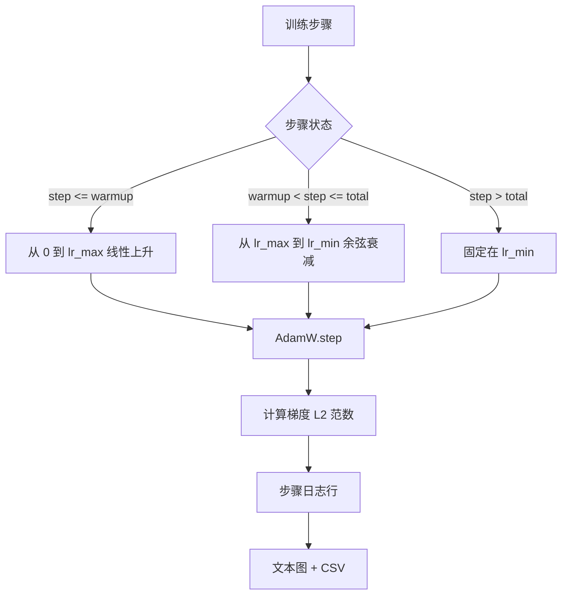

# 带线性预热的余弦学习率

> 学习率调度是继损失函数之后第二重要的决策。带余弦衰减和线性预热的 AdamW 是语言模型训练的现代默认选择，因为它让模型在脆弱的前一千次更新中看到较小的有效步长，然后上升到配置的峰值，并平滑地衰减回零附近。本课构建该调度，在训练步骤上绘制曲线，在调度旁边记录梯度范数，并证明调度尊重预热、峰值和衰减边界。

**类型：** 构建
**语言：** Python
**前置要求：** 阶段 19 课程 30 到 37
**时间：** ~90 分钟

## 学习目标

- 实现一个连接到带线性预热的余弦学习率调度的 AdamW 优化器。
- 在任意步数上计算调度的精确值，且跨运行没有浮点漂移。
- 将梯度 L2 范数与学习率并排记录，使训练健康状态可见。
- 将调度渲染成人眼可读的文本图和任何工具可消费的 CSV。

## 问题

前一千次训练更新是最喧闹的。模型的权重仍然接近初始化。优化器的运行二阶矩估计还没有稳定。梯度范数既大又嘈杂。如果这些更新期间学习率处于峰值，模型要么直接发散，要么陷入它永远无法逃脱的损失高原。两个成熟的修复方案是梯度裁剪（阶段 19 课程 45 的主题）和一个从低开始然后上升的学习率调度。

余弦加预热调度有三个区域。从第 0 步到 `warmup_steps` 步，学习率从零线性上升到配置的峰值 `lr_max`。从 `warmup_steps` 步到 `total_steps` 步，学习率跟随余弦曲线的上半部分，从 `lr_max` 衰减到 `lr_min`。在 `total_steps` 之后，学习率固定在 `lr_min`，这样配置错误的训练器如果超出范围，不会静默地退出调度。

构建问题在于调度容易差一错误。差一错误在训练运行六小时后显现为学习率在模型开始过拟合的时刻高出或低出 1%，除非调度在边界处被穷举测试，否则这是不可见的。

## 概念



### 预热公式

对于 `step` 在 `[0, warmup_steps]` 范围内且 `warmup_steps > 0`，学习率是 `lr_max * step / warmup_steps`。退化情况 `warmup_steps = 0` 被视为"无预热"：调度从第 0 步直接以 `lr_max` 开始并立即进入余弦衰减。一些测试框架传入 `warmup_steps = 0` 来检查调度是否仍产生可用曲线。

### 余弦公式

对于 `step` 在 `(warmup_steps, total_steps]` 范围内，学习率是 `lr_min + 0.5 * (lr_max - lr_min) * (1 + cos(pi * progress))`，其中 `progress = (step - warmup_steps) / max(1, total_steps - warmup_steps)`。在 `step = warmup_steps` 时，余弦计算为 `cos(0) = 1`，得到 `lr_max`，与预热端点精确匹配。在 `step = total_steps` 时，余弦计算为 `cos(pi) = -1`，得到 `lr_min`，与衰减端点精确匹配。

两个端点的连续性不是巧合。这是为什么调度实现为 `step` 上的单一函数而不是三个不同函数拼接在一起的原因。拼接的调度在第一次改变 `lr_max` 时会丢失一个边界。

### 总步数后的下限

对于 `step > total_steps`，学习率保持在 `lr_min`。契约是明确的：调度不出错也不外推；它固定在下限并让训练器记录一个警告。需要扩展训练的训练器更改调度的 `total_steps`，而不是循环。

### 梯度范数记录与学习率并列

调度是训练健康的一半。梯度范数是另一半。训练循环每步记录两者。发散训练运行在损失之前显示梯度范数尖峰；调整良好的预热使范数随着学习率线性上升；过于激进的峰值表现为预热后范数保持在高位。磁盘上的数据集是 `step, lr, grad_l2_norm, loss`。CSV 是唯一的持久记录。

## 构建

`code/main.py` 实现了：

- `CosineWithWarmup` - 一个无状态函数 `lr(step) -> float`，在配置的调度上。
- `TrainState` - 将模型、`AdamW` 优化器和调度包裹成一个单步函数。
- `TrainState.step` - 运行一次前向传播、一次反向传播，记录梯度 L2 范数，并将 `lr(step)` 应用于优化器。
- `plot_schedule_ascii` - 将调度渲染成人眼可读的文本图。
- `write_schedule_csv` - 每步发出一行，包含学习率。

文件底部的演示程序构建一个小型 `nn.Linear` 模型，在固定输入批次上训练 20 步，并打印每步的学习率、梯度范数和损失。调度也被渲染为文本图，以进行可视化健全性检查。

运行：

```bash
python3 code/main.py
```

脚本以零退出并打印每步训练日志加调度图。

## 生产模式

四种模式将调度提升为生产产物。

**调度在配置中，不在代码中。** 训练器从提交到 git 的 YAML 或 JSON 配置中读取 `warmup_steps`、`total_steps`、`lr_max`、`lr_min`。调度是可复现的，因为配置是内容寻址的；调度是可审计的，因为配置是 PR 差异的一部分。

**步计数器是单调的，与 epoch 解耦。** 一些框架在数据集被分片或数据加载器重启时混淆步和 epoch。调度从训练器检查点中的 `global_step` 读取，而不是从本地计数器。恢复的运行在正确的调度位置继续，因为步计数器是持久轴。

**运行目录中的调度图。** 每次训练运行将 `outputs/lr_schedule.png`（或本课中的文本图）写入其运行目录。浏览目录的评审者可以无需重新运行任何内容就能进行健全性检查。这能在 PR 时捕获配置错误的调度类 bug。

**日志行模式是固定的。** `step, lr, grad_l2_norm, loss` 按此顺序。下游的笔记本或仪表板读取该模式；在不提升版本的情况下重命名列会使每个现有仪表板失效。

## 使用

生产模式：

- **先扫描峰值，再扫描其他所有内容。** `lr_max` 是最敏感的旋钮。首先在小模型上扫描它；最优 `lr_max` 与模型大小的相关性较弱，因此小模型扫描是一个强有力的先验。
- **预热是总步数的一个分数，而不是一个绝对计数。** 2 亿步的运行有 2000 步预热几乎立即达到峰值；2 万步的相同数量预热则用了 10%。将预热配置为分数（典型值：1-3%），使调度随训练时长缩放。
- **`lr_min` 故意非零。** 为 `lr_max` 的 10% 的下限保持优化器在长尾期间学习。`lr_min = 0` 的调度会产生在图上看起来很美但模型实际上并未完成训练的曲线。

## 发布

在真实项目中，`outputs/skill-cosine-warmup.md` 会描述哪个配置携带调度、全局计数器从哪个训练器步读取，以及哪个 `lr_max` 扫描产生了部署值。本课发布引擎。

## 练习

1. 添加调度的逆平方根变体，并在 200 步玩具训练运行上进行比较。哪个曲线产生更低的最优损失？
2. 添加 `--restart` 标志，在 `total_steps / 2` 处添加第二次预热。论证在玩具运行上热重启是改善还是恶化。
3. 添加一个单元测试，证明调度是连续的：对于 `[0, total_steps]` 中的每一步，差值 `|lr(step+1) - lr(step)|` 以 `lr_max / warmup_steps` 为界。
4. 将调度接入 `torch.optim.lr_scheduler.LambdaLR`，使其与框架代码组合。本课使用普通的步函数；包装器改变了什么？
5. 添加 `--plot-png` 标志，通过 `matplotlib` 写入真实图。论证本课的文本图还是 PNG 是 CI 运行中更好的默认值。

## 关键术语

| 术语 | 人们说的 | 实际含义 |
|------|---------|---------|
| 预热 | "缓慢启动" | 在前 `warmup_steps` 次更新中从零到 `lr_max` 的线性上升 |
| 余弦衰减 | "平滑下降" | 在剩余步数中从 `lr_max` 到 `lr_min` 的上半部分余弦曲线 |
| 下限 | "训练后" | 调度在 `total_steps` 之后固定的 `lr_min` 值 |
| 梯度范数 | "梯度的 L2" | 拼接的梯度向量的欧几里得范数，每步记录 |
| 全局步 | "调度轴" | 在重启后存活的单调步计数器，驱动调度 |

## 延伸阅读

- [Loshchilov and Hutter, SGDR: Stochastic Gradient Descent with Warm Restarts (arXiv 1608.03983)](https://arxiv.org/abs/1608.03983) - 余弦调度的参考论文
- [Loshchilov and Hutter, Decoupled Weight Decay Regularization (arXiv 1711.05101)](https://arxiv.org/abs/1711.05101) - AdamW 的参考论文
- [PyTorch torch.optim.lr_scheduler](https://docs.pytorch.org/docs/stable/optim.html#how-to-adjust-learning-rate) - 步函数如何与框架调度器组合
- 阶段 19 · 42 - 此调度消费其语料的下载器
- 阶段 19 · 43 - 调度与其共同演进的数据加载器
- 阶段 19 · 45 - 梯度裁剪和 AMP，循环中的下一层
