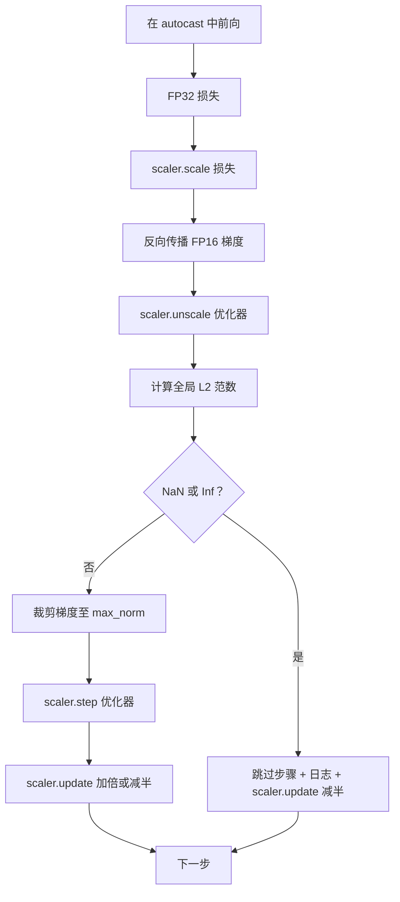

# 梯度裁剪与混合精度

> 前几课中的优化器和调度策略假设梯度是正常的。但它们通常不是。单个糟糕的批次可能使梯度范数飙升三个数量级。混合精度训练通过引入 FP16 损失溢出放大了这个问题。本课构建了生产训练不能缺少的两条安全带：将梯度裁剪到配置的全局 L2 范数，以及包含 autocast 和 GradScaler 的混合精度循环，该循环检测 NaN 和 Inf，干净地跳过该步骤，并记录缩放因子用于取证。

**类型：** 构建
**语言：** Python
**前置知识：** 阶段 19 第 30-37 课
**时长：** ~90 分钟

## 学习目标

- 计算所有参数梯度的全局 L2 范数，并在超过配置阈值时进行原地裁剪。
- 将训练步骤包装在 autocast 加 GradScaler 中，使 FP16 前向和反向传播能够承受溢出。
- 检测损失或梯度中的 NaN 和 Inf，跳过优化器步骤，并记录跳过的信息。
- 每一步报告 GradScaler 的缩放因子，使长时间的跳过序列立即可见。

## 问题

一个昨天还正常运行训练的运行，在步骤 8,217 处产生了垂直向上的损失曲线。罪魁祸首是一个梯度范数为 4,200 的批次，是之前峰值的二十倍。没有裁剪，优化器应用的步骤会重置模型在过去一小时学到的所有知识。使用全局 L2 裁剪（范数 1.0），同一批次贡献了一个单位范数的更新；损失保持在趋势线上；训练得以存活。

混合精度训练通过在前向传播和大部分反向传播中使用 FP16 计算，将吞吐量提升 2-3 倍。代价是 FP16 的指数范围很窄。在 FP16 中溢出的典型梯度会变为 Inf，通过后续层传播为 NaN，然后在下一个优化器步骤中将所有权重设置为 NaN。PyTorch 的 GradScaler 通过在反向传播前将损失乘以一个大的缩放因子，并在优化器步骤前将梯度除以相同的因子来解决这个问题。如果在取消缩放时有任何梯度是 Inf 或 NaN，缩放器会跳过该步骤并将缩放因子减半；如果之前的 N 步是干净的，缩放器会将因子加倍。在训练过程中，该因子会找到 FP16 范围允许的最高值。

构建问题在于正确连接两者。在取消缩放前裁剪，阈值是在缩放后的梯度上操作的；在取消缩放后裁剪，GradScaler 上的操作顺序很重要。正确的顺序是：`scaler.scale(loss).backward()`，然后 `scaler.unscale_(optimizer)`，然后 `clip_grad_norm_`，然后 `scaler.step(optimizer)`，然后 `scaler.update()`。任何其他顺序都会产生一个静默损坏的循环。

## 概念



### 全局 L2 范数

全局 L2 范数是拼接后的梯度向量的欧几里得范数，而不是逐参数范数。PyTorch 实现为 `torch.nn.utils.clip_grad_norm_(parameters, max_norm)`。该函数返回裁剪前的范数，以便本课可以记录自然值和裁剪值，这对于"我们在每一步都在裁剪"的诊断是必要的。

### autocast 和 GradScaler

`torch.amp.autocast(device_type)` 是上下文管理器，选择性以 FP16 运行符合条件的操作（大多数矩阵乘法类操作）。`torch.amp.GradScaler(device_type)` 是在反向传播前缩放损失、在优化器步骤前逆缩放梯度的辅助工具。两者是协同设计的；使用其中一个而不使用另一个是测试应该捕获的配置错误。

本课使用 CPU autocast，因为它能在 CI 中运行；通过将 `device_type="cpu"` 更改为 `device_type="cuda"`，相同模式可直接迁移到 CUDA。CPU 上的 GradScaler 是一个桩（CPU autocast 默认已在 BF16 下运行，不需要损失缩放），但本课包含了调用点，以便接线方式与 GPU 循环相同。

### NaN 和 Inf 检测

检测发生在两个地方。首先，在反向传播前用 `torch.isfinite` 检查损失本身；Inf 或 NaN 损失不会产生有用的梯度，在不进入优化器的情况下被跳过。其次，在 `scaler.unscale_(optimizer)` 之后，本课用 `has_non_finite_grad(...)` 扫描未缩放的梯度，并将任何 Inf 或 NaN 视为跳过。两个检查共同覆盖了前向传播和反向传播两种故障模式。

### 缩放因子诊断

缩放因子是 GradScaler 的内部状态。每一步本课读取 `scaler.get_scale()` 并将其与学习率和梯度范数一起记录。健康的训练运行显示缩放因子以 2 的幂次攀升，直到饱和在约 `2^17` 或 `2^18` 附近。异常运行显示因子在高值和低值之间振荡，这是模型梯度有时在范围内有时不在的信号。没有记录，这个诊断是不可见的。

## 构建

`code/main.py` 实现：

- `clip_global_l2_norm` — 围绕 `torch.nn.utils.clip_grad_norm_` 的包装器，返回裁剪前和裁剪后的范数。
- `has_non_finite_grad` — 扫描梯度的 NaN 和 Inf 的辅助函数。
- `AmpTrainState` — 包装模型、`AdamW` 优化器、GradScaler 和 autocast 设备。暴露了运行完整裁剪、缩放和 NaN 跳过管道的 `step(inputs, targets)` 方法。
- `StepLog` 和 `SkipLog` — 结构化的逐步骤记录。
- 一个演示，训练小型 `nn.Linear` 模型 20 步，在第 5 步向梯度注入 Inf 以触发跳过路径，并打印生成的日志。

运行：

```bash
python3 code/main.py
```

脚本以零退出并打印逐步骤日志，每行标记为 `STEP` 或 `SKIP`；至少有一行为 `SKIP`。

## 生产模式

四种模式将循环提升到生产训练步骤。

**跳过计数器作为警报，而非日志行。** 每次训练运行中少量的跳过步骤是健康的。每 epoch 数百次跳过是硬警报：模型处于 FP16 无法维持的状态，循环正在静默失败。本课跟踪 1,000 步滚动跳过率，在生产中会在率高于 5% 时发出警报。

**裁剪阈值存在于配置中。** `max_norm = 1.0` 是语言模型训练的现代默认值。先在小模型上进行扫描；较大的阈值让模型从真正困难的批次中恢复；较小的阈值在最坏情况下限定界限，代价是更嘈杂的损失曲线。该阈值应与第 44 课的调度策略位于同一个 YAML 或 JSON 配置中。

**范数日志与调度策略存入同一个 CSV。** CSV 列是 `step, lr, grad_l2_pre_clip, grad_l2_post_clip, loss, skipped, skip_reason, scaler_scale`。打开文件的审阅者可以在一行中看到调度策略、梯度情况、缩放因子和跳过结果（及其原因）。跨文件拆分列是导致分析错位的根源。

**`scaler.update()` 每一步都运行，即使在跳过时。** 在干净的步骤上，缩放器读取其无 Inf 计数器，递增它，并可能加倍因子。在跳过的步骤上，缩放器将因子减半并重置计数器。在跳过路径上忘记 `update()` 是导致"缩放因子从未改变"的 bug。

## 使用

生产模式：

- **Autocast 设备与优化器设备匹配。** GPU 训练使用 `torch.amp.autocast(device_type="cuda")`；CPU 使用 `torch.amp.autocast(device_type="cpu")`。混用设备会产生静默的类型错误，表现为损失曲线看起来正常但模型没有在学习。
- **反向传播前的损失检查。** `torch.isfinite(loss).all()` 是一次张量归约；代价可以忽略不计，NaN 损失上的节省是整个训练步骤。始终运行它。
- **`zero_grad` 中设置 `set_to_none=True`。** 将梯度设置为 `None` 而不是零，使优化器可以跳过不受影响参数组的计算。该设置是免费的吞吐量改进和轻微的 bug 面减少。

## 交付

`outputs/skill-clip-amp.md` 将在实际项目中描述训练步骤使用哪个裁剪阈值和 autocast 设备、逐步骤 CSV 在版本控制中的位置以及生产跳过率警报阈值是什么。本课交付引擎本身。

## 练习

1. 用真实的损失尖峰替换合成 Inf 注入（将一个批次的 target 乘以 1e8）并验证跳过路径被触发。
2. 添加 `--bf16` 模式，将 autocast 切换到 BF16 而不是 FP16。BF16 的指数范围比 FP16 更宽，很少需要损失缩放；验证在相同演示上跳过率降至零。
3. 添加单元测试，验证梯度裁剪包装器在未发生裁剪时正确返回裁剪前和裁剪后的范数。
4. 添加滚动窗口跳过率计算和 CLI 标志，如果连续 100 步的率超过配置阈值，则使运行失败。
5. 将循环连接到写入规范的 CSV（`step, lr, grad_l2_pre_clip, grad_l2_post_clip, loss, skipped, skip_reason, scaler_scale`），并通过在每行后刷新确认文件能在 Ctrl-C 下存活。

## 关键术语

| 术语 | 人们所说的 | 实际含义 |
|------|-----------|---------|
| 全局 L2 范数 | "裁剪目标" | 跨所有可训练参数的拼接梯度向量的欧几里得范数 |
| autocast | "混合精度" | 在 `with` 块内选择性以 FP16（或 BF16）执行符合条件的操作 |
| GradScaler | "损失缩放器" | 在反向传播前乘以损失、在优化器步骤前逆缩放梯度的辅助工具 |
| 跳过 | "坏步骤" | 由于梯度或损失非有限而被拒绝的优化器步骤；缩放器将因子减半 |
| 缩放因子 | "缩放器状态" | GradScaler 的当前乘数；在干净段后加倍，在每次跳过时减半 |

## 延伸阅读

- [Micikevicius 等人，混合精度训练（arXiv 1710.03740）](https://arxiv.org/abs/1710.03740) — 原始损失缩放提案
- [Pascanu、Mikolov、Bengio，论循环神经网络训练的难度（arXiv 1211.5063）](https://arxiv.org/abs/1211.5063) — 梯度裁剪参考论文
- [PyTorch torch.amp.GradScaler](https://docs.pytorch.org/docs/stable/amp.html) — 本课包装的缩放器 API
- [PyTorch torch.nn.utils.clip_grad_norm_](https://docs.pytorch.org/docs/stable/generated/torch.nn.utils.clip_grad_norm_.html) — 本课使用的裁剪原语
- 阶段 19 · 42 — 下载器，其语料库供给循环
- 阶段 19 · 43 — 循环消费的数据加载器
- 阶段 19 · 44 — 本课循环组合的调度策略
