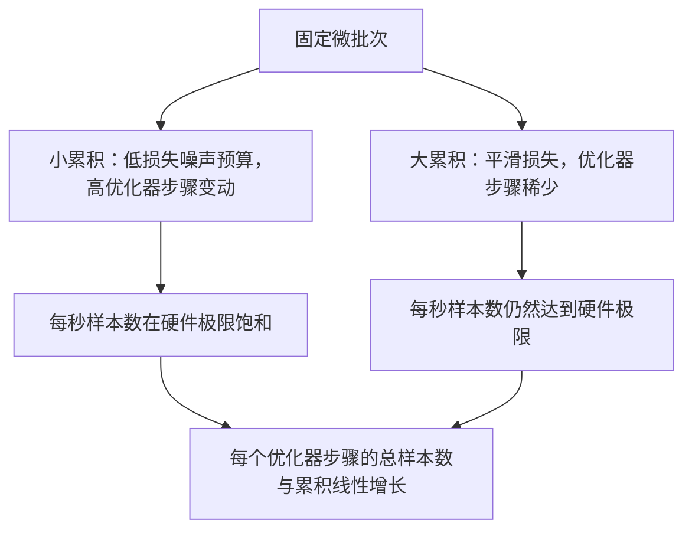

# 梯度累积

> 以你无法负担的有效批次大小进行训练，一次一个微批次。缩放损失，保持优化器步骤，让梯度累积起来。

**类型：** 构建
**语言：** Python
**前置知识：** 阶段 19 第 42 至 45 课
**时长：** ~90 分钟

## 学习目标

- 推导有效批次恒等式：`有效批次 = 微批次 * 累积步数`。
- 实现每微批次损失缩放，使累积梯度与单个完整批次的反向传播相匹配。
- 跳过优化器同步直到最后一个微批次（最后一步同步）。
- 读取吞吐量对有效批次曲线并解释边际效益递减。

## 问题

你想以有效批次 512 进行训练，因为损失曲线更平滑，优化器步骤在该规模下更有意义。桌面上的加速器在内存耗尽前只能容纳 32 个样本。加倍批次不可行。减半模型也不是选项。该领域在 2017 年采用并从未停止使用的技巧是运行 16 次反向传播，让梯度在参数缓冲区中累积，只在计数达到目标时才执行优化器步骤。

风险在于损失不再与更大批次下的数值相同。16 个微批次的交叉熵简单求和是一个完整批次损失的 16 倍。没有缩放，梯度方向是正确的但幅度是错误的，优化器步骤是 16 倍太大。修复方法是一次除法。这个修复也很容易被遗忘。

## 概念


契约很简短：

- 每个微批次的损失在 `backward()` 之前除以 `accum_steps`。PyTorch 默认将梯度求和到 `param.grad` 中；除法将运行和推回到正确的比例。
- 优化器步骤每个有效批次触发一次，在最后一个微批次的反向传播之后。在累积过程中间执行步骤会使运行其余部分依赖的每个参数发生偏差。
- 优化器的状态（动量缓冲区、Adam 矩）每个有效步骤前进一次，而不是每个微批次。否则指数移动平均会看到错误的频率并过快消耗调度策略。
- 在单设备上，这只是记账。在多 rank 集群上，相同的模式将非最终微批次包装在 `no_sync` 上下文中，跳过梯度全归约；最后一个微批次在一次传递中减少完整的累积梯度，而不是支付 N 次网络成本。

### 等价性的代码证明

```python
loss = criterion(model(x_full), y_full)
loss.backward()
opt.step()
```

等价于

```python
for x, y in chunks(x_full, y_full, n):
    scaled = criterion(model(x), y) / n
    scaled.backward()
opt.step()
```

除了浮点求和顺序外完全相同。循环结束时累积的梯度缓冲区与单个完整批次反向传播产生的张量相同。本课代码在 `equivalence_check` 中用 1e-4 的最大绝对差进行断言。

### 成本去向

每个微批次花费一次前向和一次反向。通过累积，你用内存换取时间。`outputs/accum-curve.json` 中的吞吐量曲线显示了在固定微批次下有效批次增长时发生的情况：



没有免费的午餐。加倍 `accum_steps` 使每个优化器步骤的挂钟时间加倍。变化的是梯度估计的方差：在相同的挂钟预算下，你做了更少的优化器步骤，但每一步都在更多样本上进行了平均。文献中将大批量和小批量视为不同的优化问题；本课的要点是机械性的，而非统计性的。

## 构建

`code/main.py` 是可运行的工件。它做三件事。

### 步骤 1：等价性检查

`equivalence_check()` 用相同种子构建同一网络的两个副本。一个在一次前向传播中看到 16 个样本的批次。另一个看到四个 4 样本的块，损失除以四。该函数比较优化器步骤前的梯度缓冲区和步骤后的参数。断言是 `max_abs_diff < 1e-4`。

### 步骤 2：最后一步同步模式

`train_one_optimizer_step` 遍历微批次。对于除最后一个外的每个微批次，它进入 `no_sync_context(model)`。在单进程上，该上下文是空操作；在 DDP 上，这是跳过梯度全归约的地方。记账方式在任何情况下都是相同的。`sync_counter` 记录我们离开 no_sync 作用域的次数；对于 N 个微批次，计数是每个有效步骤一次，而不是 N 次。

### 步骤 3：吞吐量曲线

`sweep_effective_batches` 使用固定的微批次和一系列累积步数运行同一模型。对于每个设置，它记录：

- `samples_per_sec`：观察到的总样本数除以挂钟时间
- `median_step_ms`：每个有效步骤的第 50 百分位数
- `sync_calls`：执行的集合点数量
- `avg_loss`：扫描的优化器步骤中的平均损失

输出保存在 `outputs/accum-curve.json` 中，可在 notebook 中重复使用。

运行：

```bash
python3 code/main.py
```

脚本输出等价性差异，然后是扫描表，然后是 JSON 路径。退出代码为零。

## 使用

在生产训练中，梯度累积隐藏在一个旋钮后面。PyTorch 的模式是 `accumulation_steps = effective_batch // (micro_batch * world_size)`。你不能使用的框架包装了相同的循环，但步骤是相同的：缩放损失，跳过非最终微批次的同步，累积，只执行一次步骤。

现实中的三种模式：

- 微批次大小选择为饱和设备内存。任何更小的都是浪费加速器周期。任何更大的都会崩溃。
- 有效批次从学习率调度策略中选择。大的有效批次需要缩放的学习率和预热；这是自 2017 年以来讨论的线性缩放规则。
- 累积计数是两者之间的桥梁，是你无需重写数据加载器即可在运行时自由调整的唯一旋钮。

## 交付

`outputs/skill-gradient-accumulation.md` 捕获了配方，使同行可以将其放入新仓库：损失乘以 `accum_steps` 进行缩放，跳过非最终微批次的优化器同步，每个有效批次执行一次优化器步骤，将吞吐量对有效批次记录为 JSON 以使权衡可见。

## 练习

1. 使用 `--num-steps 100` 重新运行扫描，并绘制每秒样本数对有效批次的图表。曲线在哪里变平？
2. 添加一个错误的缩放变体（无除法）并显示步骤 1 时与参考的参数差异。
3. 将 SGD 换成 AdamW，并确认优化器状态每个有效步骤前进一次，而不是每个微批次一次。
4. 引入真实的 `DistributedDataParallel` 包装器，并将 `no_sync_context` 路由到其方法。确认每个有效批次 sync_calls 减少了 N-1 次。
5. 修改等价性检查，比较两个不同的微分割（2x8 vs 4x4），并解释任何需要放宽的容差。

## 关键术语

| 术语 | 人们所说的 | 实际含义 |
|------|-----------|---------|
| 微批次 | 你前向传播的批次 | 单次前向传播中能放入内存的切片 |
| 累积步数 | 每次步长的反向传播次数 | 一次优化器步骤前累加的反向传播次数 |
| 有效批次 | 实际批次 | 微批次乘以累积步数乘以数据并行世界大小 |
| 损失缩放 | 除以 N | 每微批次除法，使求和后的梯度与完整批次匹配 |
| 最后一步同步 | 跳过其余 | 仅在窗口中的最后一次反向传播时运行梯度集合 |

## 延伸阅读

- PyTorch `DistributedDataParallel.no_sync` 文档，获取最后一步同步技巧的生产版本。
- Goyal 等人，2017 年，关于大批量训练的线性缩放，关注有效批次的标准原因。
- PyTorch issue tracker 上关于梯度累积与混合精度取消缩放的交互。
- 阶段 19 第 42 至 45 课涵盖了本课假设的模型、数据加载器、优化器和训练器脚手架。
- 阶段 19 第 47 课涵盖了检查点和恢复，使长时间累积运行能够经受挂钟上限。
