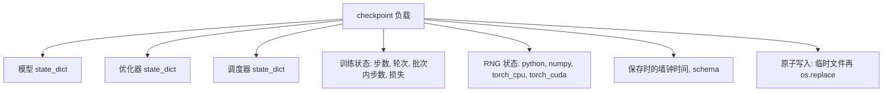
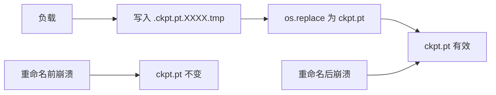
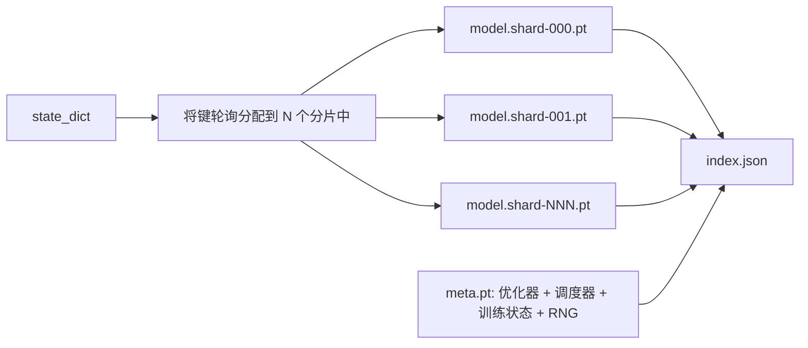

# 检查点保存与恢复

> 训练中断会毁掉整个运行；检查点让它们得以继续。原子化地保存模型、优化器、调度器、损失历史、步数计数器和随机数生成器状态，使得在任何时刻发生中断，磁盘上都留有有效的文件。

**类型：** 构建
**语言：** Python
**前置知识：** 阶段19 课程42 到 45
**时间：** 约90分钟

## 学习目标

- 将完整的训练状态捕获到单个负载中，能够在新的进程中重新加载。
- 实现原子化保存（先写入临时文件再重命名），使得崩溃永远不会留下半写入的文件。
- 恢复 Python、NumPy 和 PyTorch 的随机数生成器状态，使恢复后的损失与不间断基线相匹配。
- 为不再适合单个文件的模型构建分片检查点布局，包含哈希验证的分片和 JSON 索引。

## 问题

你设定了一个18小时的训练任务。但集群的墙钟上限是4小时。在第11小时，集群重启了，因为比你级别高的人批准了内核升级。没有检查点，你只能从头开始。没有恢复，你也会丢失前11小时学习到的优化器状态，所以即使模型权重幸存下来，AdamW 动量也消失了，下一步会朝着训练轨迹已经越过的方向猛冲。

正确的工件是一个包含继续训练所需一切内容的单个文件：模型参数、优化器状态、调度器状态、用于绘图的历史损失、当前的步数、轮次和批次内计数，以及每个随机性来源的 RNG 状态。没有 RNG 状态，恢复后的损失曲线就是一条不同的曲线。相同的模型，相同的数据，不同的打乱顺序，不同的 dropout 掩码，仪表盘上不同的数字。

原子化保存是合约的另一半。直接写入最终文件名意味着在写入中途崩溃会留下损坏的文件；恢复时会读到垃圾数据。在相同目录下写入临时文件然后重命名，意味着在写入中途崩溃时，之前的好文件不受影响。在 POSIX 文件系统上，重命名是原子操作。

## 概念



### 五个状态桶

| 桶 | 为什么重要 |
|--------|----------------|
| 模型 | 权重和缓冲区；模型是什么。 |
| 优化器 | 动量和自适应动量；没有它们，下一步就是一个不同的优化问题。 |
| 调度器 | 学习率在其曲线上所处的位置；余弦调度尤其敏感。 |
| 训练计数器 | 步数、轮次、批次内步数，以及绘制仪表盘所需的损失历史。 |
| RNG 状态 | 确保 dropout、数据打乱和模型内采样的确定性。 |

### 原子化保存



两条规则。第一，临时文件与目标文件位于同一目录，这样重命名保持在同一个文件系统内；跨设备重命名不是原子的。第二，每次尝试的临时名称是唯一的，这样两个写入者不会相互覆盖。

### 分片检查点

当模型变大时，单文件负载变得加载慢、难以检查，并且在网络共享中途卡顿时也很麻烦。解决方法是将参数状态拆分为多个分片，并编写一个小的索引文件将它们联系在一起。



索引记录分片数量、每个分片的 sha256 以及 meta 文件的 sha256。加载器在任何哈希不匹配时会大声报错。分片可以放在不同的物理磁盘上；meta 文件很小，先读取。

### 恢复从轮次中间继续

一个跳到下一个轮次开始的恢复会浪费几分钟到一天的时间。解决方案是 `(epoch, batch_in_epoch)` 加上 RNG 状态。加载后，训练循环将随机数生成器快进到当前轮次中已消费的批次之后，并从 `batch_in_epoch` 继续。课程代码正是这样做的；断言是恢复后的损失轨迹与不间断基线的差异在 1e-4 以内。

## 构建

`code/main.py` 提供了四个原语和一个演示驱动。

### 步骤 1：捕获和恢复 RNG 状态

`capture_rng_state` 返回一个字典，包含 Python 的 `random.getstate`、NumPy 的 `np.random.get_state` 以及 PyTorch CPU 和 CUDA RNG 字节。`restore_rng_state` 将其反转。CPU 张量是一个 uint8 字节缓冲区，PyTorch 的 RNG 知道如何使用它。

### 步骤 2：原子化保存

`atomic_save` 将负载写入目标目录中的临时文件，然后 `os.replace` 将其交换为最终名称。`atomic_write_json` 为分片索引做同样的操作。

### 步骤 3：完整检查点往返

`save_checkpoint` 将模型、优化器、调度器、训练状态和 RNG 打包到一个字典中。`load_checkpoint` 将其反转并返回一个 `TrainState`。schema 字段是升级钩子：未来格式变更会更新版本字符串，加载器据此进行分发。

### 步骤 4：分片变体

`save_sharded_checkpoint` 将参数键轮询分配到 N 个分片中，使用自己的原子化保存写入每个分片，写入包含优化器、调度器和训练状态的 meta 文件，并写入包含分片 sha256 的 JSON 索引。`load_sharded_checkpoint` 在合并前验证每个分片。

### 步骤 5：恢复演示

`run_resume_demo` 训练一个小型模型 `total_steps` 步，在 `interrupt_at` 处保存检查点，然后继续。另一个进程恢复检查点并运行剩余步骤。该函数返回中断点之后两条损失轨迹之间的最大绝对差值。RNG 恢复后，差异为零或浮点噪声。

运行它：

```bash
python3 code/main.py
```

单文件和分片演示都断言最大差异小于 1e-4。摘要输出到 `outputs/resume-demo.json`。

## 使用

生产训练栈将检查点功能作为训练器的一部分。形状相同：模型 + 优化器 + 调度器 + 计数器 + RNG，原子化写入，按步数命名以便轻松找到最新的。分片布局支持通过并行读取加载大型模型；index.json 是其工作基础。

三个要强制执行的模式：

- **Schema 是负载中的字符串。** 迁移根据它进行分支。没有它，你无法在不破坏旧运行的情况下演变格式。
- **对每个分片进行 Sha256 校验。** 静默截断的下载是最糟糕的 bug；加载器要么快速失败，要么失败得很晚。
- **保持检查点节奏合理。** 每 N 步和每墙钟分钟保存一次，以较短者为准。否则，崩溃的那个长步骤会浪费整整一个窗口的工作。

## 交付

`outputs/skill-checkpoint-save-resume.md` 是任何新训练脚本的配方：负载形状、原子写入、RNG 捕获、分片索引。将该技能放入仓库，在周期性保存点接入 `save_checkpoint`，在启动时接入 `load_checkpoint`，运行就能在中断中幸存下来。

## 练习

1. 将轮询分片替换为按参数组分片（以 `.weight` 结尾的层 vs `.bias`）。什么时候哪种布局更优？
2. 扩展保存循环以保留最近的 K 个检查点并修剪旧的。当磁盘很小时，合适的 K 是多少？
3. 添加一个 `--ckpt-every-seconds` 标志，使其按墙钟间隔（而不仅仅是步数计数）触发保存。
4. 添加一个启动时运行的校验和验证路径，扫描目录中的每个检查点，并报告哪些已损坏。
5. 实现一个 `migrate_v1_to_v2` 函数，向负载添加新字段并更新 schema 字符串。让加载器同时容忍两个版本。

## 关键术语

| 术语 | 人们说的 | 实际含义 |
|------|-----------------|------------------------|
| 原子保存 | "写入并祈祷" | 写入同一目录的临时文件，然后 os.replace 到目标名称 |
| 状态字典 | "权重" | 模型参数和缓冲区，按参数名称键控 |
| 分片检查点 | "大模型文件" | 多个文件，每个分片一个，加上一个 meta 文件和包含 sha256 的 JSON 索引 |
| RNG 状态 | "随机种子" | 捕获的 python random、numpy、torch CPU、torch CUDA 状态；不仅仅是种子 |
| 轮次中恢复 | "重启" | 快进 RNG 并从同一轮次的下一个批次继续 |

## 延伸阅读

- POSIX `rename` 语义，了解 `os.replace` 依赖的原子性保证。
- PyTorch 关于 `torch.save` 和 `torch.load` 的文档，包括用于跨设备恢复的 `map_location`。
- 阶段19 课程46 涵盖了梯度累积，本课程的检查点负载能够在其间幸存。
- 阶段19 课程48 涵盖了分布式包装器，本方案能够兼容其状态字典格式。
- Linux 内核 `fsync` 文档，了解原子重命名的持久性保证。
