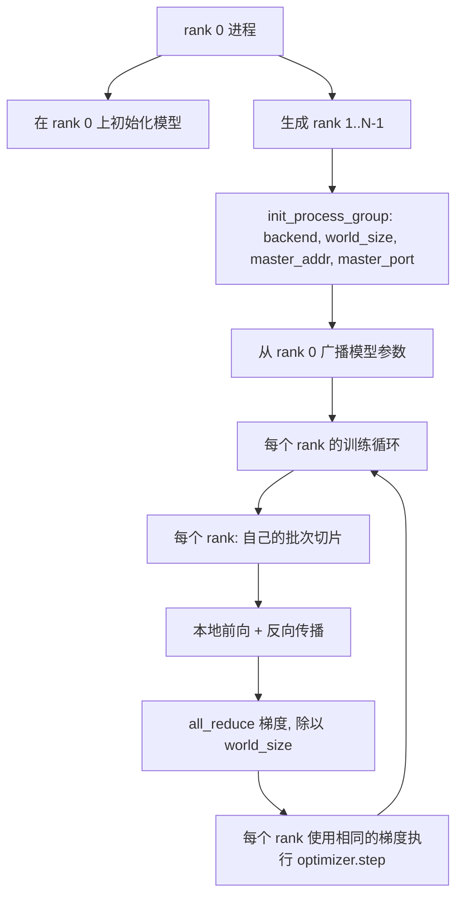
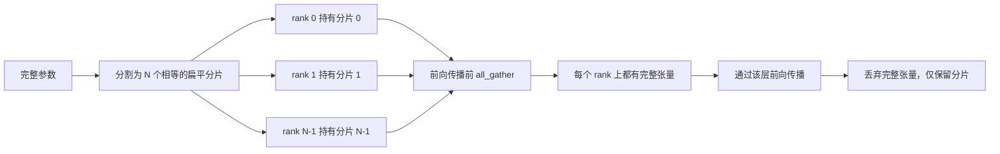

# 从零实现分布式数据并行和 FSDP

> 多卡训练就是两个集合通信和一个规则。启动时广播参数，反向传播后平均梯度，永远不要让各卡对当前步数产生分歧。

**类型：** 构建
**语言：** Python
**前置知识：** 阶段19 课程42 到 45
**时间：** 约90分钟

## 学习目标

- 使用 `gloo` 后端在 N 个 rank 上建立一个进程组，无需特殊硬件。
- 实现一个最小 DDP 包装器，在构造时广播参数，在反向传播后对所有梯度进行 all-reduce。
- 证明各 rank 梯度 all-reduce 的结果与单进程在拼接输入上的梯度相匹配。
- 勾勒 FSDP 参数分片：每个 rank 持有一个分片，前向传播时收集完整张量，之后丢弃。

## 问题

模型适合一个设备。但数据集不适合。优化预算说你希望每墙钟秒看到 N 倍的样本。第一个杠杆是数据并行：每个 rank 在批次的不同切片上运行相同的模型，然后在优化器步骤之前对梯度进行平均。第二个杠杆是 FSDP：模型也不适合一个设备，所以每个 rank 持有每个参数的一部分，在前向传播过程中逐层重建完整的张量。

痛苦在于繁琐的簿记。如果参数在各 rank 间漂移，运行会静默损坏。如果你平均了梯度但没有平均损失，仪表盘就在撒谎。如果集合通信后端无法就拓扑达成一致，运行会永远挂起。解决方案是亲手编写一次集合通信，永远不要信任你无法复现的包装器。

本课程在 CPU 上运行。不假设有 CUDA。`gloo` 后端随每个 PyTorch 构建一起发布，并接受 `torch.multiprocessing` 工作进程；相同的代码可以在多 GPU 节点上切换到 `nccl`，无需改变结构。

## 概念



### 两个重要的集合通信

| 集合通信 | 作用 | 时机 |
|------------|--------------|------|
| `broadcast` | 将张量从一个 rank 复制到所有其他 rank | 参数初始化、调度器状态、任何一对多的同步 |
| `all_reduce` | 跨所有 rank 对张量求和（或平均、取最大值），每个 rank 都得到结果 | 反向传播后的梯度平均 |
| `all_gather` | 每个 rank 贡献一个张量，每个 rank 得到拼接结果 | 逻辑收集、FSDP 参数解分片 |

DDP 的合约是在构造时 `broadcast`，在反向传播后 `all_reduce`。FSDP 草稿在每个层的前向传播前增加了 `all_gather`。

### 梯度平均与单进程梯度相匹配

一个在 N 个 rank 上以 B 个样本的批次训练的模型，必须产生与单进程在 N*B 批次上训练相同的梯度。诀窍在于，对各 rank 梯度求和再除以 N 得到平均损失梯度，这正是使用 mean reduction 的交叉熵在全批次上产生的梯度。课程代码通过手动 all-reduce 梯度与参考单进程梯度之间的 `max-abs-diff < 1e-3` 来断言这一点。

### FSDP 草稿



内存优势是精确的：每个 rank 的参数内存降至 1/N。代价是 gather，每次前向传播都要支付。生产 FSDP 将 gather 与前一层的计算重叠，因此墙钟成本远低于朴素计算的预期。课程对每个参数执行往返，并断言重建结果与原始结果逐位相等。

### CPU 和 gloo 后端

CUDA 是生产目标，但相同的代码路径在 CPU 上同样存在。`gloo` 是 CPU 集合通信后端。它在 GPU 上比 `nccl` 慢几个数量级，但 API 接口完全相同。课程的进程组使用 `backend="gloo"` 初始化，rank 使用 `torch.multiprocessing` 生成（而不是 `torchrun`）；两者最终都调用相同的 `torch.distributed` 函数。在多 GPU 节点上，唯一的变化是 `backend="nccl"`、设备张量和 `torchrun` 启动。

## 构建

`code/main.py` 是可运行的工件。

### 步骤 1：建立进程组

```python
os.environ["MASTER_ADDR"] = "127.0.0.1"
os.environ["MASTER_PORT"] = str(port)
dist.init_process_group(backend="gloo", rank=rank, world_size=world_size)
```

`MASTER_ADDR` 和 `MASTER_PORT` 是会合点：每个 rank 拨通同一主机上的同一端口。课程通过 bind-and-close 技巧选择一个空闲端口，以避免多个运行共享一台机器时发生冲突。

### 步骤 2：构造时广播

`MinimalDDP.__init__` 遍历每个参数和缓冲区，并调用 `dist.broadcast(tensor, src=0)`。Rank 0 的值成为规范初始化。没有这一步，每个 rank 用自己的种子初始化，各 rank 从第一步就开始发散。

### 步骤 3：反向传播后 all-reduce 梯度

```python
def all_reduce_grads_(module, world_size):
    for p in module.parameters():
        if p.grad is None:
            p.grad = torch.zeros_like(p.data)
        dist.all_reduce(p.grad.data, op=dist.ReduceOp.SUM)
        p.grad.data.div_(world_size)
```

每个 rank 最终得到相同的平均梯度。优化器步骤现在在每个 rank 上都是相同输入的函数，这就是参数在整个运行过程中保持同步的原因。

### 步骤 4：证明等价性

`manual_all_reduce_matches_single_process` 在 rank 0 上构建相同的模型，并将 all-reduce 后的梯度与单进程在拼接输入上计算的梯度进行比较。最大绝对差值约为 1e-8。

### 步骤 5：FSDP 往返

`fsdp_round_trip_sketch` 将每个参数展平，填充到 `world_size` 的倍数，切分，all_gather，然后去填充。每个 rank 的重建结果与原始结果相同。这是解分片步骤；反向操作（前向传播后重新分片）是从收集到的张量中切下一片。

运行它：

```bash
python3 code/main.py
```

默认 world size 为 2。两个 CPU 进程生成，通过 `gloo` 相互通信，然后零退出。输出 `outputs/ddp-demo.json` 捕获每个 rank 的参数总和、all-reduce 后的梯度范数、FSDP 往返结果以及手动与参考梯度的差异。

## 使用

生产训练栈调用相同的原语。PyTorch 的 `DistributedDataParallel` 增加了：将 all-reduce 与反向传播重叠的后向钩子、将多个小梯度合并为一个集合通信的分桶 all-reduce，以及课程 46 使用的 `no_sync` 上下文。

PyTorch 的 FSDP 增加了：每层的扁平参数视图，使每个 rank 持有一个连续的缓冲区；将下一层的解分片与当前层的计算重叠；以及可选的 CPU 卸载分片。

形状保持不变：启动时广播，反向传播后 reduce，参数不再适合时分片。

## 交付

`outputs/skill-distributed-fsdp-ddp.md` 包含新训练脚本的配方：使用 `gloo`（CPU）或 `nccl`（GPU）启动进程组，将模型包装在构造时广播、反向传播后 reduce 的 DDP 外壳中，可选地使用 FSDP 草稿中的 all_gather 模式对参数进行分片。

## 练习

1. 使用 `--world-size 4` 运行，并确认参数扩散在整个运行过程中保持在 1e-3 以下。
2. 将手动平均替换为 `dist.all_reduce(op=dist.ReduceOp.AVG)` 并计时差异。
3. 在 DDP 包装器中添加后向钩子，使 all-reduce 与反向传播的其余部分重叠；测量墙钟改进。
4. 实现 FSDP 重新分片步骤：在前向传播后，用本地分片再次替换完整张量。确认每个 rank 的内存下降。
5. 在 CUDA 机器上将后端切换为 `nccl`。注意哪些环境变量发生变化，哪些保持不变。

## 关键术语

| 术语 | 人们说的 | 实际含义 |
|------|-----------------|------------------------|
| 后端 | "gloo 或 nccl" | 实现集合操作库；gloo 用于 CPU，nccl 用于 GPU |
| World size | "总 rank 数" | 组中的进程数；组是集合通信操作的单元 |
| Rank | "工作进程 ID" | 组内的进程标识符，从零开始索引 |
| All-reduce | "求梯度和" | 跨所有 rank 对张量求和，每个 rank 最终得到相同结果 |
| 解分片 | "收集参数" | 通过 all_gather 从每个 rank 的分片重建完整张量 |

## 延伸阅读

- PyTorch `torch.distributed` 文档，了解本课程依赖的集合通信语义。
- `gloo` 库的集合通信列表，与基于 CUDA 的 `nccl` 原语形状相同。
- 阶段19 课程46，了解在 `no_sync` 中包装 DDP all-reduce 的梯度累积模式。
- 阶段19 课程47，了解能在 DDP 和 FSDP 运行中幸存的检查点布局。
- PyTorch FSDP 文档，了解此处勾勒的参数分片的生产实现。
