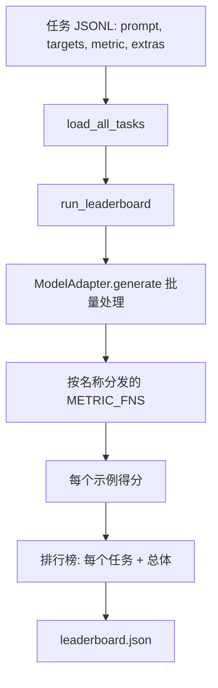
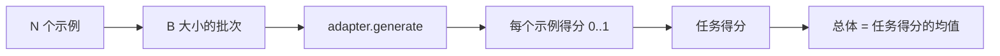

# 语言模型评估框架

> 一个在你无法定义的任务上表现良好的模型，是碰巧表现良好。评估框架就是任务定义、指标、运行器和排行榜，以一种简短、可替换的形状呈现。

**类型：** 构建
**语言：** Python
**前置知识：** 阶段19 课程42 到 45
**时间：** 约90分钟

## 学习目标

- 将任务定义为 JSONL 文件，每个示例包含 `prompt`、`targets`、`metric` 和可选的 `extras`。
- 实现五个指标：精确匹配、rouge-l F1、可执行检查、多项选择和子串包含。
- 构建一个运行器，按任务分批处理示例并分发到可替换的模型适配器。
- 输出 JSON 格式的排行榜，包含每个任务的分数、延迟和可重现的整体平均值。

## 问题

每周都有一个新的语言模型问世。营销声称它表现良好。诚实的问题是：在什么方面表现良好？诚实的答案是你自己编写的排行榜，因为供应商的排行榜是他们自己调优过的。

如果没有评估框架，你靠感觉比较两个模型。有了评估框架，你通过固定任务集和固定指标上的分数进行比较，使用你可以 diff 的 JSON 输出。评估框架是昨天运行和今天运行之间的合约。没有它，回归就会上线。

陷阱是将评估框架过度拟合到单个模型。解决方法也是同样的陷阱反过来：评估框架足够小，可以在十五分钟内读完；任务足够小，可以随仓库一起发布；指标从头编写，以便同事可以审计；适配器是唯一存放模型特定代码的地方。更换适配器，排行榜变化；更换任务，排行榜变化。其他什么都不应该变化。

## 概念



### 任务规范

每个示例是一行 JSONL：

```json
{"id": "arith-00", "prompt": "compute: 2 + 2", "targets": ["4"], "metric": "exact_match"}
```

对于需要评分辅助的指标，`extras` 携带附加负载：

```json
{
  "id": "code-00",
  "prompt": "python: write a function f that doubles its input",
  "targets": ["ok"],
  "metric": "code_exec",
  "extras": {"io_pairs": [[1, 2], [3, 6]]}
}
```

任务是一个位于 `outputs/tasks/` 下的 `.jsonl` 文件。文件名就是任务名。文件中的所有示例共享同一个指标。

### 五个固定任务

| 任务 | 指标 | 测试内容 |
|------|--------|---------------|
| arithmetic | exact_match | 确定性答案上的词元级正确性 |
| summary | rouge_l | 针对单行参考摘要的最长公共子序列 F1 |
| code-exec | code_exec | 可执行测试：预测的函数必须满足一系列输入-输出对 |
| multiple-choice | multiple_choice | 预测的首字母必须与允许的字母匹配 |
| generation | substring_contains | 自由形式的文本必须包含至少一个目标子串 |

### 指标合约

每个指标是一个函数 `(prediction, targets, extras) -> float in [0.0, 1.0]`。评估框架对每个示例的分数取平均得到任务分数，然后对任务分数取平均得到总体分数。指标函数非常小：

- `exact_match`：小写化、折叠空白、相等判断。
- `substring_contains`：相同的规范化，子串测试。
- `multiple_choice`：首字母大写。
- `rouge_l`：LCS 长度除以预测和参考的长度，精确率和召回率的 F1。
- `code_exec`：在受限命名空间中执行预测，对每个输入-输出对调用 `f(x)`，统计匹配数。

code_exec 指标在剥离了内置函数的命名空间中运行预测。课程的测试断言 `import os` 会失败，因为 `os` 不在命名空间中；你无法从代码预测中访问文件系统。

### 模型适配器

```python
class ModelAdapter(Protocol):
    def generate(self, prompts: Sequence[str]) -> List[str]: ...
    @property
    def name(self) -> str: ...
```

适配器是接缝。课程附带 `ToyAdapter`，一个确定性模式匹配器，能为五个固定任务中的每个提示返回正确答案。真正的适配器调用模型并返回其输出。评估框架不关心是哪种。

### 运行器

`run_task` 一次批处理 `batch_size` 个提示并分发到指标函数。`run_leaderboard` 遍历每个任务并取平均。`write_leaderboard` 输出包含 schema 字符串的 JSON，以便未来格式变更不会静默破坏仪表盘。



```figure
eval-harness-matrix
```

## 构建

`code/main.py` 是可运行的工件。

### 步骤 1：生成固定任务

`seed_fixture_tasks(target_dir)` 写入五个 `.jsonl` 文件。第一次运行 `main.py` 时，如果目录为空，则生成它们。

### 步骤 2：加载任务

`load_all_tasks(task_dir)` 读取每个 `.jsonl` 并返回从任务名到 `Example` 记录列表的字典。以 `#` 开头的注释行和空行会被跳过，以便贡献者可以注释文件。

### 步骤 3：实现指标

每个指标是一个小函数，配有单元测试。课程的测试套件包含 13 个用例，涵盖规范化、部分重叠、代码执行和不安全代码拒绝。

### 步骤 4：编写运行器

`run_task` 迭代批次并生成包含分数、正确数、总数和延迟的 `TaskResult`。`run_leaderboard` 遍历所有任务并生成包含总体平均值的 `Leaderboard`。

### 步骤 5：输出 JSON

`write_leaderboard` 序列化排行榜。`--include-per-example` 标志会转储每个示例的记录，以便你在分数变化时比较预测与之前的运行。

运行它：

```bash
python3 code/main.py
```

脚本在首次运行时生成固定任务，使用玩具适配器（它能正确回答每个固定任务）对其评分，并写入 `outputs/leaderboard.json`。使用玩具适配器时总体得分为 1.0；`test_main.py` 中的存根适配器测试显示，当适配器无法回答时，相同的评估框架产生 0.0。

## 使用

要接入真实模型，编写一个适配器。形状如下：

```python
class HttpAdapter:
    name = "vendor.v1"

    def __init__(self, endpoint, api_key):
        self.endpoint = endpoint
        self.api_key = api_key

    def generate(self, prompts):
        out = []
        for prompt in prompts:
            response = http_post(self.endpoint, prompt, self.api_key)
            out.append(response["text"])
        return out
```

将 `main()` 顶部的 `ToyAdapter` 替换为 `HttpAdapter`。评估框架、任务、指标和排行榜保持不变。

在真实项目中交付评估框架时要强制执行三个模式：

- **固定任务文件。** leaderboard.json 携带哈希固定的任务内容，或者随附 JSONL 文件；否则任务文件变化时分数也会变化，你无法分辨是什么导致的。
- **比较预测，不仅仅是分数。** `--include-per-example` 标志让你能看到分数下降那天模型说了什么。
- **设置批次大小上限。** 真实的适配器有速率限制。较小的批次大小使评估框架跨供应商保持兼容。

## 交付

`outputs/skill-lm-eval-harness.md` 包含配方：JSONL 任务规范、五个指标、可替换适配器、分批运行器、带 schema 字符串的排行榜 JSON。`outputs/tasks/` 下的任务文件是固定任务；复制到真实项目中作为起点。

## 练习

1. 添加第六个任务，使用你从头编写的自定义指标（类似 BLEU 的重叠、类似 BLEURT 的参考评分，任何有清晰合约的指标）。
2. 扩展 `code_exec` 以捕获标准输出并接受预期标准输出的列表作为 targets。
3. 添加排行榜差异比较命令：给定两个 `leaderboard.json` 文件，打印哪些任务发生了变化以及变化幅度。
4. 设置每个示例的延迟上限。用超时包装适配器调用；在排行榜中显示单独的 `timeouts` 列。
5. 使用 sha256 在排行榜中固定任务内容，以便未来的读者能验证他们对相同的任务进行了评分。

## 关键术语

| 术语 | 人们说的 | 实际含义 |
|------|-----------------|------------------------|
| 任务规范 | "评估格式" | JSONL 文件，每个示例包含 prompt、targets、metric 和可选的 extras |
| 指标 | "评分方式" | 从 (prediction, targets, extras) 到 [0, 1] 范围内浮点数的函数 |
| 适配器 | "模型客户端" | 具有 generate(prompts) -> list[str] 方法的对象；唯一模型相关的代码 |
| 排行榜 | "记分板" | JSON，包含每个任务的分数、总数、延迟和总体平均值 |
| 代码执行指标 | "运行并检查" | 在受限命名空间中执行预测，与输入-输出对进行比较 |

## 延伸阅读

- 原始的 lm-evaluation-harness，作为生产参考，体积更大但形状相同。
- HuggingFace 的 lighteval，相同合约的另一种实现。
- 阶段19 课程46，涵盖评估框架评分的训练栈中使用的梯度累积模式。
- 阶段19 课程47，涵盖你评分的检查点格式；在排行榜中固定检查点哈希。
- 阶段19 课程48，涵盖产生被测试模型的分布式训练栈。
