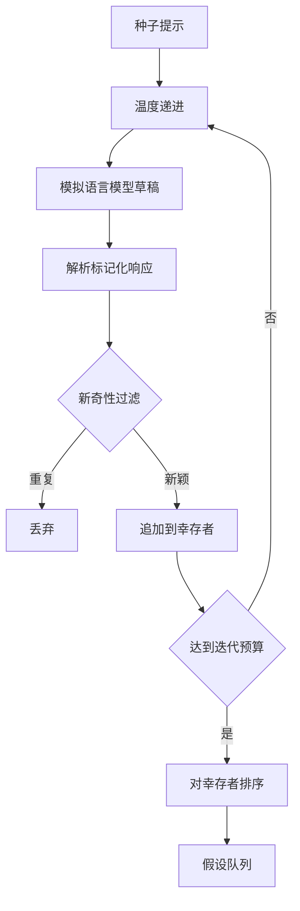

# 假设生成器

> 一个对同一个问题问两次的研究智能体是在浪费 token。诀窍在于迫使每次草稿落在新的地方。

**类型：** 构建
**语言：** Python
**前置知识：** 阶段19 轨道A 课程20-29
**时间：** 约90分钟

## 学习目标
- 从种子提示驱动采样器，并将其输出转换为类型化的假设记录。
- 每次迭代提高采样温度，使下一个草稿离上一个更远。
- 使用小型嵌入模型和余弦距离阈值过滤近似重复项。
- 使用结合新颖性、特异性和可测试性的评分函数对幸存者进行排序。
- 保持每一步都是确定性的，使相同的种子始终产生相同的队列。

## 为什么要先生成，后过滤

一个让单个模型问一次的计划器只能得到一个假设。这对于一个有示例的问题来说没问题。但对于一个研究循环来说，这是错误的形状。循环需要一个有深度的排序队列，这样当第一个假设失败时，运行器可以准备好下一个，而无需再付出一次完整的采样迭代成本。

两个想法结合起来产生这个队列。第一个是温度递进：每次通过采样器时温度提高一档，鼓励后面的草稿漫游。第二个是新奇性过滤：每次草稿生成后，生成器测量它与每个先前幸存者的嵌入距离，并拒绝聚类内的任何内容。

本课程附带一个模拟语言模型，它针对固定提示返回脚本化的 token 序列。这个模拟足以练习完整路径：输入种子提示，应用温度递进，解析候选，运行新奇性过滤，输出排序的队列。

## 假设的结构

```text
Hypothesis
  id             : int           (在单次运行内单调递增)
  text           : str           (断言)
  variables      : list[str]     (不同条件之间的变化量)
  metric         : str           (运行器将要测量的指标)
  baseline_ref   : str | None    (比较所引用的论文或运行)
  draft_pass     : int           (由哪次采样迭代产生)
  temperature    : float         (生成时的采样器设置)
  novelty_score  : float         (与先前幸存者的距离，0..1)
  rank_score     : float         (用于排序的加权和)
```

`variables` 和 `metric` 不是自由文本。解析器从标记化的响应中提取它们。第52课的运行器在构建实验配置时直接读取这些字段。

`baseline_ref` 是可选的，但建议提供。第53课的评估器需要一个基线来进行比较。如果假设省略了它，评估器会回退到同一指标上的前一次运行。

## 架构



循环很直接。有趣的部分在于每个框都有一个严格的合约。

## 温度递进

从 `t_min` 开始，到 `t_max` 结束，步长为 `(t_max - t_min) / (n_passes - 1)`。每次迭代以当前温度调用采样器，从 `GeneratorConfig.schedule()` 产生 `n_passes` 个均匀间隔的值。模拟模型通过根据 `(prompt, temp_bucket)` 在一小组脚本化响应之间切换来体现温度。这些桶是开区间，因此温度的微小变化会选择不同的桶并产生不同的草稿。在生产环境中，采样器将是真实的模型，并传入 `temperature=t`。

默认调度是从 `0.2` 到 `1.2` 的六次迭代。六次足以填满队列，而无需为那些新奇性过滤器无论如何都会拒绝的样本付费。低于 `0.2` 时，模型会重复种子提示。高于 `1.2` 时，响应往往会偏离主题并导致解析器失败。

## 新奇性过滤

每次草稿被解析后，生成器嵌入文本并与每个已接受的假设进行比较。嵌入是一个小的哈希词袋向量，归一化为单位长度。两个单位向量之间的余弦距离是 `1 - dot(a, b)`。如果草稿与任何先前幸存者的最小距离高于 `novelty_threshold`，则通过。默认值为 `0.25`。

哈希嵌入并不花哨。它是确定性的，零依赖，足以捕获明显的情况：两个共享大部分名词的草稿。生产部署会替换为一个小型句子模型。接口保持不变。

## 排序分数

```text
rank_score = w_novelty * novelty_score
           + w_specificity * specificity_score
           + w_testability * testability_score
```

三个子分数。`novelty_score` 是与先前幸存者的最小嵌入距离。`specificity_score` 是假设中具体变量的数量除以目标数量。`testability_score` 在假设同时指定了指标和基线时为 1，只有指标时为 0.5，都没有时为 0。

默认权重为 `0.4`、`0.3`、`0.3`。权重存在于生成器配置中，以便下游课程可以在不分叉代码的情况下调整它们。

## 模拟语言模型

```python
class MockLLM:
    def sample(self, prompt: str, temperature: float, seed: int) -> str:
        ...
```

采样器在给定 `(prompt, temperature, seed)` 三元组时是确定性的。模拟维护一个以 `(prompt_signature, temperature_bucket)` 为键的脚本化响应表。如果表中没有某键的条目，采样器返回一个会导致解析器失败的备用响应。备用路径在其中一个测试中被测试到。

种子会混入响应中，因此相同的 `(prompt, temperature)` 对使用不同种子会产生不同的草稿。在测试中，我们固定种子以保持结果可重现。在实际部署中，种子来自系统时钟或计数器。

## 输出队列

输出是一个按 `rank_score` 降序排列的 `Hypothesis` 记录列表。第52课的运行器弹出头部，运行实验，第53课的评估器写回一个结论。如果结论说假设是错的，运行器弹出下一个。

队列是有限的。当队列为空时，编排器可以扩大种子提示并重新运行生成器，或者停止并报告预算已耗尽。

## 如何阅读代码

`code/main.py` 定义了 `Hypothesis`、`MockLLM`、`HypothesisGenerator` 和一个确定性演示。生成器暴露一个单一的 `run(seed_prompt)` 方法，返回一个排序的队列；迭代次数从 `GeneratorConfig.n_passes` 读取，而不是作为参数传递。嵌入是哈希词袋。新奇性过滤是一个单一函数。排序分数是一个单一函数。不依赖 `numpy`；嵌入数学纯用标准库实现，使课程保持可移植性。

`code/tests/test_generator.py` 涵盖线性路径、重复拒绝路径、解析器失败路径、温度递进边界和排序顺序。

## 在整个体系中的位置

第50课产生队列。第51课取出队列头部并进行文献搜索以确认或反驳它。第52课取出同一个头部并运行实际实验。第53课读取两个输出并写出结论。这四节课组成一个没有人类参与的研究循环；人类可以在任何边界介入。
