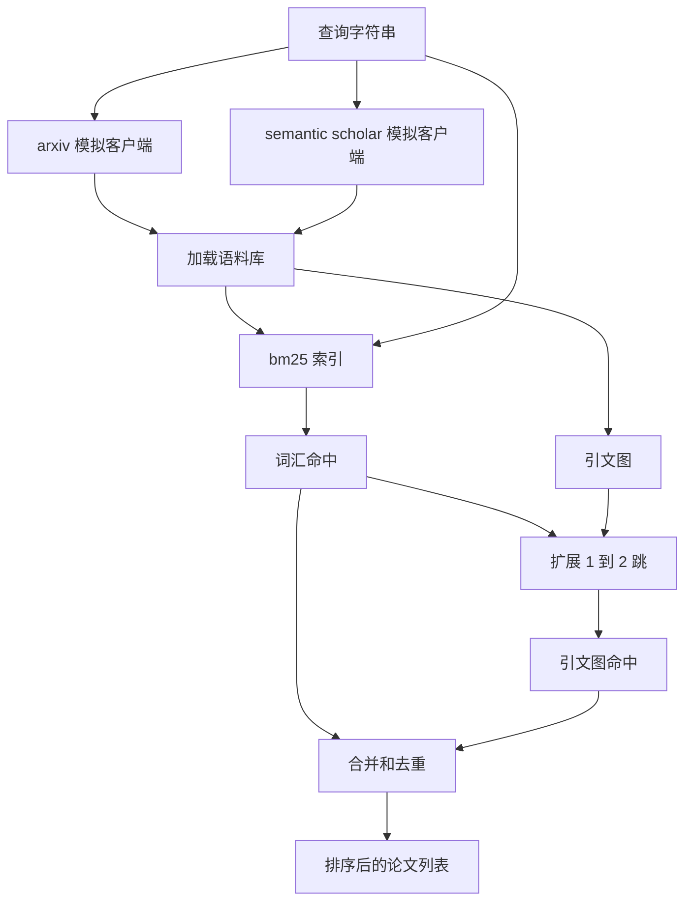

# 文献检索

> 一个假设很廉价。知道是否已经有人证明了它才是昂贵的部分。构建检索层，在运行器启动沙箱之前回答这个问题。

**类型：** 构建
**语言：** Python
**前置知识：** 阶段19 轨道A 课程20-29
**时间：** 约90分钟

## 学习目标
- 为小型论文记录建模，包含循环下游需要读取的字段。
- 仅使用标准库数据结构，在摘要上构建 BM25 索引。
- 遍历引文图，找出词汇搜索遗漏的论文。
- 通过稳定的论文 ID 对词汇和引文图路径的结果进行去重。
- 将两个模拟外部 API 包装在单个客户端后面，使上层调用点在接入真实端点时保持不变。

## 为什么要两个检索路径

对摘要的关键词搜索返回与查询共享词汇的论文。这覆盖了大部分表面。但遗漏了两种情况。第一种是奠基性论文使用了不同的词汇；例如，搜索"稀疏注意力"可能会错过一篇题为"transformer 路由中的块选择"的论文。第二种是相关论文是引用已知锚点的后续工作；找到锚点并向前遍历比暴力搜索摘要池更高效。

本课程构建了这两个路径。对摘要的 BM25 捕获词汇命中。引文图遍历将种子集向前和向后扩展一到两跳。两者的并集按论文 ID 去重，并通过一个小的综合分数排序。

## 论文的结构

```text
Paper
  id          : str           (稳定标识符，模拟语料库中为 "p001")
  title       : str
  abstract    : str
  year        : int
  authors     : list[str]
  references  : list[str]     (该论文引用的论文 ID)
  citations   : list[str]     (引用该论文的论文 ID)
  source      : str           (由哪个模拟 API 提供，"arxiv" 或 "s2")
```

references 和 citations 字段构成有向引文图。两个模拟 API 返回重叠但不完全相同的字段，因此语料库加载器按 `id` 合并它们。

## 架构



检索客户端拥有两个路径和合并操作。调用者传入查询，返回排序后的列表，其中每个条目包含每篇论文的得分字段（`bm25_score`、`graph_distance`、`recency_score`、`final_score`），解释排序依据。

## 从头实现 BM25

实现是标准的 Okapi BM25，默认参数 `k1=1.5`、`b=0.75`。索引是两个字典：`term -> doc_frequency` 和 `term -> list of (doc_id, term_count)`。文档长度是摘要的 token 数。平均文档长度在索引构建时计算一次。对查询进行评分是对查询词项的 `idf * tf_norm` 求和，其中 `tf_norm` 是标准的 BM25 长度归一化词频。

分词器是 `lower` 后在非字母数字字符上拆分。不进行词干提取。生产系统会替换为一个小型词干提取器。接口保持不变。

```text
idf(t)      = log((N - df + 0.5) / (df + 0.5) + 1.0)
tf_norm(t)  = (f * (k1 + 1)) / (f + k1 * (1 - b + b * dl / avgdl))
score(d, q) = sum over t in q of idf(t) * tf_norm(t)
```

## 引文图遍历

图从语料库构建一次。前向边从论文指向其参考文献。反向边从论文指向引用它的论文。遍历是以最高 BM25 命中为种子的广度优先搜索，最多两跳。

两跳是一个有意的上限。一跳太浅；智能体通常需要直接的祖先或后代。三跳在连通图上会爆炸式增长结果规模，并且容易偏离主题。课程将跳数限制暴露为配置旋钮，以便下游循环可以收紧它。

## 去重和排序

两个路径返回重叠的集合。合并以论文 ID 为键。对每篇论文，最终分数是一个加权混合。

```text
final_score = w_bm25 * bm25_score_norm
            + w_graph * graph_score
            + w_recency * recency_score
```

`bm25_score_norm` 是 BM25 分数除以合并集中最大的 BM25 分数（使字段值在零到一之间）。`graph_score` 对直接词汇命中为 1，一跳为 `0.6`，两跳为 `0.3`，否则为零。`recency_score` 是从语料库最小年份的零到最大年份的一的线性斜坡。

默认权重为 `0.5`、`0.3`、`0.2`。权重是可配置的；一个过时的话题可能降低 recency 权重，而一个快速变化的话题则提高它。

## 模拟语料库

语料库包含 100 篇论文，由 `build_corpus()` 生成。每篇论文有手动编写的标题和摘要，涉及五个主题之一：注意力稀疏性、检索增强、低秩适配器、数据集蒸馏和评估框架。引用关系被设置为使每个主题形成一个连通的子图，并带有少量跨主题边。

两个模拟 API 客户端（`ArxivMockClient`、`SemanticScholarMockClient`）从相同的语料库读取，但暴露不同的字段。Arxiv 返回标题、摘要、年份、作者。Semantic Scholar 添加了参考文献和引用。检索客户端按 ID 合并；跨客户端字段不一致的处理推迟到后续课程。

## 第52课和第53课读取什么

第52课的运行器读取 `paper.id`、`paper.title` 和摘要的前三句作为实验的上下文。第53课的评估器读取 `paper.year` 和 `paper.references`，以将基线归因到特定论文。

检索客户端返回一个 `RetrievalResult`，包含排序后的列表和每次查询的指标：命中数、平均分数、最高分数、总墙钟时间。运行器记录这些指标，以便下游可观测性功能可以绘制随时间变化的质量。

## 如何阅读代码

`code/main.py` 定义了 `Paper`、`ArxivMockClient`、`SemanticScholarMockClient`、`BM25Index`、`CitationGraph`、`RetrievalClient` 和一个确定性演示。模拟客户端和语料库在同一个文件中，使课程保持可移植性。BM25 实现是一个类，60 行代码。图遍历是一个方法。

`code/tests/test_retrieval.py` 涵盖词汇路径、引文图路径、合并、去重和空查询。

## 在整个体系中的位置

第50课产生一个假设。第51课搜索文献，看该假设是否已经解决。第52课在假设尚未解决时运行实验。第53课读取检索结果和实验指标，以写出结论。检索客户端是四个阶段中最便宜的，在编排器中首先运行。
