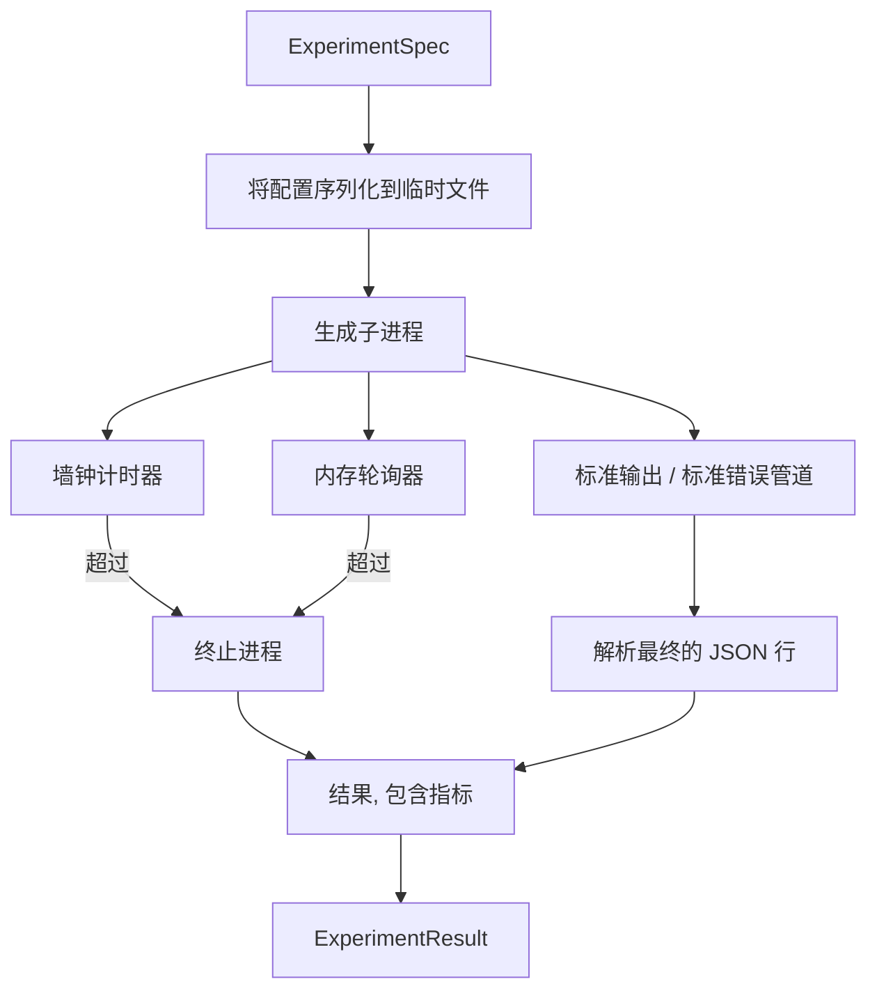

# 实验运行器

> 循环的诚实度取决于其测量方式。构建一个运行器，接收规范，在沙箱化的子进程中执行，并输出评估器可以信任的 JSON 指标数据。

**类型：** 构建
**语言：** Python
**前置知识：** 阶段19 轨道A 课程20-29
**时间：** 约90分钟

## 学习目标
- 将实验编码为类型化规范，运行器可以将其序列化到子进程。
- 启动带有硬墙钟超时和软内存上限的子进程，并将两者都作为终止条件呈现。
- 将标准输出、标准错误和结构化指标数据捕获到单个结果记录中。
- 构建一个消融表，在固定的基础规范上一次扫描一个配置旋钮。
- 在给定种子的情况下保持每个结果确定性，使评估器在多次运行中看到相同的数字。

## 为什么使用子进程

研究循环运行不受信任的代码。假设来自采样器，实验脚本来自相同的路径；将任一视为安全的进程内操作是在自找崩溃，可能拖垮编排器。子进程是语言提供的最简单的隔离：一个独立的进程，独立的地址空间，父端有一个信号句柄。

这里的运行器没有实现完整的沙箱化。没有 cgroup，没有 seccomp 过滤器，没有命名空间重映射。它有的是墙钟超时、内存增长轮询循环以及在任一限制上终止进程的 kill 路径。这是每个更复杂的沙箱所扩展的运行时合约。课程将合约保持得足够小，可以一口气读完。

## ExperimentSpec 的结构

```text
ExperimentSpec
  spec_id        : str            (稳定 ID, "exp_001")
  hypothesis_id  : int            (链接回第50课的队列)
  script_path    : str            (要运行的 Python 脚本路径)
  config         : dict           (作为 JSON 参数传递给脚本)
  seed           : int            (实验的确定性种子)
  wall_timeout_s : float          (硬超时，超过则终止)
  memory_cap_mb  : int            (软上限，轮询检查；超过则终止)
  metric_keys    : list[str]      (评估器将要读取的字段)
```

脚本存放在磁盘上；运行器将配置写入脚本读取的临时文件路径。脚本预期在标准输出上打印一行 JSON，其键是 `metric_keys` 的超集。标准输出上的其他内容会被捕获但被指标解析器忽略。

## 架构



运行器是一个具有一个主要方法的类。轮询器是一个小线程，每轮询间隔唤醒一次，并在可用时从 proc 文件系统读取子进程的 `psutil` 等价物，在平台不暴露它时回退为空操作。

## 为什么是软内存上限

硬内存上限需要 `resource.setrlimit`，且仅在 POSIX 上有效。本课程提供一种可移植的方法：从平台轮询驻留集大小，如果超过上限则终止子进程。该上限是软的，因为轮询器有一个非零间隔；进程可能在两次轮询之间飙升到上限以上然后回落。运行器记录观察到的最大 RSS，以便评估器可以看到运行离上限有多近。

在那些没有进程检查支持的系统上，轮询器记录一次性的警告并禁用它自己。墙钟超时仍然适用。课程测试涵盖了两条路径。

## 捕获标准输出和标准错误

运行器在完成后读取两个管道。标准输出逐行扫描；最后一能解析为包含所有必需 `metric_keys` 的 JSON 的行被视为指标数据。之前的 JSON 行作为 `intermediate_metrics` 保留在结果中；评估器可以用它们来绘制学习曲线。

标准错误按原样捕获到结果中。运行器从不在非零退出码时抛出异常；相反，它将退出码记录在结果中。任何非零退出都被标记为 `"crash"`，即使脚本打印了指标，这样评估器默认将部分运行视为失败。

## 消融表

```python
def ablate(base: ExperimentSpec, knob: str, values: list[Any]) -> list[ExperimentSpec]:
    ...
```

给定一个基础规范和一个旋钮名称，辅助函数为每个值返回一个规范，其中 `config[knob]` 被覆盖。每个规范获得一个派生的 `spec_id`（`f"{base.spec_id}_{knob}_{value}"`）。运行器附带一个 `AblationRunner`，按顺序运行它们并返回一个以旋钮值为键的 `AblationTable`。

为什么一次一个旋钮。全因子扫描会指数级增长，产生评估器无法解释的结果。一次一个旋钮产生一个干净的轴，评估器可以绘制。本课程仅通过由调用者组合的重复单旋钮消融来支持多旋钮扫描。

## 确定性

每个规范都带有一个种子。运行器通过配置字典（`config["__seed"] = spec.seed`）将种子转发给脚本。`code/experiments/` 中的模拟实验脚本尊重种子并跨运行产生相同的指标。第53课的评估器依赖于此；没有确定性，"回归"可能只是不同的随机初始化。

## 模拟实验脚本

本课程附带一个实验脚本：`code/experiments/sparsity_experiment.py`。它是一个真实脚本，读取其配置文件，用 numpy 随机路径模拟一个小的训练运行，并打印 JSON 指标数据。脚本尊重 `sleep_s` 旋钮（用于测试超时）和 `allocate_mb` 旋钮（用于测试内存轮询器）。

模拟并不是在训练任何真实的东西。它是一个模拟训练循环形状的数值计算：损失曲线、最终困惑度、墙钟时间。本课程的重点是运行器，而不是模拟。真实的实验脚本会导入模型。

## 结果的结构

```text
ExperimentResult
  spec_id              : str
  hypothesis_id        : int
  exit_code            : int
  terminal             : "ok" | "timeout" | "oom" | "crash"
  wall_time_s          : float
  peak_rss_mb          : float | None
  metrics              : dict
  intermediate_metrics : list[dict]
  stdout_tail          : str
  stderr_tail          : str
```

评估器首先读取 `metrics` 和 `terminal`。如果 terminal 不是 `"ok"`，则实验计为失败运行，评估器的结论是自动的。否则，指标通过显著性检验。

## 如何阅读代码

`code/main.py` 定义了 `ExperimentSpec`、`ExperimentResult`、`ExperimentRunner`、`AblationRunner` 和一个确定性演示。子进程管理是一个类。内存轮询器是一个小线程。消融辅助函数是一个单一函数。

`code/experiments/sparsity_experiment.py` 是测试中使用的模拟实验。它从 argv 读取其配置文件路径，并在完成时写入一行 JSON 指标。

`code/tests/test_runner.py` 涵盖成功路径、超时路径、崩溃路径、消融表和两次运行间的确定性检查。

## 在整个体系中的位置

第50课生成假设。第51课过滤掉文献中已解决的内容。第52课对剩下的内容运行实验。第53课读取结果，运行显著性检验，并写出编排器存储到假设 ID 下的结论。
