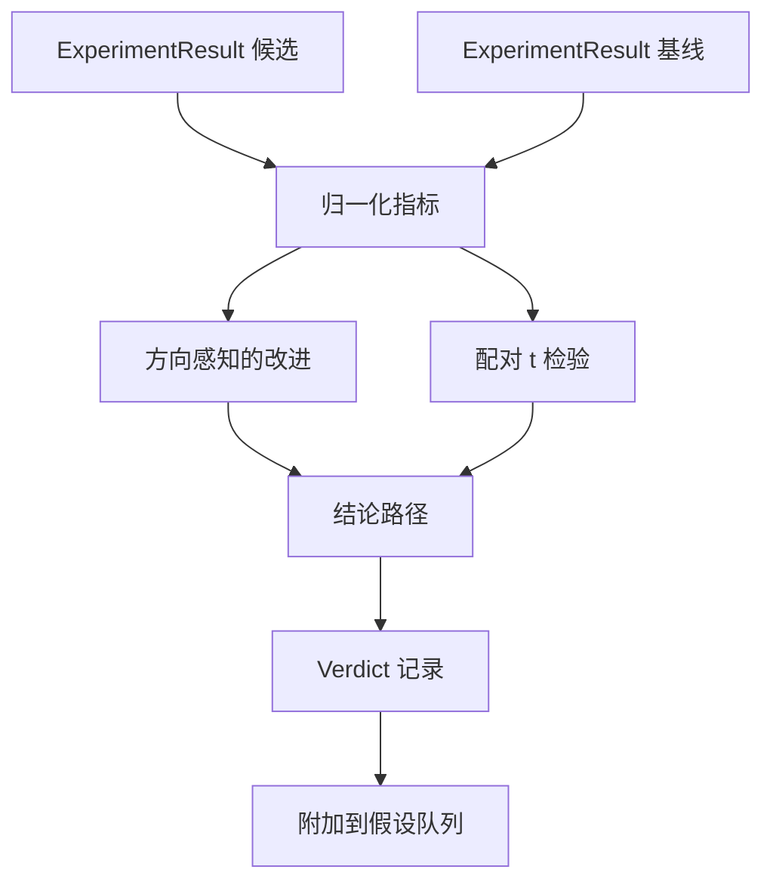

# 结果评估器

> 运行器产生了数字。评估器决定这些数字是改进、回归还是噪声。构建将指标转化为一行结论的结论路径。

**类型：** 构建
**语言：** Python
**前置知识：** 阶段19 轨道A 课程20-29
**时间：** 约90分钟

## 学习目标
- 使用方向感知的改进和固定阈值，将候选运行与基线进行比较。
- 从头开始对每个种子指标进行配对 t 检验，并读取得到的 p 值。
- 归一化对数尺度指标，使下游报告可以将它们与线性指标混合。
- 输出每个假设的结论，编排器可以将其附加到第50课的队列。
- 保持每一步都是纯函数，使相同的输入始终产生相同的结论。

## 为什么要配对检验

来自运行器的单个数字并不能说明变化是否真实。相同的配置使用不同的种子会给出不同的困惑度。变化可能是噪声。正确的比较是配对的：相同的数据、相同的种子，用候选和基线各运行一次。每个种子贡献一个差值。这些差值的均值就是效应。这些差值的标准误差就是噪声基底。

本课程从头实现检验。没有 `scipy.stats`。数学足够小，一个屏幕就能看完。

```text
diffs    = [a_i - b_i for i in seeds]
mean     = sum(diffs) / n
variance = sum((d - mean) ** 2 for d in diffs) / (n - 1)
t_stat   = mean / sqrt(variance / n)
df       = n - 1
p_value  = two_sided_p(t_stat, df)
```

双侧 p 值使用正则化不完全 beta 函数。本课程附带一个使用 Lentz 连分式的小型实现。整段代码是 60 行的标准库数学。

## 方向感知的改进

有些指标在升高时改进（准确率、吞吐量）。其他在降低时改进（损失、困惑度、墙钟时间）。评估器在每个指标上携带一个 `direction` 字段。

```text
if direction == "higher_is_better":
    improvement = (candidate - baseline) / abs(baseline)
elif direction == "lower_is_better":
    improvement = (baseline - candidate) / abs(baseline)
```

改进是有符号的。对于"越高越好"的指标，负改进意味着候选更差。结论路径一起读取符号和幅度。

一个平坦阈值（`improvement_threshold=0.02`，即百分之二）决定变化是否足够大需要报告。低于此，无论 p 值如何，结论都是"噪声"；循环对用户无法测量的变化不感兴趣。

## 架构



评估器运行三个独立计算，在结论路径中合并。每个计算都是一个没有共享状态的纯函数。

## 对数归一化

困惑度是损失的指数。损失降低 0.1 意味着困惑度降低得更多。直接比较两个配置的困惑度是可行的，但将其与线性指标混合在单一报告中进行混合需要归一化。

本课程通过在进行改进计算之前对 `scale` 字段为 `"log"` 的任何指标取自然对数来进行归一化。阈值随后在对数空间中应用。困惑度从 32 降到 28 在"越低越好"的指标上是 `log(28) - log(32) = -0.133`，远高于百分之二的阈值。

```text
if scale == "log":
    a = log(candidate)
    b = log(baseline)
else:
    a = candidate
    b = baseline
```

`scale="linear"`（默认）的指标跳过变换。相同的代码路径处理两者。

## 按种子配对检验

第52课的运行器每次运行输出一个最终指标数据。对于配对检验，评估器需要每个种子候选的一个数据块和每个种子基线的一个数据块。编排器在一系列种子上以两种配置运行相同的实验，并将两个 `ExperimentResult` 记录列表交给评估器。

评估器按种子（种子在 `result.metrics["seed"]` 中）配对，并遍历请求的指标。如果两个列表中的种子不匹配，评估器抛出 `PairingError`。编排器应重新运行。

## 结论的结构

```text
Verdict
  hypothesis_id          : int
  metric                 : str
  direction              : "higher_is_better" | "lower_is_better"
  scale                  : "linear" | "log"
  candidate_mean         : float
  baseline_mean          : float
  improvement            : float       (有符号分数；参见方向规则)
  p_value                : float | None  (n < 2 时为 None)
  significance_threshold : float
  improvement_threshold  : float
  verdict                : "improved" | "regressed" | "noise" | "failed"
  rationale              : str
```

结论路径是一个小的决策表：

```text
1. 如果任何候选结果的 terminal 不是 "ok": verdict = "failed"
2. 否则如果 |improvement| < improvement_threshold:  verdict = "noise"
3. 否则如果 p_value 为 None 或 p_value > significance: verdict = "noise"
4. 否则如果 improvement > 0:                          verdict = "improved"
5. 否则:                                             verdict = "regressed"
```

Rationale 是一个一行的人类可读句子，编排器可以将其记录到假设 ID 下。

## 如何阅读代码

`code/main.py` 定义了 `MetricSpec`、`Verdict`、`Evaluator`、t 统计量和不完全 beta 辅助函数，以及一个确定性演示。t 检验使用纯标准库数学实现；numpy 仅用于读取指标列表和计算均值与方差。

`code/tests/test_evaluator.py` 涵盖改进路径、回归路径、噪声路径（小改进）、噪声路径（n 小）、失败终端路径、对数归一化路径、与已知参考值的 t 检验以及配对错误。

## 在整个体系中的位置

第50课产生了假设队列。第51课过滤掉了文献已解决的内容。第52课在候选和基线配置下运行了实验（跨多个种子）。第53课读取这些运行并写出结论。编排器将四个部分拼在一起：

```text
for hypothesis in queue:
    literature = retrieval.search(hypothesis.text)
    if literature_settles(hypothesis, literature):
        attach(hypothesis, verdict="settled")
        continue
    candidates = runner.run_all(specs_for(hypothesis))
    baselines  = runner.run_all(baseline_specs_for(hypothesis))
    metric_spec = MetricSpec("perplexity", direction=LOWER, scale=LOG)
    verdict = evaluator.evaluate(hypothesis.id, metric_spec, candidates, baselines)
    attach(hypothesis, verdict)
```

这个编排器不在本节课中；这四节课通过每个课定义的数据类就能组合成它，无需任何胶水代码。
