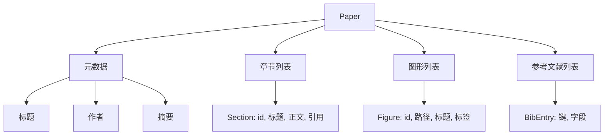
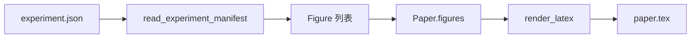
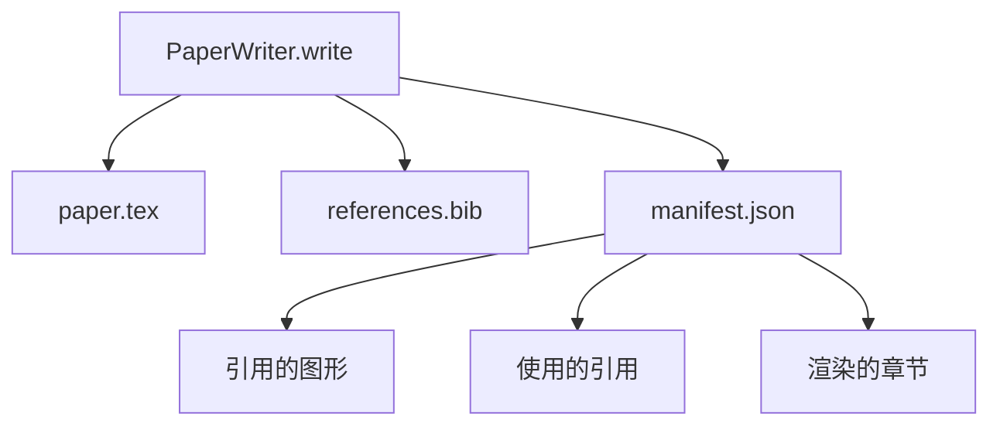

# 论文撰写器

> LaTeX 骨架是研究人员与排版者之间的合约。如果合约被破坏，文档无法编译，失败是响亮的。先构建骨架，然后填充内容。

**类型：** 构建
**语言：** Python
**前置知识：** 阶段19 课程50-53
**时间：** 约90分钟

## 学习目标

- 将研究论文视为具有已知章节图的结构化工件，而不是自由格式的文档。
- 生成一个 LaTeX 骨架，在撰写任何正文之前声明其摘要、章节、图形插槽和参考文献键。
- 通过确定性插槽机制，将实验输出中的图形（路径和标题）注入骨架。
- 接入模拟的正文生成器，根据结构化大纲填充每个章节，使得评估框架无需模型即可测试。
- 输出一个单独的 `paper.tex` 加上一个 `references.bib` 再加上一个清单，列出每个被引用的图形和每个被使用的引用。

## 为什么要先有骨架

以正文开始的草稿会积累结构债务。引言部分长出三段应该在相关工作部分的内容。图形在被定义之前就被引用。参考文献最终出现同一篇论文的三个键。等到作者注意到时，重写成本已经高于写作成本。

骨架反转了这一点。结构作为数据提前声明。章节是具有名称和顺序的插槽。图形是具有 ID 和标题的插槽。参考文献键在开头与它们指向的条目一起声明。正文一次一个地生成到这些插槽中。评估框架可以在任何正文撰写之前验证：每个图形都有插槽，每个引用都有条目，每个章节都出现在目录中。

这与早期课程应用于计划、工具调用和跟踪的纪律相同。结构就是合约。

## 论文的结构

每个字段都是纯 Python 数据。渲染器是一个从 `Paper` 到 LaTeX 字符串的纯函数。评估框架可以在渲染之前内省论文：计数章节，列出缺失的图形文件，检查每个 `\cite{key}` 是否有匹配的 `BibEntry`。

## 渲染合约

渲染器保证三个属性。第一，骨架中的每个图形插槽输出一个带有 `fig:<id>` 形式稳定标签的 `\begin{figure}` 块。第二，每个章节输出一个带有 `sec:<id>` 形式稳定标签的 `\section{}`，使交叉引用正常工作。第三，参考文献输出一个 `\bibliography` 块，其 `references.bib` 恰好包含论文上声明的条目，不多也不少。

违反其中任何一条都是渲染错误，而不是警告。骨架就是合约；静默丢弃图形的渲染是合约违约。

## 从实验注入图形

本轨道的前几课将实验输出生成为 JSON 清单。每个清单携带一个带有路径和简短标题的工件列表。论文撰写器读取该清单并生成 `Figure` 记录。

注入是确定性的。图形 ID 从实验名称加单调计数器派生。标题来自清单。路径相对于论文的输出目录进行归一化，使 LaTeX 即使在实验输出位于磁盘上其他地方时也能编译。

## 模拟的正文生成器

本课程不调用模型。一个 `MockProseGenerator` 读取大纲形状并确定性地输出正文。大纲形状是每个章节的一个短字符串。生成器将该字符串扩展为两个短段落，融入章节标题。生成的正文在声明图形和引用时正好使用它们。

这足以测试撰写器的每个行为。真实实现会用模型调用替换生成器。其周围的评估框架不会改变。这就是将正文生成器声明为可调用对象的价值：测试替换为确定性的，生产替换为模型的，流水线的其余部分完全相同。

## 清单输出

撰写器向输出目录输出三个文件。

清单是下游评估器或评论循环读取的内容。它不解析 LaTeX；它读取清单。下一课，评论循环，将此清单作为输入并产生反馈列表。这就是为什么清单是合约的一部分，而 LaTeX 不是。

## 验证关卡

撰写器在写入任何文件之前运行四个关卡。

1. 每个图形 ID 在论文内是唯一的。
2. 每个章节的 `cites` 字段引用一个在论文上声明的参考文献键。
3. 摘要非空。
4. 标题非空。

失败的关卡会以精确的原因抛出 `PaperValidationError`。评估框架将该原因作为失败模式呈现。没有部分写入：要么输出所有三个文件，要么一个都不输出。

## 如何阅读代码

`code/main.py` 定义了 `Paper`、`Section`、`Figure`、`BibEntry`、`PaperValidationError`、`MockProseGenerator`、`PaperWriter` 和一个 `render_latex` 函数。`write` 方法接受一个输出目录并输出 `paper.tex`、`references.bib` 和 `manifest.json`。`read_experiment_manifest` 辅助函数将实验清单列表转换为 `Figure` 记录。

`code/tests/test_paper_writer.py` 涵盖：无章节的骨架渲染、两个章节两个图形的完整渲染、缺失引用关卡、重复图形 ID 关卡、清单内容以及 LaTeX 字符串合约（每个章节输出 `\section{}`，每个图形输出 `\begin{figure}`）。

## 更进一步

真实实现会需要两个扩展。第一，多格式渲染：相同的 `Paper` 形状可以编译为博客文章的 Markdown 和预览的 HTML。渲染器成为 `Paper` 上的一个策略。第二，引用丰富化：撰写器在给定 DOI 本地缓存的情况下，从引用键获取 BibTeX 条目。两者都增加价值，两者都可以在不触及骨架合约的情况下添加。

骨架就是赌注。章节、图形和引用作为数据声明，正文生成到插槽中，清单随 LaTeX 一起输出。每一个其他改进都在此基础上组合。
