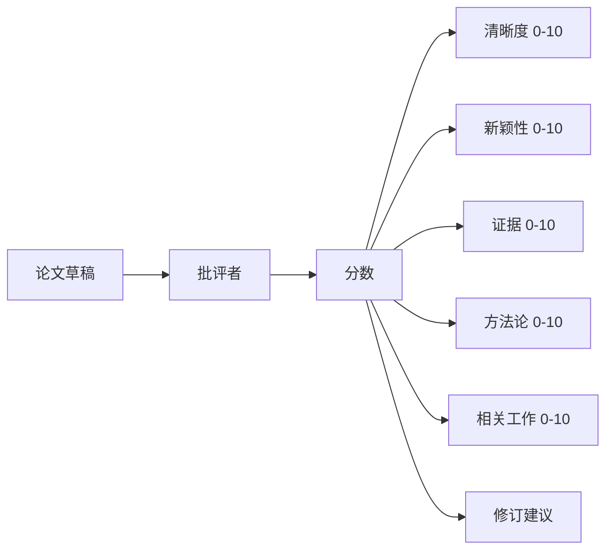
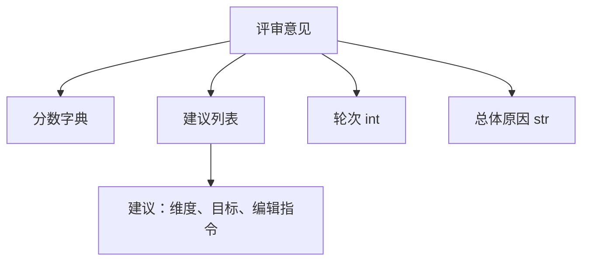
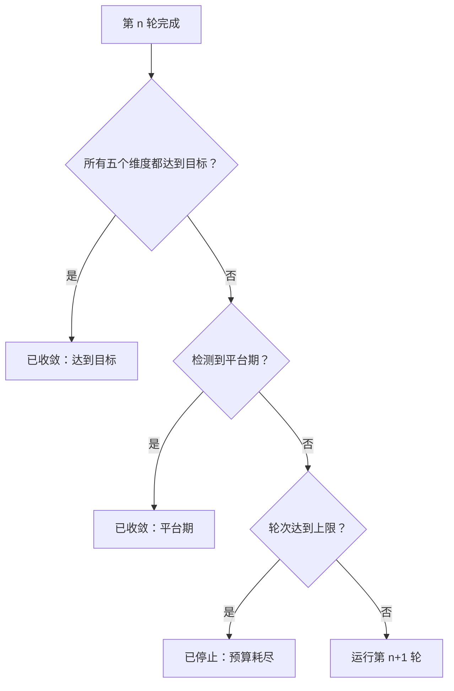
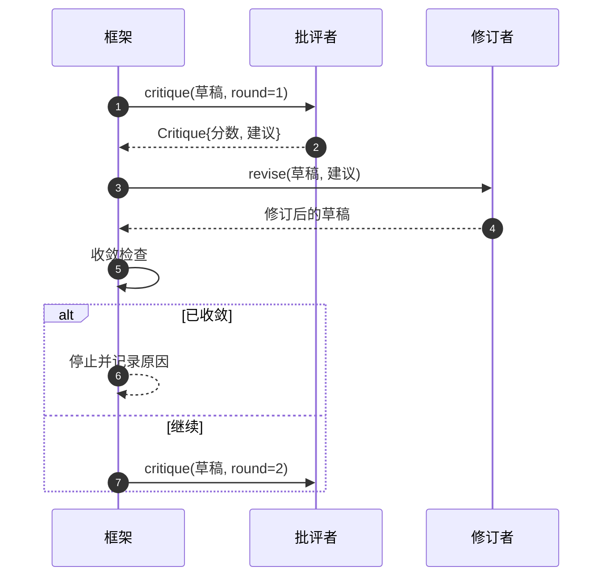

# 批评者循环

> 一个第一次就说"看起来不错"的批评者是坏的。一个总说"还需要改进"的批评者也是坏的。有趣的批评者是那个能够收敛的，而你必须设计出收敛。

**类型：** 构建
**语言：** Python
**前置知识：** 阶段 19 课程 50-53
**时间：** 约 90 分钟

## 学习目标

- 在五个固定维度上对论文草稿进行评分：清晰度、新颖性、证据、方法论、相关工作。
- 将每一轮的评审意见以结构化修订差异（diff）的形式应用，而不是自由形式的重写。
- 通过跨轮比较分数来检测收敛；在平台期、达到目标或预算耗尽时停止。
- 使用最大迭代预算来限制轮数，使不收敛的批评者不会无限运行。
- 输出每轮轨迹，以便仪表盘或下一阶段可以展示分数变化趋势。

## 为什么是五个固定维度

一个自由形式的批评者是一个返回一段建议的模型。下一轮的修订将这段文字当作背景上下文。重写是否解决了批评意见是无法验证的，因为批评意见从来就没有结构。

五个维度为框架提供了一个契约。



分数是一个向量。框架监控每一轮中每个维度的变化。一次提高清晰度但损害证据的修订，在证据维度上就是退步，收敛检查能够发现这一点。纯模型的批评者无法提供这种保证。

## 评审意见的结构



每条建议都携带它要改进的维度、它针对的章节，以及一个修订者可以应用的`edit`指令。修订者也是一个可调用对象。本课程附带一个确定性的修订者，它将编辑指令解释为追加到章节的操作。一个模型驱动的修订者会将同一个字段解释为一个提示。契约不变。

## 收敛规则（按顺序）

批评者循环在以下三个条件中的任何一个触发时终止。



达到目标是最严格的情况：五个维度（清晰度、新颖性、证据、方法论、相关工作）中的每一个都必须达到 `>= target_score`（默认 `8.0`），循环才返回成功。平均值高但有一个维度弱是不够的。平台期检测比较当前轮次的平均值与上一轮的平均值。如果连续两轮的改进幅度低于 `plateau_epsilon`（默认 `0.1`），循环以`平台期`退出。预算是对轮次的硬性上限（默认为 `5` 轮），以`预算耗尽`退出。

顺序很重要。达到目标优先于平台期，平台期优先于预算耗尽。如果第三轮达到了目标，而同一轮迭代也会触发平台期，结果是`达到目标`，而不是`平台期`。

## 为什么平台期检测需要两轮

一轮的平台期只是噪声。即使是在固定草稿上，一个真实的批评者每次迭代也会返回略有不同的分数，因为确定性评分仍然取决于哪些建议被应用了以及应用的顺序。要求连续两轮的平台期可以过滤掉这种噪声。如果框架报告了平台期，说明草稿确实已经停止改进了。

## 本课程中的确定性批评者

本课程不调用模型。自带的批评者是一个可调用对象，它根据三个信号对草稿进行评分：平均章节正文长度（清晰度）、图表数量和引用数量（证据），以及论文元数据上的 `originality_tag` 字段（新颖性）。修订者知道如何推高每个分数。

```text
clarity（清晰度）  当平均章节正文长度增加时增长
novelty（新颖性）  当 originality_tag 设置为 "high" 时增长
evidence（证据）    当章节的 figure_refs 非空时增长
methodology（方法论）当存在标题为 "Method" 的章节且有正文内容时增长
related-work（相关工作）当存在标题为 "Related Work" 的章节且有正文内容时增长
```

修订者将每条建议解释为一次有针对性的追加操作。第一轮之后，框架可以观察到分数上升。测试用例利用这一属性来断言循环能够缩小差距。

## 完整的循环契约



框架拥有轮次计数器、轨迹和收敛检查。批评者拥有分数。修订者拥有差异（diff）。三者互不触碰对方的状态。

## 轨迹输出

每一轮输出一个轨迹事件，包含轮次编号、分数向量、建议数量和收敛判断。完整的轨迹与最终草稿一起返回。下游仪表盘可以绘制每轮分数图。下一课"迭代调度器"会读取轨迹来决定分支是否值得保留。

## 保护机制：防止不良批评者的预算

一个不断产生建议但从未提高分数的批评者会让循环卡在最大迭代上限。轨迹使这一点可见：五轮下来分数持平，判断结果为`预算耗尽`。用户将此解读为批评者的 bug，而不是草稿的 bug。另一种做法是只呈现最终草稿，但这会隐藏诊断信息。轨迹优先的设计将其暴露出来。

## 如何阅读代码

`code/main.py` 定义了 `Critique`、`Suggestion`、`Critic` 协议、`Reviser` 协议、`CriticLoop`，以及一个返回确定性批评者和匹配修订者的 `make_deterministic_critic_pair` 工厂函数。其中包含一个最小化的 `Paper` 数据结构，使本课程可以独立运行。

`code/tests/test_critic_loop.py` 覆盖了：第一轮后的单调改进、调优草稿上的目标收敛、两轮持平后的平台期检测、没有建议能改进分数时的预算耗尽、修订者对建议的应用，以及轨迹结构。

## 延伸阅读

实际实现中可能需要的两个扩展。第一，维度权重：投给研讨会的论文将新颖性权重设得高于方法论；期刊则相反。收敛检查变为加权平均值。第二，配对批评者：一个批评者评分，第二个批评者在修订者看到建议之前对这些建议进行裁决。两者都增加价值，两者都基于同样的 `Critique` 结构进行组合。

核心赌注在于分数向量。一旦评审意见被结构化，所有其他改进——收敛规则、仪表盘、配对批评者——都可以在不改变循环的情况下直接接入。
