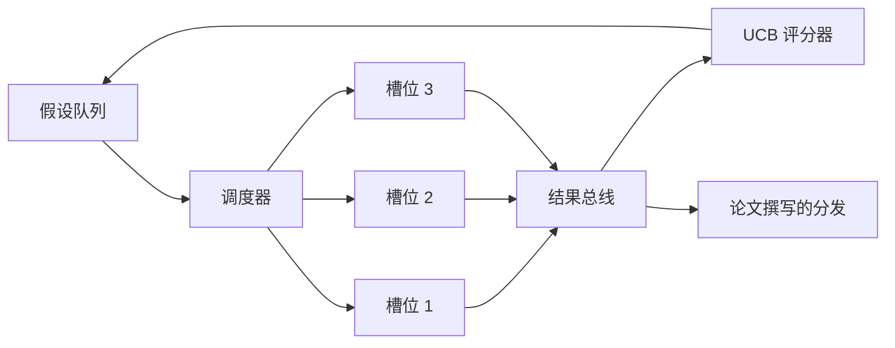
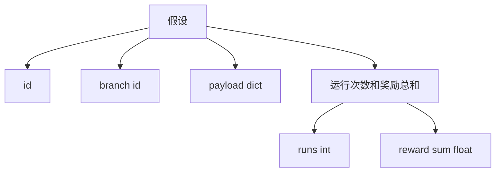
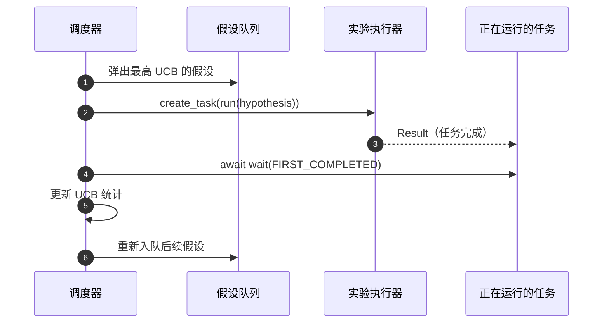

# 迭代调度器

> 一个没有调度器的研究循环，不过是一个自欺欺人的队列。调度器是循环决定停止探索什么的地方，而这个决定就是整个游戏的关键。

**类型：** 构建
**语言：** Python
**前置知识：** 阶段 19 课程 50-53
**时间：** 约 90 分钟

## 学习目标

- 将研究工作流建模为一个假设队列，队列为并行的实验槽提供输入，实验结果再汇聚回来。
- 使用 asyncio 同时运行多个实验，使调度器能够保持所有槽位忙碌。
- 使用 UCB 对每个假设分支进行评分，使调度器能够修剪低产出分支而不放弃探索。
- 将完成的结果分发到论文撰写阶段和重新入队阶段，使高产出分支能够产生后续假设。
- 输出每轮迭代轨迹，包含分支分数、槽位占用和修剪决策。

## 为什么需要调度器，而不是工作列表

一个扁平的工作列表按提交顺序运行任务。当每个任务独立时这没问题。但研究不是独立的：实验三的一个发现会改变实验四和实验五的优先级。一个能够读取结果汇集并重新排序队列的调度器，能够在单位计算资源内完成更多有价值的工作。

有趣的设计选择是评分规则。贪婪评分器总是选择当前的领先者，从不探索。均匀评分器从不利用已有成果。UCB（上置信界）是中间路线：在利用领先者的同时，为尝试较少的分支预留容量。

## 系统结构



队列存放假设。调度器在某个槽位空闲时选择 UCB 分值最高的假设。每个槽位异步运行一个实验。完成的实验将结果分发到总线上。总线更新原始分支的 UCB 统计数据，并在分支产出超过阈值时将结果分发到论文撰写阶段。

## 假设的结构



`branch` 是 UCB 统计的键。多个假设可能共享一个分支（分支是研究方向；假设是该分支内的一个试验）。`runs` 是该分支已完成的实验数量，`reward_sum` 是累积奖励。UCB 读取这两个值。

## UCB 评分

本课程使用的 UCB 公式是经典的 UCB1。

```text
ucb(branch) = mean_reward(branch) + c * sqrt( ln(total_runs) / runs(branch) )
```

`total_runs` 是所有分支上完成的实验总数。`c` 是探索权重；本课程默认设为 `sqrt(2)`。运行次数为零的分支获得 `+inf`，因此未尝试的分支总是被优先调度。平均奖励高的分支保持高分，直到其他分支追赶上来；运行次数多但奖励不高的分支会被尝试次数较少的替代方案超越。

修剪闸门与选择器是分开的。当某个分支的平均奖励在至少 `prune_after_runs` 次试验（默认为 `3`）后低于绝对下限（默认为 `0.2`）时，修剪会将该分支从未来的调度中移除。这保持了队列的有界性。

## 使用 asyncio 的并行槽位

调度器使用 `asyncio.create_task` 驱动实验。每个任务运行实验执行器（一个 `async def` 可调用对象），返回一个 `Result`。主循环使用 `asyncio.wait(..., return_when=asyncio.FIRST_COMPLETED)` 等待正在运行的任务集合，并在每次任务完成时触发评分更新。



三个槽位并发运行。主循环从不阻塞在单个实验上。调度器在槽位一空闲就立即启动新任务，直到队列为空且没有正在运行的任务。

## 分发：论文触发

当某个分支的平均奖励超过 `paper_threshold`（默认为 `0.7`）且该分支尚未产生论文时，调度器将一个 `paper.trigger` 事件分发到一个输出列表中。下游的第 54 课的论文撰写器会接收这个事件。在本课程中，触发事件被捕获为一个列表，以便测试可以断言它。

## 分发：后续假设

当高产出结果到达时，调度器可以调用用户提供的 `expander` 来在同一分支上产生一个或多个后续假设。扩展器是一个从 `Result` 到 `list[Hypothesis]` 的纯函数。本课程附带一个确定性扩展器，对于任何奖励超过论文阈值的結果，它会产生两个后续假设。

## 预算

两个预算保护调度器免于失控循环。

```text
max_experiments    : 所有分支上运行的实验总数
max_seconds        : 挂钟时间上限（asyncio 时间）
```

当任何一个预算被触发时，调度器停止调度新任务，等待正在运行的任务完成，并返回最终轨迹。轨迹中包含 `stop_reason`（停止原因）。

## 轨迹和最终报告

每个调度决策（选择、分发、结果、修剪、分发事件）都输出一个事件。最终报告汇总每个分支的统计信息、总运行次数、总挂钟时间和触发的论文事件。下一课"端到端演示"会读取这份报告来驱动论文撰写器。

## 如何阅读代码

`code/main.py` 定义了 `Hypothesis`、`Result`、`BranchStats`、`IterationScheduler`，以及一个返回具有可预测奖励的 asyncio 实验执行器的 `make_deterministic_runner` 工厂函数。执行器会休眠固定的 `delay_ms`（默认为 `5ms`），以便可以观察到并发行为。

`code/tests/test_scheduler.py` 覆盖了：UCB 优先选择未尝试的分支、并行槽位占用、超过阈值时的论文触发、低产出试验后的分支修剪、后续假设的分发，以及预算退出（实验数量和挂钟时间两种）。

## 延伸阅读

实际实现中可能需要的三个扩展。第一，跨会话的持久化 UCB 统计：当前统计信息存在于内存中；真实的调度器会将其检查点化，以便重启后保留已花费的探索预算。第二，多目标评分：不采用标量奖励，每个结果输出一个向量，UCB 变为帕累托风格的选择器。第三，上下文赌博机：选择器根据假设特征（长度、复杂度）进行调节，使相似的假设共享探索。

调度器是研究超越简单工作列表的地方。一旦 UCB 被接入并且槽位并行运行，所有其他改进都可以在其之上组合。
