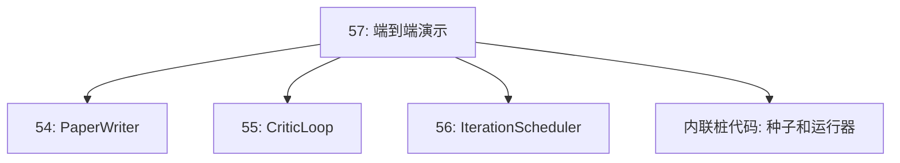
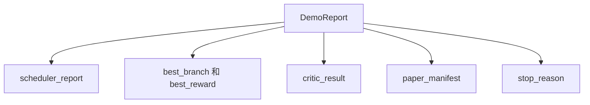

# 端到端研究演示

> 演示是每个之前编写的合约必须协同工作的地方。如果其中任何一个出现泄漏，演示就是抓住问题的课程。

**类型：** 构建
**语言：** Python
**前置知识：** 阶段 19 课程 50-53
**时间：** ~90 分钟

## 学习目标

- 将自动研究循环端到端连接起来：假设种子、实验运行器、调度器、评论家循环、论文撰写器。
- 通过普通的 Python 导入（而非框架）组合来自之前四个轨道 D 课程的原语。
- 运行循环直至自我终止，并输出一份列出每个阶段输出的单一演示报告。
- 保持演示的确定性，以便测试套件可以断言最终的输出形态。
- 当任何阶段的合约被破坏时，清晰呈现失败模式，使下一阶段不会以损坏的输入运行。

## 此处组合了什么


五个阶段。种子是一个包含三个假设的列表。调度器使用三个并行槽在这三个假设上运行六个实验。总线报告一个或多个论文触发。选择器选择单一最佳结果。评论家循环根据该结果迭代草稿。论文撰写器输出最终的 LaTeX、BibTeX 和清单。

## 为什么用导入而非复制

每个之前的课程都提供了一个包含公共数据类和函数的 `main.py`。演示通过调整 `sys.path` 指向每个课程的上层目录来导入它们。这不是框架连接；它与之前课程的测试文件已经使用的导入方式相同。



内联桩代码代替了课程 50 到 53：一个小的种子假设生成器和一个同步奖励函数。用户可以通过调整两个导入将内联桩代码替换为来自那些课程的真实原语。

## 确定性保证

演示在构造上是确定性的。实验运行器使用带种子的 numpy。评论家循环的修改器以固定顺序遍历固定维度。论文撰写器的散文生成器是来自课程 54 的模拟版本。调度器的 UCB 选择器按迭代顺序打破平局，而非随机选择。

给定相同的种子，演示输出相同的报告。测试通过运行演示两次并比较清单来断言此属性。

## 演示报告的形态



每个字段直接来自上游阶段。演示不转换任何输出；它只是组合它们。这就是演示要测试的内容。

## 失败模式处理

每个阶段要么成功，要么引发类型化错误。

```text
调度器 ........ 返回带有 stop_reason 的 SchedulerReport
                 值为 {queue_empty, max_experiments, deadline}
最佳结果选择器 . 若无论文触发则引发 NoTriggerError
评论家循环 ...... 返回状态为 converged 或 stopped 的 LoopResult
论文撰写器 ..... 合约破坏时引发 PaperValidationError
```

任何阶段的失败都会以类型化异常短路演示。测试钉住了这个合约：`test_no_triggers_raises_typed_error` 和 `test_best_picker_raises_when_no_triggers` 断言当没有分支触发时，选择器会引发 `NoTriggerError` / `BestResultError`，且论文撰写器永远不会被调用。

## 最佳结果选择器

调度器为每个分支发出论文触发。选择器选择在所有触发中平均奖励最高的分支。平局按分支 ID 字母顺序打破，以使演示保持确定性。选择器是一个小型纯函数；测试在固定的调度器报告上钉住它。

## 连接评论家循环

课程 55 中的评论家循环操作于 `MiniPaper`。演示通过使用分支 ID 填充摘要、播种两个章节（引言和结果），并根据分支的平均奖励设置 `originality_tag`（如果 `>= 0.8` 则为高，如果 `>= 0.6` 则为中，否则为低），从选定的分支构建一个 `MiniPaper`。

然后修改器将草稿迭代至收敛。输出进入论文撰写器。

## 连接论文撰写器

课程 54 中的论文撰写器操作于完整的 `Paper` 形态，包括图表和参考文献。演示通过 `mini_to_full_paper` 升级收敛后的 `MiniPaper`，该函数为选定的分支附加一个图表，并构建一个由评论家建议的引用键并集组成的小型合成参考文献列表。演示添加的每个引用也同时添加到参考文献列表中，因此验证通过。

## 如何阅读代码

`code/main.py` 定义了 `BestResultError`、`NoTriggerError`、`DemoReport`、`pick_best_branch`、`build_mini_paper`、`mini_to_full_paper` 和 `run_demo`。顶部的导入调整一次 `sys.path`，并从各自的课程中引入 `PaperWriter`、`CriticLoop` 和 `IterationScheduler`。

`code/tests/test_e2e.py` 涵盖：端到端运行演示并输出包含所有五个字段的报告、两次运行的确定性、当没有分支超过阈值时的 NoTriggerError、当撰写器的合约被破坏时的 PaperValidationError、论文清单包含选定分支的图表、以及调度器停止原因在预期的值范围内。

## 深入扩展

在演示通过后值得连接的三个扩展。第一，持久化状态：每个阶段的结果写入一个小型 JSON 存储，以便重启可以恢复而无需重新运行廉价阶段。第二，仪表板：来自调度器和评论家循环的跟踪事件呈现为一个时间线。第三，真实模型调用：将模拟的散文生成器和确定性评论家替换为模型驱动的版本；连接方式不变。

演示的工作是证明组合就是架构。五个课程，四个导入，一份报告。下次你添加阶段时，连接代码恰好增加一行。
