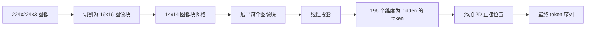

# 视觉编码器图像块

> 一个读取像素的视觉模型需要一个用于像素的分词器。图像块嵌入就是这个分词器。将图像切割成方形网格，展平每个方块，通过一个线性层投影，然后添加一个 2D 位置信号，以便 Transformer 知道每个方块在原始图像中的位置。

**类型：** 构建
**语言：** Python
**前置知识：** 阶段 19 课程 30-37（轨道 B 基础）
**时间：** ~90 分钟

## 学习目标

- 将图像分词化为固定长度的图像块嵌入序列。
- 实现基于 `Conv2d` 的图像块投影，其数学原理与 unfold-then-linear 相同。
- 构建确定性的 2D 正弦位置嵌入，使 token 顺序编码空间位置。
- 在合成夹具上验证图像块数量、嵌入形状以及 `Conv2d`/unfold 的等价性。

## 问题

Transformer 处理向量序列。图像是一个 3 通道网格。将每个像素作为 token 读取会导致序列长度爆炸：一张 224x224 的 RGB 图像有 150,528 个 token，12 层 Transformer 在注意力计算上无法承受。将图像作为一个巨大的扁平向量读取会丢弃局部性信息，而注意力层无法恢复。编码器前端的工作是将像素网格压缩成几百个 token，每个 token 概括一个方形区域。

图像块嵌入通过一个线性投影解决了这个问题。将 224x224 图像切割成 16x16 的图像块，产生一个 14x14 的网格，共 196 个图像块。每个图像块从 `(3, 16, 16) = 768` 个像素值展平为一个向量，然后一个线性层将其映射到模型的隐藏维度。Transformer 看到 196 个维度为 `hidden`（通常为 768）的 token 加上一个 CLS token。这是网络其余部分可以处理的序列长度。

## 概念



### 为什么用图像块而不用像素

注意力在序列长度上是二次的。196 个 token 的序列每层每头需要 `196 * 196 = 38,416` 个注意力分数；150,528 个 token 的序列需要 `150,528 * 150,528 = 226 亿`。图像块使注意力计算减少了 590,000 倍，单个 16x16 区域携带足够的信号用于高级视觉任务。代价是单个图像块内部细粒度空间细节的丢失，这就是下游多模态栈在需要精确定位时经常运行第二个高分辨率分支的原因。

### 为什么线性投影就足够了

每个图像块被视为一个独立的向量。投影学习一个基：边缘检测器、颜色过滤器、简单纹理。单个线性层很小（ViT-Base 为 `768 * 768 = 589,824` 个参数），且训练速度快。存在更深的卷积主干（"混合" ViT），但扁平线性投影是标准做法，大多数现代开源权重编码器都使用这种确切的形态。

### `Conv2d` 技巧

一个 `Conv2d(in_channels=3, out_channels=hidden, kernel_size=patch_size, stride=patch_size)` 无填充的卷积在数值上与 unfold-then-linear 结果相同，因为每个输出位置将图像块像素与一个过滤器做点积。卷积就是图像块投影，大多数生产代码库都采用这种方式，因为它在 GPU 上更快且少了一次重塑操作。

### 位置嵌入

Token 在投影后不携带顺序信息。2D 正弦嵌入给每个 token 一个固定信号，编码其 `(row, col)` 位置。一半嵌入维度用多个频率的 sin/cos 编码行位置；另一半编码列位置。编码是确定性的，因此可以在不重新训练的情况下切换分辨率，并且可以干净地插值到模型在训练时从未见过的网格。

| 组件 | 形状 | 参数量 |
|-----------|-------|------------|
| 图像块投影（`Conv2d`） | `(hidden, 3, patch, patch)` | `3 * P * P * hidden + hidden` |
| 位置嵌入（固定） | `(num_patches, hidden)` | 0（计算得到，非学习） |
| CLS token（可学习） | `(1, hidden)` | `hidden` |

对于 224 分辨率下的 ViT-Base/16：投影中 590,592 个参数，CLS token 中 768 个参数，正弦位置零参数。下一课（59）在此前端之上堆叠一个 12 层 Transformer。

### 等价性作为健全性检查

图像块步骤有两种实现方式：`Conv2d` 投影和显式的 unfold-then-linear。对于相同的权重，它们必须产生相同的输出。如果不一致，则 unfold 数学实现有误，编码器的其余部分建立在流沙之上。本课程中的测试验证了这种等价性。

## 构建它

`code/main.py` 实现了：

- `PatchEmbed`，一个包装 `Conv2d` 用于图像块投影的 `nn.Module`。
- `sinusoidal_2d(grid_h, grid_w, dim)`，构建 2D 位置表的无状态函数。
- `VisionFrontEnd`，将图像块嵌入、CLS 前置和位置加法组合到一个前向传播中。
- 一个 `synthesize_image(seed)` 辅助函数，从 `numpy.random` 构建确定性的 224x224x3 夹具。
- 一个演示，运行一张夹具图像通过前端，打印输出形状、CLS token 范数和位置嵌入的一行。

运行它：

```bash
python3 code/main.py
```

输出：224x224 夹具被分词化为形状为 `(1, 197, 768)` 的序列。第一个 token 是 CLS；接下来的 196 个是图像块 token。位置嵌入范数在一行内是均匀的，这是正弦编码的特征。

## 使用它

相同的图像块前端出现在每个现代视觉语言模型中：CLIP ViT-L/14、SigLIP、DINOv2、Qwen-VL 系列和 InternVL 栈都从一个 `Conv2d` 图像块投影加位置信号开始。不同系列之间的差异存在于下游（CLS 与无 CLS 池化、寄存器 token、不同的图像块大小 14 与 16、通过插值位置实现的动态分辨率）。本课程中的前端是所有这些模型所依赖的基础。

## 测试

`code/test_main.py` 涵盖：

- 图像块数量匹配 `(image_size / patch_size) ** 2`
- 输出形状匹配 `(batch, num_patches + 1, hidden)`
- `Conv2d` 投影等于在小夹具上的手动 unfold-then-linear
- 正弦位置表在多次调用间具有确定性
- CLS token 跨批次维度广播而无泄漏

运行它们：

```bash
python3 -m unittest code/test_main.py
```

## 练习

1. 将正弦位置替换为可学习的 `nn.Parameter`，并在一个小型合成分类任务上比较第一个 epoch 的损失。可学习位置在固定分辨率下获胜；正弦位置在训练后改变分辨率时获胜。

2. 将 `Conv2d` 替换为显式的 `nn.Unfold` 加 `nn.Linear`，并断言输出在浮点容差内匹配。相同的数学，两种实现方式。

3. 添加对非方形图像块大小的支持（例如宽高比输入使用 32x16），并验证位置表能处理非方形网格。

4. 在批次大小 1、8、64 下对图像块步骤进行性能分析。图像块投影很少是瓶颈；下游的注意力层占主导。

5. 将前端作为冻结的特征提取器在 4 类合成形状数据集（圆形、正方形、三角形、星形）上进行训练。CLS token 输出应可线性分离。

## 关键术语

| 术语 | 含义 |
|------|---------------|
| 图像块（Patch） | 图像的方形子区域，通常为 14x14 或 16x16 |
| 图像块嵌入（Patch embedding） | 将一个展平的图像块线性投影到隐藏维度 |
| 序列长度（Sequence length） | 图像块分词化后的 token 数，通常加上 CLS |
| 正弦位置（Sinusoidal position） | 编码 2D 网格坐标的固定 sin/cos 信号 |
| CLS token | 前置到序列前作为池化头的可学习向量 |

## 延伸阅读

- An Image is Worth 16x16 Words（ViT，2021）了解原始图像块嵌入框架。
- Attention Is All You Need（2017）了解此处适配为 2D 的正弦位置公式。
- DINOv2 论文了解寄存器 token，你可以将其作为练习 6 添加。
