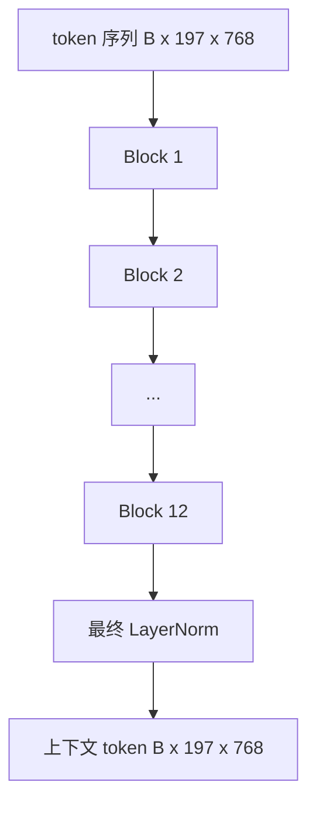
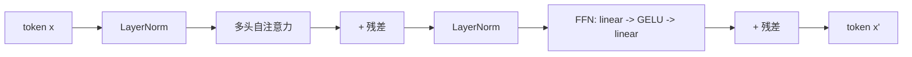

# Vision Transformer 编码器

> 仅有图像块是看不到东西的。一个带 12 个注意力头的 12 层 Pre-LN Transformer 将图像块 token 序列转换为上下文 token 序列，CLS token 在其最终隐藏状态中汇集整幅图像的特征。本课程是每个现代视觉语言模型的引擎室。

**类型：** 构建
**语言：** Python
**前置知识：** 阶段 19 课程 30-37（轨道 B 基础）
**时间：** ~90 分钟

## 学习目标

- 实现一个包含多头自注意力和前馈子层的 Pre-LN Transformer 块。
- 堆叠 12 个块、12 个头，形成 ViT-Base 编码器。
- 将课程 58 的图像块前端连接到编码器并运行前向传播。
- 验证 CLS token 从每个图像块聚合信息。

## 问题

图像块嵌入产生一个包含 197 个 token 的序列，每个向量对其它图像块没有感知。一张猫的图片需要每个图像块知道哪些图像块包含胡须、哪些包含背景、哪些包含眼睛。Transformer 是构建这种感知的机制，一次一层注意力。没有它，图像块前端只是一个没有理解能力的巧妙分词器。

标准配方是 12 层深、12 头宽，使用 Pre-LayerNorm 放置、GELU 激活和 4 倍前馈扩展。这个配方是 CLIP ViT-L、SigLIP、DINOv2、Qwen-VL 系列、InternVL 以及 2025-2026 年所有其他开源视觉编码器的骨干。这个配方足够稳定，你可以阅读这些论文中的任何一篇，并假设块形状如此，除非他们明确说明不同。

## 概念





### Pre-LN 与 Post-LN

原始 Transformer 将 LayerNorm 放在残差之后。Pre-LN（在每个子层之前做 LayerNorm）是每个现代视觉语言模型使用的版本，因为它在没有学习率预热技巧的情况下也能稳定训练。区别在前向传播中只有一行代码，但在 12+ 层深度下的梯度流动天差地别。

### 多头自注意力

每个头将 token 向量投影到其自己的 `(query, key, value)` 三元组，维度为 `head_dim = hidden / num_heads`。当 `hidden = 768` 且 `heads = 12` 时，每个头有 `dim = 64`。12 个头并行进行注意力计算，然后将它们的输出拼接回维度 768，并通过一个输出投影。多头的作用在于一个头可以学习"关注猫眼"而另一个头学习"关注背景渐变"而互不干扰。

### 为什么是 4 倍前馈扩展

FFN 按 `hidden -> 4 * hidden -> hidden` 进行，中间使用 GELU。因子 4 是经验性的，自 2017 年以来在语言和视觉 Transformer 中一直保持不变。更小的（2 倍）欠拟合；更大的（8 倍）在固定数据预算下过拟合。MLP 是模型存储大部分学习到事实的地方，更宽的中间层是它们所在的位置。

| 组件 | ViT-Base 规模的参数量 |
|-----------|------------------------------|
| 每块 qkv 投影 | `3 * 768 * 768 = 1.77M` |
| 每块输出投影 | `768 * 768 = 590K` |
| 每块 FFN（4 倍扩展） | `2 * 768 * 4 * 768 = 4.72M` |
| 每块 LayerNorm | `4 * 768 = 3K` |
| 每块总计 | 约 7.1M |
| 12 块 | 约 85M |
| 加前端 | 总计约 86M |

ViT-Base 是一个 86M 参数的编码器。按 2026 年标准来说很小（SigLIP-So400M 是 400M，Qwen-VL ViT 是 675M），但架构在宽度和深度上相同。

### 因果掩码还是不？

Vision Transformer 是纯编码器且双向的：token `i` 可以关注任何 token `j`。无掩码。课程 61 中的解码器侧交叉注意力将使用因果掩码，但在视觉编码器内部，注意力是完全连接的。

### CLS token 学习什么

CLS token 开始时是一个可学习参数，本身没有图像块内容，通过每个块的注意力积累信息。到最后一层时，CLS 行是整个图像的向量摘要；下游头将这一向量投影为类别 logits、对比嵌入或用于文本解码器的交叉注意力键。

## 构建它

`code/main.py` 实现了：

- `MultiHeadSelfAttention`，包含 `qkv` 和输出投影、缩放点积注意力数学和形状断言。
- `FeedForward`，4 倍扩展 GELU MLP。
- `Block`，一个 Pre-LN 块，组合注意力和前馈子层以及残差连接。
- `ViT`，12 个块的堆叠，带有最终 LayerNorm。
- `VisionEncoder`，将课程 58 的 `VisionFrontEnd` 连接到 `ViT` 栈，并暴露一个返回上下文序列和池化 CLS 向量的 `forward()` 方法。
- 一个演示，将合成的 224x224 夹具图像通过完整编码器，并打印输入形状、输出形状、参数量以及每隔一层的 CLS 范数。

运行它：

```bash
python3 code/main.py
```

输出：夹具被编码为 `(1, 197, 768)` 的张量。CLS 范数随着层数增加而上升，然后在最终 LayerNorm 处稳定。总参数量报告约为 86M。

## 使用它

此处定义的编码器，在宽度和深度上，与 2025-2026 年每个开源 VLM 内部的块栈相同。差异存在于：

- **宽度和深度。** ViT-Large 是 `hidden=1024, depth=24, heads=16`；SigLIP So400M 是 `hidden=1152, depth=27, heads=16`。相同的块。
- **池化头。** CLS 池化（本课程）与平均池化（SigLIP）与注意力池化（后来的 VLM）。
- **位置处理。** 固定正弦（课程 58）与可学习 1D 与 ALiBi 与 2D RoPE。块的数学计算不变。
- **寄存器 token。** DINOv2 前置了 4 个额外的可学习 token。一行代码。

这个块栈是基础。接下来的课程（60-63）建立在其之上。

## 测试

`code/test_main.py` 涵盖：

- 单个块保持形状，且对输入批次大小不变
- 注意力分数沿键轴之和为 1（softmax 健全性检查）
- 残差路径已连接（零输入仍通过 CLS token 产生非零输出）
- 4 层堆叠前向传播产生正确的形状
- 梯度从 CLS 输出流向图像块投影

运行它们：

```bash
python3 -m unittest code/test_main.py
```

## 练习

1. 添加寄存器 token（在 CLS 后前置的 4 个可学习向量）并重新运行。通过最后一层 softmax 分布的熵比较注意力图平滑度。

2. 将 Pre-LN 替换为 Post-LN，并在合成形状分类器上训练一个 epoch。观察哪一个在没有 LR 预热的情况下稳定训练。

3. 实现因果掩码作为 `attn_mask` 参数，使同一块可以复用为解码器块。掩码形状为 `(seq, seq)`，下三角。

4. 使用 `torch.profiler` 在批次大小 1、8、64 下分析前向传播。MLP 层占主导时间，而非注意力。

5. 将一个注意力头的 q-k-v 投影替换为低秩 LoRA 适配器，冻结其余部分，并验证梯度只在你期望的地方流动。

## 关键术语

| 术语 | 含义 |
|------|---------------|
| Pre-LN | LayerNorm 应用于每个子层之前而非之后 |
| 自注意力（Self-attention） | 每个 token 关注同一序列中的每个其他 token |
| 多头（Multi-head） | 隐藏维度被分割成 `H` 个独立的注意力头 |
| FFN 扩展 | 前馈层在收缩前扩展到 `4 * hidden` |
| CLS 池化 | 使用第一个 token 的最终隐藏状态作为图像摘要 |

## 延伸阅读

- An Image is Worth 16x16 Words（ViT，2021）了解编码器配方。
- DINOv2（2023）了解寄存器 token 和自监督预训练目标。
- SigLIP（2023）了解平均池化变体和课程 62 中使用的 sigmoid 对比损失。
