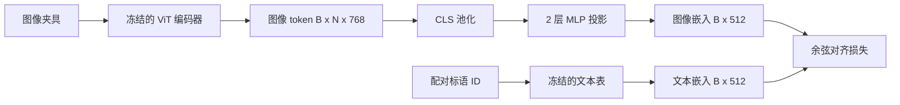

# 模态对齐的投影层

> 视觉编码器产生图像 token。文本解码器消费文本 token。两者存在于不同的向量空间中。一个小的两层 MLP 将图像 token 投影到文本嵌入空间，针对配对标语的余弦对齐损失将两个空间拉近。该投影是视觉语言模型中最小的组件，也是对迁移最重要的组件。

**类型：** 构建
**语言：** Python
**前置知识：** 阶段 19 课程 30-37（轨道 B 基础）
**时间：** ~90 分钟

## 学习目标

- 构建一个将图像特征映射到文本嵌入空间的两层 MLP 投影。
- 构造一个模拟文本嵌入表（无预训练分词器，无真实语料库）。
- 计算投影后的图像 token 与配对标语嵌入之间的余弦对齐损失。
- 在冻结的视觉编码器和冻结的文本表下单独训练投影层。

## 问题

你有一个视觉编码器（课程 58-59），产生维度为 `vision_hidden = 768` 的 token。你有一个想要连接在上面的文本解码器，其嵌入维度为 `text_hidden = 512`（任何其他数字也同样合理）。解码器期望文本形状的 token。图像 token 不是文本形状的：它们存在于编码器在仅视觉预训练期间学习的基中，与解码器的词向量没有关系。

两层 MLP 投影（linear，GELU，linear）弥合了这一差距。它足够小（约 `768 * 1024 + 1024 * 512 = 1.3M` 参数），可以在单个 GPU 上几分钟内训练完成，并且它是在对齐阶段唯一需要学习的组件。视觉编码器保持冻结。文本嵌入表保持冻结。只有投影层在移动。这是 LLaVA 在 2023 年发布的配方，BLIP-2 将其重新定义为 Q-Former，此后每个开源 VLM 都以某种形式采用了它。

## 概念



### 投影前的池化

视觉编码器输出 197 个 token。文本侧有一个单标语级别的嵌入。要对齐它们，每个样本需要一个图像级向量。CLS 池化是最简单的：取编码器的第一个 token 并投影它。对所有 197 个 token 进行平均池化是另一种选择，SigLIP 使用这种方法。两者都将 197 个向量缩减为一个。

### 为什么两层而不是一层

单个线性投影可以旋转和缩放，但如果两个空间存在曲率不匹配，则无法修复基。两个线性层之间的 GELU 为投影提供了一次非线性弯曲，经验上足以将 CLIP 风格的特征与语言模型嵌入对齐。更深的投影（LLaVA-NeXT 使用了 GLU；Qwen-VL 使用了一堆注意力层）是扩展；两层 MLP 是规范基线，BLIP-2 的 Q-Former 投影头在底层也是这么实现的。

| 层 | 形状 | 参数量 |
|-------|-------|------------|
| fc1 | `(vision_hidden, projection_hidden)` | `768 * 1024 + 1024` |
| 激活 | GELU | 0 |
| fc2 | `(projection_hidden, text_hidden)` | `1024 * 512 + 512` |

对于 `768 -> 1024 -> 512` 的头，约 1.3M 参数。

### 余弦对齐损失

对齐并不意味着 `image_emb == text_emb`。对齐意味着 `image_emb` 在联合空间中指向与 `text_emb` 相同的方向。余弦损失是 `1 - cos_sim(image, text)`，范围从 0（完美对齐）到 2（完全相反）。训练使每对的值趋近于零。课程 62 将其推广为对比批次（InfoNCE），其中每个图像必须与其自己的标语比批次中任何其他标语更接近；本课程使用配对版本以便动态可见。

### 冻结编码器是关键

视觉编码器有 86M 参数。文本表还有几百万。从模拟语料库训练所有这些参数是不可行的。冻结两者意味着投影的 1.3M 参数是唯一变化的部分，在合成对上几百步就足以降低损失。这正是每个基于适配器的 VLM 的操作形态：重的部分保持冻结，轻的桥梁进行训练。

## 构建它

`code/main.py` 实现了：

- `MLPProjector(in_dim, hidden_dim, out_dim)`，两层线性 MLP 加 GELU 激活。
- `MockTextEmbedding(vocab_size, dim)`，一个从种子确定性初始化的冻结嵌入表。
- `make_pair(seed, vocab_size)`，合成为一个配对的（图像，标语）样本。标语是短的 ID 序列；标语嵌入是 token 嵌入的平均池化。
- `cosine_alignment_loss(image_emb, text_emb)`，配对 `1 - cos_sim` 目标。
- 一个训练循环，在 32 个合成对（循环使用）上运行投影 200 步，视觉编码器和文本表冻结，每 25 步打印损失。

运行它：

```bash
python3 code/main.py
```

输出：训练报告损失从初始约 1.07 下降到 200 步内的约 0.80，证明仅投影层就能将图像 token 拉向文本空间。每对的最终余弦相似度也会打印。

## 使用它

相同的模式出现在每个开源 VLM 中：

- **LLaVA 1.5。** 从 CLIP-ViT-L 隐藏层到 LLaMA 嵌入维度的两层 GELU MLP 投影。冻结视觉编码器，冻结 LLM，仅训练投影（然后在阶段二解冻 LLM）。
- **BLIP-2。** Q-Former 通过交叉注意力将 32 个可学习查询 token 与图像 token 交互，然后投影到 LLM 嵌入维度。Q-Former 最末端的投影头是本课程 MLP 的对应物。
- **MiniGPT-4。** 从 BLIP-2 Q-Former 输出到 Vicuna 嵌入维度的单层线性投影。
- **Qwen-VL。** 包含几层的交叉注意力适配器，但最终部分仍然是到 LM 嵌入维度的投影。

形状各异但角色相同：池化图像 token，投影到文本嵌入维度，单独训练。

## 测试

`code/test_main.py` 涵盖：

- 投影器输出形状匹配配置的 `out_dim`
- 冻结的文本嵌入表有零个 `requires_grad` 参数
- 余弦损失在相同向量上为 0，在反平行向量上为 2
- 一次反向传播后投影器梯度流动
- 训练循环减少步 0 和步 200 之间的损失

运行它们：

```bash
python3 -m unittest code/test_main.py
```

## 练习

1. 将 CLS 池化替换为 196 个图像块 token 的平均池化，并比较 200 步后的最终损失。平均池化通常在合成数据上训练更快；CLS 在自然图像上样本效率更高。

2. 向余弦损失添加可学习标量温度（`cos / tau`），并观察当 `tau` 太小（梯度噪声）或太大（损失在高位平台期）时会发生什么。

3. 将两层 MLP 替换为单层线性层，并量化损失差距。非线性在自然图像特征上比在合成特征上更重要。

4. 在投影器权重上添加小的 L2 惩罚，观察它如何与余弦对齐交互（余弦是尺度不变的，因此惩罚主要收缩未使用的方向）。

5. 持久化投影器权重，然后重新加载并在无视觉编码器反向传播的情况下运行推理，验证部署时只需要投影器。

## 关键术语

| 术语 | 含义 |
|------|---------------|
| 模态对齐（Modality alignment） | 使图像和文本嵌入在一个共享空间中可比较 |
| 投影头（Projection head） | 将一个空间映射到另一个空间的小模块，通常是 2 层 MLP |
| 余弦相似度（Cosine similarity） | 点积除以 L2 范数的乘积 |
| 冻结编码器（Frozen encoder） | 视觉（或文本）模型的所有参数设置 `requires_grad=False` |
| 模拟语料库（Mock corpus） | 使用的合成对，使训练没有数据集下载依赖 |

## 延伸阅读

- LLaVA 论文了解两阶段训练（投影，然后解冻 LM）。
- BLIP-2 论文了解 Q-Former 作为一种可学习的投影替代方案。
- Qwen-VL 技术报告了解交叉注意力适配器作为更深层的投影头。
