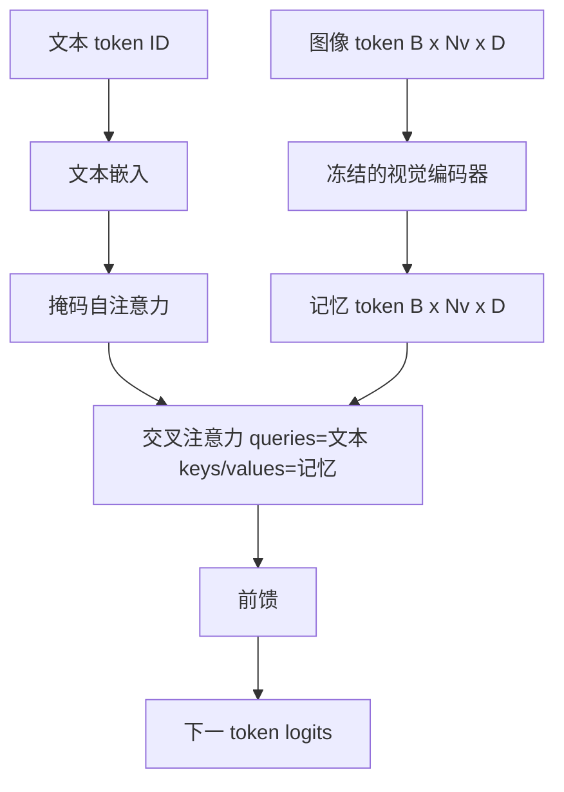
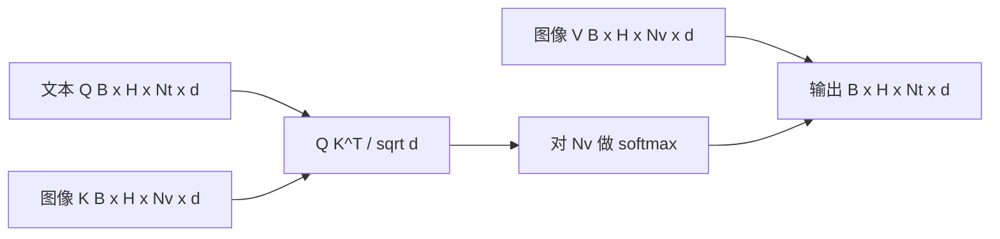

# 交叉注意力融合

> 投影层将一个图像向量与一个标语向量对齐。真正的视觉语言解码器需要每个文本 token 关注每个图像块 token，以使模型能够将每个词定位到某个区域。交叉注意力就是实现这种定位的机制。文本作为查询；视觉的键和值作为回答。本课程构建交叉注意力块、因果文本自注意力以及使两者保持合法的掩码形状。

**类型：** 构建
**语言：** Python
**前置知识：** 阶段 19 课程 30-37（轨道 B 基础）
**时间：** ~90 分钟

## 学习目标

- 实现多头交叉注意力，其中查询流是文本，键/值流是视觉。
- 组合一个解码器块：因果自注意力 + 交叉注意力 + 前馈。
- 正确处理掩码形状：自注意力使用因果掩码，交叉注意力无掩码。
- 使用批处理文本 token 和固定的图像 token 池运行前向传播。

## 问题

将图像 token 和文本 token 连接成一个序列是一种融合选项（早期融合，Chameleon 和 Emu3 采用的方式）。交叉注意力是另一种（后期融合，Flamingo 引入且此后每个 Flamingo 形状的解码器都复制的方式）。在后期融合中，文本解码器在纯文本 token 上运行，并通过每层的交叉注意力延伸到图像流。

后期融合有两个优势。首先，文本流保持干净，模型保留纯文本能力。其次，图像流对每幅图像计算一次，并对每个解码步骤复用，因此即使对于长标语，生成成本也很低。代价是每个块多一个注意力子层。

## 概念





### 掩码形状

解码器块内的两种注意力需要不同的掩码：

| 注意力 | 查询长度 | 键长度 | 掩码 | 原因 |
|-----------|--------------|------------|------|-----|
| 自注意力 | `Nt`（文本） | `Nt`（文本） | 因果：下三角 `(Nt, Nt)` | 自回归时文本 token 不能向前看 |
| 交叉注意力 | `Nt`（文本） | `Nv`（视觉） | 无掩码 | 每个文本位置可以看到整个图像 |

本课程包含一个形状验证函数，使混淆两者的错误以 `ValueError` 形式呈现，而不是静默破坏损失曲线。

### 为什么交叉注意力没有掩码

图像在任何文本生成之前已被完全观测。标语的 token `t` 可以关注图像的任何图像块；图像块之间没有时间顺序。一些 Flamingo 变体在交错多个图像和文本片段时添加了每个样本的掩码模式，但对于单图像加标语，交叉注意力看到一切。

### 键/值缓存

图像的键和值在解码开始时计算一次，并保存在缓存中。每个新的文本 token 使用缓存而无需重新计算。这就是推理时字幕生成速度快的原因：重的 ViT 运行一次；交叉注意力为每一步复用其键和值。本课程暴露了缓存并测试了缓存命中路径。

### 块组合

一个解码器块依次执行：Pre-LN -> 自注意力 -> 残差 -> Pre-LN -> 交叉注意力 -> 残差 -> Pre-LN -> 前馈 -> 残差。三个子层，每个都有自己的 LayerNorm。Flamingo 论文在交叉注意力上添加了一个可学习门控，使模型可以选择退出图像路径（但需要训练时稳定性的成本）；规范基线（此处使用）没有门控。

```python
class DecoderBlock:
  def forward(self, text_tokens, image_tokens, text_mask, cross_mask):
      text_tokens = text_tokens + self.self_attn(self.ln1(text_tokens),
                                                 mask=text_mask)
      text_tokens = text_tokens + self.cross_attn(self.ln2(text_tokens),
                                                  image_tokens,
                                                  mask=cross_mask)
      text_tokens = text_tokens + self.ffn(self.ln3(text_tokens))
      return text_tokens
```

## 构建它

`code/main.py` 实现了：

- `CrossAttention(hidden, heads)`，多头交叉注意力，具有独立的 `q` 和 `kv` 投影。
- `CausalSelfAttention(hidden, heads)`，标准解码器中的掩码自注意力。
- `DecoderBlock`，组合三个子层及 Pre-LN 残差。
- `VisionLanguageDecoder`，四层解码器，由模拟视觉编码器输出和小型文本嵌入表提供输入。
- `causal_mask(length)` 返回一个 `(length, length)` 的下三角布尔张量。
- 一个演示，输入批次为两个长度为 10 的文本序列，图像记忆长度为 197，打印输出形状、自注意力掩码形状和每个位置的交叉注意力输出范数。

运行它：

```bash
python3 code/main.py
```

输出：解码器产生一个 `(2, 10, text_vocab)` 的 logits 张量。掩码形状为 `(10, 10)`。KV 缓存复用检查确认缓存路径与未缓存路径产生相同的 logits。

## 使用它

交叉注意力出现在两个生产家族中：

- **Flamingo 和 IDEFICS。** 每 K 个语言模型块插入一个交叉注意力子层，使用冻结的 LM。视觉语言适配器就是交叉注意力块及其门控。
- **BLIP-2。** Q-Former 使用从一组固定的 32 个查询 token 到图像特征的交叉注意力，然后将查询投影到 LM 嵌入空间。

本课程中块的形状直接映射到两者。掩码规范（自注意力因果，交叉注意力无掩码）是相同的。

## 测试

`code/test_main.py` 涵盖：

- 因果掩码是下三角的，且匹配期望的布尔形状
- 交叉注意力输出形状为 `(B, Nt, hidden)`，与键长度无关
- KV 缓存路径与未缓存路径在浮点容差内匹配
- 文本和图像流之间的形状不匹配引发清晰的 `ValueError`
- 完整的解码器前向传播产生正确的批次和序列形状

运行它们：

```bash
python3 -m unittest code/test_main.py
```

## 练习

1. 在交叉注意力残差上添加一个可学习 tanh 门控（Flamingo 技巧），并验证训练从接近零的初始门控值收敛。门控从 0 开始；模型在混合图像流之前先恢复纯文本行为。

2. 实现交错注意力，其中同一个解码器消费多个图像加多个文本片段。构建每个样本的交叉注意力掩码，阻止文本片段 2 关注图像 1。

3. 在 `Nt=64, Nv=576`（24x24 网格，更高分辨率）下对交叉注意力与自注意力层进行性能分析。交叉注意力成本为 `Nt * Nv`，在高图像分辨率下占主导。

4. 在交叉注意力图上添加查询侧 dropout，并在演示中测量字幕多样性（交叉图中的 dropout 增加字幕样本方差）。

5. 将交叉注意力层替换为 Q-Former 风格的注意力块，其中固定的 32 token 查询池每层关注图像特征一次。

## 关键术语

| 术语 | 含义 |
|------|---------------|
| 后期融合（Late fusion） | 文本和视觉保持在独立流中；交叉注意力在每个块处桥接它们 |
| 交叉注意力（Cross-attention） | Q 来自一个流，K 和 V 来自另一个流 |
| 因果掩码（Causal mask） | 阻止自回归时向前看的下三角布尔掩码 |
| KV 缓存 | 图像键和值存储一次，为每个解码步骤复用 |
| 记忆 token（Memory tokens） | 解码器访问的冻结图像 token |

## 延伸阅读

- Flamingo（2022）了解带门控交叉注意力的规范后期融合设计。
- BLIP-2（2023）了解 Q-Former，它是一种交叉注意力块，以可学习查询池的形式呈现。
- IDEFICS（2023）了解 Flamingo 配方的开源复现。
