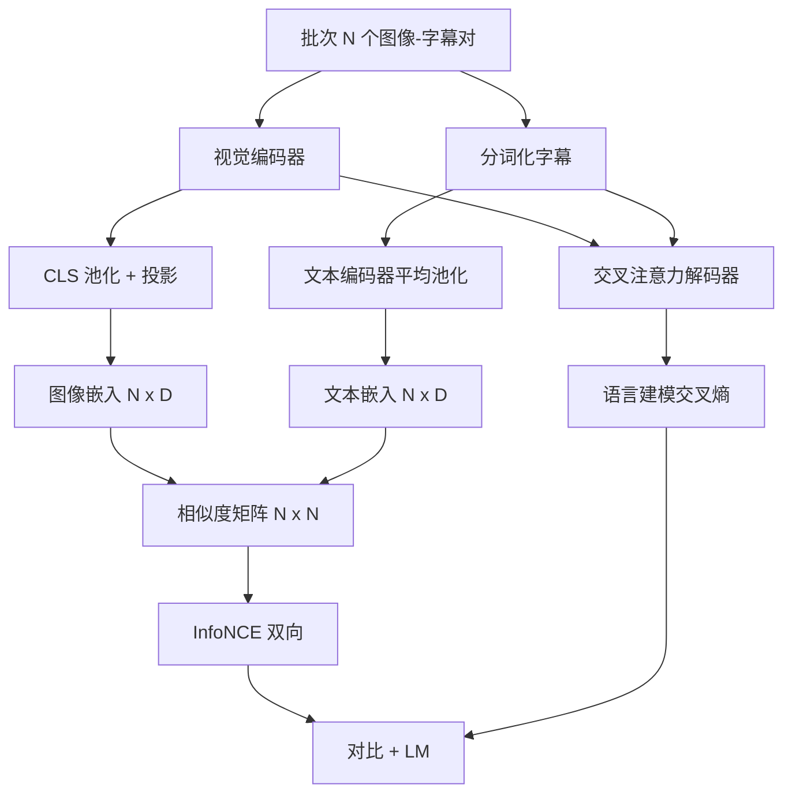

# 视觉语言预训练

> 编码器、投影和解码器已经连接起来。现在一起训练它们。两个目标驱动学习：一个对比图像-文本损失（InfoNCE），将匹配对在联合嵌入空间中拉近；以及一个语言建模损失，要求解码器为每张图像生成字幕。两者结合，教会网络既能为字幕找到正确的图像，也能为图像编写字幕。

**类型：** 构建
**语言：** Python
**前置知识：** 阶段 19 课程 30-37（轨道 B 基础）
**时间：** ~90 分钟

## 学习目标

- 在图像-标签对批次上实现 InfoNCE 对比损失。
- 将对比损失与自回归语言建模损失组合。
- 合成为一个包含 200 对模拟图像-字幕的语料库，无需下载真实数据集。
- 运行一个 50 步的演示训练循环，观察两个损失同时下降。

## 问题

一个视觉语言模型需要两种技能。它必须能够排序：给定一段字幕，在众多图像中找到正确的那个。它必须能够生成：给定一幅图像，编写一段字幕。仅训练一种技能只能得到半个系统。CLIP 擅长排序但无法生成字幕。GPT-4V 可以生成字幕但使用单独的检索头进行排序。多目标预训练一次完成两者。

InfoNCE 处理排序部分。对于 N 对批次，模型将 N 个匹配对视为正例，将 `N^2 - N` 个不匹配对视为负例，然后在生成的 `(N, N)` 相似度矩阵上运行交叉熵损失。LM 损失处理生成部分：以图像为条件的标准下一个 token 预测。两个损失都是可微的，可以共享编码器、投影器和解码器的权重。

## 概念



### InfoNCE 一段话概括

将 N 个图像嵌入作为行堆叠，N 个文本嵌入也作为行堆叠。对两者做 L2 归一化。计算 `N x N` 矩阵 `S = I T^T / tau`，其中 `tau` 是一个可学习的温度。对角线上的条目是匹配对；非对角线条目是负例。以目标 `argmax` 沿对角线向下应用交叉熵：第 `i` 行的最高条目应在第 `i` 列。沿着列对称地做同样的操作。总和是两者的平均值。这就是八行代码的 CLIP 损失。

### 温度很重要

温度 `tau` 控制 softmax 的尖锐程度。太小（例如 `tau = 0.01`）时梯度仅来自最难的负例，训练噪声大。太大时 softmax 变平，梯度消失。CLIP 将 `tau` 作为参数学习；本演示也是如此。

### 语言建模损失

解码器通过交叉注意力消费图像记忆 token，并在每个位置预测下一个文本 token。损失是标准交叉熵，以 next-position 为目标。填充位置被屏蔽在损失之外。

### 组合损失

`total = contrastive + lm_weight * lm`，其中 `lm_weight` 是一个标量（通常为 1.0）。两个损失共享进入编码器和投影的梯度；只有解码器接收 LM 损失梯度。这是 CoCa、BLIP 和 SigLIP 风格模型使用的多任务配方，各有不同的权重。

| 组件 | 损失面 | 影响范围 |
|-----------|--------------|---------|
| InfoNCE | 联合空间中的配对排序 | 编码器 + 投影 + 文本头 |
| LM | 以图像为条件的 token 预测 | 编码器 + 投影 + 解码器 |
| 组合 | 多任务 | 整个堆栈 |

### 为什么 50 步对演示来说就足够了

模拟语料库是一个包含随机图像和随机字幕 ID 的合成 200 对集合。在 50 步 SGD（批次大小 16）后，两个损失都有明显下降，即使绝对值仍高于真实数据模型能达到的值。演示的目的是确认梯度管道端到端工作，以及添加 LM 损失不会使对比目标失稳。

## 构建它

`code/main.py` 实现了：

- `MultimodalModel`，组合一个小型 ViT 编码器、MLP 投影器、一个小型文本侧编码器（嵌入 ID 的平均池化），以及来自课程 61 的交叉注意力解码器。
- `info_nce_loss(image_emb, text_emb, temperature)`，双向 CLIP 风格对比损失。
- `lm_loss(logits, target_ids, padding_id)`，掩码下一个 token 交叉熵。
- `make_mock_corpus(seed, n_pairs)`，返回 200 个确定性的（图像，caption_ids）对。
- 一个训练循环，运行 50 步，批次大小 16，Adam 优化器，以及一个可学习的 log-temperature 参数。每 5 步打印两个损失。

运行它：

```bash
python3 code/main.py
```

输出：对比损失从约 `ln(16) = 2.77` 下降到约 2.4；LM 损失从随机均匀基线 `ln(512) ≈ 6.24` 下降到约 4.7。两者都证明梯度连接正确。真实模型训练数百万步；动态过程是相同的。

## 使用它

这是以下模型中使用相同损失配方的地方：

- **CLIP（2021）。** 仅图像-文本对比，带有单独的冻结编码器字幕探针。
- **CoCa（2022）。** 图像-文本对比加图像字幕 LM 损失在同一个模型中。本课程构建的确切模式。
- **BLIP（2022）和 BLIP-2。** 对比加 LM 加图像-文本匹配头。三个损失组合。
- **SigLIP（2023）。** 将 InfoNCE 替换为 sigmoid 对损失；相同的对比角色，不同的函数形式。
- **LLaVA 家族。** 两阶段训练，阶段一是对齐（在冻结 LM 上的余弦损失），阶段二添加 LM 损失并解冻 LM。课程 60 对应阶段一；本课程对应阶段二。

## 测试

`code/test_main.py` 涵盖：

- InfoNCE 损失在图像/文本行之间是对称的
- 当相似度矩阵是对角线为大正数的完美对角矩阵时，InfoNCE 返回 0
- LM 损失正确屏蔽填充位置
- 模型前向传播同时产生两个损失而无错误
- 5 步训练循环减少组合损失

运行它们：

```bash
python3 -m unittest code/test_main.py
```

## 练习

1. 将 InfoNCE 替换为 SigLIP 风格的 sigmoid 对损失，并在模拟语料库上比较收敛速度。

2. 添加困难负例挖掘步骤：每隔一个批次，从上一个批次中选择最困难的非对角线对并附加它。训练并检查对比损失是否下降更快。

3. 在联合嵌入之上添加一个图像-文本匹配二分类头（真/假：是否匹配？）作为第三个损失，复现 BLIP 的三头设置。

4. 将模拟语料库替换为从马尔可夫链（其转移矩阵以图像哈希为条件）中抽取的字幕 ID 序列。字幕损失应该下降更多，因为存在实际可学习的信号。

5. 分别使用 `lm_weight = 0` 和 `lm_weight = 1` 训练同一模型。比较对比损失；LM 损失不应回归排序目标。

## 关键术语

| 术语 | 含义 |
|------|---------------|
| InfoNCE | 噪声对比估计：对相似度矩阵的交叉熵 |
| 温度（Temperature） | 控制对比 softmax 尖锐程度的标量 |
| 困难负例（Hard negative） | 模型觉得困惑的非对角线对，对采样有用 |
| LM 损失 | 字幕侧标准下一个 token 交叉熵 |
| 联合嵌入空间（Joint embedding space） | 投影后图像和文本向量所在的共享空间 |

## 延伸阅读

- CLIP 论文了解原始的对比配方。
- CoCa 论文了解对比加字幕生成在同一个模型中。
- SigLIP 论文了解 sigmoid 对损失变体及其更好的扩展性。
