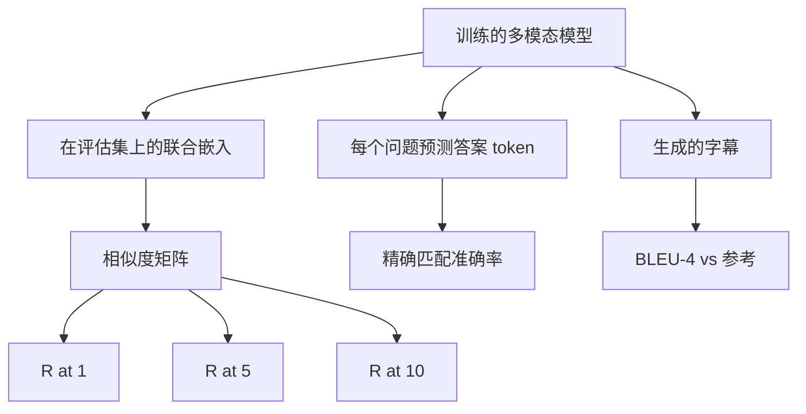

# 多模态评估

> 训练只是循环的一半。另一半是测量。本课程从原语构建三个评估面：图像-字幕检索报告为 R@1、R@5、R@10；视觉问答报告为精确匹配准确率；图像字幕报告为 BLEU-4。每个指标都是模型输出上的一个函数，以及一个在几秒钟内运行的合成评估套件。

**类型：** 构建
**语言：** Python
**前置知识：** 阶段 19 课程 58-62（轨道 E 基础：编码器、Transformer、投影、交叉注意力融合、预训练）
**时间：** ~90 分钟

## 学习目标

- 从图像和字幕嵌入之间的相似度矩阵计算 Recall@K。
- 从将（图像，问题）对映射到固定答案词汇表的模型计算精确匹配 VQA 准确率。
- 在不使用任何外部库的情况下，从生成的和参考的 token 序列计算 BLEU-4。
- 针对构建在课程 62 训练模型之上的合成评估套件运行所有三个评估。

## 问题

一个常见的诱惑是在训练损失趋于平稳时宣布多模态模型完成。训练损失衡量对训练分布的拟合程度；它并不能衡量模型是否能在留出批次中对配对排序、回答问题或编写人类可接受的字幕。三个评估面是标准的：

- **检索（R@1、R@5、R@10）。** 为查询字幕构建联合嵌入；按余弦相似度排序评估池中的每张图像；报告匹配图像是否在前 1、前 5、前 10 中。对称形式（图像到文本）以相同方式运行。
- **视觉问答（精确匹配）。** 给定（图像，问题），模型输出一个答案 token。精确匹配是每个样本一位：预测答案是否等于参考答案？在评估集上取平均。
- **字幕（BLEU-4）。** 生成一段字幕。计算 1-gram 到 4-gram 精确率相对于参考字幕的几何平均，带简短惩罚。多参考是标准形式（一张图像，多个参考字幕）。

每个指标都是一个精简的函数。本课程在代码中构建所有指标，使数学具体化且评估表面在你的控制之下。真实的基准套件（MS-COCO、VQA v2、GQA、OK-VQA）接入相同的函数形态。

## 概念



### 从相似度矩阵计算 Recall@K

构建图像和字幕嵌入之间的 `(N, N)` 余弦相似度矩阵。对于每一行，按降序排列列。Recall@K 是对角线列索引位于前 K 位的行所占的比例。对称 Recall@K（字幕到图像）在转置矩阵上计算。两个数字都被报告。对于 N=100 的评估，R@1 = 0.6 意味着 100 个字幕中有 60 个检索到了它们正确的图像作为最佳匹配。

### VQA 精确匹配

对于每个（图像，问题，答案），编码图像，嵌入问题，通过解码器融合，并读出下一个 token。预测的 token ID 与参考 ID 比较；相等则正确。在评估集上取平均。真实的 VQA 数据集每个问题附带多个人工标注的答案，并使用软准确率公式（如果至少 3/10 的标注者同意则为 1.0，否则按比例缩放）；本课程为清晰起见使用单答案精确匹配。

### BLEU-4

```text
BLEU-4 = BP * exp(mean(log p1, log p2, log p3, log p4))
```

其中 `p_n` 是修正的 n-gram 精确率（出现在任何参考中的生成 n-gram 的剪辑计数，除以生成的总 n-gram 数），`BP` 是简短惩罚：

```text
BP = 1                如果生成长度 > 参考长度
   = exp(1 - r/g)     否则，其中 r 是参考长度，g 是生成长度
```

小样本中某些 `p_n` 为零时需要平滑处理。实现使用 Chen 和 Cherry 的"方法 1"（对于任何零计数，分子和分母都加 1），这是低计数情况下最安全的默认值。

### 合成评估套件

一个 50 样本的评估套件在内存中构建，使用与课程 62 相同的模拟语料库模式，但使用留出种子。套件包含三个列表：

- `pairs`：50 个（图像，captions_ids）对，用于检索。
- `vqa`：50 个（图像，question_ids，answer_id）三元组。
- `caps`：50 个（图像，[reference_caption_ids, ...]）条目，每张图像最多 3 个参考。

套件从种子确定性地生成，并从训练语料库中留出，因此指标在模型从未见过的数据上计算。将套件持久化为 JSON 留作练习（见下文）。

| 指标 | 范围 | 随机基线（N=50） |
|--------|-------|------------------------|
| R@1 | 0 到 1 | 0.02 (1 / N) |
| R@5 | 0 到 1 | 0.10 |
| R@10 | 0 到 1 | 0.20 |
| VQA EM | 0 到 1 | 1 / vocab |
| BLEU-4 | 0 到 1 | 小但非零 |

对于在合成数据上运行 50 步的训练，不期望指标很高；它们期望高于随机基线，这是演示检查的内容。

## 构建它

`code/main.py` 实现了：

- `recall_at_k(sim_matrix, k)`，返回两个方向的 `[0, 1]` 浮点数。
- `vqa_exact_match(predictions, references)`，返回 `int` 相等性的均值。
- `bleu4(generated, references, smoothing=True)`，支持多参考。
- `build_eval_suite(seed, n_samples, vocab_size, max_len)`，返回三个确定性的评估列表。
- `evaluate(model, suite)`，运行所有三个指标并返回一个数字 `dict`。
- 一个演示，加载一个刚初始化的课程 62 多模态模型，进行评估，然后训练 50 步并再次评估，打印训练前后的指标。

运行它：

```bash
python3 code/main.py
```

输出：训练前/后指标表显示检索从接近随机改进到模型的学习信号，VQA 改进到高于随机水平，BLEU-4 也有所改善（合成结构足以带来 4-gram 精确率的提升）。

## 使用它

每个指标直接映射到一个生产基准：

- **检索。** MS-COCO 5K val、Flickr30K、ImageNet zero-shot 都是同一相似度矩阵上的 R@K 问题。将合成评估替换为真实文件，函数签名不变。
- **VQA。** VQA v2、GQA、OK-VQA 使用相同的精确匹配形态（VQA v2 使用软准确率而非单答案 EM）。
- **BLEU-4。** MS-COCO 字幕、NoCaps、Flickr30K 字幕都使用 BLEU-4 加上 CIDEr 和 METEOR。添加 CIDEr 只是一个函数的问题。

对于真实基准，将 `build_eval_suite` 替换为真实加载器，保留函数体。数学是与基准无关的。

## 测试

`code/test_main.py` 涵盖：

- recall@k 在完美恒等相似度矩阵上返回 1.0，在翻转矩阵上返回 0.0（k < N 时）
- recall@k 遵循 `k <= N` 的上界
- bleu4 在生成完全等于某个参考时返回 1.0
- bleu4 在词汇表不相交时返回 0.0
- vqa 精确匹配等于相等对的比例
- build_eval_suite 返回期望数量的对、vqa 项和字幕条目

运行它们：

```bash
python3 -m unittest code/test_main.py
```

## 练习

1. 在字幕指标中添加 CIDEr。CIDEr 在 n-gram 上使用 TF-IDF 加权，奖励信息量大的 token。

2. 实现软准确率 VQA：每个问题多个人类答案，准确率为 `min(human_count / 3, 1)`（如果任何匹配）。复现 VQA v2。

3. 添加 `bleu4` 的 NaN 安全变体，处理空的生成序列而不崩溃。

4. 在 R@K 旁边计算平均倒数排名（MRR）。MRR 对正确答案落在前 K 之外的位置敏感；R@K 对其是否落在前 K 之内敏感。

5. 在训练期间的五个检查点（步 0、10、20、30、40、50）运行评估并绘制学习曲线。确认指标轨迹跟踪损失轨迹。

## 关键术语

| 术语 | 含义 |
|------|---------------|
| R@K | 正确匹配落在前 K 结果中的查询比例 |
| 精确匹配（Exact match） | 最简单的 VQA 评分：预测答案等于参考 |
| BLEU-4 | 1 到 4-gram 精确率的几何平均，带简短惩罚 |
| 多参考（Multi-reference） | 字幕指标每张图像接受多个参考字幕 |
| 留出（Held-out） | 评估集从训练语料库不相交的种子中采样 |

## 延伸阅读

- VQA v2 论文了解软准确率公式和数据集统计。
- CIDEr 论文了解 TF-IDF 加权的 n-gram 字幕评估。
- BLEU 原始论文（Papineni 等人，2002）了解平滑变体。
- MS-COCO 字幕评估脚本了解规范的参考实现。
