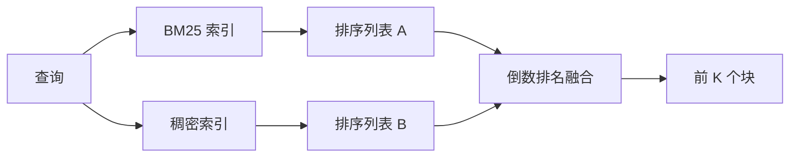

# BM25 与稠密嵌入的混合检索

> 词汇检索和语义检索在相反的查询分布上失败。使用倒数排名融合的混合检索不做插值，它投票——而且在每种查询类别上都获胜。

**类型：** 构建
**语言：** Python
**前置知识：** 阶段 11 课程 04（嵌入）、06（RAG）；阶段 19 轨道 B 基础（课程 20-29）；阶段 19 课程 64（分块策略）
**时间：** ~90 分钟

## 学习目标
- 使用 Robertson 和 Sparck Jones 公式从头实现 BM25，包含字段加权、文档长度归一化和可调的 k1 和 b。
- 在确定性模拟嵌入之上构建稠密检索器，使循环可离线运行。
- 精确按照 Cormack、Clarke 和 Buettcher 2009 年发表的方式实现倒数排名融合，并解释它为什么主导分数加权插值。
- 调节 RRF 的 k 常数和每模态权重，并在小型夹具语料库上读取权衡。

## 问题

当查询携带语料库中包含的逐字文字标识符时，词汇搜索获胜。一个针对 `AbortMultipartOnFail` 的查询通过 BM25 在微秒内返回正确的 Go 函数。相同的查询，经嵌入后，位于三个相似度聚类的边界，稠密检索器将错误的文件排在第一位。

当查询被意译而偏离语料库的文字 token 时，稠密搜索获胜。一个用户问"我们如何处理取消的上传"从未输入单词 abort 或 multipart。BM25 返回"上传大文件"的文档块，因为该页面包含单词 uploads。稠密检索找到其摘要提到取消的中止函数。

两者之间的选择不是静态的。查询分布是变量。一个生产 RAG 系统从同一个端点处理两类查询，因此检索必须同时处理两者。这就是混合检索。合并步骤是必须正确的那部分。

## 概念



### BM25 一段话概括

BM25 通过对查询词求和来评分查询-文档对：一个逆文档频率因子乘以一个饱和的词频因子，包括长度归一化校正。两个旋钮。`k1` 控制词频饱和度；默认值 1.5 是已发表的推荐值，没有基准测试你不应改动它。`b` 控制文档长度的影响程度；默认值 0.75 表示较长的文档受惩罚，但不是线性惩罚。

IDF 公式使用平滑的 Robertson 和 Sparck Jones 定义：`log((N - df + 0.5) / (df + 0.5) + 1)`。log 内部的加一使得当一个词出现在超过一半的语料库中时 IDF 仍为正数。这在停用词技术上罕见的小型语料库中很重要。

字段加权让你告诉 BM25 符号名称上的匹配比正文中的匹配更重要。实现是在索引时对词计数施加乘数，而不是在评分时。这使数学保持不变，避免了每个字段单独计分。

### 稠密检索一段话概括

用嵌入模型将每个块嵌入到固定维度的向量中。在查询时，嵌入查询，按余弦相似度对每个块排序，返回前 k 个。模型是决定质量的变量。检索算法本身只有两行：点积和排序。

本课程使用基于确定性哈希的嵌入，这样你可以在没有网络调用的情况下读取融合数学。哈希将 token 键控的偏移量求和到一个 96 维向量中并做归一化。余弦排名在多次运行中是确定性的，这正是测试套件所需要的。

### 倒数排名融合，已发表公式

两个排序列表。对于出现在任一个列表中的每个候选，累加其倒数排名贡献。2009 年的论文使用 `1 / (k + rank)`，默认 k 等于 60。按总分排序。这就是全部算法。

已发表的常数 k = 60 并非随意。k = 60 时，排名 1 的贡献是 1 / 61，排名 10 的贡献是 1 / 70。贡献衰减缓慢，因此深度候选项仍然参与投票。较小的 k 使顶部结果占主导。较大的 k 使贡献曲线更平坦。

我们的实现中有两个可调节的旋钮。`k` 常数。一对每模态权重，这样当你事先有证据表明某种模态在语料库上更好时，可以提升 BM25 或稠密。将排名贡献乘以权重是最简单的有原则的实现；它保持了排名衰减的形状并保持无量纲。

### 为什么融合优于分数加权插值

BM25 分数是无界且依赖于语料库的。余弦相似度是有界的（-1 到 1）。线性组合 `alpha * bm25 + (1 - alpha) * cosine` 需要针对每个语料库调节 alpha，并且每次重新索引都会失效。基于排名的融合不会。两个排名在模态之间是可比较的。已发表的 RRF 基线自 2010 年以来在每项公开的 TREC 赛道中都击败了分数插值。

这和你在 Vespa 和 Weaviate 文档中听到的关于 RankFusion 与 RRF 的争论是一样的。他们得出了相同的结论：除非你有非常强的证据进行分数插值，否则坚持基于排名的方法。

## 构建它

`code/main.py` 实现了：

- `tokenize(text)` - 一个快速的正则表达式分词器。
- `BM25Index` - 字段加权，带有 `add` 和 `search` 以及可调的 k1、b。
- `mock_embed`、`DenseIndex` - 与课程 64 相同的确定性嵌入，使块具有可比性。
- `rrf(rankings, k, weights)` - 已发表的带多模态权重的融合。
- `HybridRetriever` - 结合 BM25 和稠密检索。
- 一个演示 `main()`，加载小型夹具语料库，运行针对每个检索器优势和劣势的三个查询，并打印每种模态产生的排名以及融合后的列表。

运行它：

```bash
python3 code/main.py
```

并排阅读演示输出。文字标识符查询在 BM25 排名 1，稠密排名 4，RRF 排名 1。意译查询在 BM25 排名 6，稠密排名 1，RRF 排名 1。模糊查询在 BM25 排名 3，稠密排名 3，RRF 排名 1。融合不是平局打破器；它是在每种查询类别上都获胜的系统。

## 调节旋钮

| 旋钮 | 默认 | 何时调高 | 何时调低 |
|------|---------|----------------|------------------|
| BM25 k1 | 1.5 | 词在文档中重复且你希望词频更重要 | 文档短且词重复是噪声 |
| BM25 b | 0.75 | 长文档确实每字信息更少 | 文档长度与主题无关 |
| RRF k | 60 | 深度候选项应继续参与投票 | 顶部结果应占主导 |
| BM25 权重 | 1.0 | 你的语料库包含文字标识符且查询匹配它们 | 你的查询是用户意译的 |
| 稠密权重 | 1.0 | 查询是意译的 | 查询是文字的 |

通过重新运行课程 68 的评估框架在你的留出查询集上进行调节，而不是凭直觉。

## 演示将隐藏的失败模式

**词汇表外 token。** BM25 的 IDF 从语料库计算，因此仅出现在查询中的词贡献为零。稠密嵌入为同一词幻觉出一个向量。在语料库外的标识符上，稠密模态返回看似合理但错误的相关项。融合吸收了这一点，因为 BM25 返回空值，排名贡献消失，但前提是你按文档（而非按块）去重。

**停用词主导。** BM25 针对单词"the"在语料库上产生均匀排名。在索引器中过滤停用词，或接受高 IDF 词自然主导。

**模态间相同内容。** 如果你的语料库足够小，BM25 的 top-1 也是稠密的 top-1，RRF 给你相同的 top-1 和相同的相邻项。这是正确的行为，不是失败，但它使融合看起来不可见。在你的评估中添加一个对抗性查询对来验证融合实际上在起作用。

## 使用它

生产模式：

- 在进程内索引 BM25；瓶颈是词频字典，而非向量。
- 在单独的存储中索引稠密向量（本课程中使用扁平列表；生产中使用 HNSW）。
- 并行运行两个查询；融合是对并集的常数时间合并。
- 持久化每个检索命中的模态信息，以便下游重排序器可以看到哪个模态为其投票。

## 投入生产

课程 66 使用交叉编码器对本课程的融合 top-k 进行重排序。课程 68 使用精确率、召回率、MRR 和 nDCG 评估整个管道。本课程中的混合检索器是课程 69 中端到端系统的第一阶段。

## 练习

1. 将 `mock_embed` 替换为你提供商的真实模型。重新运行演示并报告在意译查询上仅稠密排序的变化。

2. 添加第三种模态：单独索引的块摘要，作为第三个排序列表融合。测量收益。

3. 扫描 RRF k 值 10、30、60、100、200。绘制来自课程 68 的 recall@k 曲线。报告曲线上峰值在你的语料库上的 k 值。

4. 正确实现 BM25F（每字段长度归一化而非乘数技巧）并在符号匹配最重要的语料库上进行比较。

## 关键术语

| 术语 | 人们怎么说 | 实际含义 |
|------|-----------------|------------------------|
| BM25 | "词汇搜索" | 带 idf x 饱和 tf x 长度归一化的概率排名 |
| RRF | "排名融合" | 跨排序列表的 1 / (k + rank) 之和；默认 k = 60 |
| k1 | "TF 饱和度" | 控制重复词停止增加分数的速度 |
| b | "长度惩罚" | 0 表示忽略文档长度，1 表示完全归一化 |
| 字段加权（Field weighting） | "符号提升" | 在索引时重复 token 以提升该字段中的匹配 |
| 基于排名与基于分数的融合 | "为什么 RRF 优于线性" | 排名在模态间可比；分数不可比 |

## 延伸阅读

- Cormack, Clarke, Buettcher, "Reciprocal Rank Fusion outperforms Condorcet and individual rank learning methods", SIGIR 2009
- Robertson, Walker, Beaulieu, Gatford, Payne, "Okapi at TREC-3" (原始 BM25 论文)
- [Vespa: Hybrid Retrieval with BM25 and Embeddings](https://docs.vespa.ai/en/tutorials/hybrid-search.html)
- [Weaviate: Hybrid Search](https://weaviate.io/developers/weaviate/search/hybrid)
- 阶段 11 课程 06 - RAG 基础
- 阶段 19 课程 64 - 此处索引其输出的分块器
- 阶段 19 课程 66 - 消费融合 top-k 的交叉编码器重排序器
