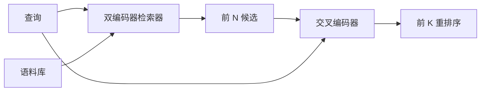

# 交叉编码器重排序器

> 双编码器独立嵌入查询和文档。交叉编码器将它们拼接并同时读取两者。交叉编码器是最智能的读取器，也是最慢的。作为双编码器 top-k 上的第二阶段使用，它物有所值。

**类型：** 构建
**语言：** Python
**前置知识：** 阶段 11 课程 06（RAG），阶段 11 课程 07（高级 RAG）；阶段 19 轨道 B 基础（课程 20-29）；阶段 19 课程 65（喂入本阶段的混合检索）
**时间：** ~90 分钟

## 学习目标
- 通过输入形状、参数量和每查询成本区分双编码器检索器和交叉编码器重排序器。
- 从头实现一个小型交叉编码器作为一个 Transformer 块，消费打包的（query，document）序列并输出单个相关性标量。
- 连接一个两阶段检索-然后-重排序管道：使用廉价检索器检索 top-N，用交叉编码器将 N 重排序为 top-K，返回 K。
- 在小型夹具语料库上测量延迟与质量的权衡，并为给定的延迟预算选择正确的 N。

## 问题

双编码器将查询和文档映射到同一个向量空间并按余弦排序。两个编码从未互相看见对方。模型必须将关于文档的一切有用信息压缩到一个向量中，对查询视而不见。这很快——索引时每个文档一个嵌入，查询时每个查询一个嵌入——而且是唯一能在语料库规模上排序的方式。

代价是精确度。两篇具有相同整体主题的文档可以有几乎相同的嵌入，即使其中一篇回答了查询而另一篇没有。双编码器无法区分它们。

交叉编码器通过一起读取查询和文档来解决这个问题。模型接收 `[query] [SEP] [document]` 作为单一序列，在连接上运行完整注意力，产生一个相关性标量。文档的每个 token 都可以关注查询的每个 token。模型在完整上下文中决定分数。

代价是吞吐量。双编码器嵌入一次即可永远查询，而交叉编码器每（查询，文档）对运行一次。对于一个 1000 万文档的语料库，每个查询就是 1000 万次前向传播。在请求预算中无法运行。

解决方案是分阶段。使用双编码器检索 top-N。使用交叉编码器将 N 重排序为 top-K。N 很小（50 到 200），交叉编码器的质量提升集中在关键位置。总延迟保持在请求预算内。总质量是交叉编码器的质量，上限为双编码器在 N 处的召回率。

## 概念



### 交叉编码器的输入形状

标准打包是 `[CLS] query_tokens [SEP] document_tokens [SEP]`。CLS 位置的输出被送入一个输出相关性标量的线性头。一些实现使用平均池化而非 CLS；差异很小。关键是模型每对产生一个数字。

一个 22M 参数的交叉编码器（已发布的 `ms-marco-MiniLM-L-6-v2` 权重级别）是典型的生产选择。较小的模型损失质量的速度快于它们节省延迟的速度。较大的模型（例如 568M 参数的 `bge-reranker-v2-m3`）保留用于离线重排序或 K 较小的首页重排序。

### 为什么本课程训练一个小型模型

真正的交叉编码器是一个微调的编码器 Transformer。在生产中你加载一个检查点并运行它。在本课程中，目标是展示模型的形态和延迟-质量曲线的形态，而不是训练最先进的排序器。因此我们构建一个包含一个 Transformer 块、多头注意力（默认 4 头）和一个回归头的小型 `nn.Module`。它从种子确定性初始化，使演示无需磁盘上的权重即可复现。

玩具模型从夹具语料库中学习了正确的形态：相关的查询-文档对具有比不相关对更高的预测分数。端到端管道重排序双编码器的输出，重排序的 top-k 与黄金标签相关。

### 延迟与质量

两阶段管道有一个可调参数：N。在留出查询集上从 5 扫描到 100，你就能得到曲线。

| N | 阶段 2 的 Recall@1 | 每查询交叉编码器前向传播次数 | 延迟 |
|---|--------------------|---------------------------------------|---------|
| 5 | 0.62 | 5 | 低 |
| 20 | 0.81 | 20 | 中 |
| 50 | 0.86 | 50 | 高 |
| 100 | 0.86 | 100 | 非常高 |

上述数字是形状的示意，而非来自该夹具的测量。形状是真实的。在 20 到 50 个候选之间总有一个拐点，重排序的提升在此饱和。过了拐点你就在白花钱。

从评估曲线加上延迟预算中选择 N。交叉编码器不能将召回率提升到超过双编码器在 N 处的召回率，因此低 N 限制了质量，而不仅仅是延迟。

## 构建它

`code/main.py` 实现了：

- `CrossEncoder` - 一个小型 `torch.nn.Module`：token 嵌入、一个带多头注意力和前馈的 Transformer 块、产生一个标量的平均池化头。
- `tokenize_pair(query, document)` - 将两个字符串打包成一个带有标记边界的类型 ID 序列，确定性和 stdlib 实现。
- `train_tiny(pairs)` - 在手标注的（query，document，relevance）三元组列表上的一次监督训练，使模型在夹具上产生合理的分数。
- `rerank(query, candidates, top_k)` - 生产接口。
- `pipeline(query, retriever, top_n, top_k)` - 两阶段流程。
- 一个演示 `main()`，加载课程 65 模式的语料库，检索 top-N，重排序为 top-K，并排打印两个列表，并报告每个阶段的延迟。

运行它：

```bash
python3 code/main.py
```

输出显示双编码器的 top-N、交叉编码器的 top-K 和时间总结。交叉编码器每次调用耗时更长但不在完整语料库上运行。两阶段总延迟保持在请求预算内，同时选出双编码器排在第二或第三的答案。

## 演示将隐藏的失败模式

**交叉编码器不对称。** `rerank(q, d)` 和 `rerank(d, q)` 是不同分数。始终先喂查询。如果你不小心交换，召回率会崩溃。

**N 太低无法暴露问题。** 如果你设置 N = K，交叉编码器无法重新排序；它只能重新加权。提升看起来为零。选择至少 K 三倍的 N。

**训练数据泄漏到评估中。** 如果手标注的训练对包括评估查询，重排序看起来神奇。严格分离训练和评估，即使在夹具上也是如此。

**生产权重是密集的。** 一个 22M 参数的交叉编码器在 float32 下为 88MB。在承诺亚 100ms p95 之前规划好模型服务器的内存。

**批处理很重要。** 真正的交叉编码器在一个批次中运行 N 个候选。本课程在 `_batch_encode` 中这样做，它使用 `torch.tensor(...)` 构建批处理的 ID 和类型 ID 张量并运行一次前向传播。跳过批处理会使延迟乘以 N。

## 使用它

生产模式：

- 将双编码器、交叉编码器和 N 固定在一起。更改任何一个都会使评估无效。
- 按（query，document_id）哈希缓存重排序器的输出。相同查询针对稳定语料库重排序到相同顺序；缓存命中让你免费降低延迟。
- 记录排名 1 的交叉编码器分数。其 top-1 分数低于语料库特定阈值的查询是域外命中；将其作为"我不确定"呈现给 LLM。

## 投入生产

课程 68 端到端评估这个两阶段管道。课程 69 将此重排序器连接在课程 65 的混合检索器之后和答案生成器之前。重排序器是端到端系统的第二阶段。

## 练习

1. 将 N 从 5 扫描到 50 并绘制重排序输出的 recall@1。在此夹具上找到拐点。
2. 将交叉编码器训练十个 epoch 而非一个。测量每个 epoch 正负对之间的分数差距。
3. 将平均池化替换为 CLS token 头。在此夹具上比较收敛速度。
4. 添加第二个交叉编码器头，预测"此答案是否在文档中"的二分类标签。在推理时使用两个头：一个排序，一个设阈值。
5. 将确定性模拟双编码器替换为课程 65 中的那个，并链接两个阶段。测量 top-K 相对于仅双编码器的变化。

## 关键术语

| 术语 | 人们怎么说 | 实际含义 |
|------|-----------------|------------------------|
| 双编码器（Bi-encoder） | "向量检索器" | 独立编码查询和文档；余弦排序 |
| 交叉编码器（Cross-encoder） | "重排序器" | 联合编码（查询，文档）；输出一个相关性标量 |
| 两阶段管道（Two-stage pipeline） | "检索并重排序" | 廉价检索器返回 N，昂贵重排序器保留 K |
| N（候选预算） | "重排序池" | 交叉编码器每查询评分的候选数 |
| 平均池化头（Mean-pooling head） | "最后一层隐藏状态的平均" | 将编码器最后一层的输出平均为一个向量 |

## 延伸阅读

- Nogueira, Cho, "Passage Re-ranking with BERT", 2019 - 规范的交叉编码器排序器论文
- Reimers, Gurevych, "Sentence-BERT: Sentence Embeddings using Siamese BERT-Networks", 2019 - 关于双编码器与交叉编码器
- [SentenceTransformers Cross-Encoders 文档](https://www.sbert.net/examples/applications/cross-encoder/README.html)
- [BGE Reranker v2 模型卡](https://huggingface.co/BAAI/bge-reranker-v2-m3)
- 阶段 19 课程 65 - 喂入此重排序阶段的混合检索器
- 阶段 19 课程 68 - 衡量此重排序带来的提升的评估
