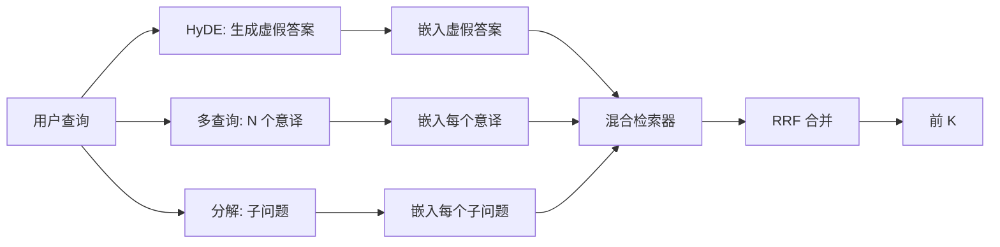

# 查询重写：HyDE、多查询与分解

> 用户输入的查询并非你的检索器想要的查询。重写在检索之前弥合差距，使索引看到更接近答案样子的内容。

**类型：** 构建
**语言：** Python
**前置知识：** 阶段 11 课程 04（嵌入）、06（RAG）；阶段 19 轨道 B 基础（课程 20-29）；阶段 19 课程 64 和 65
**时间：** ~90 分钟

## 学习目标
- 实现假设性文档嵌入（HyDE）：生成一个虚假答案，嵌入它，用该向量而非查询向量进行检索。
- 实现多查询扩展：将一个查询重写为 N 个意译版本，用每个版本检索，通过倒数排名融合合并并集。
- 实现查询分解：将复杂问题拆分为子问题，每个子问题检索，合并。
- 在夹具上头部比较三种重写器，并解释每种策略何时获胜。
- 连接一个产生确定性、基于夹具输出的模拟 LLM，使重写器循环离线运行。

## 问题

用户输入"我们的团队在上传失败且预算耗尽时做什么？"。语料库包含一个文档说"AbortMultipartOnFail 中止正在进行的 S3 分块上传并在上传失败时递减每桶重试预算"。查询和文档不共享名词短语。BM25 错过。双编码器将文档排在第三或第四，因为查询向量落在嵌入空间中偏爱关于已取消作业的文档（而非关于中止上传的文档）的区域。课程 66 的两阶段重排序如果答案在 top-N 中可以挽救它，但如果它甚至没有达到 top-N，重排序器永远不会看到它。

修复方法是在查询触及检索器之前重写它。2023 年的论文"Precise Zero-Shot Dense Retrieval without Relevance Labels"（Gao 等人）引入了 HyDE：让 LLM 写一个会回答查询的文档，嵌入该假设性文档，并使用其嵌入作为检索向量。假设性文档位于嵌入空间的正确区域，因为它以语料库的口吻书写。查询向量则不然。

两个相关技术与 HyDE 配合使用。多查询扩展（Microsoft 的 GraphRAG 使用的术语）生成查询的 N 个意译版本，用每个版本检索，然后合并。分解（在 2024 年 Stanford DSPy 工作中推广为"子查询分解"）将"我们的团队在上传失败且预算耗尽时做什么"拆分为两个问题："上传失败时会发生什么"和"重试预算耗尽时会发生什么"。两次检索，一个合并结果，答案的两部分都可触及。

本课程实现所有三种方法并在同一夹具语料库上运行它们。

## 概念



### HyDE 详解

HyDE 用 LLM 编写的假设性文档向量替换用户查询向量。提示很简短：

```
你是一位领域专家。请写一段能够回答下面问题的段落。
使用该领域文档会使用的相同词汇和措辞。
不要拒绝回答。不要说你不知道。

问题：{user_query}

段落：
```

LLM 的答案作为事实答案是不正确的，因为 LLM 不知道你的语料库。这没问题。检索器不关心事实正确性，只关心 token 分布。假设性段落包含单词"abort"、"multipart"、"bucket"、"budget"，因为关于此主题的文档段落会这么说。嵌入该段落。向量靠近真实段落。

在生产中，将假设性文档限制为两到三个句子。更长的假设性文档收集更多噪声。更短的则失去 HyDE 所需的词汇信号。

### 多查询扩展详解

生成用户查询的 N 个意译版本。最简单的提示：

```
用 {N} 种不同方式重写以下问题。
每个重写必须保留原始意图。
从 1 到 {N} 编号。不要添加解释。
```

为每个意译检索 top-k。用 RRF（与课程 65 相同的算法）合并 N 个排序列表。廉价、并行、确定性。

当用户的措辞是许多同等有效的提问方式之一，且任何重写本来可以更好地提问时，多查询获胜。当所有重写同样糟糕（因为原始措辞在同样的方式上糟糕）时，它失败。

### 分解详解

单次检索无法满足多面问题。分解要求 LLM 将问题拆分为子问题，系统为每个子问题检索。提示：

```
以下问题可能需要来自多个不同主题的信息。
将其分解为一系列子问题。每个子问题必须能独立回答。
如果问题已是原子性的，保持原样返回。

问题：{user_query}
```

为每个子问题检索。合并。分解是处理包含连词、多从句比较或两个无关主题的问题的正确工具。对于原子性问题则是错误的工具；分解器的工作是不创造虚假子问题，只返回单个问题。

### 为什么三者都存在

三者互补。HyDE 弥合查询-语料库的 token 差距。多查询覆盖意译方差。分解覆盖多主题查询。生产系统运行三者并根据查询选择策略（课程 69 的端到端系统显示了选择器）。

## 模拟 LLM

本课程离线运行。模拟 LLM 是一个以用户查询为键的小型查找表，加上对未见过的查询的回退方案。查找表包含：

- 对于每个夹具查询：一个编写的假设性段落、三个意译版本和一个分解。
- 对于未知查询：一个确定性转换：获取查询的内容词，通过同义词词典扩展它们，并返回结果。

重要的是模拟的形状而非数据。在生产中你将模拟替换为真实的模型调用。检索器不改变。

## 构建它

`code/main.py` 实现了：

- `MockLLM` - 上述确定性替代。
- `HyDERewriter` - 调用 LLM 编写假设性文档，返回 `RewriteResult` 以及假设性文本和检索器应使用的查询。
- `MultiQueryRewriter` - 调用 LLM 获取 N 个意译，返回查询列表。
- `DecomposeRewriter` - 调用 LLM 进行分解，返回子问题。
- `retrieve_with_rewriter` - 接收重写器和检索器，运行重写，融合结果。
- 一个演示，在夹具上运行三种重写器并打印哪种策略首先返回黄金答案文档。

检索器形状从课程 65（混合 BM25 + 稠密）复用。融合是相同的 RRF。唯一的新形状是重写器接口，它很小。

运行它：

```bash
python3 code/main.py
```

输出是每策略排名和最终摘要。HyDE 在措辞不匹配的查询上获胜。多查询在意译方差查询上获胜。分解在多主题查询上获胜。回退（无重写器）在三个查询中至少有一个失败。

## 演示将隐藏的失败模式

**HyDE 幻觉出错误的语料库特定标识符。** 模型发明了一个函数名。假设性文档在正确文档上的 BM25 分数崩溃，因为发明出的名字现在是一个不存于索引中的高权重 token。限制假设性文档的长度并在融合中降低 BM25 的权重。

**多查询重写全部趋同。** 一个弱模型产生三个几乎相同的意译。N 次检索返回相同的 top-k。RRF 合并不比单次检索更好。向重写提示添加显式的多样性指令，并通过 Jaccard 检测重复。

**分解过度拆分。** 分解器将一个原子性问题变成一个列表。多次检索都返回相同的文档但排名降低。合并比原始更差。通过"这些子问题是否足够不同"的检查来检测，然后再进行扇出。

**延迟倍增。** HyDE 花费一次 LLM 调用。多查询花费一次 LLM 调用生成 N 个重写，然后 N 次检索。分解花费一次 LLM 调用进行分解，然后 M 次检索。检索并行运行；LLM 调用是底线。

## 使用它

生产模式：

- 按查询长度的每查询策略选择：原子性短查询使用多查询，复杂多从句查询使用分解，行话密集型查询使用 HyDE。
- 按查询哈希缓存重写器输出。许多查询重复。
- 并行运行所有三种方法，并用 RRF 将三个结果集融合为一个。代价是三次 LLM 调用和一次融合；质量是三种策略覆盖范围的并集。

## 投入生产

课程 69 将此重写器阶段连接在课程 65 的检索器之前和课程 66 的重排序器之前。课程 68 评估重写器为检索召回带来的提升。

## 练习

1. 实现 RAG-Fusion（2024 年的多查询变体），其中重写器的意译有意识地多样化，然后重排序步骤（课程 66）选择最终列表。
2. 添加第四种策略：后退提示（让 LLM 提出更一般的问题，基于此检索，然后缩小）。在夹具上比较。
3. 训练分解器通过添加"问题是否是原子性的"头来识别原子性查询。测量过度拆分率的前后变化。
4. 将模拟 LLM 替换为真实的模型调用。测量你栈上每策略的延迟。
5. 为每个重写添加置信度分数。丢弃低于阈值的重写。测量对召回率的影响。

## 关键术语

| 术语 | 人们怎么说 | 实际含义 |
|------|-----------------|------------------------|
| HyDE | "虚假文档检索" | LLM 写答案；嵌入并在其上检索而非查询 |
| 多查询（Multi-query） | "意译扩展" | 查询的 N 个重写；检索 N 次，通过 RRF 合并 |
| 分解（Decomposition） | "子查询拆分" | 多主题查询拆分为子问题，分别检索 |
| 原子性查询（Atomic query） | "单主题" | 无法分解而不创造虚假子问题 |
| 后退（Step-back） | "抽象查询" | 问更一般的问题，检索，然后缩小 |

## 延伸阅读

- Gao, Ma, Lin, Callan, "Precise Zero-Shot Dense Retrieval without Relevance Labels" (HyDE), 2023
- Microsoft Research, "Multi-Query Expansion for Retrieval"
- Stanford DSPy, "Subquery Decomposition for Multi-Hop QA"
- [LlamaIndex query transformations 文档](https://docs.llamaindex.ai/en/stable/optimizing/advanced_retrieval/query_transformations/)
- 阶段 11 课程 07 - 高级 RAG 模式
- 阶段 19 课程 65 - 此重写器喂入的检索器
- 阶段 19 课程 68 - 衡量重写器提升的评估
