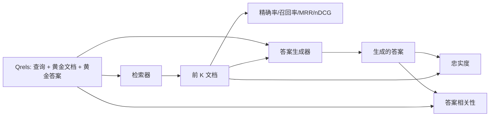

# RAG 评估：精确率、召回率、MRR、nDCG、忠实度、答案相关性

> 如果你不能同时评估你的检索和你的答案，你就无法发布系统。两者不是同一个指标，同一个提示会在不同轴上失败。

**类型：** 构建
**语言：** Python
**前置知识：** 阶段 11 课程 06（RAG）、10（评估）；阶段 19 轨道 B 基础（课程 20-29）；阶段 19 课程 64、65、66、67
**时间：** ~90 分钟

## 学习目标
- 从黄金 qrels 计算四个检索指标：precision@k、recall@k、MRR（平均倒数排名）和 nDCG@k。
- 计算两个答案质量指标：忠实度（每个声明都基于检索到的上下文）和答案相关性（答案回答了问题）。
- 构建一个评估端到端读取的夹具 qrels 文件（查询、黄金文档 ID、黄金答案文本）。
- 阅读指标值以诊断管道失败位置：检索、排序、生成或 grounding。

## 问题

一个 RAG 系统至少有四个活动部件：分块器、检索器、重排序器、生成器。其中任何一个都可能是错误答案的原因。没有每阶段指标，你就是在盲目飞行。

用户报告了错误答案。是因为分块器切断了答案片段？是因为检索器没有将块包含在 top-k 中？是因为重排序器将正确的块推过了位置一？是因为生成器忽略了块并编造了一些东西？仅凭答案你无法判断。你需要：

- 检索指标来评估检索器的输出。
- 排序指标来评估正确块在顺序中的位置。
- 忠实度来评估生成器是否保持在检索到的上下文内。
- 答案相关性来评估答案是否回答了问题。

本课程在一个夹具 qrels 文件之上构建所有六个指标。评估离线且确定性；在生产中你将模拟 LLM-as-judge 替换为真实模型。

## 概念



### Precision@k

检索器返回的前 k 个文档中，有多少在黄金集中？如果黄金有三个文档，top-3 返回了其中两个和一个错误的，那么 precision@3 是 2 / 3。当不相关检索块的成本高时（生成器在其上浪费 token，或块毒害答案），使用精确率。

### Recall@k

黄金文档中有多少出现在前 k 中？如果黄金有三个文档，top-5 包含全部三个，那么 recall@5 是 1.0。当错过答案的成本高时（你宁愿多看到一个错误块也不愿完全错过答案块），使用召回率。

在生产 RAG 中，人们通常引用的指标是 recall@k。生成器可以容易地丢弃不相关的块；它无法从一个从未看到的块中发明出一个答案。

### MRR（平均倒数排名）

对于每个查询，找到排序列表中第一个相关文档的位置。倒数排名是 1 / 位置。在查询集上取平均。MRR 是一个单一数字总结，表示检索器将最佳答案放在顶部的程度。

MRR 对位置 1 加权很重。黄金文档在排名 1 的查询贡献 1.0。排名 2 贡献 0.5。排名 10 贡献 0.1。该指标由列表顶部主导。

### nDCG@k

归一化折损累计增益。完整公式为每个检索到的文档分配一个增益（相关为 1，不相关为 0），按位置的对数折损，求和，并除以理想 DCG（如果你完美排序会得到的 DCG）。范围 0 到 1。

nDCG 适应分级相关性：黄金可以说"文档 A 是 3，文档 B 是 2，文档 C 是 1"。MRR 和 recall@k 将所有内容扁平化为二值。当语料库每个查询有多个部分相关的文档时，使用 nDCG。

### 忠实度

对于生成答案中的每个声明，检查该声明是否得到检索到的上下文的支持。标准实现使用 LLM-as-judge 提示，接收（claim，context）并返回是或否。指标是通过的声明的比例。

忠实度捕捉生成器编造内容的失败模式。即使检索器返回了正确的块，一个会幻觉的生成器也是有问题的。忠实度也被称为 groundedness、support、attribution。

本课程使用一个确定性的模拟评判器来实现忠实度，它检查每个声明的 token 是否通过阈值与检索到的上下文重叠。在生产中你替换为真实的模型调用。指标的形态相同。

### 答案相关性

答案是否真正回答了问题？忠实度问"答案是否基于上下文"？答案相关性问"答案是否基于问题"？一个忠实但离题的答案在忠实度上得分高，在相关性上得分低。一个简短、切题但忽略上下文的答案在相关性上得分高，在忠实度上得分低。

标准实现也使用 LLM-as-judge：接收（question，answer）并询问答案是否回答了问题。本课程实现了一个 token-overlap-plus-judge 的替代方案。

## 夹具 qrels

```python
{
  "qid": "q1",
  "query": "分块上传的中止阈值是什么",
  "gold_doc_ids": ["d1", "d3"],
  "gold_answer_substring": "三个失败的部分",
  "graded_relevance": {"d1": 3, "d3": 2},
}
```

每个查询携带：
- 查询字符串，
- 一组黄金文档 ID（用于精确率/召回率/MRR），
- 一个分级相关性字典（用于 nDCG），
- 黄金答案子串（作为每个 qrel 上的参考元数据保留；本课程中的忠实度通过将提取的声明与检索到的上下文进行评判来计算，而不是与此子串）。

在生产中你标注这些。本课程附带一个手工构建的夹具，使评估开箱即用。

## 构建它

`code/main.py` 实现了：

- `precision_at_k(retrieved, gold, k)` - 字面定义。
- `recall_at_k(retrieved, gold, k)` - 字面定义。
- `mean_reciprocal_rank(retrieved_list_of_lists, gold_list)` - 查询间的均值。
- `ndcg_at_k(retrieved, graded_relevance, k)` - 带有二值或分级增益的 DCG / IDCG。
- `extract_claims(answer)` - 将答案拆分为句子形状的声明。
- `faithfulness(claims, context_texts, judge)` - 被判定为支持的声明的比例。
- `answer_relevance(question, answer, judge)` - 评判答案是否回答了问题。
- `MockJudge` - 确定性 token 重叠评判器，使评估离线运行。
- `evaluate_pipeline(pipeline_fn, qrels, ks)` - 运行每个指标的管理器。
- 一个演示，运行三个管道变体（分块器基线、混合检索、混合 + 重排序）对 qrels 进行评估并打印指标表。

运行它：

```bash
python3 code/main.py
```

输出显示每个变体的 precision@k、recall@k、MRR、nDCG@k、忠实度和答案相关性在单一指标表中。混合检索行在召回率上击败分块器基线；重排序行在 MRR 上击败混合检索。

## 阅读指标以诊断失败

| 症状 | 可能原因 | 要修复什么 |
|---------|-------------|-------------|
| 低 recall@k，低 precision@k | 分块器切断了答案或检索器无法找到 | 分块器边界（课程 64）或检索器模态（课程 65） |
| 尚可的 recall@k，低 MRR | 正确块在 top-k 中但不在位置 1 | 重排序器（课程 66） |
| 高 MRR，低忠实度 | 生成器虽有正确上下文但编造内容 | 生成提示；强制引用或拒绝 |
| 高忠实度，低相关性 | 答案有依据但离题 | 查询重写器（课程 67）或生成提示 |
| 全部四个都高，用户仍投诉 | 评估集不具代表性 | 用真实用户查询扩展 qrels |

## 演示将隐藏的失败模式

**LLM-as-judge 偏见。** 模型评判自己的输出会比实际更忠实。使用与生成器不同的模型家族来担任评判器，或手动评分一个样本。

**Qrels 腐烂。** 黄金答案随语料库变化而漂移。一个在 2024 年 1 月是 q1 黄金文档的文档，在 2024 年 10 月不再是正确答案，因为团队重命名了函数。安排季度 qrels 审查。

**忠实度微检查遗漏宏声明。** 每句忠实度可以通过，而整体答案的结构误导人。在自动化指标之上添加样本级定性审查。

**Recall@k 掩盖每查询失败。** 90% 的平均召回率可以隐藏一个查询类别总是失败。按查询类别（文字型、意译型、多主题型）切片 qrels 并报告每片指标。

## 使用它

生产模式：

- 在每次检索器或生成器更改时运行评估。将 recall@k 回归视为测试失败。
- 每查询持久化指标跟踪。当用户投诉时，查找匹配的 qrels 条目，看它是否本应被捕获。
- 分层 qrels：20 个查询的烟雾测试在 CI 中运行；200 个的回归测试每晚运行；2000 个的深度测试每周运行。

## 投入生产

课程 69 连接整个管道（分块器、检索器、重排序器、生成器）并对此端到端系统运行评估。

## 练习

1. 添加第五个检索指标：hit-rate@k。与 recall@k 比较。解释它们何时不同。
2. 实现分级忠实度：0（无支持）、1（部分支持）、2（完全支持）。相应更新指标。
3. 将模拟评判器替换为真实模型调用。测量模拟评判器和真实评判器在夹具上的分歧。
4. 添加查询类别切片（"文字型"、"意译型"、"多主题型"）。报告每片指标。
5. 添加"答案长度"指标并与忠实度相关联。绘制曲线。

## 关键术语

| 术语 | 人们怎么说 | 实际含义 |
|------|-----------------|------------------------|
| Precision@k | "检索命中率" | top-k 中属于黄金的比例 |
| Recall@k | "黄金命中率" | 黄金文档在 top-k 中的比例 |
| MRR | "首个命中位置" | 第一个相关文档的 1 / rank 的均值 |
| nDCG@k | "分级排序质量" | top-k 上的 DCG 除以理想 DCG |
| 忠实度（Faithfulness） | "基于性" | 答案声明中由检索到的上下文支持的比例 |
| 答案相关性（Answer relevance） | "它是否回答了问题？" | 答案是否匹配问题的意图 |
| Qrels | "黄金标签" | 查询及其黄金文档和答案的标注集 |

## 延伸阅读

- Buckley, Voorhees, "Evaluating Evaluation Measure Stability", SIGIR 2000 - 关于排序指标的规范论文
- Jarvelin, Kekalainen, "Cumulated Gain-based Evaluation of IR Techniques" - nDCG 论文
- [Ragas: Automated Evaluation of RAG Pipelines](https://docs.ragas.io)
- [Anthropic, Evaluating RAG](https://www.anthropic.com/news/evaluating-rag)
- 阶段 11 课程 10 - 评估框架基础
- 阶段 19 课程 64-67 - 在此评估的组件
- 阶段 19 课程 69 - 此评估打分的端到端管道
