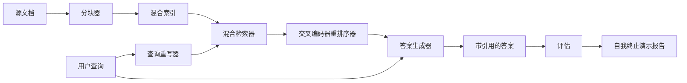

# 端到端 RAG 系统

> 六个课程的组件。一个管道。一个评估循环。一个自我终止的演示。这是你要发布的系统。

**类型：** 构建
**语言：** Python
**前置知识：** 阶段 11 课程 06（RAG）、10（评估）；阶段 19 轨道 B 基础（课程 20-29）；阶段 19 课程 64、65、66、67、68
**时间：** ~90 分钟

## 学习目标
- 将分块器、混合检索器、查询重写器、交叉编码器重排序器和答案生成器组合成一个单一的端到端管道。
- 实现一个答案生成器，它通过块锚点引用其声明，并带低置信度拒绝回退。
- 对组装好的管道运行课程 68 的评估，并证明阶段性构建在每个指标上都优于隔离的相同组件。
- 构建一个自我终止的 CLI 演示，摄入夹具语料库，运行固定查询集，以零退出码和摘要报告退出。

## 问题

六个隔离的组件证明不了什么。分块器可以在语料库上凭借 recall@5 获胜，但在系统的 recall@5 上失败，因为检索器无法对分块器输出的内容进行排序。重排序器可以在合成候选池上提升 MRR，但在真实双编码器候选上失败，因为双编码器在重排序预算下的召回率太低。查询重写器可以在单个查询上提升黄金文档，但在下一个查询上失败，因为 LLM 模拟返回了退化的假设性文档。

集成测试是整个管道端到端地针对相同的夹具 qrels、使用相同的指标、由一个将所有内容连接在一起的管理器文件运行。这就是本课程构建的内容。如果集成管道上的指标击败了每个阶段隔离演示上的指标，你就证明了系统。

## 概念



### 连接选择

管道是一个小图。每个阶段是一个具有清晰签名的函数。

| 阶段 | 输入 | 输出 |
|-------|-------|--------|
| 分块器 | 文档文本 | Chunk 记录列表 |
| 检索器 | 查询字符串 | 前 N 个 Chunk 记录 |
| 重写器（可选） | 查询字符串 | 重写 + 假设内容列表 |
| 重排序器 | 查询，候选 | 带交叉分数的前 K 个 Chunk 记录 |
| 生成器 | 查询，前 K 个 Chunk 记录 | 带引用的答案字符串 |

当每个签名稳定时，组合很简单。课程的 `Pipeline` 类持有五个阶段和一个按顺序运行它们的 `query` 方法。每个阶段都是可替换的：传入不同的分块器、检索器、重写器、重排序器或生成器，管道仍然运行。

### 带引用的答案生成器

生成器是最后一个阶段也是最容易出问题的。课程提供一个确定性的模拟生成器，它：

1. 获取重排序后的 top-K 块。
2. 选择最多两个文本包含与查询最高内容 token 重叠的块。
3. 输出一个答案，它是从每个选定块中取一句话的拼接，每句话后跟一个 `[doc_id:chunk_index]` 锚点。
4. 如果没有块的重叠高于拒绝阈值，输出"我不知道"，不带引用。

在生产中你将模拟替换为带有以下提示模板的真实 LLM 调用：

```
你仅使用下面的片段来回答问题。
用括号中的锚点引用每个声明。
如果片段不能回答问题，请说"我不知道"。

问题：{query}

片段：
{带锚点的枚举块}

答案：
```

低置信度拒绝路径是整个交叉编码器排名 1 分数被记录的原因。如果它低于语料库阈值，生成器拒绝。这是防止幻觉答案的安全阀。

### 自我终止演示

演示端到端运行所有内容。它打印一个查询的每阶段分解，对四个夹具 qrels 运行评估，打印指标表，如果课程 68 的所有指标满足演示中设置的阈值，以状态零退出。如果任何指标低于阈值，演示以非零状态退出，并附上命名失败指标的消息。

这就是 CI 烟雾测试的形状。管道离线运行，快速，确定性。阈值在夹具上刻意严格，因此六个课程中任何一个的回归都会导致演示失败。

## 构建它

`code/main.py` 实现了：

- `Chunk` - 通过所有阶段携带的记录（扩展课程 64 的形状，添加 chunk_index 和 source doc_id）。
- `Chunker` - 从课程 64 选择策略（默认递归分割）。
- `HybridIndex` - 打包课程 65 的 BM25 + 稠密 + RRF。
- `Rewriter`（可选）- 根据查询长度和连词存在从课程 67 选择 HyDE、多查询、分解之一。
- `Reranker` - 来自课程 66 的训练好的交叉编码器，使用更小的夹具训练集以便在几秒内收敛。
- `Generator` - 带引用和低置信度拒绝的确定性模拟生成器。
- `Pipeline` - 组合五个阶段，有一个 `query(question)` 方法返回 `Result(answer, top_k, latency_ms_per_stage)`。
- `run_demo()` - 摄入语料库，运行三个夹具查询，运行评估，打印结果，通过阈值设置退出码。

运行它：

```bash
python3 code/main.py
```

输出是一个打印的查询跟踪、完整的评估表以及最终的通过/失败状态。在夹具上返回退出码 0。

## 演示将隐藏的失败模式

**分块器边界漂移。** 如果你在评估 qrels 标注和演示之间切换分块器策略，黄金文档 ID 不再对齐。在 qrels 文件中锁定分块器策略。演示包含命名分块器的头部。

**重排序器训练集泄漏到评估中。** 课程 66 中的 14 个训练三元组包括类似评估查询的查询。在生产中，严格保留评估查询。演示的评估查询特意与重排序训练集不相交。

**模拟生成器隐藏幻觉风险。** 模拟不能幻觉，因为它只从检索到的块中输出文本。课程记录了这一点，并将生产交换路径指向真实模型。

**无流式传输。** 管道在每个阶段结束时返回完整答案。生产系统会流式传输生成器的输出。流式传输超出范围；答案质量指标在任何情况下都在最终字符串上工作。

**延迟是离线的。** 模拟 LLM 调用是恒定时间的。真实 LLM 调用占主导。在请求作用域中规划延迟预算；课程的每阶段计时仅测量 CPU 工作。

## 使用它

生产模式：

- 将管道文件放在一个具有显式阶段接口的管理器下。避免将连接代码分散到整个仓库。
- 在每次触碰阶段的合并之前运行评估。如果评估下降，合并不发生。
- 每次 CI 运行持久化指标跟踪，以便你可以将回归归因于阶段交换。
- 添加一个 20 个查询的烟雾集（回归集的子集），在 30 秒内运行；完整回归集每晚运行。

## 投入生产

本课程中的管道文件是阶段 19 轨道 F 后续课程所假设的形状。后续课程将添加摄入自动化、增量重新索引、遥测和之上的服务层。检索、重排序、重写和评估部分在此完成。

## 练习

1. 在重写器内部添加每查询策略选择器：来自课程 67 的启发式方法（长度、连词、行话比例）选择 HyDE、多查询或分解。
2. 在环境标志后为生成器添加真实 LLM 调用。默认使用模拟。测量延迟差异。
3. 扩展演示以接受 `--corpus path` 标志，加载真实语料库。重新运行评估和阈值检查。
4. 为分块器添加 `--strategy` 标志。测量每种策略对端到端召回率的贡献。
5. 添加流式生成器接口并将其送入评估。确认忠实度是在最终字符串上计算的，而非流式前缀上。

## 关键术语

| 术语 | 人们怎么说 | 实际含义 |
|------|-----------------|------------------------|
| 管道（Pipeline） | "RAG 管道" | 从摄入到带引用答案的组合阶段 |
| 引用锚点（Citation anchor） | "来源链接" | 附加到每个声明的 (doc_id，chunk_index) 引用 |
| 低置信度拒绝（Refuse-on-low-confidence） | "我不知道" | 当重排序器 top-1 分数低于阈值时，生成器不返回答案 |
| 烟雾集（Smoke set） | "CI 评估" | 在每个 PR 检查中运行的最小 qrels 子集 |
| 阶段接口（Stage interface） | "函数签名" | 每个管道阶段的稳定输入和输出类型 |

## 延伸阅读

- [Anthropic, Building search and retrieval](https://www.anthropic.com/news/contextual-retrieval)
- [Pinterest, MCP internal search](https://medium.com/pinterest-engineering) - 参考生产架构
- [Ragas: Automated Evaluation of RAG Pipelines](https://docs.ragas.io)
- 阶段 11 课程 06 - RAG 基础
- 阶段 19 课程 64-68 - 此处组合的组件
