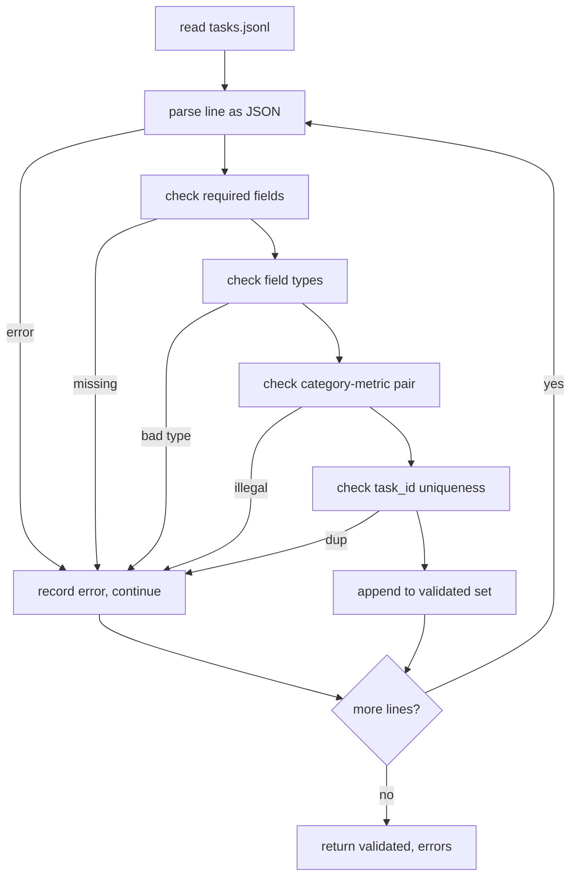

# 任务规范格式

> 评估框架的好坏取决于任务遵守的契约。在编写第一个评分函数之前，先冻结 JSONL 格式和度量词汇表。

**类型：** 构建
**语言：** Python
**前置知识：** 第 19 阶段 Track B 基础
**时间：** ~90 分钟

## 学习目标

- 定义一个 JSONL 任务记录模式，该模式在单一格式中涵盖算术、多项选择、代码执行、分类和自由文本摘要。
- 固定一个封闭的度量名称词汇表，使后续课程（71-73）能够基于单一字段进行调度。
- 将少样本示例和后处理规则定义为任务的一部分，而不是运行器的一部分，以便相同的提示在所有模型上产生相同的目标。
- 实现一个严格的验证器，在错误记录到达运行器之前将其拒绝。
- 交付一个 10 任务固定数据集，覆盖规范的每一个分支，使验证器有真实的测试内容。

## 为什么要冻结规范

研究代码库积累 eval 脚本的速度会比积累测试更快。六个月后，每个笔记本都有自己的 JSON 格式，每个度量都被重复实现了两次，没有任何东西可以在不同运行之间进行比较。解决方法很无聊。选择一个模式。编写一个验证器。拒绝其他所有内容。这就是本课程所做的。

该格式借鉴了 BIG-bench、HELM 和 lm-eval 风格框架的想法，但字段名是我们自己的。每个字段有唯一的拥有者。运行器读取任务。度量读取目标。后处理步骤规范化生成结果。没有一个字段在管道中间是可变的。

## 记录格式

一个任务是一个单行 JSON 对象。框架读取 `tasks.jsonl` 并独立验证每一行。一行错误会中止该记录，但不会中止整个运行。

```json
{
  "task_id": "arith_001",
  "category": "arithmetic",
  "prompt": "Compute the result. Question: 17 + 24\nAnswer:",
  "targets": ["41"],
  "metric_name": "exact_match",
  "few_shot_examples": [
    {"prompt": "Question: 2 + 2\nAnswer:", "completion": "4"}
  ],
  "post_process": "strip_whitespace",
  "metadata": {"difficulty": "easy"}
}
```

必需字段是 `task_id`、`category`、`prompt`、`targets`、`metric_name`、`post_process`。`few_shot_examples` 和 `metadata` 是可选的。未知的顶级字段会导致验证失败。

## 字段规则

`task_id` 是一个不含空格的字符串。验证器强制文件内唯一性。

`category` 是 `arithmetic`、`mcq`、`code_exec`、`classification`、`summary` 之一。类别限制了哪些度量和后处理组合是合法的。`code_exec` 任务必须使用 `metric_name = code_exec`，`mcq` 任务必须对单字母目标使用 `metric_name = exact_match`。

`prompt` 是一个非空字符串。验证器禁止尾随空白，并拒绝提示体中已包含少样本块的记录。少样本渲染发生在运行器中，而不是任务作者手中。

`targets` 是一个非空字符串列表。对于 `exact_match`，任何匹配的元素都算数。对于 `f1` 和 `rouge_l`，得分最高的目标获胜。对于 `mcq`，列表只包含一个元素。

`metric_name` 是 `exact_match`、`f1`、`bleu_4`、`rouge_l`、`accuracy`、`code_exec` 之一。词汇表是封闭的。新增度量需要新的课程和新的条目。

`few_shot_examples` 是一个 `{prompt, completion}` 对列表。验证器将列表上限设为八个条目，以保持提示长度可控。

`post_process` 是 `none`、`strip_whitespace`、`lower`、`extract_letter`、`extract_code_block`、`extract_first_line` 之一。每个规则具有单一的确定性行为。验证器禁止组合规则。

## 验证器行为



验证器返回两个列表：有效记录和错误记录（包括出错的行的行号、违反的规则和有问题的字段）。如果错误列表非空，运行器拒绝启动，除非设置了显式的 `--allow-bad-tasks` 标志。

## 少样本渲染

运行器将少样本示例连接在提示前面，并用空行分隔。相同的代码路径对所有模型运行，因此唯一的变量是模型本身。任务作者只需编写一次示例，而不必为每个提供商各写一次。

```python
def render(task):
    parts = []
    for ex in task.get("few_shot_examples", []):
        parts.append(ex["prompt"] + " " + ex["completion"])
    parts.append(task["prompt"])
    return "\n\n".join(parts)
```

## 后处理规则

后处理步骤在生成之后、度量之前运行。它是确定性的且无状态的。

- `none` 返回字符串不变。
- `strip_whitespace` 去除首尾空白。
- `lower` 将字符串转为小写。
- `extract_letter` 返回第一个匹配 `[A-E]` 的字符，用于 MCQ。
- `extract_code_block` 返回第一个三重反引号围栏代码块的内容，用于代码执行。
- `extract_first_line` 返回第一个非空行，用于摘要分类。

如果一个任务需要此列表之外的规则，它应该属于一门新的课程。

## 本课程不做的事

它不评分。它不调用模型。它不执行代码。这些将在课程 71、72 和 75 中完成。本课程冻结了所有后续课程必须遵守的契约。

10 任务固定数据集包含两个算术项、两个 MCQ 项、两个代码执行项、两个分类项和两个摘要项。验证器对所有 10 个项均通过。另一个固定数据集（`tasks_bad.jsonl`）触发了每一条规则，验证器恰好返回那么多错误。

## 如何阅读代码

`main.py` 定义了 `TaskSpec`、`validate_task`、`validate_file` 和一个 CLI 入口点。固定数据加载器是 `load_fixtures`。渲染和后处理辅助函数位于验证代码旁边，以便课程 75 中的运行器导入单个模块。

从头到尾阅读 `main.py`。然后阅读 `code/tests/test_spec.py`。测试固定了每条验证规则和每个后处理行为。`main.py` 底部的演示验证了捆绑的固定数据集并打印摘要。

## 更进一步

真实的评估套件增长类别的方式就像模式增长列一样。明智的做法是拒绝添加类别而不同时添加度量、后处理规则和至少一个固定数据任务。将规范视为数据库迁移。每次更改都要经过审查、版本控制并附带测试。本课程中的验证器就是关卡。
