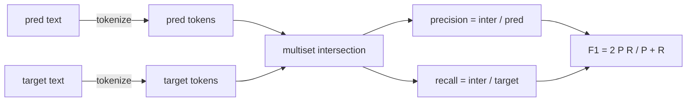
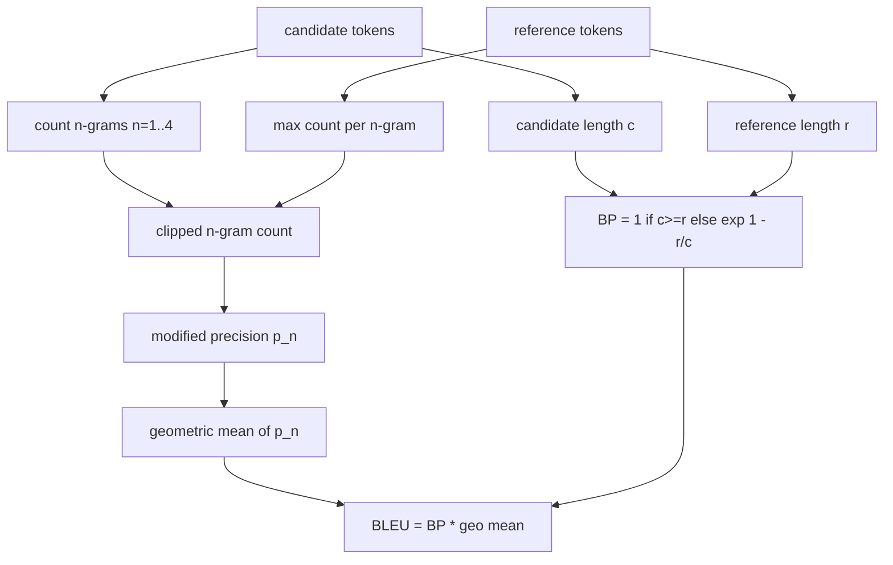

# 经典度量

> BLEU、ROUGE-L、F1、精确匹配、准确率。这五个度量仍然占据大多数已发布的 LLM 评估数据。从头实现每一个，这样你才知道数字的含义。

**类型：** 构建
**语言：** Python
**前置知识：** 第 19 阶段 Track B 基础，课程 70
**时间：** ~90 分钟

## 学习目标

- 使用显式分词规则实现词元级精确匹配、F1 和准确率。
- 从头实现 BLEU-4：修正 n-gram 精确率、n 等于 1 到 4 的几何平均、简短惩罚。
- 使用最长公共子序列实现 ROUGE-L，并采用 F-beta 组合精确率与召回率。
- 基于课程 70 的 metric_name 字段进行调度，使运行器保持度量无关。
- 使用来自手工计算示例的参考向量固定行为，而非依赖第三方库。

## 为什么要重新实现

你会读到一篇论文报告 BLEU 28.3，另一篇报告 BLEU 0.283。你会发现跨两个库的 ROUGE-L 分数相差十分，因为一个库截断为小写而另一个没有。停止困惑的最快方法是自己编写度量，然后指出决定分词器的代码行和决定平滑策略的代码行。在那之后，跨论文比较数字就变成了阅读度量设置的问题，而不是争论库的问题。

标准库加 numpy 就足够了。BLEU 就是计数和截断。ROUGE-L 是动态规划。F1 是词元上的集合交集。最难的部分是选择一个分词器并坚持使用它。

## 分词

分词器是 `re.findall(r"\w+", text.lower())`。小写、字母数字序列、丢弃标点。本课程中的所有度量都使用这个确切的分词器。运行器没有选择权。如果你更换分词器，你就在运行不同的基准。

```python
TOKEN_RE = re.compile(r"\w+", re.UNICODE)
def tokenize(text):
    return TOKEN_RE.findall(text.lower())
```

这是一个刻意的简化。生产环境需要考虑中文、缩写和代码标识符。本课程的重点是：分词器是一个契约，不是一个旋钮。

## 精确匹配

```python
def exact_match(pred, targets):
    return float(any(pred.strip() == t.strip() for t in targets))
```

每个任务返回 1.0 或 0.0。整个数据集上的聚合是均值。这是算术、MCQ 和短分类任务的常用度量。

## 词元级 F1

为预测和目标建立词元多重集。精确率是多重集交集除以预测的多重集。召回率是相同的交集除以目标的多重集。F1 是调和平均。实现处理空预测和空目标的边界情况。



对于多目标任务，我们取目标列表中最佳的 F1 分数。这与文献中广泛报告的 SQuAD 风格行为一致。

## BLEU-4

BLEU 是标准的机器翻译度量，至今仍出现在摘要工作中。我们使用的公式是语料级 BLEU-4，带有标准的简短惩罚和对修正 n-gram 计数的加一平滑，这样单个缺失的 4-gram 不会将分数推到零。

对于每个候选-参考对，我们计算 n 等于 1、2、3、4 的修正 n-gram 精确率。修正精确率将候选 n-gram 计数裁剪为任何参考中该 n-gram 的最大计数，这样候选不能通过重复一个短语来夸大分数。四个精确率的几何平均被简短惩罚包裹。



平滑规则是 Lin 和 Och 称为方法 1 的方法：在每个 n-gram 精确率的分子和分母上都加一，然后再取对数。这避免了当参考中没有匹配的 4-gram 时出现 `log 0`，并且在长候选上保持接近未平滑的值。

## ROUGE-L

ROUGE-L 比较候选和参考词元序列的最长公共子序列。LCS 捕获词序而不要求连续，这就是为什么它是默认的摘要度量。我们使用标准动态规划表计算 LCS 长度，然后推导出召回率为 `lcs / reference length`，精确率为 `lcs / candidate length`，并使用 F-beta（beta 等于 1，即对称的 F1 形式）进行组合。

```python
def lcs_length(a, b):
    n, m = len(a), len(b)
    dp = numpy.zeros((n + 1, m + 1), dtype=int)
    for i in range(n):
        for j in range(m):
            if a[i] == b[j]:
                dp[i+1, j+1] = dp[i, j] + 1
            else:
                dp[i+1, j+1] = max(dp[i+1, j], dp[i, j+1])
    return int(dp[n, m])
```

numpy 表使实现清晰易读；纯 Python 列表也可以。选择 ROUGE-L 的任务每次调用付出 O(n m) 的成本。对于典型的摘要长度，这保持在毫秒以下。

## 准确率

对于多目标分类任务，准确率简化为针对单个规范化目标的精确匹配。我们将其暴露为一个单独的函数，以便调度器可以根据 `metric_name` 进行调度，而无需在运行器内部进行字符串比较。

## 调度契约

单一入口点是 `score(metric_name, prediction, targets)`。它返回 `[0, 1]` 范围内的浮点数。运行器不根据度量名称进行分支。它将调用转发并写入结果。这就是课程 75 将粘合到课程 70 的任务规范上的接口。

```python
def score(metric_name, pred, targets):
    if metric_name == "exact_match":
        return exact_match(pred, targets)
    if metric_name == "f1":
        return max(f1_score(pred, t) for t in targets)
    if metric_name == "bleu_4":
        return max(bleu4(pred, t) for t in targets)
    if metric_name == "rouge_l":
        return max(rouge_l(pred, t) for t in targets)
    if metric_name == "accuracy":
        return accuracy(pred, targets)
    raise ValueError(f"unknown metric_name: {metric_name}")
```

`code_exec` 在课程 72 中处理，并在那里加入调度器。

## 本课程不做的事

它不调用模型。它不规范化生成结果，除了课程 70 的后处理规则已经做的事情。它不计算置信区间。它不做 BLEURT 或 BERTScore（这些需要模型并且在不同的课程中）。重点是基础：五个度量、一个分词器、一个调度表。

## 如何阅读代码

`main.py` 将每个度量定义为独立函数加上调度器。参考向量位于文件底部的 `_reference_examples` 块中。演示运行调度器对八个示例进行评估并打印每个度量的分数。`code/tests/test_metrics.py` 中的测试固定了参考向量并覆盖了每个边界情况（空预测、空参考、无共享词元、精确匹配、重复短语裁剪）。

从头到尾阅读 `main.py`。函数按复杂度排序。exact_match 和 accuracy 各是一行。F1 是六行。BLEU 和 ROUGE-L 是较重部分，它们包含关于平滑规则和 LCS 递推的详细注释。

## 更进一步

经典度量的必要但不充分。它们奖励表面重叠而忽略含义。解决方法是在你信任经典基础之后，在之上分层基于模型的度量（BLEURT、BERTScore、GEval）。那是后面的课程。现在：让这五个工作，用测试固定它们，你就有了一组可审计、快速且可重现的度量栈。
