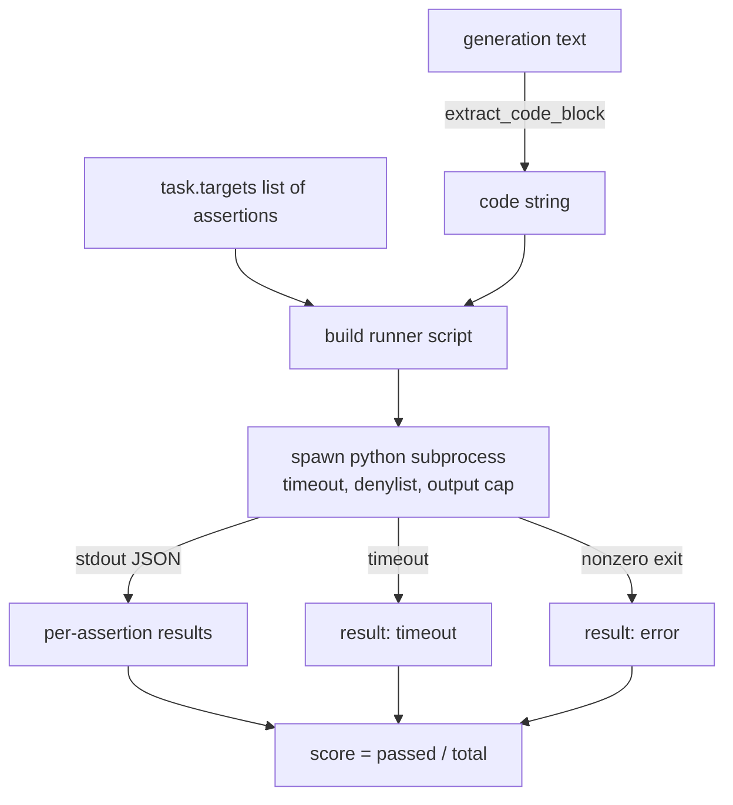
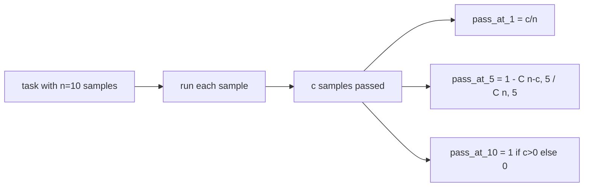

# 代码执行度量

> 生成的代码通过测试就是正确的。评估框架必须提取代码、在不崩溃主机的情况下运行它，并诚实统计通过率。本课程构建了这个表面。

**类型：** 构建
**语言：** Python
**前置知识：** 第 19 阶段 Track B 基础，课程 70 和 71
**时间：** ~90 分钟

## 学习目标

- 以与课程 70 后处理规则匹配的方式从自由格式生成中提取代码块。
- 在隔离的子进程中执行候选代码，设定挂钟超时、输出上限和导入黑名单。
- 将任务评分作为提供的断言字符串中针对候选代码通过的分数。
- 对于从一个模型采样多个生成的任务，计算 pass-at-k。
- 将沙箱崩溃、语法错误和超时作为一等失败模式处理，并具有运行器可以记录的不同退出码。

## 为什么需要隔离子进程

内联 `exec` 是一个安全性和稳定性风险。生成的 `while True: pass` 会永远阻塞评估。生成的 `import shutil; shutil.rmtree('/')` 听起来有多灾难就有多灾难。解决方法是每个候选代码生成一个新的 Python 解释器，通过 stdin 传递代码，将断言结果写入 stdout，并在超时时杀死进程。主机评估进程继续运行。

像 HumanEval、MBPP、BigCodeBench 和 LiveCodeBench 这样的真实评估都使用子进程沙箱。有些在之上层叠 Docker。我们停在子进程是有原因的：它是可移植的，它是标准库，它捕捉对教育评估重要的失败模式。生产部署会添加 seccomp、网络隔离和只读文件系统。关于加固的下一门课程不在本 track 内。

## 代码执行任务的格式

一个 `code_exec` 任务在 `targets` 中携带断言字符串。运行器从生成中提取围栏代码块，围绕它构建测试框架，然后运行结果。



分数是 `[0, 1]` 范围内的一个分数。一个有三次断言且两次通过的任务得分为 0.667。无论什么失败，运行器都返回相同的格式：子进程崩溃被映射为规范化的错误码，而不是冒泡到框架的 Python 回溯。

## 黑名单

黑名单基于导入。在运行候选代码之前，运行器脚本将危险模块的导入重写为一个引发 `ImportError("denied")` 的桩。这个列表有意保守：`os.system`、`subprocess`、`socket`、`requests`、`urllib`、`urllib.request`、`urllib.error`、`urllib.parse`、`ctypes`、`shutil`、`http.client`、`asyncio.subprocess`。

我们不假装这是牢不可破的。坚定的对抗性代码可以逃逸 Python 中的任何进程内沙箱。黑名单是备用的最后防线。挂钟超时和输出上限是承载负载的控制。

```python
DENIED = {
    "os.system": True,
    "subprocess": True,
    "socket": True,
    "shutil": True,
    "requests": True,
    "urllib": True,
    "ctypes": True,
}
```

我们通过前置 `import sys` 和一个将 `os.system` 猴子补丁为 raise 的守卫来包装候选代码。完整模板在 `main.py` 中。

## 挂钟超时

每个子进程获得默认的三秒挂钟预算。运行器使用 `subprocess.run(..., timeout=t)`。如果超时触发，运行器捕获 `TimeoutExpired`，杀死进程，并为该任务记录 `timeout` 退出原因。该任务得分为零。运行器继续前进。

超时可以通过 `task.metadata.timeout_s` 按任务配置。长时间运行的单元测试可以要求更多时间；课程 70 的验证器将该值上限设为三十秒以保持套件有界。

## 输出上限

子进程可能淹没 stdout，耗尽主机内存。运行器将 stdout 流式传输到缓冲区，并在累计总量超过 256 KB 时立即杀死子进程。结果记录为 `exit_code = error`，附带详情字符串 `"output overflow"`。这在实践中出现在生成意外写入打印无限循环时。

## Pass-at-k

Pass-at-k 是 HumanEval 及其同类使用的无偏估计量。给定每个任务的 `n` 个独立样本，其中 `c` 个通过，从 `n` 中抽取大小为 `k` 的样本包含至少一个通过解的概率为：

```
pass_at_k(n, c, k) = 1 - C(n - c, k) / C(n, k)
```

当 `n - c < k` 时分子未定义，值为 `1`。实现直接处理边界情况。我们暴露 `pass_at_k(n, c, k)` 供课程 74 中的排行榜层使用。



## 退出码

运行器返回每个任务的五种结果之一：

- `pass` 当每个断言都通过时。
- `assertion_fail` 当代码运行了但至少一个断言失败时。
- `syntax_error` 当代码无法导入或有 SyntaxError 时。
- `timeout` 当挂钟时间到期时。
- `error` 用于任何其他崩溃，包括黑名单命中（表面为详情 `"output overflow"`）。

分数仍然是一个分数。退出码是元数据。下游课程可以决定将超时计为零还是缺失数据。

## 本课程不做的事

它不给你一个真正的沙箱。它不运行来自开放网络的不可信代码。它不处理有状态的任务如文件 I/O 或网络调用。这些需要一个容器或 microVM。本课程的重点是契约：一个隔离的子进程、一个黑名单、一个超时、一个输出上限、一个干净的退出码词汇表和 pass-at-k 数学。

## 如何阅读代码

`main.py` 定义了 `extract_code`、`run_candidate`、`score_code_exec` 和 `pass_at_k`。子进程运行器脚本构建为字符串，并通过 `-c` 传递给新的 Python 解释器。`code/tests/test_exec.py` 中的测试针对来自 HumanEval 风格的手工计算示例，覆盖了四个退出码加上 pass-at-k。

从头到尾阅读 `main.py`。运行器模板是承载负载的部分。仔细阅读断言循环，直到你可以预测它写回父进程的 JSON 信封。

## 更进一步

一旦子进程格式工作，下一个关注点是可移植性。不同的 Python 版本在 Windows 上处理 SIGKILL 的方式不同。最干净的解决方法是将运行器放在 Docker 镜像中。之后下一个事情是用真正的单元测试文件替换断言字符串，使评估匹配生产 CI 所做的。在那时不要再称断言字符串为测试；它们是玩具测试，有玩具般的失败模式。
