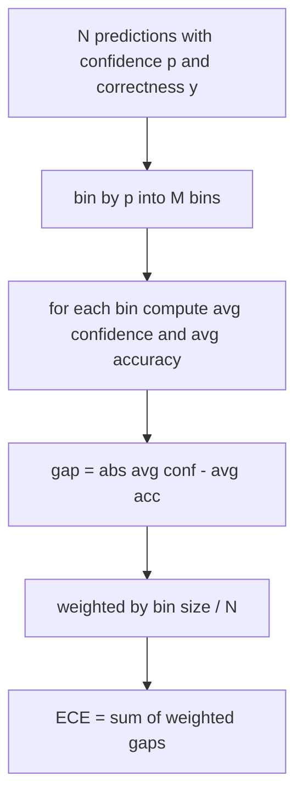
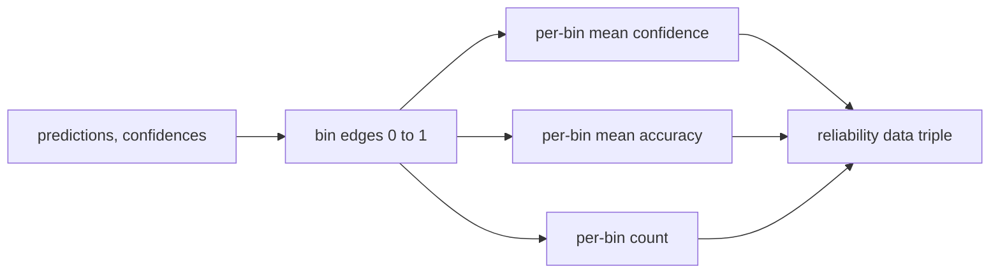

# 困惑度和校准

> 如果你的模型在一千个答案上声称 90% 的置信度，但只做对了六百个，那它就没有很好地校准。校准是可信评估的一半。另一半是困惑度，它告诉你模型是否认为保留文本是合理的。

**类型：** 构建
**语言：** Python
**前置知识：** 第 19 阶段 Track B 基础，课程 70 和 71
**时间：** ~90 分钟

## 学习目标

- 根据模型适配器提供的词元负对数概率，在保留语料上计算词元级困惑度。
- 从分箱的预测概率计算分类器或多项选择评估的期望校准误差（ECE）。
- 计算 Brier 分数（针对正确性指标的均方误差），并解释它何时能做到 ECE 做不到的事情。
- 构建绘制置信度-准确率曲线所需的可靠性图数据。
- 将三者全部接入评估框架，使运行器可以将 `perplexity`、`ece` 和 `brier` 数字附加到模型报告中。

## 困惑度告诉我们什么

困惑度是指数化的平均每个词元负对数似然。越低越好。困惑度为 1 意味着模型为每个实际词元分配概率 1。困惑度等于词汇表大小意味着模型是均匀的，什么也没学到。实际数字介于两者之间：一个强的 2026 年基础模型在 WikiText-103 上大约在 8 到 12 之间。一个差的模型在相同文本上在 50 以上。

框架本身不计算对数概率。这些来自模型适配器。框架进行聚合：它接收每个词元的对数概率列表、每个序列的词元计数列表，并返回语料困惑度。

```python
def perplexity(neg_log_probs, token_counts):
    total_nll = sum(neg_log_probs)
    total_tokens = sum(token_counts)
    return math.exp(total_nll / total_tokens)
```

实现处理零词元边界情况并断言负对数概率是非负的。一个常见错误是忘记取反：适配器返回 `log p` 而不是 `-log p` 会产生低于 1 的困惑度，这是不可能的。该函数将其捕获为契约违反。

## ECE 度量什么

期望校准误差将预测按其置信度分组到固定数量的箱子中，然后度量每个箱子中置信度和准确率之间的平均差距，按箱子大小加权。



标准公式在 `[0, 1]` 上使用十个等宽箱子。实现支持任何正整数计数。我们暴露一个 `bins` 参数，以便运行器可以在发布惯例（10）和比较惯例（15）之间选择。

ECE 受箱子数量和样本大小的影响。有十个箱子和一百个预测，你无法区分 0.02 的 ECE 和随机噪声。实现返回填充的箱子数量以及 ECE，以便运行器可以在样本太少时拒绝报告单一数字。

## Brier 分数能做到而 ECE 做不到的

ECE 只关心平均差距。一个模型在一半箱子上过于自信而在另一半上不够自信，可以有较低的 ECE，同时局部校准不良。Brier 分数度量每次预测相对于真实结果的平方误差，因此它直接惩罚离散度。

对于二元结果，Brier 是 `mean((p_i - y_i)^2)`。它可以分解为可靠性、分辨率和不确定性。我们计算分数和分解。运行器报告标量，但记录分解用于仪表板。

```python
def brier(p, y):
    return float(np.mean((p - y) ** 2))
```

## 可靠性图数据

可靠性图绘制每个箱子中预测置信度与经验准确率的关系。对角线是完美校准。函数返回三个数组：每个箱子的平均置信度、每个箱子的平均准确率和每个箱子的计数。绘图代码在下游；本课程止步于数据格式。



返回的元组是调用层绘制图表或计算自定义 ECE 变体（自适应 ECE、扫描 ECE 等）所需的内容。我们返回 numpy 数组，以便下游代码无需转换。

## 置信度来源

框架不假设置信度来自 softmax。它接受每个预测的 `[0, 1]` 中的任何数字。对于多项选择任务，自然的置信度是 `选项对数似然的 softmax`。对于自由文本，自然的置信度是模型自我报告的概率或平均对数似然的指数。评估只消费这个数字。它来自哪里是适配器的工作。

## 边界情况

- 所有预测都错误：ECE 是平均置信度，Brier 很高，困惑度取决于模型对文本的看法。
- 所有预测都正确且高置信度：ECE 接近零，Brier 接近零。
- 完美不确定的预测器在 p=0.5：ECE 是 0.5 减去准确率，Brier 是 0.25 减去修正项。
- 空输入：ECE、Brier 和可靠性返回 `0.0`（或零填充数组）。困惑度为零词元情况返回 `NaN`。这些路径都不发出警告；运行器检查值并决定是报告还是跳过。

这些情况已内置于测试中。真实模型在真实基准上不会遇到它们，但有问题的适配器或小样本会遇到，运行器不应该崩溃。

## 调度

校准不像 F1 那样的每个任务度量。它是每个模型的报告。运行器在整个评估过程中累积 `(confidence, correct)` 对，并一次性计算 ECE、Brier 和可靠性数据。困惑度是在保留文本语料上计算的，与逐个任务的评分分开。

接口是：

```python
report = CalibrationReport.from_predictions(confidences, correct)
report.ece          # float
report.brier        # float
report.reliability  # tuple of three numpy arrays
report.populated_bins  # int
```

`PerplexityResult.from_token_nll(neg_log_probs, token_counts)` 返回困惑度和每个词元的平均负对数似然。

## 本课程不做的事

它不调用模型。它不实现 softmax。它不从输出词元估计置信度；那是适配器的工作。它不做温度缩放或 Platt 缩放；那些是事后修复，属于不同的课程。本课程的重点是使三个数字（困惑度、ECE、Brier）可信且可重现。

## 如何阅读代码

`main.py` 定义了 `perplexity`、`expected_calibration_error`、`brier_score`、`reliability_diagram` 以及 `CalibrationReport` / `PerplexityResult` 数据类。演示在已知真实结果的合成预测上运行：一个良好校准的模型、一个过于自信的模型和一个不够自信的模型。`code/tests/test_calibration.py` 中的测试固定了每个边界情况以及合成预测器的参考值。

从头到尾阅读 `main.py`。函数排序从标量到向量再到报告。每个函数都有一个简短的文档字符串，包含数学公式和契约。

## 更进一步

校正是已发表评估中最被忽视的轴。大多数排行榜报告一个准确率数字就完事了。一个在准确率上获胜但在 Brier 上失利的模型，比一个分数低几分但可靠报告不确定性的模型更差的生产部署。一旦你有了校准管道，在保留的验证切片上添加温度缩放，重新计算 ECE，观察差距缩小。那是另一门课程，但基础在这里。
