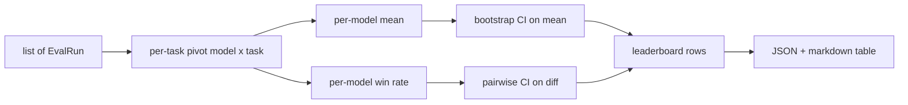
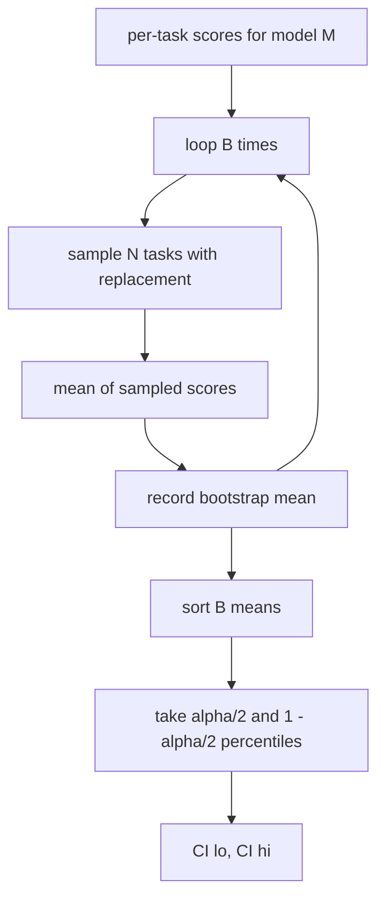

# 排行榜聚合

> 每个任务的分数很容易。跨异构任务的每个模型排名更难。在千次预测的排行榜上，统计显著性是人人都跳过的一部分。本课程不跳过它。

**类型：** 构建
**语言：** Python
**前置知识：** 第 19 阶段 Track B 基础，课程 70、71、73
**时间：** ~90 分钟

## 学习目标

- 将多个模型和多个任务的每个任务分数聚合成整洁的每个模型行。
- 规范化异构分数，使通过率和 BLEU 值不会过度影响聚合结果。
- 按均值和按胜率对模型排名，并解释何时每个是合适的摘要统计量。
- 计算每个模型均值的自助法置信区间以及成对差异的置信区间。
- 输出排行榜为 JSON 报告和 markdown 表格，课程 75 中的运行器可以将其粘贴到 CI 注释中。

## 输入格式

聚合器消费一个 `EvalRun` 记录列表：

```python
@dataclass
class EvalRun:
    model_id: str
    task_id: str
    metric_name: str
    score: float          # in [0, 1]
    category: str
```

课程 75 中的运行器为每个 `(model, task)` 对发射一个记录。聚合器不关心分数是如何产生的。它期望规范化已经发生：每个分数都在 `[0, 1]` 内。

## 输出

输出三个表格：



排行榜行包含：`model_id`、`mean_score`、`mean_ci_lo`、`mean_ci_hi`、`win_rate`、`tasks_completed` 和一个可选的 `categories` 映射用于每个类别的均值。

## 规范化

如果一个任务分数在 `[0, 1]` 内，另一个在 `[0, 100]` 内，第二个会静默地主导均值。聚合器验证每个输入分数在 `[0, 1]` 内，否则拒绝运行。修复在上游：度量应该已经返回一个分数。课程 71 到 73 强制执行该契约。

## 均值和胜率

两种排名方案服务于不同的目标。

均值分数是一个模型所有任务分数的平均值。这是排行榜报告的头条数字。它对异常值和任务不平衡敏感。

胜率统计一个模型在同一个任务上击败其他每个模型的频率。对于每个任务，得分最高的模型获胜（平局平分）。胜率等于获胜数除以该模型有分数的任务数量。它对异常值和尺度差异不那么敏感，但会丢失信息。

```python
def win_rate(model_id, runs_by_task, all_models):
    wins, total = 0, 0
    for task_id, runs in runs_by_task.items():
        scores = {r.model_id: r.score for r in runs if r.model_id in all_models}
        if model_id not in scores:
            continue
        total += 1
        best = max(scores.values())
        if scores[model_id] >= best:
            wins += 1
    return wins / total if total else 0.0
```

框架报告两者。课程 75 中的运行器默认按均值排名；胜率的 markdown 列就在那里，以防用户偏好它。

## 自助法置信区间

每个模型的均值附带一个置信区间，通过任务的 bootstrap 重采样估计。我们放回地重采样任务 ID，在重采样集上计算均值，重复 `B` 次，并取 `alpha` 水平的分位数区间。



对于成对比较，我们对每个任务差异 `score_A - score_B` 进行 bootstrap，取分位数区间并报告。用户读取区间是否排除零。如果排除，差异在 alpha 水平上显著。如果不排除，排行榜将模型视为平局。

底层辅助函数（`bootstrap_mean_ci`、`bootstrap_pairwise_diff`）默认为 `B=1000`；公共聚合器（`aggregate`、`pairwise_diffs`）默认为 `b=500`，以便演示和测试保持快速。默认 alpha 是 0.05。本课程保持 bootstrap 纯 numpy，不使用 scipy。

## 类别

如果设置了 `EvalRun.category`，聚合器还会报告每个类别的均值。这是每个排行榜上写着 `math`、`reasoning`、`code`、`safety` 的列。它让运行器发现一个模型是否总体良好但在代码方面较弱，这是头条均值隐藏的信息。

## Markdown 渲染

排行榜渲染为 markdown 表格：

```text
| Rank | Model | Mean | 95% CI | Win rate | Tasks |
|------|-------|------|--------|----------|-------|
| 1    | gpt   | 0.78 | 0.74-0.82 | 0.62 | 50 |
| 2    | claude| 0.75 | 0.71-0.79 | 0.34 | 50 |
| 3    | random| 0.10 | 0.07-0.13 | 0.04 | 50 |
```

表格按均值分数排序。CI 渲染到两位小数。长模型 ID 被截断为二十个字符。

## 本课程不做的事

它不运行模型。它不调用度量层。它不实现自适应 ECE 或其他校准变体；那些是课程 73。它不实现任务加权。这里每个任务权重相同。生产排行榜会对任务加权；我们通过 `weight` 字段保留该钩子，但在聚合器中忽略它。如果你需要，在后续课程中添加加权。

## 如何阅读代码

`main.py` 定义了 `EvalRun`、`LeaderboardRow`、`aggregate`、`bootstrap_mean_ci`、`bootstrap_pairwise_diff` 和 `render_markdown`。演示构建了三个模型和十二个任务的合成套件，聚合，并打印排行榜加上成对差异表。`code/tests/test_leaderboard.py` 中的测试固定了 bootstrap、markdown 渲染、胜率边界情况和空输入行为。

从头到尾阅读 `main.py`。数据格式（EvalRun、LeaderboardRow）排第一，聚合器第二，bootstrap 第三，渲染最后。每个函数都有一个聚焦的契约。

## 更进一步

自然的下一步是配对任务显著性而不是非配对 bootstrap。如果模型 A 和 B 都运行了相同的一百个任务，合适的检验是逐任务差异的配对 bootstrap，我们已经实现了。除此之外，你想要一个尊重任务族的分层 bootstrap（数学问题之间不是独立的；一个算术错误模式影响其中十个）。那是后续内容。本课程的重点是把基础做对，使评估报告一个你可以辩护的数字。
