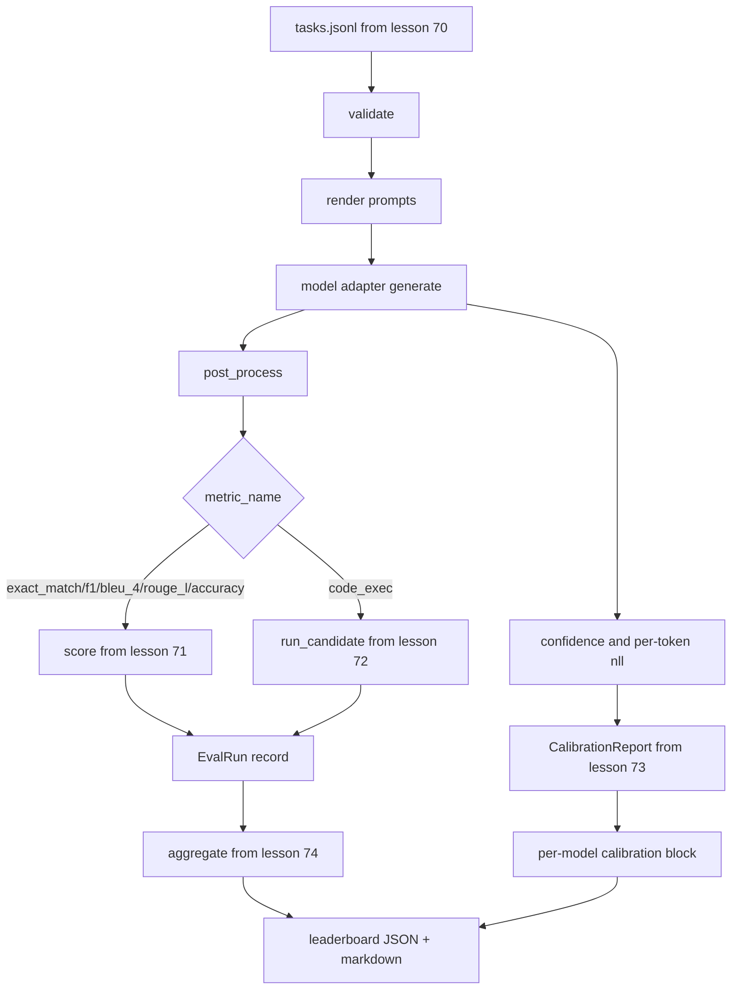

# 端到端评估运行器

> 五门课程的管道工程，一门课程将它们粘合起来。运行器读取课程 70 的任务规范，通过适配器调用模型，用课程 71 和 72 评分，附加课程 73 的校准报告，并输出课程 74 的排行榜。演示自动终止。

**类型：** 构建
**语言：** Python
**前置知识：** 第 19 阶段 Track B 基础，课程 70 到 74
**时间：** ~90 分钟

## 学习目标

- 定义一个 `ModelAdapter` 接口，任何模型（模拟、本地、API）都可以通过一个小的方法表面来满足。
- 通过工作池并行执行任务，在固定 JSONL 文件上运行评估。
- 在一次遍历中组合度量层（exact_match、F1、BLEU-4、ROUGE-L、code_exec）和校准层。
- 为每个模型发射 `EvalRun` 记录并直接馈入排行榜聚合器。
- 输出 JSON 报告和 markdown 表格；干净运行时以退出码零终止，验证或运行时失败时以非零退出。

## 管道



运行器是集成点。课程 70 到 74 每门课程拥有一个模块，运行器组合它们。运行器不重复这些模块中的任何逻辑：它导入它们。

## 适配器接口

适配器是运行器和任何模型之间的接缝。接口有意保持小型。

```python
class ModelAdapter:
    model_id: str

    def generate(self, prompt: str, task: TaskSpec) -> Generation: ...
```

`Generation` 是一个数据类，包含：

- `text`：模型的自由格式输出
- `confidence`：`[0, 1]` 范围内的浮点数，表示模型自我报告的回答概率
- `token_nll`：可选的生成词元上负对数似然的总和
- `token_count`：可选的生成词元数量

运行器中的模拟适配器提供三种类型：`RuleBasedAdapter`（确定性，接近完美）、`NoisyAdapter`（过于自信，经常错误）和 `BiasedAdapter`（在一个类别上表现好，在另一个类别上表现差）。演示在课程 70 的固定数据集上运行所有三个。

## 并行执行

运行器使用 `concurrent.futures.ThreadPoolExecutor` 按模型并行运行任务。工作线程数默认为 8 和任务数量中的较小值。线程足够，因为真实模型调用的瓶颈是网络 I/O。代码执行路径在自己的子进程中生成，执行器只调度等待。

对于确定性测试，运行器暴露 `run_eval(adapters, tasks, parallel=False)`，以便测试可以固定执行顺序。

## 单遍评分循环

对于每个任务：

1. 渲染提示（少样本前缀加提示体）。
2. 调用适配器并计时。
3. 根据任务的规则后处理生成结果。
4. 调度到度量层。
5. 构建带有分数和度量元数据的 `EvalRun` 记录。
6. 将 `(confidence, correct)` 对附加到校准缓冲区。

`correct` 信号对于 exact_match 风格的度量（`exact_match`、`accuracy`、`code_exec`）是 `score >= 1.0`，对于分级度量是 `score >= 0.5`。阈值位于 `_correct_from_score` 中，运行器不暴露公共覆盖。

## 聚合

在每个任务都有结果后，运行器调用课程 74 的 `aggregate` 和 `pairwise_diffs`，以及课程 73 的 `CalibrationReport.from_predictions`。输出是一个单一的 JSON 信封：

```json
{
  "leaderboard": [...],
  "pairwise": [...],
  "calibration": {
    "model_id_a": {"ece": 0.04, "brier": 0.10, "populated_bins": 8, ...},
    ...
  },
  "summary": {
    "tasks": 10,
    "models": 3,
    "wall_seconds": 1.2
  }
}
```

运行器还向 stdout 写入一个 markdown 表格，以便用户可以将结果粘贴到 PR 评论中。

## 自终止演示

演示在课程 70 的十个固定数据任务上运行三个模拟适配器。挂钟时间应在十秒以下。干净运行时退出码为零。

干净运行的标准是：

- 每个任务都在课程 70 下验证通过。
- 每个任务都在课程 71 和 72 下评分。
- 课程 73 下的校准报告聚合无错误。
- 排行榜将基于规则的适配器严格排在随机适配器之上。

如果其中任何一项失败，运行器以非零退出，并在 JSON 信封中包含结构化错误。

## 本课程不做的事

它不调用真实模型。它不实现 API 密钥流或速率限制处理。它不实现流式或部分生成；适配器每次调用返回一个生成。它不进行重试或缓存。这些关注点位于适配器层；运行器是度量无关和提供商无关的。

## 如何阅读代码

`main.py` 是集成代码。它通过一个小的 `_load_sibling` 辅助函数从其他五个课程模块导入，该函数通过相对路径解析它们。数据类 `Generation`、`EvalReport` 和 `ModelAdapter` 在本地定义。模拟适配器在文件底部。

从头到尾阅读 `main.py`。略读导入，然后看 `run_eval`，接着是 `_score_one`，然后是适配器。最后的演示是入口点。

`code/tests/test_runner.py` 中的测试固定了适配器接口、单遍循环、并行与顺序的等价性、校准缓冲区和 JSON 信封格式。

## 更进一步

这个运行器是基础。生产评估系统添加：一个以 `(task_id, model_id, model_version)` 为键的结果缓存、一个跟踪每运行美元和词元的成本账本、一个在速率限制时退避的重试层、一个针对 pass-at-k 任务的采样策略、以及一个用于长套件的流式输出格式。每个都是一个单一关注点，包装运行器而不更改度量或聚合层。这种分离就是契约的意义所在。

在模拟工作正常后，为真实提供商添加适配器。选择一个有免费层的提供商，编写三十行胶水代码，看着排行榜亮起来。然后添加第二个提供商，让框架做工作。
