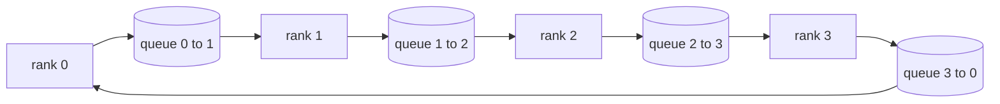

# 从头实现集合通信操作

> 支撑分布式训练的四个集合通信操作是 allreduce、broadcast、allgather 和 reduce_scatter。训练框架提供的每一个其他原语都是对这些操作的包装。在 `multiprocessing.Queue` 网络上一次性构建它们，对照参考实现进行验证，track 的其余部分就变成了管道工程。

**类型：** 构建
**语言：** Python
**前置知识：** 第 19 阶段 Track C 课程 42-49
**时间：** ~90 分钟

## 学习目标

- 实现环形 allreduce，分为两次传递（reduce-scatter 然后 allgather），并证明每个 rank 的通信量是每个元素 2(N-1)/N 字节。
- 在 `multiprocessing.Queue` 的点对点发送之上构建 broadcast、allgather 和 reduce_scatter。
- 针对相同输入的 `torch.distributed` gloo 参考验证每个原语。
- 根据集群形状、延迟下限和带宽上限，论证环与树的选择。

## 问题

朴素的 allreduce 在 N 个 rank 上将张量发送 N 次到根节点并广播 N 次回来。带宽按每个 rank O(N) 缩放，根节点成为瓶颈，挂钟下限是最慢链路乘以 N。环形 allreduce 将其展平为 2(N-1) 个大小为 T/N 的块，因此每个 rank 的字节数降至 2T(N-1)/N，与集群大小无关。树形 allreduce 在 N 较小和延迟较高的链路上胜出，因为深度是 log2(N) 跳而不是 2(N-1)。为集群形状选错拓扑，最慢的 GPU 决定了步长。

你将在这个 track 中读到的每一个分布式训练框架都依赖这四个原语。PyTorch DDP 每个参数桶用一个 allreduce 来同步梯度。ZeRO 通过 reduce_scatter 分片优化器状态并通过 allgather 广播更新后的参数。FSDP 将完整的前向传播转变为 allgather 加 reduce_scatter。流水线并行需要 broadcast 在 stage 组之间传递激活值。如果你不能实现这四个集合操作，你就无法推理为什么训练挂起、为什么梯度不匹配出现在 rank 3、或者为什么当你交换拓扑时流水线气泡翻倍。

## 概念



### 环形 allreduce 两次传递

将张量均匀分成 N 块，索引为 0..N-1。每个 rank 拥有等于其 rank 的块索引。第一次传递 reduce-scatter 运行 N-1 步。在步骤 s，rank r 向 rank (r + 1) mod N 发送块 (r - s) mod N，从 rank (r - 1) mod N 接收块 (r - s - 1) mod N，并将接收到的块累加到其本地副本中。N-1 步后，rank r 拥有块 r 的完整总和。第二次传递 allgather 再运行 N-1 步，将完成的块在环上旋转，直到每个 rank 拥有每个块的完整总和。

| 原语 | 每 rank 字节数 | 步数 | 何时使用 |
|-----------|---------------|-------|-------------|
| 环形 allreduce | 2T(N-1)/N | 2(N-1) | 大 T，胖管道同质集群 |
| 树形 allreduce | T log2(N) | 2 log2(N) | 小 T 或高延迟链路 |
| Broadcast | T | log2(N) 树 | 参数初始化，标量配置 |
| Allgather | T(N-1)/N | N-1 | 分片前向，ZeRO 去分片 |
| Reduce_scatter | T(N-1)/N | N-1 | ZeRO 梯度分片 |

### 队列网络作为 NCCL 的替代

NCCL 在 PCIe 和 NVLink 上运行，具有硬件卸载的归约操作。在 CPU 上你没有这些。每个环边的 `multiprocessing.Queue` 为你提供有序的点对点交付，具有单一生产者和单一消费者。归约在用户空间完成，因此你要付出 Python 开销，但线上的模式与 NCCL 环形 allreduce 相同。在队列版本上推理正确性，集群行为随之而来。

### 对照 gloo 验证

每个原语都附带一个单元测试，将其输出与使用 gloo 后端在相同张量和相同世界大小下初始化的 `torch.distributed` 进行比较。如果你的环形 allreduce 与 gloo 的差异超过 float32 epsilon，测试失败。对照参考实现进行验证是不可商量的；没有它，原语看起来正确，直到真实训练运行的第 10000 步。

## 构建

`code/main.py` 实现：

- `Mesh` 类，将 N 个 `multiprocessing.Queue` 实例连接成一个环，并为每个 rank 暴露 `send(dst, tensor)` 和 `recv(src)`。
- `ring_allreduce(mesh, rank, world_size, tensor)` 运行两次传递算法。
- `broadcast(mesh, rank, world_size, tensor, src)` 通过对数树实现。
- `allgather(mesh, rank, world_size, tensor)` 使用 N-1 次旋转。
- `reduce_scatter(mesh, rank, world_size, tensor)` 作为 allreduce 的前半部分。
- `_gloo_reference(op, world_size, tensor)` 通过 `torch.distributed` 使用 gloo 在相同输入上运行，用于字节相等的比较。

运行：

```bash
python3 code/main.py
```

输出：每个原语的验证表，比较队列网络和 gloo 的输出，然后是每个 rank 的字节计数器，证明 2T(N-1)/N 的缩放规律。

## 生产环境中的模式

三种模式将原语加固到可以交付的程度。

**在 allreduce 之前对梯度分桶。** 一个 1B 参数的模型有数万个梯度张量。每个张量一次 allreduce 要付出 N 次的延迟开销。DDP 将梯度分组成约 25 MB 的块，每个块执行一次 allreduce；小张量搭大张量的便车。没有分桶，延迟开销会主导步长。

**通信与计算重叠。** 反向传播按逆序逐层计算梯度。一旦最后一层的梯度就绪，立即启动它的 allreduce，同时下一层继续计算。PyTorch DDP 通过桶就绪钩子实现这一点。当网络有空闲时，重叠将可见通信时间减半。

**根据消息大小选择环或树，而不是根据信仰。** NCCL 带有一个拓扑检测器，对于约 1 MB 以上的消息选择环，以下的选择树。交叉点是带宽与延迟的权衡：在 1 MB 以上，带宽项 2T(N-1)/N 占主导，环胜出；在 1 MB 以下，log2(N) 跳数胜出。硬编码一种拓扑会在错误的消息大小上损失吞吐量。

## 使用

生产模式：

- **PyTorch DDP。** 在反向传播后对分桶梯度调用 `dist.all_reduce`。桶大小可调；默认 25 MB 对 100G 以太网是合理的。
- **DeepSpeed ZeRO。** 发出 reduce_scatter 来分片梯度，allgather 来在前向之前重建完整参数。课程的原语正是 ZeRO 所做的调用。
- **FSDP。** 前向以 allgather 开始以去分片该层，计算，然后通过 reduce_scatter 归约并丢弃去分片。相同的原语，不同的调度。

## 交付

在课程 77-81 中使用队列网络原语。课程 77 将 allreduce 接入 DDP。课程 78 将 reduce_scatter 接入 ZeRO。课程 79 将 broadcast 接入流水线激活。课程 81 将所有四个组合成端到端演示。

## 练习

1. 添加树形 allreduce 变体，并根据消息大小在环和树之间切换。测量交叉点。
2. 添加 `recv_timeout_ms`，使停滞的 rank 表面截止时间错误而不是永远挂起。
3. 用 TCP 套接字替换 `multiprocessing.Queue` 来实现四个原语。相同的测试，真实的线路。
4. 添加带宽检测钩子，使每个 rank 的字节计数器记录到 JSONL。
5. 比较在 4 个 rank 上、张量大小为 1KB、1MB、16MB 时，环与树的挂钟时间。用经验数据论证交叉点。

## 关键术语

| 术语 | 人们说的 | 实际含义 |
|------|----------------|------------------------|
| Allreduce | "跨 rank 求和" | 调用后每个 rank 持有相同的归约后张量 |
| 环 | "快速拓扑" | N-1 个大小为 T/N 的块在环上流动两次 |
| 树 | "对数拓扑" | 归约遵循二叉树；深度为 log2(N) 跳 |
| Allgather | "拼接分片" | 每个 rank 最终拥有其他每个 rank 的分片 |
| Reduce_scatter | "拆分求和" | 每个 rank 最终只拥有一个块的求和结果 |
| 桶 | "融合小张量" | 将 N 个小 allreduce 合并为一个大的 |

## 进一步阅读

- [PyTorch Distributed: NCCL collectives](https://pytorch.org/docs/stable/distributed.html#collective-functions)
- [Horovod ring allreduce paper](https://arxiv.org/abs/1802.05799)
- [NCCL topology and algorithm selection](https://docs.nvidia.com/deeplearning/nccl/user-guide/docs/index.html)
- [Patarasuk and Yuan, Bandwidth optimal allreduce algorithms](https://www.cs.fsu.edu/~xyuan/paper/09jpdc.pdf)
- 第 10 阶段第 05 课 - 分布式训练概述
- 第 19 阶段第 77 课 - 在这些原语之上构建的 DDP
