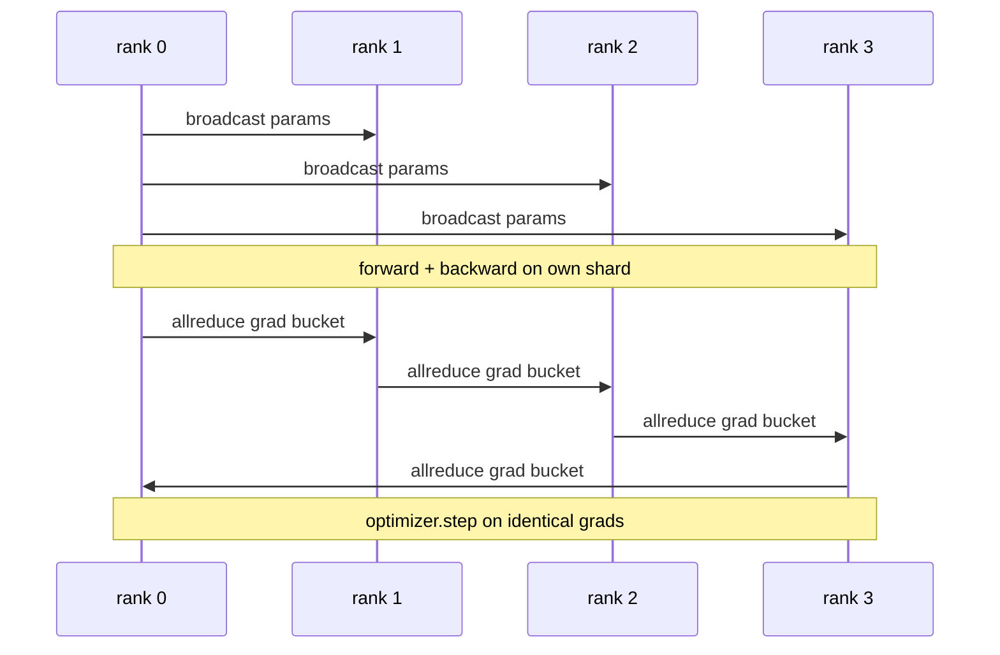

# 从头实现数据并行 DDP

> DistributedDataParallel 是 allreduce 之上的一个钩子。包装一个模型，从 rank 0 广播初始参数使每个 rank 从相同起点开始，在每个参数上安装一个反向钩子，发出梯度的 allreduce，剩下的就是梯度下降。整个模式是 200 行代码。

**类型：** 构建
**语言：** Python
**前置知识：** 第 19 阶段 Track C 课程 42-49
**时间：** ~90 分钟

## 学习目标

- 实现一个 `DistributedDataParallel` 风格的包装器，广播初始参数并在反向传播后 allreduce 梯度。
- 使用 `torch.multiprocessing.spawn` 通过 gloo 后端并配合基于文件的会合来生成 N 个 CPU rank。
- 通过在相同数据上顺序训练相同模型并展示每步参数等价性，证明梯度同步的正确性。
- 论证分桶（梯度融合）和重叠（在反向传播期间通信）是使工作的 DDP 变成生产级 DDP 的两个关键变化。

## 问题

一个 10 亿参数、具有 12 GB 激活值的模型无法放在一个消费级 GPU 上。即使能放下，训练也需要数周。数据并行将批次拆分为 N 个 rank，每个 rank 在其分片上计算前向和反向传播，每一步每个 rank 的梯度被求和，使所有 N 个副本保持一致。求和后的梯度就是优化器所更新的。

没有梯度同步，N 个副本在第二步就会发散。模型就不再是"在更多数据上训练的一个模型"，而是 N 个恰好共享初始权重的独立模型。梯度同步做得不好（每个参数一次 allreduce，没有重叠，没有分桶），网络成为瓶颈，GPU 空等线路。DDP 的工艺在于使梯度同步相对于计算几乎免费。规范的 PyTorch DDP 通过分桶梯度、将 allreduce 与下一层的反向传播重叠以及在 NVLink 上使用 NCCL 来实现这一点。我们可以在 CPU 上使用 gloo 完成所有这三项并学到相同的教训。

## 概念



### DDP 需要的三个操作

| 阶段 | 集合操作 | 原因 |
|-------|-----------|-----|
| 初始化 | 从 rank 0 广播 | 每个 rank 从相同的参数开始 |
| 反向传播后 | 每个梯度的 allreduce | 优化器更新的就是均值梯度 |
| 有时 | 缓冲区的广播 | BatchNorm 运行统计保持同步 |

### 为什么是均值而不是求和

Allreduce-SUM 除以 world_size 得到均值梯度。均值对 world_size 不变：在一个 rank 上调优的学习率在四个 rank 上同样有效，因为每步梯度幅度不变。Allreduce-SUM 不除的话，每次改变集群大小都必须重新调优学习率。DDP 包装 SUM 并除以 world_size；本课程中做同样的事情。

### 为什么对梯度分桶

一个 Transformer 有数千个参数张量。每个张量一次 allreduce 要付出数千次 gloo 延迟开销。DDP 将梯度分组成约 25 MB 的桶，每个桶执行一次 allreduce。相同的总字节在线路上移动，但延迟被分摊到桶上。对于本课程的小模型，我们将所有内容分组到一个桶中；结构才是跨项目通用的。

### 为什么固定种子

每个 rank 必须为打乱数据调用 `torch.manual_seed(seed + rank)`，但为参数初始化调用 `torch.manual_seed(seed)`。单一的共享种子意味着每个 rank 看到相同的批次顺序（破坏了数据并行）；每个 rank 特定的参数种子意味着初始参数相差 float epsilon，梯度同步不再使副本一致。搞错种子模式，参数等价性测试在第一步就会失败。

## 构建

`code/main.py` 实现：

- `MiniMLP`：一个 3 层 MLP，小到可以在几秒内收敛，大到足以暴露布线问题。
- `DistributedDataParallel(model, world_size)`：在构造时广播参数，返回一个包装器，其 `sync_grads` 将累积的 allreduce 求和梯度除以 world_size。
- `worker(rank, world_size, ...)`：完整的训练循环，使用 `torch.distributed` 通过 gloo 初始化，包括前向、反向、同步、优化步骤。
- `_reference_single_process_loop(...)`：在单个 rank 上顺序训练相同模型于相同数据，用于测试中验证每步后字节相等的参数等价性。

运行：

```bash
python3 code/main.py
```

输出：一个每步训练表，比较单进程损失和参数校验和与 4 个 rank 上的 DDP 运行。两个路径产生相同到 float epsilon 的损失曲线，证明梯度同步是正确的。

## 生产环境中的模式

三种模式将 DDP 加固到可以交付的程度。

**查找未使用的参数。** 某些前向路径有条件地跳过参数（早期退出、混合专家路由器）。跳过的参数没有梯度，但 DDP 的桶就绪钩子仍然等待它们，allreduce 死锁。`find_unused_parameters=True` 告诉 DDP 在归约之前查看哪些参数有梯度。代价是每步的图遍历，所以除非你的前向有分支，否则保持关闭。

**静态图优化。** 当前向跨步骤稳定时，`static_graph=True` 让 DDP 预计算桶调度。优化在规模上很重要：预计算每步节省几毫秒，在 10000 步中累积效果显著。

**梯度累积需要小心。** 在 K 个微批次上累积梯度而不同步每个微批次是 10 倍的吞吐量提升。DDP 将 `no_sync()` 暴露为上下文管理器，暂停反向传播后的 allreduce。忘记管理器，你就无谓地 allreduce K 次；吞吐量降至地板。

## 使用

生产模式：

- **PyTorch DDP。** 规范实现。`torch.nn.parallel.DistributedDataParallel(model)` 连接分桶、重叠和 no_sync 上下文。
- **HuggingFace Accelerate。** 添加一个启动器，处理 `torchrun` 环境变量和模型包装。底层还是同一个 DDP。
- **Megatron-LM 数据并行。** 将 DDP 与张量并行结合用于大模型；数据并行部分是一样的 allreduce-after-backward 模式。

## 交付

课程 78（ZeRO 分片）用 reduce_scatter 替换每个参数的 allreduce，使每个 rank 只存储其优化器状态的分片。课程 81 将 DDP 与 ZeRO 组合成端到端演示。

## 练习

1. 添加可配置大小的梯度桶，并在更深模型上测量相对于每个参数一次 allreduce 的加速。
2. 将 `no_sync()` 实现为上下文管理器，并验证梯度累积在 K 个微批次上匹配单进程基线。
3. 添加 `find_unused_parameters` 模式，其中前向有时跳过一个 MLP 层；没有标志时运行应该死锁。
4. 将 gloo 替换为仅使用 `torch.distributed.barrier()` 的同步，感受基于 allreduce 和基于 barrier 的同步之间的区别。
5. 测量梯度同步开销在步长时间中的比例，批量大小为 1、16、256，并解释缩放规律。

## 关键术语

| 术语 | 人们说的 | 实际含义 |
|------|----------------|------------------------|
| DDP | "数据并行" | 包装器，广播参数并每步 allreduce 梯度 |
| 桶 | "融合梯度" | 将 N 个小 allreduce 分组为一个大 allreduce |
| 重叠 | "隐藏通信" | 在后面的层仍在计算反向时发出 allreduce |
| no_sync | "累积" | 跳过反向传播后的 allreduce 用于梯度累积 |
| find_unused | "分支前向" | 在归约之前检测没有梯度的参数 |

## 进一步阅读

- [PyTorch DistributedDataParallel docs](https://pytorch.org/docs/stable/generated/torch.nn.parallel.DistributedDataParallel.html)
- [PyTorch DDP internals tutorial](https://pytorch.org/tutorials/intermediate/ddp_tutorial.html)
- [Li et al, PyTorch Distributed: Experiences on Accelerating Data Parallel Training](https://arxiv.org/abs/2006.15704)
- 第 19 阶段第 76 课 - DDP 构建其上的集合操作
- 第 19 阶段第 78 课 - ZeRO 分片用 reduce_scatter 替换每个参数的 allreduce
