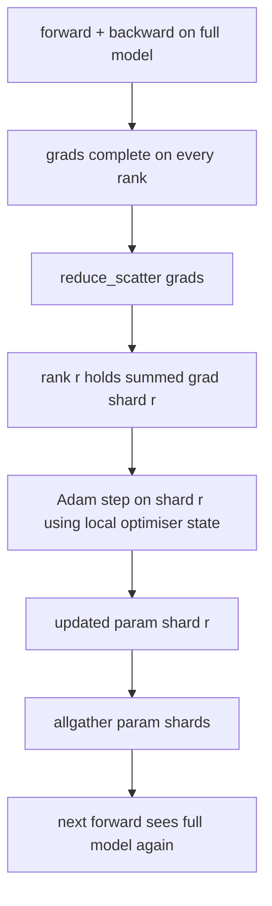

# ZeRO 优化器状态分片

> Adam 为每个参数存储两个动量估计值，均为 float32。一个 7B 参数的模型携带 56 GB 的优化器状态。ZeRO 阶段 1 将其分片到 N 个 rank 上；每个 rank 拥有优化器的 1/N。在本地步骤之后，更新后的参数分片广播回来，每个 rank 重建完整模型，下一步开始。胜出是训练栈中最大单一分配上的线性内存下降。

**类型：** 构建
**语言：** Python
**前置知识：** 第 19 阶段 Track C 课程 42-49
**时间：** ~90 分钟

## 学习目标

- 将优化器状态（一阶动量、二阶动量、fp32 主副本）分片到 N 个 rank 上，使每个 rank 拥有 1/N。
- 使用 reduce_scatter 为每个 rank 只交付其分片的梯度求和，然后使用 allgather 广播更新后的参数分片。
- 计算阶段 1、阶段 2、阶段 3 相对于普通 DDP 的内存节省表。
- 根据模型大小和带宽预算论证阶段 1 与阶段 2 与阶段 3 的选择。

## 问题

普通 DDP 复制所有内容：参数、梯度和优化器状态在每个 rank 上完整存在。对于一个 7B 参数的 fp16 模型，这意味着每个 rank 有 14 GB 的参数、14 GB 的梯度和 28 GB 的优化器状态。优化器状态是最大的项，也是最容易分片的，因为它只在步骤期间被访问，而不是在前向或反向传播期间。

ZeRO 阶段 1 分片优化器状态。每个 rank 持有 Adam 动量的 1/N。在反向传播之后，ZeRO 不是 allreduce 完整梯度并在本地更新，而是进行 reduce_scatter，使每个 rank 只收到其分片的求和梯度。该 rank 对其主参数分片应用优化器步骤。更新后的参数分片然后 allgather 回来，使每个 rank 为下一次前向拥有完整模型。优化器内存下降 N 倍。每步的线路流量与 DDP 相同：一次 reduce_scatter 加一次 allgather 按带宽等于一次 allreduce。内存胜出，吞吐量保持不变。

## 概念



### ZeRO 的阶段

| 阶段 | 分片什么 | 每 rank 内存 | 每步通信 |
|-------|----------------|------------------|---------------|
| DDP | 无 | 参数 + 梯度 + 优化器 | 1x allreduce |
| ZeRO-1 | 优化器状态 | 参数 + 梯度 + 优化器/N | 1x reduce_scatter + 1x allgather |
| ZeRO-2 | 优化器 + 梯度 | 参数 + 梯度/N + 优化器/N | 1x reduce_scatter + 1x allgather |
| ZeRO-3 | 优化器 + 梯度 + 参数 | 参数/N + 梯度/N + 优化器/N | 每层 1x allgather + 每层 1x reduce_scatter |

阶段 1 是最便宜的胜利，因为优化器状态占预算的主导地位。阶段 2 需要梯度分片累积逻辑，但带宽相同。阶段 3（FSDP）为每次前向和反向付出每层通信，获得参数分片内存下降。本课程完整实现阶段 1。

### 内存计算，实际数字

对于一个使用 Adam 进行混合精度训练的具有 P 个参数的模型：

| 项 | 普通 | ZeRO-1 | 原因 |
|------|---------|--------|-----|
| fp16 参数 | 2P 字节 | 2P 字节 | 前向需要 |
| fp16 梯度 | 2P 字节 | 2P 字节 | 反向需要 |
| fp32 主副本 | 4P 字节 | 4P/N 字节 | 只有优化器使用 |
| fp32 一阶动量 | 4P 字节 | 4P/N 字节 | 只有优化器使用 |
| fp32 二阶动量 | 4P 字节 | 4P/N 字节 | 只有优化器使用 |
| 总计 | 16P 字节 | 4P + 12P/N 字节 |   |

在 N=8 时：普通 16P，ZeRO-1 5.5P，下降 65%。在 N=64 时：普通 16P，ZeRO-1 4.19P，下降 74%。

### 为什么 reduce_scatter 胜过 allreduce-then-shard

Allreduce 给每个 rank 完整的求和梯度。如果你只需要分片 r，那么 (N-1)/N 的已归约梯度在 rank r 上被浪费了。Reduce_scatter 精确交付每个 rank 拥有的分片；每 rank 的字节数与 allreduce 相同（因为 allreduce 就是 reduce_scatter + allgather），但后半部分被后面的参数分片 allgather 替代。净线路与 DDP 相同，内存被分割。

## 构建

`code/main.py` 实现：

- `flatten_params(module)` 和 `unflatten_into(module, flat)`，将模型的参数打包成一个连续张量并解包回去。平坦布局使按 rank 分片成为一个简单的切片。
- `ZeroOptimizer(model, world_size, rank, lr)`，拥有该 rank 的主副本和 Adam 动量的分片。
- `step()`，在平坦梯度上运行 reduce_scatter，对该 rank 的分片应用 Adam，并将更新后的参数 allgather 回去。
- 一个演示，训练一个 3 层 MLP 20 步，并打印每步内存预算以及普通 DDP 基线。

运行：

```bash
python3 code/main.py
```

输出：每步损失和内存表，显示 ZeRO-1 在每个 rank 上持有优化器状态的 1/N，而 DDP 持有完整副本。

## 生产环境中的模式

三种模式将 ZeRO 加固到可以交付的程度。

**分片检查点很重要。** ZeRO-1 的优化器状态跨 rank 分割；检查点必须记录哪个 rank 拥有什么。课程 80 构建了分片检查点清单，在相同世界大小上恢复 ZeRO 运行。没有它，保存的状态在重启时不可读。

**混合精度是关键。** ZeRO 是一种混合精度技术；被分片的是 fp32 主副本。在没有混合精度的情况下运行 ZeRO 会为 fp32 主副本付出内存税，而没有对应的 fp16 前向收益。生产运行总是将 ZeRO 与 autocast 或 bf16 权重配对。

**阶段 1 是近乎免费的胜利。** 通信按带宽与 DDP 相同。内存节省与 N 线性相关。唯一的成本是优化器分片的簿记。除非参数分片内存也有问题，否则生产栈默认使用阶段 1；然后阶段 2 或 3 用通信换内存。

## 使用

生产模式：

- **DeepSpeed ZeRO。** 参考实现。`deepspeed_config.json` 选择阶段 1/2/3 和分区大小。
- **PyTorch FSDP。** PyTorch 原生等价物。`ShardingStrategy.SHARD_GRAD_OP` 是 ZeRO-2；`FULL_SHARD` 是 ZeRO-3。
- **HuggingFace Accelerate。** 在统一配置下包装 DeepSpeed 和 FSDP。

## 交付

课程 79（流水线并行）是正交的分片轴：不是将优化器状态分片到相同模型，而是将层分片到 rank 上。课程 81 在端到端演示上组合 DDP + ZeRO。

## 练习

1. 扩展到 ZeRO-2，通过分片梯度：每个 rank 只存储其分片的梯度，在反向传播后将非分片部分归零实现。
2. 添加一个内存分析器，打印 rank 0 上的实际 fp32 字节使用量与公式预测值。
3. 测量普通 DDP 与 ZeRO-1 的每步挂钟时间，并分解为前向、反向、通信。
4. 在 ZeRO-1 下实现梯度裁剪：L2 范数必须通过所有分片上本地范数平方的 allreduce 来计算。
5. 实现一个"朴素 ZeRO"，使用 allreduce 而不是 reduce_scatter，测量线路时间差异。用数字论证 reduce_scatter 的选择。

## 关键术语

| 术语 | 人们说的 | 实际含义 |
|------|----------------|------------------------|
| ZeRO-1 | "分片优化器" | 每个 rank 持有 fp32 主副本 + Adam 动量的 1/N |
| ZeRO-2 | "也分片梯度" | 每个 rank 在 reduce_scatter 后丢弃非分片梯度 |
| ZeRO-3 | "分片参数" | 每个 rank 持有 fp16 参数的 1/N；前向中每层 allgather |
| 主副本 | "fp32 权重" | 优化器更新的高精度参数副本 |
| Reduce_scatter | "拆分求和" | 为每个 rank 只交付其分片的求和梯度 |

## 进一步阅读

- [Rajbhandari et al, ZeRO: Memory Optimizations Toward Training Trillion Parameter Models](https://arxiv.org/abs/1910.02054)
- [DeepSpeed ZeRO documentation](https://www.deepspeed.ai/tutorials/zero/)
- [PyTorch FSDP documentation](https://pytorch.org/docs/stable/fsdp.html)
- 第 19 阶段第 76 课 - 本课程依赖的 reduce_scatter 和 allgather
- 第 19 阶段第 80 课 - ZeRO 状态必须使用的分片检查点
