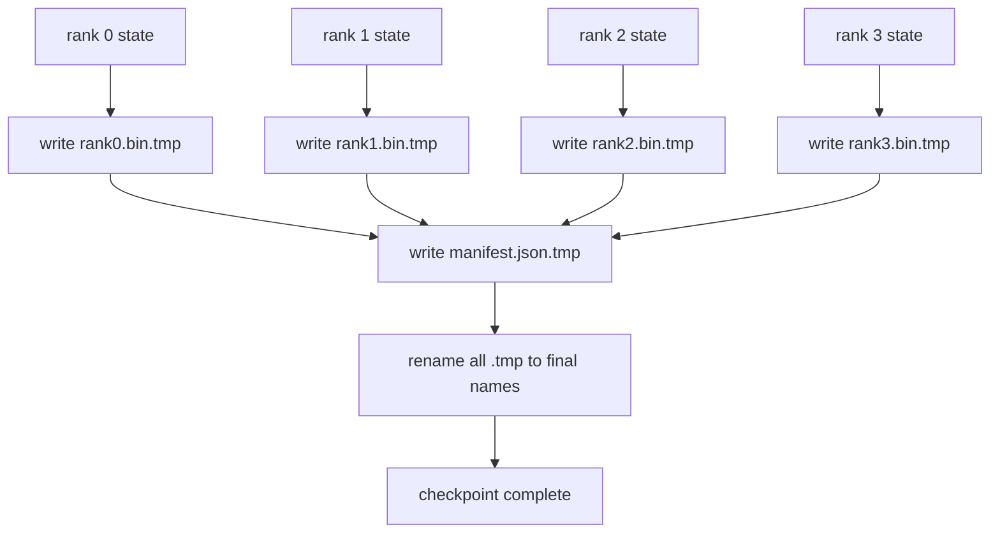

# 分片检查点与原子恢复

> 一个 70B 参数的训练任务每隔几小时就会被节点故障中断。检查点格式决定了你丢失 30 分钟还是 30 小时。分片检查点并行写入每个 rank 的分片，并在清单中记录所有权。恢复从自己的文件加载每个 rank 的分片，在相同世界大小上重建状态，优化器就像什么都没发生过一样继续步进。原子写入防止未完成的检查点污染下一次恢复。

**类型：** 构建
**语言：** Python
**前置知识：** 第 19 阶段 Track C 课程 42-49
**时间：** ~90 分钟

## 学习目标

- 将多 rank 检查点保存为每个 rank 的分片文件加上一个记录哪个 rank 拥有什么的清单。
- 使用原子写入模式（写入临时路径然后重命名），使写入中途的崩溃永远不会产生未完成的检查点。
- 从清单恢复，验证每个 rank 上 fp16 参数和 ZeRO 优化器状态的字节相等性。
- 论证清单模式如何应对三种失败模式：世界大小变化、分片数量不匹配和部分写入。

## 问题

普通检查点将所有参数和优化器状态读入 rank 0，收集，并写入单个文件。对于一个 70B 模型，这需要通过一个 rank 的网络端口传输 1.1 TB 的状态。写入阻塞了所有其他 rank，因为它们空闲等待收集。IO 带宽是最慢的单个 GPU 的网络链路，而不是聚合带宽。在真实集群上，收集然后写入的步骤可能比之前的训练小时还要长，这意味着该任务每天产出的检查点不到一个。

分片检查点翻转了模式：每个 rank 并行将其自己的分片写入自己的文件。清单记录哪个 rank 拥有哪个分片，以便恢复可以将每个分片放回它来自的地方。聚合写入带宽随集群规模扩展。一个通过单个 rank 需要 4 小时写入的 1 TB 检查点，通过 64 个 rank 需要 4 分钟。此外，清单为不兼容的恢复提供了契约：世界大小变化可检测，部分写入可检测，加载路径可以大声失败，而不是静默使用过时数据。

## 概念



### 清单模式

```json
{
  "world_size": 4,
  "step": 1234,
  "wall_clock_seconds": 4521,
  "shards": [
    {"rank": 0, "path": "rank0.bin", "sha256": "...", "param_shard_offset": 0, "param_shard_numel": 65536},
    {"rank": 1, "path": "rank1.bin", "sha256": "...", "param_shard_offset": 65536, "param_shard_numel": 65536}
  ],
  "schema_version": 1
}
```

三个字段承载负载。`world_size` 使在不同大小上恢复时大声失败，而不是静默损坏。每个分片的 `sha256` 捕获部分或损坏的写入。每个分片的 `param_shard_offset` 和 `param_shard_numel` 让加载器在正确位置重建平坦参数张量。

### 原子写入

标准模式：将每个分片写入 `<name>.tmp`，将清单写入 `manifest.json.tmp`，fsync 每个文件，然后重命名。在同一文件系统内的 POSIX 重命名是原子的；要么新文件完全存在，要么旧文件仍然存在。在最终重命名之前的崩溃会使先前的检查点保持为活跃状态。没有原子写入，崩溃可能留下一个部分分片，但有一个存在的清单指向它，加载时损坏优化器状态。

### 模式必须防御的三种失败模式

| 失败 | 症状 | 防御 |
|---------|---------|---------|
| 世界大小变化 | 在 N=8 上恢复，清单来自 N=4 | 清单中 world_size 不匹配，大声失败 |
| 分片数量不匹配 | 恢复时看到的 rank*.bin 文件少于清单中的分片 | 枚举分片，验证每个都存在 |
| 部分写入 | 分片文件在冲洗中途被截断 | 加载时 sha256 验证 |

每个防御提前拒绝错误加载；替代方案是静默损坏，在 100 步后损失变为 NaN 时才显现。

### 为什么使用每个 rank 文件，而不是一个大文件

通过 `O_APPEND` 对一个文件的并发写入在 POSIX 上对字节对齐的写入有效，但实际上一个分片内的偏移跨越 MB 大小的区域，加锁占主导。每个 rank 文件没有争用，并且在底层文件系统是并行的（Lustre、GPFS）时受益于条带化。生产栈（DeepSpeed、FSDP、NeMo）都因此使用每个 rank 文件。

## 构建

`code/main.py` 实现：

- `ShardManifest` 数据类，包含上述模式加上 `to_json`/`from_json`。
- `save_sharded(state_dict_per_rank, dir, step)`，使用原子临时文件然后重命名模式将每个 rank 的二进制状态写入自己的文件，然后写入清单。
- `load_sharded(dir, expected_world_size)`，读取清单，验证每个分片的 sha256，并返回每个 rank 的状态字典。
- 一个往返测试：构建每个 rank 状态，保存，加载，断言字节相等。

运行：

```bash
python3 code/main.py
```

输出：4 个分片文件加清单被写入，然后重新加载，字节相等性验证通过。

## 生产环境中的模式

三种模式将检查点加固到可以交付的程度。

**异步写入。** 生产栈在单独的线程或进程上发出检查点写入，以便训练继续。屏障在下一个检查点：在上一个完成之前不开始下一个保存。DeepSpeed 的 `async_io` 标志正是做这个。本课程保持写入同步以使步骤可见。

**先本地快速磁盘，然后异步上传。** 写入本地 NVMe（快速），然后异步上传到 S3 或 GCS。两层模式使集群内检查点快速用于恢复，同时将持久副本发送到集群外用于归档。清单携带本地路径；上传清单携带远程路径。

**轮换很重要。** 生产运行保留最近的 K 个检查点（通常 3-5 个）并轮换最旧的。没有轮换，磁盘会在运行中途填满，下一个检查点失败。有了轮换，下一个保存首先删除最旧的，释放预算。

## 使用

生产模式：

- **DeepSpeed 检查点。** `deepspeed.save_checkpoint(tag=step)` 写入每个 rank 文件和一个指向活跃标签的 `latest` 文件。
- **PyTorch FSDP 检查点。** `torch.distributed.checkpoint` 保存分片状态，使用一个决定每 rank 布局的 `Planner`。
- **NeMo。** 用统一的 `save_to_checkpoint` API 包装 DeepSpeed 和 FSDP，添加元数据。

## 交付

课程 81 保存端到端 DDP+ZeRO 运行的分片检查点，并在相同世界大小上重新加载以证明恢复契约保持成立。

## 练习

1. 添加异步写入：在线程中启动保存并让训练继续。阻塞下一个保存直到上一个完成。
2. 添加 `last_5_steps` 轮换：保留 5 个最近的检查点，在保存新检查点之前删除最旧的。
3. 为内循环重新加载添加仅 CRC 的快速验证路径（轮换将检查点变成新的活跃检查点，而不需要完整的 sha256）。
4. 添加跨世界大小加载：通过读取清单、连接和重新分片，从 N=4 重新平衡到 N=8。
5. 添加上传到模拟 S3（第二个目录）并写入上传清单。论证两层存储策略。

## 关键术语

| 术语 | 人们说的 | 实际含义 |
|------|----------------|------------------------|
| 分片检查点 | "每 rank 保存" | 每个 rank 并行写入自己的分片文件 |
| 清单 | "索引" | JSON 文件，记录分片路径、偏移量和 sha256 |
| 原子写入 | "临时文件后重命名" | 写入 .tmp 然后 POSIX 重命名，使崩溃后上一个文件仍然存活 |
| 部分写入 | "截断的分片" | 写入期间的崩溃产生损坏的分片；sha256 捕获它 |
| 轮换 | "保留最近 K 个" | 在写入新检查点之前删除最旧的，以限制磁盘使用量 |

## 进一步阅读

- [DeepSpeed checkpointing](https://www.deepspeed.ai/tutorials/checkpointing/)
- [PyTorch torch.distributed.checkpoint](https://pytorch.org/docs/stable/distributed.checkpoint.html)
- [POSIX rename atomicity](https://pubs.opengroup.org/onlinepubs/9699919799/functions/rename.html)
- 第 19 阶段第 78 课 - 此检查点设计为保存的 ZeRO 状态
- 第 19 阶段第 81 课 - 端到端演示进行保存状态的往返验证
