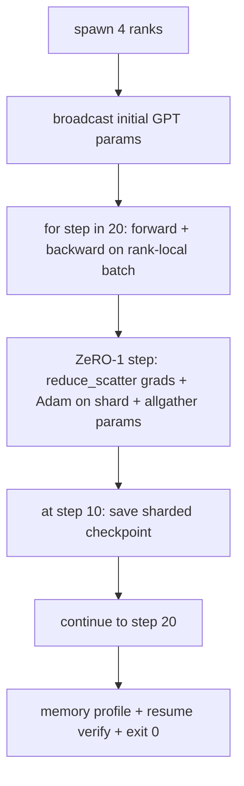

# 端到端分布式训练

> 课程 76 到 80 每门构建了一个组件。这是组装：一个在 4 个模拟 rank 上训练的小型 GPT，配备 DDP 用于梯度同步、ZeRO-1 用于优化器状态分片，以及一个在中间点的分片检查点。演示运行 20 步，自动终止，打印损失曲线和内存概况，并写入一个可恢复的检查点。

**类型：** 构建
**语言：** Python
**前置知识：** 第 19 阶段 Track C 课程 42-49
**时间：** ~90 分钟

## 学习目标

- 将 DDP（课程 77）+ ZeRO-1（课程 78）+ 分片检查点（课程 80）组合成一个训练循环。
- 在一个小型合成语料上训练一个 2 层 Transformer 语言模型 20 步，跨 4 个模拟 rank。
- 打印每步损失表、每 rank 内存概况和一个检查点清单，该清单在相同世界大小上恢复字节相等的状态。
- 论证组合：每个组件在更早的课程中独立可测试，本课程证明它们可以组合。

## 问题

顶点项目是证明各部件能够拼合在一起的验证。课程 76 实现了集合操作。课程 77 将它们包装成 DDP。课程 78 用 reduce_scatter 分片优化器状态。课程 79 分析了流水线。课程 80 保存了分片检查点。每门课程都有自己的测试独立存在。真实的训练运行同时使用每个原语；如果组合错误，损失发散，检查点拒绝恢复，或者每 rank 内存应该在缩小时却增长。

本课程运行端到端演示并验证四个不变量：(a) 损失在 20 步内单调递减（在浮点噪声范围内），(b) 每个 rank 在每一步持有相同的参数范数，(c) 每 rank 优化器内存在浮点范围内等于 ZeRO-1 公式 12P/N 字节，以及 (d) 在第 10 步的检查点在重启时重新加载字节相等。演示自动终止：20 步，单个命令，退出码 0。

## 概念



### 迷你 GPT

模型故意做小：2 个 Transformer 块，嵌入维度 32，4 个注意力头，词汇表 64，序列长度 16，批次大小 4。几千个参数。大到足以练习每个布线决策（多头注意力运行标准遮罩路径；LayerNorm 有需要同步的权重；LM 头是一个独立的线性投影回到词汇表）。小到 20 步在 4 个 CPU rank 上可以在几秒内完成。

### 组合规则

| 课程组件 | 它拥有什么 | 它留给循环什么 |
|--------------|--------------|----------------------------|
| DDP 广播 | 初始参数同步 | 构造时一次调用 |
| ZeRO-1 step | 梯度同步、主副本更新、参数广播 | 每步一次调用替换 optimizer.step |
| 分片检查点 | 持久化每 rank 状态、带 sha256 的清单 | 在 rank 0 上调用，通过 allgather 收集状态 |
| 训练循环 | 前向、反向、损失日志 | 按顺序调用以上三个 |

循环不知道 reduce_scatter 或会合文件。ZeRO 和检查点模块暴露窄接口，循环组合它们。

### 为什么是迷你 GPT 而不只是 MLP

课程 77 中的 MLP 足以验证梯度同步。迷你 GPT 增加了三样东西：一个单独的词汇表上的 LM 头（在本课程中，为了清晰没有共享权重；完整的 GPT 通常将头与词元嵌入绑定）、softmax+交叉熵作为损失（比 MSE 有更多的数值边界情况），以及一个不对称的前向（每层先是嵌入，然后是注意力，然后是 MLP）。在顶点项目中坚持使用 MLP 会隐藏组合是否正确处理 LayerNorm 或嵌入层的梯度形状。

### 自动终止意味着退出码 0

循环运行固定的 20 步然后退出。没有 `while True`，没有人工干预，没有从外部状态恢复。一个你可以让它无人值守运行，并在完成后找到完整日志的顶点项目，是证明系统布线正确的顶点项目。如果任何组件死锁，演示永远不会返回，测试框架会捕获它。

## 构建

`code/main.py` 实现：

- `MiniGPT`：2 层 Transformer，带有遮蔽自注意力和一个独立的 LM 头。
- `make_corpus(seed, total_tokens)`：确定性的下一个词元预测数据。
- `_train_worker`：每个 rank 生成；广播初始化参数，运行循环，调用 ZeRO step，在第 10 步写入分片检查点。
- `verify_resume`：在主运行后，在进程中重新加载第 10 步检查点，并断言保存的主分片与内存中的快照逐字节匹配。
- `main`：编排整个演示，打印损失表、内存概况和验证结果。

运行：

```bash
python3 code/main.py
```

输出：一个 20 行的损失表、一个 4 行的每 rank 内存概况、一个检查点清单，以及一行成功时的 "RESUME VERIFIED"。

## 生产环境中的模式

三种模式完成真实运行的组合。

**每 K 分钟检查点，而不是每 K 步。** 步长时间随序列长度和微批次数量变化。10 分钟的检查点节奏捕获相同的计算量，与模型大小无关。本课程为了简单使用基于步数；生产使用基于挂钟时间。

**早期检测发散。** 生产运行在反向传播后添加 NaN 守卫和损失尖峰检测器；如果损失在一步内跳升超过 2 倍，回滚到上一个检查点，而不是让优化器走入退化状态。本课程的损失曲线平滑，因此守卫未使用，但钩子保留。

**跨 rank 聚合内存概况。** 在真实运行中，每 rank 内存因 rank 而异（拥有最大流水线阶段的 rank 持有更多激活值）。生产记录跨 rank 的最大值和平均值；本课程打印每 rank 以显示公式匹配。

## 使用

生产模式：

- **DeepSpeed。** 在一个配置下组合 DDP + ZeRO + 流水线 + 激活检查点。本课程的组合是缩小版的 DeepSpeed 形态。
- **PyTorch FSDP。** 原生等价物。`FullyShardedDataParallel` 配合 `ShardingStrategy.SHARD_GRAD_OP` 是 ZeRO-2。
- **NeMo 和 Megatron-LM。** 为最大的模型添加张量并行；否则组合是相同的形态。

## 交付

整个 track 到此结束。这 6 门课程合在一起就是真实团队在采用 DeepSpeed 之前会构建的分布式训练子系统；抽象已经对照 gloo 验证过，失败模式已经实践过。第 17 阶段（基础设施和生产）是将此带到真实集群的地方。

## 练习

1. 添加注意力头的张量并行拆分，并验证损失与单 rank 基线匹配。两个 rank：每个 rank 一半的头，注意力输出的 allreduce。
2. 添加跨 4 个微批次的梯度累积，并证明梯度等于一个大批次的梯度。
3. 添加一个从第 10 步恢复的路径，实际继续训练到第 20 步，并产生与原始运行相同的最终损失。
4. 添加指标导出（损失、梯度范数、步长时间）到 JSONL，以便之后可视化运行。
5. 添加 NaN 守卫，在损失尖峰时回滚到上一个检查点，并使用一步的学习率乘数强制尖峰来练习回滚。

## 关键术语

| 术语 | 人们说的 | 实际含义 |
|------|----------------|------------------------|
| 端到端 | "全部连接起来" | 一次运行组合每个组件，而不是每个组件的单元测试 |
| 内存概况 | "每 rank GB" | 每个 rank 上参数、梯度、优化器状态持有的字节数 |
| 恢复契约 | "保存和加载" | 检查点往返后每 rank 状态字节相等 |
| 自动终止 | "有界运行" | 固定步数，完成时退出码 0，循环中无人参与 |

## 进一步阅读

- [DeepSpeed end-to-end training tutorial](https://www.deepspeed.ai/getting-started/)
- [PyTorch FSDP advanced tutorial](https://pytorch.org/tutorials/intermediate/FSDP_advanced_tutorial.html)
- [Megatron-LM training script reference](https://github.com/NVIDIA/Megatron-LM)
- 第 19 阶段第 76-80 课 - 本课程组合的每个组件
- 第 17 阶段 - 将组合迁移到真实集群
